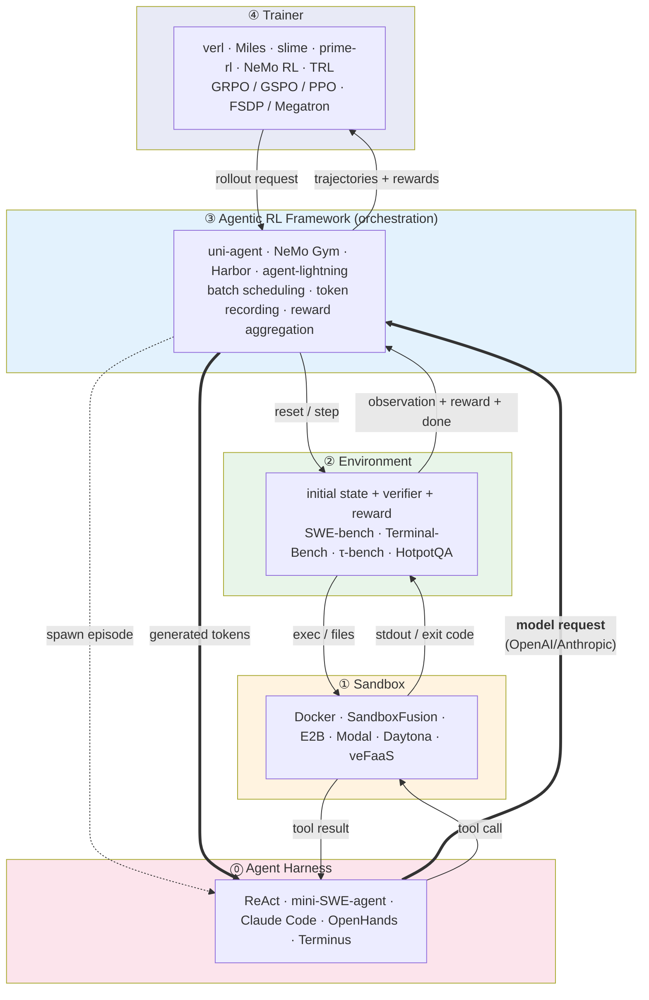
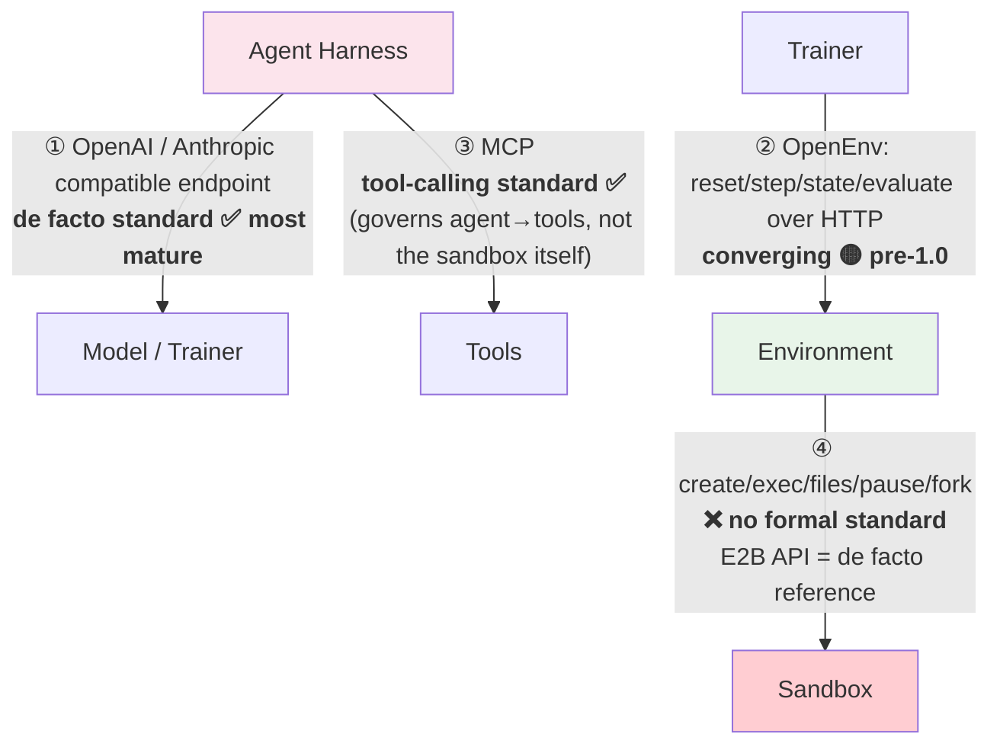
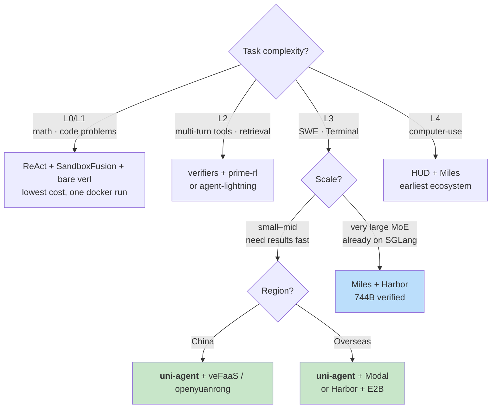

# Agentic RL Landscape: Frameworks, Sandboxes, Agents, and Standards

*Data as of 2026-09-14. Entries marked ⚠️ are unverified vendor claims — see [Appendix](#appendix-sources) for provenance.*

**How to read this document.** §0 is the executive summary, §1 the mental model everything else depends on, §2 the framework landscape. §3 links out to three detailed comparison documents. §4 answers the standards question; §5 is the selection guidance and the presentable takeaways.

---

## 0. TL;DR

1. **The agentic RL stack has settled into four layers**, each standardizing independently: Agent ↔ Environment ↔ Sandbox ↔ Trainer.
2. **Sandbox choice is no longer the hard part.** Every framework treats it as a pluggable provider — swapping one is a config change. The hard part is **how an agent gets wired into the training loop**.
3. **Three standards exist, one gap.** The Environment layer has OpenEnv (converging). The Agent↔model layer runs on OpenAI/Anthropic-compatible endpoints (de facto). **The Sandbox layer has no formal standard** — E2B's API is the closest thing to a reference point.

---

## 1. The Four-Layer Model

**On the arrow directions.** Every edge here is a request/response pair, not a one-way pipe — an earlier version of this diagram drew them as single arrows, which obscures the one asymmetry that actually matters:

- **Control flow and data flow point in opposite directions on the Agent edge.** The framework *starts* an episode (dotted arrow), but from then on **the agent is the client and the framework is the server**. The agent calls out to an OpenAI/Anthropic-compatible endpoint; the framework answers.
- **This inversion is the entire reason the Gateway trick works.** If the framework had to call *into* the agent, every harness would need a framework-specific adapter. Because the agent dials out to a URL, a closed-source CLI like Claude Code becomes trainable by changing one environment variable. See the [uni-agent deep dive](./deep-dive-uni-agent-vs-miles.md#uni-agent-full-stack-cohesion).
- On every other edge, control and data agree: the caller above drives, results flow back up.

**Responsibility boundaries** — this is the key to reading everything below:

| Layer | Owns | Does not own |
|---|---|---|
| Agent Harness | Deciding what to do next | Knowing its own score |
| Sandbox | Running code, storing files, isolation | Scoring; knowing what the task is |
| Environment | **Scoring (verifier/reward)**, initial state | How training works |
| Agentic RL Framework | Concurrency, **token-level recording**, trajectory assembly | The optimizer |
| Trainer | Optimizer, weight updates, distribution | What the environment looks like |

> **The most common confusion:** reward *must* be computed at the Environment layer, because only it knows the ground truth and the test cases. This is exactly why you cannot use E2B directly as an RL environment — it hands you a box, but it will never tell you what this trajectory scored.

---

## 2. Table 1: Agentic RL Solutions

### 2.1 Task Complexity Scale (our own rubric)

| Level | Name | Characteristics | Representative tasks | Sandbox requirement |
|---|---|---|---|---|
| **L0** | Single-turn RLVR | No environment, rule-based scoring | GSM8K, MATH, IFBench | None |
| **L1** | Single-turn tool call | One code-interpreter call | ReTool, DeepScaler | **Stateless** is enough |
| **L2** | Multi-turn tools / retrieval | A few turns, light state | HotpotQA, [τ-bench](https://github.com/sierra-research/tau-bench) | Lightweight stateful |
| **L3** | **Long-horizon agent** | Tens to hundreds of turns, real filesystem | **SWE-bench, [Terminal-Bench](https://github.com/harbor-framework/terminal-bench), SWE-reBench** | **Full stateful sandbox + harness** |
| **L4** | Computer-use / multimodal | Screenshots as observations | OSWorld, [HUD](https://hud.ai) family | Stateful + GUI + multimodal trajectory recording |

**The two inflection points are L1→L2 and L2→L3:**
- L1→L2: the sandbox must hold state.
- L2→L3: you need a **full agent harness plus token-level trajectory fidelity**. Framework complexity jumps sharply here.

### 2.2 Main Table

| Agentic RL framework | Underlying RL | Level | Rollout engine | Agent layer | Sandbox options | Stars | Ease |
|---|---|:---:|---|---|---|---:|:---:|
| **[uni-agent](https://github.com/verl-project/uni-agent)** | **[verl](https://github.com/verl-project/verl)** (embedded) | **L3** | vLLM / SGLang / TRT-LLM / HF (inherits verl) | react, claude_code, mini_swe_agent, mem_agent + **any harness (Gateway)** | local, docker, **[modal](https://modal.com), [veFaaS](https://www.volcengine.com/product/vefaas), [openyuanrong](https://github.com/yuanrong-proj/yuanrong)** | **601** | ★★★★ |
| *([verl](https://github.com/verl-project/verl) bare)* | verl | L1–L2 | same | None built in; write your own `BaseTool` | [SandboxFusion](https://github.com/bytedance/SandboxFusion), [Daytona](https://github.com/daytonaio/daytona) | 23,405 | ★★ |
| **[Miles](https://github.com/radixark/miles)** (agentic part) | **Miles** (own) | **L3–L4** | **SGLang only** | Three plug-in layers; **no built-in agent** | ⚠️ [AgentENV](https://github.com/kvcache-ai/AgentENV), Daytona, [E2B](https://github.com/e2b-dev/E2B), Modal, shared Docker | **2,849** | ★★★ |
| *([slime](https://github.com/THUDM/slime))* | slime | L2–L3 | SGLang only | same (Miles is its fork) | same | 8,458 | ★★★ |
| **[NeMo Gym](https://github.com/NVIDIA-NeMo/Gym)** | [NeMo RL](https://github.com/NVIDIA-NeMo/RL) / [Unsloth](https://github.com/unslothai/unsloth) / **verl** | **L3** | vLLM, SGLang, TRT-LLM, Dynamo, Megatron ✅ | ⚠️ [OpenHands](https://github.com/All-Hands-AI/OpenHands), [mini-SWE-agent](https://github.com/SWE-agent/mini-swe-agent), [LangGraph](https://github.com/langchain-ai/langgraph), **[Claude Code](https://github.com/anthropics/claude-code)**, Hermes | Environment-provided | **1,183** | ★★★ |
| **[verifiers](https://github.com/PrimeIntellect-ai/verifiers)** | [prime-rl](https://github.com/PrimeIntellect-ai/prime-rl) / TinkerRL / [SkyRL](https://github.com/NovaSky-AI/SkyRL) | L2–L3 | vLLM (prime-rl) | Environment-provided | Environment-defined | **4,613** | ★★★★ |
| **[Harbor](https://github.com/harbor-framework/harbor)** | Miles or any | **L3** | Agnostic (HTTP server) | Terminus, Claude Code, [Codex](https://github.com/openai/codex), OpenHands | Docker, **Modal, Daytona** | **5,205** | ★★★★ |
| **[agent-lightning](https://github.com/microsoft/agent-lightning)** | verl and others | L2 | Depends on backend | Wraps any framework (LangChain / AutoGen / OpenAI SDK) | Delegated to agent framework | **18,087** | ★★★★★ |
| **[ART](https://github.com/OpenPipe/ART)** | Own | L2 | vLLM | Built-in agent loop | Custom | **10,712** | ★★★★ |
| **[SkyRL](https://github.com/NovaSky-AI/SkyRL)** | Own | L2–L3 | ⚠️ vLLM + SGLang | SkyRL-Gym | Environment-provided | 2,296 | ★★★ |
| **[AReaL](https://github.com/inclusionAI/AReaL)** | Own | L2–L3 | **SGLang + vLLM ✅** | Has agentic support | ⚠️ | 5,754 | ★★★ |
| **[ROLL](https://github.com/alibaba/ROLL)** | Own | L2 | **SGLang + vLLM ✅** | Agentic pipeline | ⚠️ | 3,394 | ★★★ |
| **[TRL](https://github.com/huggingface/trl)** | Own | L1–L2 | vLLM | Thin | Via [OpenEnv](https://github.com/meta-pytorch/OpenEnv) | **19,299** | ★★★★★ |
| **[atropos](https://github.com/NousResearch/atropos)** | Own | L2 | ⚠️ | Environment-centric | Custom | 1,350 | ★★ |
| **[rllm](https://github.com/agentica-project/rllm)** | **verl** | L2 | Inherits verl | Agent abstraction | Custom | 412 | ★★ |
| **[torchforge](https://github.com/meta-pytorch/torchforge)** | Own | L1–L2 | ⚠️ | — | OpenEnv | 702 | ★★ |
| **[OpenRLHF](https://github.com/OpenRLHF/OpenRLHF)** | Own | L0–L1 | vLLM | Weak | — | **10,000** | ★★★ |

### 2.3 How to Read This Table

1. **Star count and agentic capability are badly decorrelated.** verl's 23k and TRL's 19k are the installed base of *general-purpose* RL frameworks. uni-agent has 601 stars but is verl's official answer at L3. agent-lightning's 18k includes a large population of thin-wrapper users who only ever reach L2.
2. **The rollout engine is a hard constraint.** Miles and slime support **SGLang only** — verified in source: `miles/backends/` contains only `sglang_utils`, and there is no vLLM code anywhere under `miles/`. If your inference stack is committed to vLLM, Miles is out. The verl family (including uni-agent), NeMo RL, AReaL, and ROLL are all dual-stack.
3. **How the agent gets wired in is the real differentiator.** Three paradigms:
   - **Gateway interception** (uni-agent): impersonate an OpenAI/Anthropic endpoint; the agent is unmodified → most general.
   - **External agent server** (Miles + Harbor): outsource agent + sandbox + verifier wholesale to an HTTP service → most decoupled.
   - **Write your own tool** (bare verl, prime-rl): most controllable, most labor.

---

## 3. Detailed Comparisons

The three comparison tables live in their own documents to keep this page readable:

| Document | Covers |
|---|---|
| **[Deep Dive: uni-agent vs. Miles](./deep-dive-uni-agent-vs-miles.md)** | Architecture diagrams for both, Miles's three plug-in layers, layer-by-layer comparison, published results |
| **[Sandbox Options](./sandboxes.md)** | 18 options across deployment shape, isolation, statefulness, licensing, backing org |
| **[Agent Harnesses](./agent-harnesses.md)** | 15 harnesses: black vs. white box, trainability, what each is actually for |

---

## 4. Standards: Three Layers Covered, One Gap

This is the most important section. The question "is there an MCP-like standard for sandboxes?" has a **layered** answer:

### 4.1 ① Agent ↔ Model: OpenAI/Anthropic-Compatible Endpoints

This is **the only genuinely frictionless interface** in the stack, and all agentic RL agent-wiring is built on it:

- uni-agent's **Gateway**: `adapters/openai.py` + `adapters/anthropic.py`
- Miles's **session server** (TITO)
- Any harness that can change its `base_url` becomes trainable

> Nobody ratified this standard; it exists through the historical inertia of the OpenAI API. It is the **technical precondition** that made agentic RL possible at all.

### 4.2 ② Environment Layer: What OpenEnv Is

**OpenEnv is an interface standard for the Environment layer. It is not a sandbox, and it is not a framework.**

| Aspect | Detail |
|---|---|
| **What it is** | An open protocol for RL environments: an environment is an HTTP service exposing `reset()` / `step()` / `state()` (and optionally `evaluate()`) |
| **Shape** | Gymnasium-style API; environments are packaged as Docker containers running a FastAPI server over HTTP + WebSocket |
| **Governance** | Moved to a multi-party committee in 2026-06: **Meta-PyTorch, NVIDIA, Microsoft, HuggingFace, Prime Intellect, Unsloth, Modal, Mercor, Fleet AI, Reflection, RadixArk (SGLang)** |
| **Adopters** | vLLM, SkyRL, TRL, TorchForge, Axolotl, Lightning, **Miles** |
| **Sandbox backends** | **Pluggable providers**: local Docker / Docker Swarm / Daytona / E2B / Modal / AgentENV |
| **Explicitly out of scope** | How rewards are defined; how the training loop works — it is only the "common socket" |
| **Stars** | **2,578** |
| **Maturity** | 🟡 **pre-1.0, explicitly labeled experimental, APIs will change** |
| **Active RFCs** | 001 baseline API / 002 tool discoverability / **003 native MCP support** / 004 composable rubric & reward engine / 005 agentic harness integration / 006 external rewards / 007 HF-dataset tasksets |

**Why it is needed:** without it, every training framework writes an adapter for every environment (N×M). With it, an environment is written once and consumed by verl, Miles, TRL, and SkyRL alike (N+M).

**Current limitations:**
- verl's main repo has **no in-tree `openenv` directory** (`verl/experimental/` contains only agent_loop, fully_async_policy, one_step_off_policy, reward_loop, separation, teacher_loop). verl reaches the OpenEnv ecosystem through `verl-recipe/nemo_gym`.
- Miles has first-class support (`docs/user-guide/openenv.md`) but labels it experimental.

### 4.3 ③ Where MCP Fits (A Common Misconception)

**MCP is not a sandbox standard.** It is the agent↔tool protocol, and it appears in two places here:

1. **Inside the sandbox.** E2B partnered with Docker to ship an MCP gateway *inside* sandboxes, exposing 200+ tools from the Docker MCP Catalog; each tool runs as a container within the sandbox. Tools are addressable both from inside (localhost gateway) and outside (sandbox URL).
2. **Wrapped around the sandbox.** A cottage industry of `e2b-sandbox-mcp`-style projects wraps E2B's API as an MCP server for clients like Claude Code.

> Note that verl's main repo **removed MCP support** — `verl/tools/tool_registry.py:37` reads `# MCP tool is removed for now.` and the `ToolType` enum contains only `NATIVE`. Training workloads need MCP far less than product workloads do.

### 4.4 ④ Sandbox Layer: The Gap

**There is no formal cross-vendor sandbox API specification.** No widely implemented "E2B-compatible protocol" spec exists in the way "OpenAI-compatible endpoint" does. What exists instead:

| Observation | Detail |
|---|---|
| **E2B's API has become the de facto reference** | **AgentENV explicitly claims "E2B-compatible"** — currently the strongest signal of anything standard-like |
| **Every framework builds its own provider abstraction** | uni-agent's `sandbox/registry.py`, Miles's provider table, OpenEnv's provider model — **all separately** |
| **Shapes diverge sharply** | SandboxFusion: single REST endpoint · E2B: REST+WS · agent-sandbox: **k8s CRD** · Modal: Python-first |
| **Kubernetes shows the seed of a standard** | `kubernetes-sigs/agent-sandbox` defines `Sandbox` / `SandboxTemplate` / `SandboxClaim` / `SandboxWarmPool` — a standard *within* the k8s ecosystem, but **not a REST API standard** |

**Why the gap hasn't been filled:** OpenEnv absorbed it one layer up. As far as a training framework is concerned, if the Environment interface is uniform, what sits underneath is irrelevant. **The absence of a sandbox standard is masked by the presence of an environment standard.**

**What this means in practice:**
- Short term: accept it. Use whatever provider abstraction your framework gives you; swapping sandboxes is a one-line config change.
- Medium term: if you self-host, **prefer an E2B-compatible implementation** (AgentENV) for the lowest migration cost.
- Long term: watch OpenEnv RFC 003 (native MCP) and the evolution of the agent-sandbox CRDs.

---

## 5. Conclusions and Selection

### 5.1 Decision Path

### 5.2 Seven Observations, Ready to Present

**① Sandbox selection is not the hard part.**
Every framework made it a pluggable provider (uni-agent's `sandbox/registry.py`, Miles's provider table, OpenEnv's provider model). Swapping one is a config change. The hard part is **wiring an agent into the training loop** — exactly the problem that uni-agent's Gateway and Miles's three plug-in layers exist to solve.

**② High-star agent ≠ trainable agent.**
Claude Code has 145k stars, but uni-agent measured its RL gain at only +6.0 versus +14.6 for in-house ReAct. Automatic context compaction, invisible prompts, and version drift are poison for RL. **The right place for a black-box agent is as a distillation source and a ceiling baseline, not a training target.**

**③ The rollout engine is a hard constraint that is easy to miss.**
Miles and slime support **SGLang only** (verified in source: `miles/backends/` contains only `sglang_utils`). verl-family, NeMo RL, AReaL, and ROLL are dual-stack. Check this before choosing a framework, or your entire inference stack needs rebuilding.

**④ Standards exist at three layers; the sandbox layer is blank, but it doesn't hurt yet.**
Agent↔model (OpenAI-compatible) is mature; Environment (OpenEnv) is converging; **Sandbox has no standard**. Because OpenEnv absorbs that variance one layer up, the gap is currently painless. When self-hosting, prefer E2B-compatible (AgentENV).

**⑤ uni-agent is seriously underrated.**
601 stars, but it is **the only open-source solution that wires together all four of {any harness, multiple sandboxes, multiple tasks, verl training} with reproducible result tables and learning curves**. For teams on the verl path, this is a starting point, not a reference. It also ships two China-domestic sandbox backends (veFaaS, openyuanrong).

**⑥ Two architectural paradigms, neither wrong.**
- **Cohesive** (uni-agent): fast onboarding, reproducible, batteries included — at the cost of a large repo surface and source edits for customization.
- **Outsourced** (Miles): clean decoupling, plugs into the whole ecosystem — at the cost of building your own connector and operating two services (mind that dual-timeout trap).

**⑦ Engineering, not algorithms, will consume most of your time.**
The timeout-ordering warning in Miles's docs (`--agent-timeout` < `AGENT_TRIAL_TIMEOUT`, or **one sample takes down an entire GRPO group**) is the representative example. The real cost of L3 agentic RL lies in **concurrency, timeouts, failure attribution, and token fidelity over long trajectories**.

---

## Appendix: Sources

**Local source trees**
- `/home/yuhanya/uni-agent` @ `1074343` (2026-09-11)
- `/home/yuhanya/miles` @ `7c547b07b` (2026-08-25)
- `/home/yuhanya/verl` @ `2e8a3f1d` (fork `lizamd/verl@dsv4-0907`)

**GitHub API** (pulled 2026-09-14)
- Directory structure of `verl-project/verl@main` and `verl-project/verl-recipe@main`
- All star counts and `pushed_at` timestamps

**Documentation and public material**
- [OpenEnv](https://github.com/meta-pytorch/OpenEnv) · [HF announcement](https://huggingface.co/blog/openenv-agentic-rl)
- [Miles v0.1 — LMSYS](https://www.lmsys.org/blog/2026-08-18-miles-v0-1/) · [Miles docs](https://miles.radixark.com/docs)
- [Harbor](https://github.com/harbor-framework/harbor) · [Terminal-Bench 2.0](https://www.tbench.ai/news/announcement-2-0)
- [NeMo Gym ecosystem](https://docs.nvidia.com/nemo/gym/latest/about/ecosystem.html)
- [verifiers](https://github.com/PrimeIntellect-ai/verifiers) · [Environments Hub](https://www.primeintellect.ai/blog/environments)
- [kubernetes-sigs/agent-sandbox](https://github.com/kubernetes-sigs/agent-sandbox)
- [E2B MCP](https://e2b.dev/docs/mcp) · [E2B × Docker MCP](https://e2b.dev/blog/docker-e2b-partner-to-introduce-mcp-support-in-e2b-sandbox)
- [AgentENV](https://github.com/kvcache-ai/AgentENV)

**Quick link index**

*Agentic RL / RL frameworks*
[uni-agent](https://github.com/verl-project/uni-agent) ·
[verl](https://github.com/verl-project/verl) ·
[verl-recipe](https://github.com/verl-project/verl-recipe) ·
[Miles](https://github.com/radixark/miles) ·
[slime](https://github.com/THUDM/slime) ·
[NeMo Gym](https://github.com/NVIDIA-NeMo/Gym) ·
[NeMo RL](https://github.com/NVIDIA-NeMo/RL) ·
[verifiers](https://github.com/PrimeIntellect-ai/verifiers) ·
[prime-rl](https://github.com/PrimeIntellect-ai/prime-rl) ·
[SkyRL](https://github.com/NovaSky-AI/SkyRL) ·
[TRL](https://github.com/huggingface/trl) ·
[AReaL](https://github.com/inclusionAI/AReaL) ·
[ROLL](https://github.com/alibaba/ROLL) ·
[agent-lightning](https://github.com/microsoft/agent-lightning) ·
[ART](https://github.com/OpenPipe/ART) ·
[OpenRLHF](https://github.com/OpenRLHF/OpenRLHF) ·
[atropos](https://github.com/NousResearch/atropos) ·
[rllm](https://github.com/agentica-project/rllm) ·
[torchforge](https://github.com/meta-pytorch/torchforge) ·
[Unsloth](https://github.com/unslothai/unsloth)

*Sandboxes*
[SandboxFusion](https://github.com/bytedance/SandboxFusion) ·
[E2B](https://github.com/e2b-dev/E2B) ·
[e2b-dev/infra](https://github.com/e2b-dev/infra) ·
[AgentENV](https://github.com/kvcache-ai/AgentENV) ·
[Modal](https://modal.com) ·
[Daytona](https://github.com/daytonaio/daytona) ·
[microsandbox](https://github.com/microsandbox/microsandbox) ·
[agent-sandbox](https://github.com/kubernetes-sigs/agent-sandbox) ·
[veFaaS](https://www.volcengine.com/product/vefaas) ·
[OpenYuanRong](https://github.com/yuanrong-proj/yuanrong) ·
[SWE-ReX](https://github.com/SWE-agent/SWE-ReX) ·
[llm-sandbox](https://github.com/vndee/llm-sandbox) ·
[Judge0](https://github.com/judge0/judge0) ·
[Piston](https://github.com/engineer-man/piston) ·
[gVisor](https://github.com/google/gvisor) ·
[Kata](https://github.com/kata-containers/kata-containers) ·
[Firecracker](https://github.com/firecracker-microvm/firecracker)

*Agent harnesses / environments*
[Claude Code](https://github.com/anthropics/claude-code) ·
[Codex](https://github.com/openai/codex) ·
[Gemini CLI](https://github.com/google-gemini/gemini-cli) ·
[OpenHands](https://github.com/All-Hands-AI/OpenHands) ·
[Cline](https://github.com/cline/cline) ·
[Aider](https://github.com/Aider-AI/aider) ·
[LangGraph](https://github.com/langchain-ai/langgraph) ·
[smolagents](https://github.com/huggingface/smolagents) ·
[Qwen Code](https://github.com/QwenLM/qwen-code) ·
[SWE-agent](https://github.com/SWE-agent/SWE-agent) ·
[mini-SWE-agent](https://github.com/SWE-agent/mini-swe-agent) ·
[Strands](https://github.com/strands-agents/sdk-python) ·
[Harbor](https://github.com/harbor-framework/harbor) ·
[Terminal-Bench](https://github.com/harbor-framework/terminal-bench) ·
[τ-bench](https://github.com/sierra-research/tau-bench) ·
[HUD](https://hud.ai)

*Standards*
[OpenEnv](https://github.com/meta-pytorch/OpenEnv) ·
[MCP](https://modelcontextprotocol.io)

**Known uncertainties** (marked ⚠️; worth stating when presenting)
- Miles's sandbox provider list comes from its docs; not each was independently exercised.
- Rollout engines for SkyRL / atropos / torchforge were not verified against source.
- OpenYuanRong's isolation mechanism was not confirmed.
- Ease-of-use ratings (★) are subjective, based on documentation completeness, dependency complexity, and whether reproducible recipes ship with the project.
