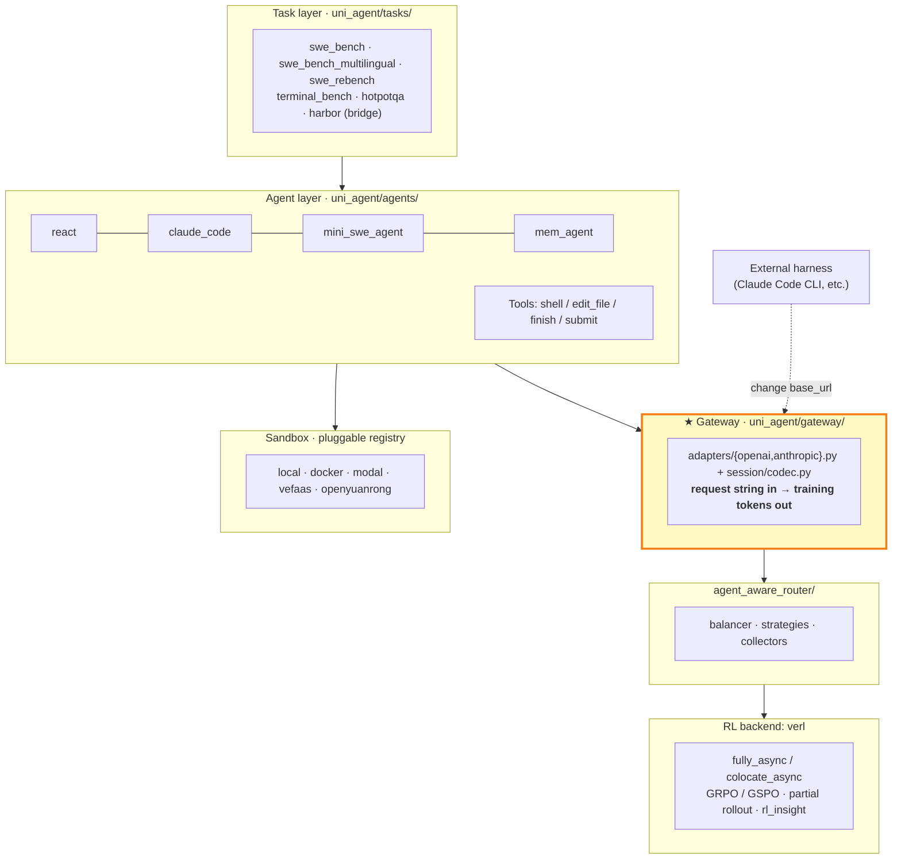
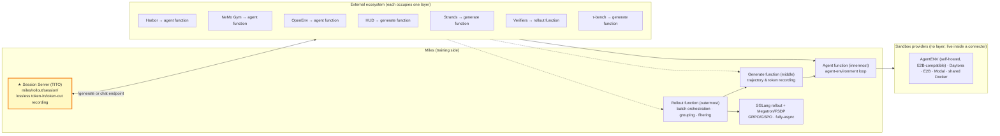

# Deep Dive: uni-agent vs. Miles

*Part of the [Agentic RL Landscape](./README.md). Data as of 2026-09-14; entries marked ⚠️ are unverified vendor claims.*

Two L3 frameworks with opposite architectural philosophies: uni-agent is **cohesive**, Miles is **outsourced**. Architecture diagrams, the three-plug-in-layer model, and a layer-by-layer comparison.

---

Both target L3, but their architectural philosophies are opposites: uni-agent is **cohesive**, Miles is **outsourced**.

## uni-agent: Full-Stack Cohesion

**The core idea:** the Gateway inverts "the training framework adapts to the agent" into "the agent points at a URL." Any harness that can change its `base_url` enters the RL loop.

**Published results** (from the repo README):

| Benchmark | Agent | Model | Base → RL |
|---|---|---|---|
| SWE-Bench Verified | ReAct | Qwen3-Coder-480B | — → **64.2** |
| Terminal-Bench v2.1 | **Claude Code** | GLM5.2-733B | — → **67.4** |
| R2E-Gym | ReAct | Qwen3-30B-A3B | 22.2 → **36.8** |
| SWE-reBench | ReAct | Qwen3.5-9B | 53.8 → **59.2** |
| SWE-reBench | **Claude Code** | Qwen3-Coder-30B-A3B | 40.2 → **46.2** |

> Note the asymmetry: ReAct covers every RL recipe and gains more (+14.6); Claude Code appears once and gains less (+6.0). **White-box agents train better.**

## Miles: Three Plug-In Layers + External Agent Server

**The three plug-in layers** (source: `docs/user-guide/environments.md`; ✓ = the external framework takes it over):

| Capability | Agent function | Generate function | Rollout function |
|---|:---:|:---:|:---:|
| CLI flag | `--custom-agent-function-path` | `--custom-generate-function-path` | `--rollout-function-path` |
| Agent–environment loop | ✓ | ✓ | ✓ |
| Trajectory & token recording | ○ stays in Miles | ✓ | ✓ |
| Reward pathway | ○ | ○ | ✓ |
| Data source / taskset | ○ | ○ | ✓ |
| Batch orchestration (grouping, filtering) | ○ | ○ | ✓ |
| Model, engines, weight updates, optimizer | ○ | ○ | ○ **always Miles** |

**How it actually runs** (`examples/swe-agent-harbor-docker/`): Miles runs a session server that serves the policy; **Harbor runs as a separate agent server** (`miles_agent_server.py`, port 30000) that creates sandboxes, runs agents, and returns verifier rewards. The two processes talk over HTTP.

One engineering detail worth memorizing: **the two timeouts must be ordered** — `--agent-timeout` (server-side, authoritative) < `AGENT_TRIAL_TIMEOUT` (client ceiling, default 7200s). Get it backwards and a trial is marked aborted client-side while the server keeps running it; the sandbox slot stays occupied, and **the aborted sample takes its whole GRPO group down with it**.

**Reference run:** GLM-5.2 744B-A40B on 64× GB300 (32 rollout / 32 training), terminal-bench-style tasks, fully async, ~4.5 min/step, rollout weights lagging ~1.7 steps behind the trainer.

## Layer-by-Layer Comparison

| Dimension | uni-agent | Miles |
|---|---|---|
| **Philosophy** | Cohesive: agent / task / sandbox all in-repo | Outsourced: defines plug-in points, implementations external |
| **Agents** | 4 built-in + any harness via Gateway | **0 built-in**, entirely connector-driven |
| **Wiring mechanism** | Gateway impersonating OpenAI/Anthropic endpoint | Session server + external agent server over HTTP |
| **Token fidelity** | Gateway `session/codec` | **TITO** session server |
| **Sandboxes** | 5 providers (incl. China-domestic veFaaS / openyuanrong) | 4 (all overseas commercial) + shared Docker |
| **Rollout engine** | vLLM / SGLang / TRT-LLM / HF | **SGLang only** |
| **Training backend** | verl | Megatron / FSDP (in-house) |
| **Demonstrated scale** | No public 700B-class results | **744B MoE on 64× GB300, verified** |
| **China availability** | ★★★★★ veFaaS / openyuanrong | ★★ depends on Daytona / E2B / Modal |
| **Onboarding cost** | Low (recipes included) | High (build your own connector) |
| **Stars** | 601 | 2,849 |

**One-line selection rule:** **small-to-mid scale, need results fast, China-based → uni-agent; very large MoE, already on SGLang, willing to build your own environment → Miles.**

---

