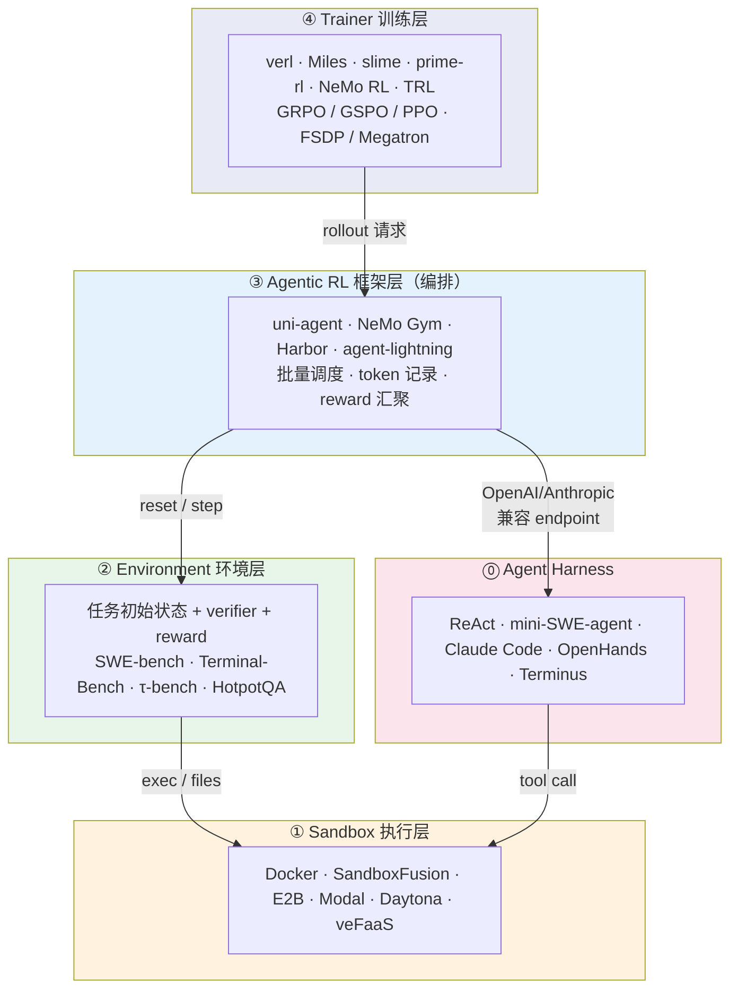
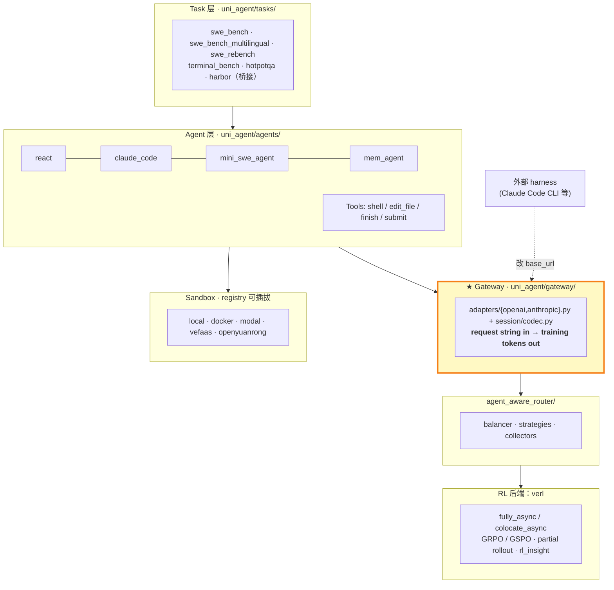
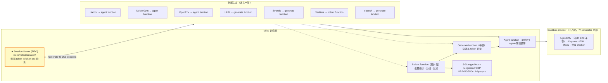
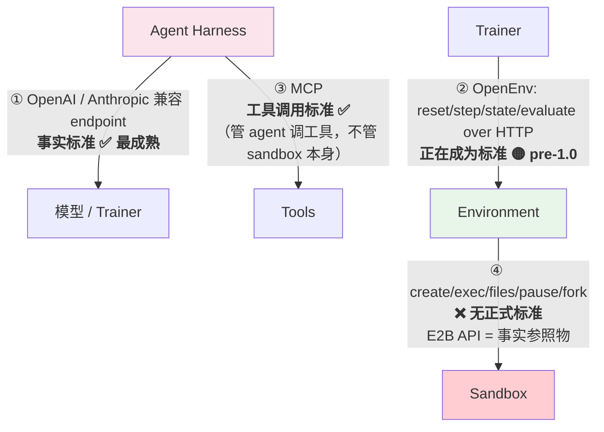
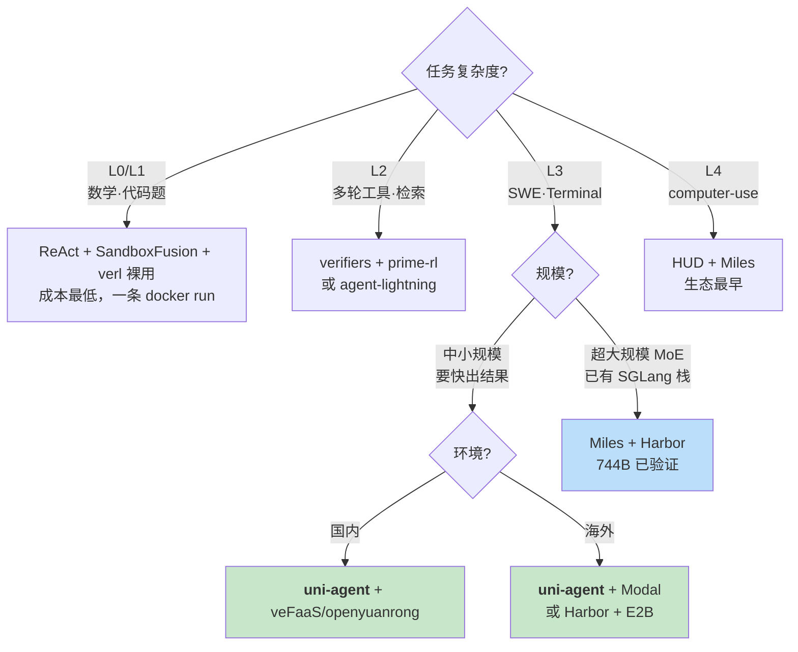

# Agentic RL 全景：框架、Sandbox、Agent 与标准

> **数据采集**：Star 数与最后提交时间由已认证 `gh api repos/<repo>` 于 **2026-09-14** 实时拉取。
> 架构细节来自本地源码阅读：`uni-agent`(commit `1074343`, 2026-09-11)、`miles`(commit `7c547b07b`, 2026-08-25)、`verl`(fork `lizamd/verl@dsv4-0907`) + GitHub API 查上游 `verl-project/verl@main`、`verl-project/verl-recipe@main`。
> 标注 ⚠️ 的条目来自厂商文档/博客，未经源码验证。

---

## 0. TL;DR

三句话：

1. **Agentic RL 的技术栈已经分成四层**，每层都在独立标准化：Agent ↔ Environment ↔ Sandbox ↔ Trainer。
2. **Sandbox 已经不是选型难点**——所有框架都做成了可插拔 provider，换一个是改一行配置。真正的难点在 **agent 怎么接进训练循环**。
3. **三层标准现状**：Environment 层有 OpenEnv（正在成为标准）；Agent↔模型层是 OpenAI/Anthropic-compatible endpoint（事实标准）；**Sandbox 层没有正式标准**，E2B 的 API 是事实上的参照物。

---

## 1. 分层模型

**每层的职责边界**（这是理解全局的关键）：

| 层 | 管什么 | 不管什么 |
|---|---|---|
| Agent Harness | 决定"下一步做什么" | 不知道自己得几分 |
| Sandbox | 跑代码、存文件、隔离 | 不算分、不知道任务是什么 |
| Environment | **算分（verifier/reward）**、定义初始状态 | 不管训练怎么做 |
| Agentic RL 框架 | 并发调度、**token 级记录**、轨迹拼接 | 不管优化器 |
| Trainer | 优化器、权重更新、分布式 | 不管环境长什么样 |

> **最容易混淆的一点**：`reward 必须在 Environment 层算`，因为只有它知道 ground truth 和测试用例。这就是为什么不能直接拿 E2B 当 RL 环境用——E2B 给你一个盒子，但不会告诉你这条轨迹该得几分。

---

## 2. 表一：Agentic RL 方案对比

### 2.1 任务复杂度分级（本文自定义的判定标尺）

| 级别 | 名称 | 特征 | 代表任务 | 对 sandbox 的要求 |
|---|---|---|---|---|
| **L0** | 单轮 RLVR | 无环境，规则打分 | GSM8K, MATH, IFBench | 不需要 |
| **L1** | 单轮工具调用 | 一次 code interpreter | ReTool, DeepScaler | **无状态**即可（SandboxFusion 足够） |
| **L2** | 多轮工具/检索 | 几轮交互，轻状态 | HotpotQA, [τ-bench](https://github.com/sierra-research/tau-bench) | 轻量有状态 |
| **L3** | **长程 Agent** | 几十~几百轮，真实文件系统 | **SWE-bench, [Terminal-Bench](https://github.com/harbor-framework/terminal-bench), SWE-reBench** | **完整有状态 sandbox + harness** |
| **L4** | Computer-use / 多模态 | 截图作为 observation | OSWorld, [HUD](https://hud.ai) 系 | 有状态 + GUI + 多模态轨迹记录 |

**分水岭在 L1→L2 和 L2→L3**：
- L1→L2：需要 sandbox 保持状态
- L2→L3：需要**完整 agent harness + token 级轨迹保真**，框架复杂度陡增

### 2.2 主表

| Agentic RL 框架 | 底层 RL 框架 | 支持复杂度 | Rollout 引擎 | Agent 层 | Sandbox 选项 | Star | 易用性 |
|---|---|:---:|---|---|---|---:|:---:|
| **[uni-agent](https://github.com/verl-project/uni-agent)** | **[verl](https://github.com/verl-project/verl)**（内嵌） | **L3** | vLLM / SGLang / TRT-LLM / HF（继承 verl） | react, claude_code, mini_swe_agent, mem_agent + **任意 harness（Gateway）** | local, docker, **[modal](https://modal.com), [veFaaS](https://www.volcengine.com/product/vefaas), [openyuanrong](https://github.com/yuanrong-proj/yuanrong)** | **601** | ★★★★ |
| *（[verl](https://github.com/verl-project/verl) 裸用）* | verl | L1~L2 | 同上 | 无内建，自写 `BaseTool` | [SandboxFusion](https://github.com/bytedance/SandboxFusion), [Daytona](https://github.com/daytonaio/daytona) | 23,405 | ★★ |
| **[Miles](https://github.com/radixark/miles)**（agentic 部分） | **Miles**（自带） | **L3~L4** | **仅 SGLang** | 三层插件点，**不内建 agent** | ⚠️ [AgentENV](https://github.com/kvcache-ai/AgentENV), Daytona, [E2B](https://github.com/e2b-dev/E2B), Modal, 共享 Docker | **2,849** | ★★★ |
| *（[slime](https://github.com/THUDM/slime)）* | slime | L2~L3 | 仅 SGLang | 同上（Miles 是其 fork） | 同上 | 8,458 | ★★★ |
| **[NeMo Gym](https://github.com/NVIDIA-NeMo/Gym)** | [NeMo RL](https://github.com/NVIDIA-NeMo/RL) / [Unsloth](https://github.com/unslothai/unsloth) / **verl** | **L3** | vLLM, SGLang, TRT-LLM, Dynamo, Megatron ✅ | ⚠️ [OpenHands](https://github.com/All-Hands-AI/OpenHands), [mini-SWE-agent](https://github.com/SWE-agent/mini-swe-agent), [LangGraph](https://github.com/langchain-ai/langgraph), **[Claude Code](https://github.com/anthropics/claude-code)**, Hermes | 环境自带 | **1,183** | ★★★ |
| **[verifiers](https://github.com/PrimeIntellect-ai/verifiers)** | [prime-rl](https://github.com/PrimeIntellect-ai/prime-rl) / TinkerRL / [SkyRL](https://github.com/NovaSky-AI/SkyRL) | L2~L3 | vLLM（prime-rl） | 环境自带 | 环境自定义 | **4,613** | ★★★★ |
| **[Harbor](https://github.com/harbor-framework/harbor)** | 可接 Miles / 任意 | **L3** | 无关（HTTP server） | Terminus, Claude Code, [Codex](https://github.com/openai/codex), OpenHands | Docker, **Modal, Daytona** | **5,205** | ★★★★ |
| **[agent-lightning](https://github.com/microsoft/agent-lightning)** | 可接 verl 等 | L2 | 依赖底层 | 包任意框架（LangChain/AutoGen/OpenAI SDK） | 交给 agent 框架 | **18,087** | ★★★★★ |
| **[ART](https://github.com/OpenPipe/ART)** | 自带 | L2 | vLLM | 自带 agent loop | 自定义 | **10,712** | ★★★★ |
| **[SkyRL](https://github.com/NovaSky-AI/SkyRL)** | 自带 | L2~L3 | ⚠️ vLLM + SGLang | SkyRL-Gym | 环境自带 | 2,296 | ★★★ |
| **[AReaL](https://github.com/inclusionAI/AReaL)** | 自带 | L2~L3 | **SGLang + vLLM ✅** | 有 agentic 支持 | ⚠️ | 5,754 | ★★★ |
| **[ROLL](https://github.com/alibaba/ROLL)** | 自带 | L2 | **SGLang + vLLM ✅** | agentic pipeline | ⚠️ | 3,394 | ★★★ |
| **[TRL](https://github.com/huggingface/trl)** | 自带 | L1~L2 | vLLM | 轻 | 靠 [OpenEnv](https://github.com/meta-pytorch/OpenEnv) | **19,299** | ★★★★★ |
| **[atropos](https://github.com/NousResearch/atropos)** | 自带 | L2 | ⚠️ | 环境为中心 | 自定义 | 1,350 | ★★ |
| **[rllm](https://github.com/agentica-project/rllm)** | **verl** | L2 | 继承 verl | agent 抽象 | 自定义 | 412 | ★★ |
| **[torchforge](https://github.com/meta-pytorch/torchforge)** | 自带 | L1~L2 | ⚠️ | — | OpenEnv | 702 | ★★ |
| **[OpenRLHF](https://github.com/OpenRLHF/OpenRLHF)** | 自带 | L0~L1 | vLLM | 弱 | — | **10,000** | ★★★ |

### 2.3 读表要点

1. **Star 数与 agentic 能力严重不相关**。verl 23k、TRL 19k 是**通用 RL 框架**的存量；uni-agent 只有 601，但它是 verl 官方给出的 L3 答案。agent-lightning 18k 里有大量"包一层"的轻量用户，实际只到 L2。
2. **Rollout 引擎是硬约束**：Miles/slime **只支持 SGLang**（`miles/backends/` 下只有 `sglang_utils`，全仓 `miles/` 无 vLLM 代码）。如果你的推理栈绑死 vLLM，Miles 直接出局。verl 系（含 uni-agent）、NeMo RL、AReaL、ROLL 都是双栈。
3. **Agent 接入方式是真正的分野**，三种范式：
   - **Gateway 劫持**（uni-agent）：伪装成 OpenAI/Anthropic endpoint，agent 完全不改 → 最通用
   - **外部 agent server**（Miles + Harbor）：把 agent+sandbox+verifier 整体外包给一个 HTTP 服务 → 最解耦
   - **自写 tool**（verl 裸用、prime-rl）：最可控，最费人

---

## 3. 深度展开：uni-agent vs Miles

两者都是 L3，但**架构哲学完全相反**：uni-agent **内聚**，Miles **外包**。

### 3.1 uni-agent：全栈内聚

**核心设计**：Gateway 把"训练框架适配 agent"反转成"agent 指向一个 URL"。任何能改 `base_url` 的 harness 都能进 RL 循环。

**已验证结果**（README 结果表）：

| Benchmark | Agent | Model | Base → RL |
|---|---|---|---|
| SWE-Bench Verified | ReAct | Qwen3-Coder-480B | — → **64.2** |
| Terminal-Bench v2.1 | **Claude Code** | GLM5.2-733B | — → **67.4** |
| R2E-Gym | ReAct | Qwen3-30B-A3B | 22.2 → **36.8** |
| SWE-reBench | ReAct | Qwen3.5-9B | 53.8 → **59.2** |
| SWE-reBench | **Claude Code** | Qwen3-Coder-30B-A3B | 40.2 → **46.2** |

> 注意：ReAct 覆盖了所有 RL recipe 且提升幅度更大（+14.6）；Claude Code 只有一行且提升更小（+6.0）。**白盒 agent 更好训**。

### 3.2 Miles：三层插件点 + 外部 agent server

**三层插件点**（源码：`docs/user-guide/environments.md`，✓ = 外部框架接管）：

| 能力 | Agent function | Generate function | Rollout function |
|---|:---:|:---:|:---:|
| 命令行 flag | `--custom-agent-function-path` | `--custom-generate-function-path` | `--rollout-function-path` |
| agent–环境循环 | ✓ | ✓ | ✓ |
| 轨迹与 token 记录 | ○ Miles 保留 | ✓ | ✓ |
| reward 通路 | ○ | ○ | ✓ |
| 数据源 / taskset | ○ | ○ | ✓ |
| 批量编排（分组、过滤） | ○ | ○ | ✓ |
| 模型、引擎、权重更新、优化器 | ○ | ○ | ○ **永远在 Miles** |

**实际跑法**（`examples/swe-agent-harbor-docker/`）：Miles 起 session server 提供 policy，**Harbor 作为独立 agent server**（`miles_agent_server.py`，端口 30000）负责创建 sandbox、跑 agent、返回 verifier reward。两个进程通过 HTTP 通信。

工程细节值得记的一条：**两个超时必须有序**——`--agent-timeout`（服务端权威）< `AGENT_TRIAL_TIMEOUT`（客户端上限，默认 7200s）。顺序反了会导致 trial 被客户端判死但服务端仍在跑，sandbox 槽位被占，**整个 GRPO group 被这个样本拖垮**。

**参考实验**：GLM-5.2 744B-A40B，64× GB300（32 rollout / 32 train），terminal-bench 类任务，全异步，~4.5 分钟/步，rollout 权重滞后 ~1.7 步。

### 3.3 逐层对比

| 维度 | uni-agent | Miles |
|---|---|---|
| **哲学** | 内聚：agent/task/sandbox 都在仓内 | 外包：定义插件点，实现交给外部 |
| **Agent** | 4 个内建 + Gateway 接任意 harness | **0 个内建**，全靠 connector |
| **接入机制** | Gateway 伪装 OpenAI/Anthropic endpoint | Session server + 外部 agent server (HTTP) |
| **Token 保真** | Gateway session/codec | **TITO** session server |
| **Sandbox** | 5 个 provider（含国内 veFaaS/openyuanrong） | 4 个（全是海外商业服务）+ 共享 Docker |
| **Rollout 引擎** | vLLM / SGLang / TRT-LLM / HF | **仅 SGLang** |
| **训练后端** | verl | Megatron / FSDP（自研） |
| **规模上限** | 未见 700B 级公开结果 | **744B MoE，64×GB300 已验证** |
| **国内可用性** | ★★★★★ veFaaS/openyuanrong | ★★ 依赖 Daytona/E2B/Modal |
| **上手成本** | 低（recipe 齐全） | 高（要自己搭 connector） |
| **Star** | 601 | 2,849 |

**一句话选型**：**中小规模、要快速出结果、国内环境 → uni-agent；超大规模 MoE、已有 SGLang 栈、愿意自己搭环境 → Miles。**

---

## 4. 表二：Sandbox 方案对比

| 方案 | 部署形态 | 本地部署 | 隔离 | 有状态 | API 形态 | 开源/收费 | 背后 | Star | 最后提交 | 易用性 |
|---|---|:---:|---|:---:|---|---|---|---:|---|:---:|
| **裸 [Docker](https://www.docker.com)** | 本机 / baremetal | ✅ | container | 进程级 | 无（CLI/SDK） | 开源 | Docker | — | — | ★★★★★ |
| **[SandboxFusion](https://github.com/bytedance/SandboxFusion)** | **单机 docker** | ✅ | container | ❌ | `POST /run_code` | 开源 | **字节** | 1,065 | 2026-07-14 | ★★★★★ |
| **[E2B](https://github.com/e2b-dev/E2B)** | Cloud | ⚠️ 可自建 | **Firecracker** | ✅ | REST + WS，SDK 完整 | SDK Apache-2.0 / 服务收费 | E2B (YC) | **13,784** | 2026-09-12 | ★★★★★ |
| **[e2b-dev/infra](https://github.com/e2b-dev/infra)** | **自建（Nomad+Consul+Terraform）** | ✅ | Firecracker | ✅ | 同 E2B | 开源 | E2B | 1,395 | **2026-09-14** | ★★ |
| **[AgentENV](https://github.com/kvcache-ai/AgentENV)** | **自建分布式** | ✅ | ⚠️ | ✅ | **E2B 兼容** | 开源 | **kvcache-ai**（月之暗面系） | **3,459** | 2026-09-12 | ★★★ |
| **[Modal](https://modal.com)** | Cloud | ❌ | gVisor | ✅ | Python SDK 优先 | 收费（[client](https://github.com/modal-labs/modal-client) 开源） | Modal Labs | 514 (client) | 2026-09-11 | ★★★★★ |
| **[Daytona](https://github.com/daytonaio/daytona)** | Cloud | ❌ | container | ✅ | REST SDK | ⚠️ **2026-06 闭源** | Daytona | 71,715 ※ | 2026-07-24 | ★★★★ |
| **[microsandbox](https://github.com/microsandbox/microsandbox)** | **本机免编排** | ✅ | **libkrun microVM** | ✅ | 本地 SDK | 开源 | 社区 | **8,248** | **2026-09-14** | ★★★★ |
| **[agent-sandbox](https://github.com/kubernetes-sigs/agent-sandbox)** | **k8s** | ✅ | gVisor / Kata | ✅ | **k8s CRD**（非 REST） | 开源 | **k8s-sigs / Google** | **3,832** | 2026-09-12 | ★★ |
| **[veFaaS](https://www.volcengine.com/product/vefaas)** | Cloud（国内） | ❌ | Serverless | ✅ | 火山 SDK | 收费 | **火山引擎** | — | — | ★★★★ |
| **[OpenYuanRong](https://github.com/yuanrong-proj/yuanrong)** | Cloud（国内） | ⚠️ | ⚠️ | ✅ | SDK | 开源（openEuler 系） | **华为** | 104 | — | ★★★ |
| **[SWE-ReX](https://github.com/SWE-agent/SWE-ReX)** | 库（多后端） | ✅ | 随后端 | ✅ | Python | 开源 | **SWE-agent 团队(Princeton)** | 588 | 2026-09-07 | ★★★★ |
| **[llm-sandbox](https://github.com/vndee/llm-sandbox)** | 库（本机） | ✅ | container | 弱 | Python | 开源 | 社区 | 1,119 | **2026-09-14** | ★★★★★ |
| **[Judge0](https://github.com/judge0/judge0)** | 服务 | ✅ | container | ❌ | REST | 开源 | 社区 | 4,433 | 2026-08-17 | ★★★★ |
| **[Piston](https://github.com/engineer-man/piston)** | 服务 | ✅ | container | ❌ | REST | 开源 | 社区 | 2,811 | 2026-07-31 | ★★★★ |
| *[gVisor](https://github.com/google/gvisor)*（原语） | — | ✅ | 用户态内核 | — | — | 开源 | **Google** | 19,301 | 2026-09-14 | — |
| *[Kata](https://github.com/kata-containers/kata-containers)*（原语） | — | ✅ | microVM | — | — | 开源 | **OpenInfra** | 8,720 | 2026-09-11 | — |
| *[Firecracker](https://github.com/firecracker-microvm/firecracker)*（原语） | — | ✅ | microVM | — | — | 开源 | **AWS** | **36,717** | 2026-09-11 | — |

※ **Daytona 的 71.7k star 具有误导性**——那是早期"云开发环境"产品积累的，2026-06 生产代码已闭源、公开仓库冻结不再维护。**不要把它当开源自建方案评估**，只能当托管服务用。

### 读表要点

1. **第一分水岭是有状态 vs 无状态**。SandboxFusion 便宜好用但只能做 L1；L3 必须有状态。
2. **真正活跃的自建开源选项只有四个**：`e2b-dev/infra`（重，Nomad 栈）、`AgentENV`（分布式，E2B 兼容）、`microsandbox`（单机 microVM）、`agent-sandbox`（k8s）。
3. **AgentENV 是被低估的一个**：3.4k star、活跃、**声称 E2B API 兼容**——意味着写好的 E2B 代码可以零成本迁到自建。对国内/私有化场景价值很高。
4. **国内方案**：veFaaS（火山，uni-agent 官方致谢）、OpenYuanRong（华为）。这是 uni-agent 相对 Miles 的一个实际优势。
5. **API 形态不统一**是当前最大的摩擦点，见第 6 节。

---

## 5. 表三：Agent Harness 对比

| Harness | 黑/白盒 | Star | 最后提交 | 类型 | 能否进 RL | 谁集成了 | 最适用场景 |
|---|:---:|---:|---|---|:---:|---|---|
| **[Claude Code](https://github.com/anthropics/claude-code)** | **黑盒** | **144,957** | 2026-09-14 | 闭源 CLI | ✅ Gateway 劫持 | **uni-agent**, NeMo Gym, Harbor | 上限最高的基线；蒸馏/冷启数据生成；**不适合深度 RL** |
| **[Codex CLI](https://github.com/openai/codex)** | 灰盒 | **123,915** | 2026-09-14 | 开源 CLI | ✅ 同上 | Harbor | 同上，OpenAI 生态 |
| **[Gemini CLI](https://github.com/google-gemini/gemini-cli)** | 灰盒 | **106,970** | 2026-09-14 | 开源 CLI | ✅ 同上 | — | 同上，Google 生态 |
| **[OpenHands](https://github.com/All-Hands-AI/OpenHands)** | 白盒（重） | **87,817** | 2026-09-14 | agent 平台 | ✅ 自带 runtime | NeMo Gym, Harbor | 需要完整 IDE 能力、浏览器、多模态的复杂任务 |
| **[Cline](https://github.com/cline/cline)** | 白盒 | 67,957 | 2026-09-14 | VSCode 插件 | ❌ IDE 绑定 | — | 人机协作，**不适合 RL** |
| **[Aider](https://github.com/Aider-AI/aider)** | 白盒 | 48,944 | **2026-05-22** | CLI | 理论可 | — | git 原生工作流；**已 4 个月无提交** |
| **[LangGraph](https://github.com/langchain-ai/langgraph)** | 白盒 | 41,596 | 2026-09-13 | 编排框架 | ✅ | NeMo Gym, [verl-recipe](https://github.com/verl-project/verl-recipe), agent-lightning | 通用多智能体/工作流，**非 coding agent** |
| **[smolagents](https://github.com/huggingface/smolagents)** | **白盒（极简）** | 29,312 | 2026-08-25 | 轻量库 | ✅ | HF 生态 | 快速原型、教学、自定义 tool 循环 |
| **[Qwen Code](https://github.com/QwenLM/qwen-code)** | 灰盒 | 27,830 | 2026-09-14 | 开源 CLI | ✅ | — | 国内可控栈 |
| **[SWE-agent](https://github.com/SWE-agent/SWE-agent)** | **白盒** | 20,318 | 2026-09-07 | 研究 agent | ✅ 配 [SWE-ReX](https://github.com/SWE-agent/SWE-ReX) | 学术界 | SWE-bench 类学术复现 |
| **[mini-SWE-agent](https://github.com/SWE-agent/mini-swe-agent)** | **白盒（~100 行）** | **7,515** | 2026-09-07 | 极简 | ✅✅ **最适合** | **uni-agent**, NeMo Gym | **L3 RL 训练首选**：行为可控、可复现、context 透明 |
| **[Strands Agents](https://github.com/strands-agents/sdk-python)** | 白盒 | 7,237 | 2026-09-11 | AWS SDK | ✅ | Miles | AWS 生态工具调用 |
| **[Harbor](https://github.com/harbor-framework/harbor) / Terminus** | 白盒 | 5,205 | 2026-09-14 | 评测 harness | ✅ 自带 RL/SFT rollout 接口 | **Miles**, uni-agent, NeMo Gym | **terminal 类任务标准**；[benchmark](https://github.com/harbor-framework/terminal-bench) 转换 |
| **[τ-bench](https://github.com/sierra-research/tau-bench)** | 白盒 | 1,433 | 2026-03-18 | 环境集 | ✅ | Miles | 工具调用 + 用户模拟（L2） |
| **ReAct（自建）** | **全白盒** | — | — | 自己实现 | ✅✅ | 所有框架 | **L3 RL 的实际主力**；完全可控 |

### 黑盒/白盒的实质差异

| | 白盒（ReAct / mini-SWE-agent） | 黑盒（Claude Code） |
|---|---|---|
| prompt 可改 | ✅ | ❌ |
| context 管理可见 | ✅ | ❌（自动压缩，训练时轨迹会漂） |
| tool 集合可控 | ✅ | ❌ |
| 版本稳定性 | 自己锁 | **上游一更新结果就变** |
| token 级对齐 | 直接 | 靠 Gateway 还原，有损风险 |
| RL 提升幅度 | uni-agent 实测 **+14.6** | uni-agent 实测 **+6.0** |

### 读表要点

1. **Star 最高的三个（Claude Code 145k / Codex 124k / Gemini CLI 107k）都不是为 RL 设计的**。它们能进训练循环纯靠 Gateway 劫持，且行为不可控、版本一变结果就漂。
2. **RL 圈实际训练用的是低 star 的那批**：自写 ReAct 和 mini-SWE-agent（7.5k）。原因很实际——多轮 RL 需要 token 级可控、行为可复现、context 管理透明，**一个 100 行的 agent 比 10 万行的 CLI 好训得多**。
3. **黑盒 agent 的正确用法不是训练，是"蒸馏源"和"上限基线"**：用 Claude Code 跑出高质量轨迹做 SFT 冷启，再用白盒 agent 做 RL。

---

## 6. 标准现状：三层标准，一个空白

这是全文最重要的一节。**"有没有像 MCP 那样的 sandbox 标准"——答案是分层的**：

### 6.1 ① Agent ↔ 模型：OpenAI/Anthropic 兼容 endpoint（最成熟的事实标准）

这是**唯一一个真正无摩擦**的接口。整个 agentic RL 的 agent 接入都建立在它之上：

- uni-agent 的 **Gateway**：`adapters/openai.py` + `adapters/anthropic.py`
- Miles 的 **session server**（TITO）
- 任何 harness 只要能改 `base_url` 就能被训练

> 这条标准不是谁定的，是 OpenAI API 的历史惯性造就的。它是 agentic RL 能起来的**技术前提**。

### 6.2 ② Environment 层：OpenEnv —— 什么是 OpenEnv

**OpenEnv 是 Environment 层的接口标准，不是 sandbox，也不是框架。**

| 项目 | 内容 |
|---|---|
| **是什么** | RL 环境的开放协议：环境 = 一个 HTTP 服务，暴露 `reset()` / `step()` / `state()`（可选 `evaluate()`） |
| **形态** | Gymnasium 风格 API；环境打包成 Docker 容器，跑 FastAPI server，走 HTTP + WebSocket |
| **谁在管** | 2026-06 移交多方委员会：**Meta-PyTorch、NVIDIA、Microsoft、HuggingFace、Prime Intellect、Unsloth、Modal、Mercor、Fleet AI、Reflection、RadixArk(SGLang)** |
| **谁在用** | vLLM、SkyRL、TRL、TorchForge、Axolotl、Lightning、**Miles** |
| **Sandbox 后端** | **pluggable provider**：local Docker / Docker Swarm / Daytona / E2B / Modal / AgentENV |
| **明确不管** | reward 怎么定义、训练循环怎么写 —— 它只做"公共插座" |
| **Star** | **2,578** |
| **成熟度** | 🟡 **pre-1.0，明确标注 experimental，API 会变** |
| **活跃 RFC** | 001 基线 API / 002 工具可发现性 / **003 原生 MCP 支持** / 004 可组合 rubric 与 reward 引擎 / 005 agentic harness 集成 / 006 外部 reward / 007 HF datasets taskset |

**为什么需要它**：没有它，每个训练框架要为每个环境写一份适配（N×M）。有了它，环境写一次，verl/Miles/TRL/SkyRL 都能消费（N+M）。

**当前局限**：
- verl 主仓 **in-tree 没有 openenv 目录**（`verl/experimental/` 下只有 agent_loop、fully_async_policy、one_step_off_policy、reward_loop、separation、teacher_loop），要通过 `verl-recipe/nemo_gym` 桥接
- Miles 有 first-class 支持（`docs/user-guide/openenv.md`），但标记 experimental

### 6.3 ③ MCP 的位置（常见误解）

**MCP 不是 sandbox 标准。** 它是 agent ↔ 工具的协议，在这套体系里有两个位置：

1. **跑在 sandbox 里面**：E2B 与 Docker 合作，在 sandbox 内置 MCP gateway，接 Docker MCP Catalog 的 200+ 工具，每个工具是 sandbox 内的一个容器。工具在 sandbox 内（localhost gateway）和外（sandbox URL）都可寻址。
2. **包在 sandbox 外面**：社区有一堆 `e2b-sandbox-mcp` 类项目，把 E2B 的 API 包成 MCP server 给 Claude Code 之类用。

> 注意 verl 主仓**已移除 MCP 支持**（`verl/tools/tool_registry.py:37` 写着 `# MCP tool is removed for now.`，`ToolType` 枚举只剩 `NATIVE`）。训练场景对 MCP 的需求远低于产品场景。

### 6.4 ④ Sandbox 层：标准的空白

**没有正式的跨厂商 sandbox API 规范**，不存在类似"OpenAI-compatible endpoint"那样被广泛实现的"E2B-compatible protocol"规范文档。现状是：

| 现象 | 说明 |
|---|---|
| **E2B API 成为事实参照物** | **AgentENV 明确声称 "E2B-compatible"**——这是目前最接近"标准"的信号 |
| **各框架自建 provider 抽象** | uni-agent `sandbox/registry.py`、Miles 的 sandbox provider、OpenEnv 的 provider model——**各写各的** |
| **形态差异巨大** | SandboxFusion 单接口 REST / E2B REST+WS / agent-sandbox **k8s CRD** / Modal Python-first |
| **k8s 方向有标准苗头** | `kubernetes-sigs/agent-sandbox` 的 `Sandbox` / `SandboxTemplate` / `SandboxClaim` / `SandboxWarmPool` 四个 CRD，是 k8s 生态内的标准，但**不是 REST API 标准** |

**这个空白为什么还没被填上**：因为 OpenEnv 在上面一层把它吸收掉了——对训练框架而言，只要 Environment 接口统一，底下 sandbox 是什么无所谓。**sandbox 标准的缺失被 environment 标准掩盖了。**

**对你的实际含义**：
- 短期：接受它。用框架给的 provider 抽象，换 sandbox 改一行配置。
- 中期：如果要自建，**优先选 E2B 兼容的**（AgentENV），迁移成本最低。
- 长期：关注 OpenEnv RFC 003（原生 MCP）和 agent-sandbox CRD 的演进。

---

## 7. 结论与选型

### 7.1 决策路径

### 7.2 七条可直接汇报的观察

**① Sandbox 已经不是选型难点。**
所有框架都把它做成了可插拔 provider（uni-agent 的 `sandbox/registry.py`、Miles 的 provider 表、OpenEnv 的 provider model）。换一个 sandbox 是改一行配置。真正的难点在 **agent 怎么接进训练循环**——这才是 uni-agent 的 Gateway、Miles 的三层插件点在解的问题。

**② 大 star agent ≠ 好训。**
Claude Code 145k star，但 uni-agent 实测它的 RL 提升只有 +6.0；自写 ReAct 是 +14.6。黑盒 agent 的 context 自动压缩、prompt 不可见、版本漂移，都是 RL 的毒药。**黑盒 agent 的正确位置是"蒸馏源"和"上限基线"，不是训练对象。**

**③ Rollout 引擎是硬约束，容易被忽略。**
Miles/slime **只支持 SGLang**（源码验证：`miles/backends/` 只有 `sglang_utils`）。verl 系、NeMo RL、AReaL、ROLL 是双栈。选框架前先确认这条，否则整个推理栈要重做。

**④ 标准分三层，sandbox 层是空白，但不致命。**
Agent↔模型层（OpenAI 兼容）已成熟，Environment 层（OpenEnv）正在成，**Sandbox 层没有标准**。但因为 OpenEnv 在上层吸收了这个差异，空白暂时不痛。自建时优先选 E2B 兼容的（AgentENV）。

**⑤ uni-agent 被严重低估。**
601 star，但它是**目前唯一一个把「任意 harness + 多 sandbox + 多任务 + verl 训练」四件事全打通、且带可复现结果表和学习曲线的开源方案**。对走 verl 路线的团队，这是起点而非参考。国内还额外有 veFaaS/openyuanrong 两个 sandbox 后端。

**⑥ 架构上有两种范式，没有对错。**
- **内聚**（uni-agent）：上手快、可复现、组件齐；代价是仓库边界大、定制要改源码
- **外包**（Miles）：解耦彻底、能接整个生态；代价是要自己搭 connector、运维两套服务（注意那个双超时陷阱）

**⑦ 工程细节会吃掉大部分时间。**
Miles 文档里那条超时顺序警告（`--agent-timeout` < `AGENT_TRIAL_TIMEOUT`，否则**一个样本拖垮整个 GRPO group**）是典型例子。L3 agentic RL 的真实成本不在算法，在**长轨迹的并发、超时、失败归因和 token 保真**。

---

## 附录：数据来源

**源码（本地）**
- `/home/yuhanya/uni-agent` @ `1074343` (2026-09-11)
- `/home/yuhanya/miles` @ `7c547b07b` (2026-08-25)
- `/home/yuhanya/verl` @ `2e8a3f1d` (fork `lizamd/verl@dsv4-0907`)

**GitHub API**（2026-09-14 拉取）
- `verl-project/verl@main`、`verl-project/verl-recipe@main` 目录结构
- 全部 star 数与 `pushed_at`

**文档与公开资料**
- [OpenEnv](https://github.com/meta-pytorch/OpenEnv) · [HF 公告](https://huggingface.co/blog/openenv-agentic-rl)
- [Miles v0.1 — LMSYS](https://www.lmsys.org/blog/2026-08-18-miles-v0-1/) · [Miles docs](https://miles.radixark.com/docs)
- [Harbor](https://github.com/harbor-framework/harbor) · [Terminal-Bench 2.0](https://www.tbench.ai/news/announcement-2-0)
- [NeMo Gym 生态](https://docs.nvidia.com/nemo/gym/latest/about/ecosystem.html)
- [verifiers](https://github.com/PrimeIntellect-ai/verifiers) · [Environments Hub](https://www.primeintellect.ai/blog/environments)
- [kubernetes-sigs/agent-sandbox](https://github.com/kubernetes-sigs/agent-sandbox)
- [E2B MCP](https://e2b.dev/docs/mcp) · [E2B × Docker MCP](https://e2b.dev/blog/docker-e2b-partner-to-introduce-mcp-support-in-e2b-sandbox)
- [AgentENV](https://github.com/kvcache-ai/AgentENV)

**项目链接速查**

*Agentic RL / RL 框架*
[uni-agent](https://github.com/verl-project/uni-agent) ·
[verl](https://github.com/verl-project/verl) ·
[verl-recipe](https://github.com/verl-project/verl-recipe) ·
[Miles](https://github.com/radixark/miles) ·
[slime](https://github.com/THUDM/slime) ·
[NeMo Gym](https://github.com/NVIDIA-NeMo/Gym) ·
[NeMo RL](https://github.com/NVIDIA-NeMo/RL) ·
[verifiers](https://github.com/PrimeIntellect-ai/verifiers) ·
[prime-rl](https://github.com/PrimeIntellect-ai/prime-rl) ·
[SkyRL](https://github.com/NovaSky-AI/SkyRL) ·
[TRL](https://github.com/huggingface/trl) ·
[AReaL](https://github.com/inclusionAI/AReaL) ·
[ROLL](https://github.com/alibaba/ROLL) ·
[agent-lightning](https://github.com/microsoft/agent-lightning) ·
[ART](https://github.com/OpenPipe/ART) ·
[OpenRLHF](https://github.com/OpenRLHF/OpenRLHF) ·
[atropos](https://github.com/NousResearch/atropos) ·
[rllm](https://github.com/agentica-project/rllm) ·
[torchforge](https://github.com/meta-pytorch/torchforge) ·
[Unsloth](https://github.com/unslothai/unsloth)

*Sandbox*
[SandboxFusion](https://github.com/bytedance/SandboxFusion) ·
[E2B](https://github.com/e2b-dev/E2B) ·
[e2b-dev/infra](https://github.com/e2b-dev/infra) ·
[AgentENV](https://github.com/kvcache-ai/AgentENV) ·
[Modal](https://modal.com) ·
[Daytona](https://github.com/daytonaio/daytona) ·
[microsandbox](https://github.com/microsandbox/microsandbox) ·
[agent-sandbox](https://github.com/kubernetes-sigs/agent-sandbox) ·
[veFaaS](https://www.volcengine.com/product/vefaas) ·
[OpenYuanRong](https://github.com/yuanrong-proj/yuanrong) ·
[SWE-ReX](https://github.com/SWE-agent/SWE-ReX) ·
[llm-sandbox](https://github.com/vndee/llm-sandbox) ·
[Judge0](https://github.com/judge0/judge0) ·
[Piston](https://github.com/engineer-man/piston) ·
[gVisor](https://github.com/google/gvisor) ·
[Kata](https://github.com/kata-containers/kata-containers) ·
[Firecracker](https://github.com/firecracker-microvm/firecracker)

*Agent Harness / 环境*
[Claude Code](https://github.com/anthropics/claude-code) ·
[Codex](https://github.com/openai/codex) ·
[Gemini CLI](https://github.com/google-gemini/gemini-cli) ·
[OpenHands](https://github.com/All-Hands-AI/OpenHands) ·
[Cline](https://github.com/cline/cline) ·
[Aider](https://github.com/Aider-AI/aider) ·
[LangGraph](https://github.com/langchain-ai/langgraph) ·
[smolagents](https://github.com/huggingface/smolagents) ·
[Qwen Code](https://github.com/QwenLM/qwen-code) ·
[SWE-agent](https://github.com/SWE-agent/SWE-agent) ·
[mini-SWE-agent](https://github.com/SWE-agent/mini-swe-agent) ·
[Strands](https://github.com/strands-agents/sdk-python) ·
[Harbor](https://github.com/harbor-framework/harbor) ·
[Terminal-Bench](https://github.com/harbor-framework/terminal-bench) ·
[τ-bench](https://github.com/sierra-research/tau-bench) ·
[HUD](https://hud.ai)

*标准*
[OpenEnv](https://github.com/meta-pytorch/OpenEnv) ·
[MCP](https://modelcontextprotocol.io)

**已知不确定项**（标 ⚠️，建议汇报时说明）
- Miles 的 sandbox provider 列表来自其文档，未逐个跑通验证
- SkyRL / atropos / torchforge 的 rollout 引擎未经源码验证
- OpenYuanRong 的隔离机制与开源状态未确认
- 易用性评分（★）为主观判断，基于文档完整度、依赖复杂度、是否有可复现 recipe
