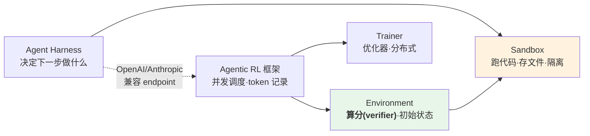
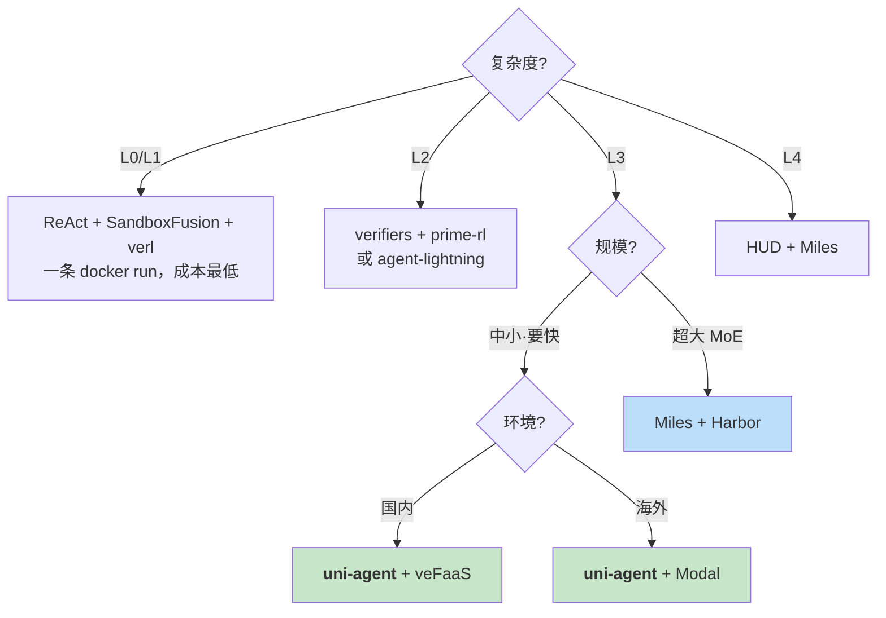

# Agentic RL 全景速览（精简版）

> 详细版见 [README.md](./README.md)。Star 数为 `gh api` 于 **2026-09-14** 实拉；架构结论来自本地源码（uni-agent `1074343` / miles `7c547b07b` / verl fork）。

## 1. 四层分工

**一句话**：Sandbox 管「跑代码」，Environment 管「算分」，框架管「怎么对接」。不能直接拿 E2B 当 RL 环境——它给你盒子，但不告诉你这条轨迹几分。

## 2. 任务复杂度标尺（选型的第一个问题）

| 级别 | 特征 | 代表任务 | Sandbox 要求 |
|---|---|---|---|
| L0 | 无环境，规则打分 | GSM8K, MATH | 不需要 |
| L1 | 单轮 code interpreter | ReTool | **无状态**即可 |
| L2 | 多轮工具/检索 | HotpotQA, [τ-bench](https://github.com/sierra-research/tau-bench) | 轻量有状态 |
| **L3** | **长程 Agent，几十~几百轮** | **SWE-bench, [Terminal-Bench](https://github.com/harbor-framework/terminal-bench)** | **完整有状态 + harness** |
| L4 | computer-use / 截图 | OSWorld, [HUD](https://hud.ai) 系 | 有状态 + 多模态轨迹 |

分水岭：**L1→L2 要有状态；L2→L3 要 harness + token 保真**，框架复杂度陡增。

## 3. 表一：Agentic RL 方案

| 方案 | 底层 RL | 复杂度 | Rollout 引擎 | Agent | Sandbox | Star |
|---|---|:---:|---|---|---|---:|
| **[uni-agent](https://github.com/verl-project/uni-agent)** | [verl](https://github.com/verl-project/verl) | **L3** | vLLM/SGLang/TRT/HF | 4 内建 + **任意 harness(Gateway)** | local,docker,[modal](https://modal.com),**[veFaaS](https://www.volcengine.com/product/vefaas),[openyuanrong](https://github.com/yuanrong-proj/yuanrong)** | 601 |
| *([verl](https://github.com/verl-project/verl) 裸用)* | verl | L1~L2 | 同上 | 自写 tool | [SandboxFusion](https://github.com/bytedance/SandboxFusion), [Daytona](https://github.com/daytonaio/daytona) | 23.4k |
| **[Miles](https://github.com/radixark/miles)** | 自带 | **L3~L4** | **仅 SGLang** | 0 内建，三层插件点 | [AgentENV](https://github.com/kvcache-ai/AgentENV),Daytona,[E2B](https://github.com/e2b-dev/E2B),Modal | 2.8k |
| **[NeMo Gym](https://github.com/NVIDIA-NeMo/Gym)** | [NeMo RL](https://github.com/NVIDIA-NeMo/RL)/verl | L3 | 全栈 ✅ | [OpenHands](https://github.com/All-Hands-AI/OpenHands),[mini-SWE](https://github.com/SWE-agent/mini-swe-agent),[LangGraph](https://github.com/langchain-ai/langgraph),[Claude Code](https://github.com/anthropics/claude-code) | 环境自带 | 1.2k |
| **[verifiers](https://github.com/PrimeIntellect-ai/verifiers)** | [prime-rl](https://github.com/PrimeIntellect-ai/prime-rl)/[SkyRL](https://github.com/NovaSky-AI/SkyRL) | L2~L3 | vLLM | 环境自带 | 自定义 | 4.6k |
| **[Harbor](https://github.com/harbor-framework/harbor)** | 可接 Miles | L3 | 无关 | Terminus,Claude Code,[Codex](https://github.com/openai/codex) | Docker,Modal,Daytona | 5.2k |
| **[agent-lightning](https://github.com/microsoft/agent-lightning)** | 可接 verl | L2 | 依赖底层 | 包任意框架 | 交给 agent | 18.1k |
| **[TRL](https://github.com/huggingface/trl)** | 自带 | L1~L2 | vLLM | 轻 | 靠 [OpenEnv](https://github.com/meta-pytorch/OpenEnv) | 19.3k |
| [AReaL](https://github.com/inclusionAI/AReaL) / [ROLL](https://github.com/alibaba/ROLL) | 自带 | L2~L3 | SGLang+vLLM ✅ | 有 | ⚠️ | 5.8k / 3.4k |

**三点**：
1. **Star 与 agentic 能力不相关**——verl 23k/TRL 19k 是通用 RL 存量；uni-agent 601 但是 verl 官方的 L3 答案。
2. **Rollout 引擎是硬约束**：Miles/[slime](https://github.com/THUDM/slime) 只支持 SGLang（源码验证）。绑死 vLLM 的直接出局。
3. **Agent 接入有三种范式**：Gateway 劫持（uni-agent，最通用）／外部 agent server（Miles+Harbor，最解耦）／自写 tool（最费人）。

### uni-agent vs Miles：内聚 vs 外包

| | [uni-agent](https://github.com/verl-project/uni-agent) | [Miles](https://github.com/radixark/miles) |
|---|---|---|
| 哲学 | 内聚，agent/task/sandbox 都在仓内 | 外包，只定义插件点 |
| Agent | 4 内建 + Gateway | **0 内建**，全靠 connector |
| Rollout | 四栈 | **仅 SGLang** |
| 规模验证 | 中小 | **744B MoE / 64×GB300** |
| 国内可用 | ★★★★★ veFaaS/openyuanrong | ★★ 依赖海外服务 |
| 上手 | 低（recipe 齐全） | 高（自搭 connector） |

**选型**：中小规模 + 要快 + 国内 → **uni-agent**；超大 MoE + 已有 SGLang 栈 → **Miles**。

## 4. 表二：Sandbox

| 方案 | 部署 | 本地 | 隔离 | 有状态 | 开源 | 背后 | Star |
|---|---|:---:|---|:---:|---|---|---:|
| 裸 [Docker](https://www.docker.com) | 本机/baremetal | ✅ | container | 进程级 | ✅ | Docker | — |
| **[SandboxFusion](https://github.com/bytedance/SandboxFusion)** | **单机 docker** | ✅ | container | ❌ | ✅ | **字节** | 1.1k |
| **[E2B](https://github.com/e2b-dev/E2B)** | Cloud | ⚠️ | **Firecracker** | ✅ | SDK 开源 | E2B | **13.8k** |
| [e2b-dev/infra](https://github.com/e2b-dev/infra) | 自建(Nomad) | ✅ | Firecracker | ✅ | ✅ | E2B | 1.4k |
| **[AgentENV](https://github.com/kvcache-ai/AgentENV)** | **自建分布式** | ✅ | ⚠️ | ✅ | ✅ **E2B 兼容** | **kvcache-ai** | **3.5k** |
| **[Modal](https://modal.com)** | Cloud | ❌ | gVisor | ✅ | 收费（[client](https://github.com/modal-labs/modal-client) 开源） | Modal | — |
| [Daytona](https://github.com/daytonaio/daytona) | Cloud | ❌ | container | ✅ | ⚠️ **已闭源** | Daytona | 71.7k※ |
| **[microsandbox](https://github.com/microsandbox/microsandbox)** | 本机免编排 | ✅ | **libkrun** | ✅ | ✅ | 社区 | **8.2k** |
| **[agent-sandbox](https://github.com/kubernetes-sigs/agent-sandbox)** | **k8s** | ✅ | [gVisor](https://github.com/google/gvisor)/[Kata](https://github.com/kata-containers/kata-containers) | ✅ | ✅ | **k8s-sigs** | 3.8k |
| **[veFaaS](https://www.volcengine.com/product/vefaas)** | Cloud(国内) | ❌ | Serverless | ✅ | 收费 | **火山** | — |
| [SWE-ReX](https://github.com/SWE-agent/SWE-ReX) | 库 | ✅ | 随后端 | ✅ | ✅ | SWE-agent | 588 |

※ Daytona 的 71.7k 是早期"云开发环境"产品积累，2026-06 已闭源、仓库冻结，**不能当开源方案评估**。

**三点**：① 第一分水岭是有状态 vs 无状态，L3 必须有状态；② 真正活跃的自建开源只有四个（[e2b-infra](https://github.com/e2b-dev/infra) / [AgentENV](https://github.com/kvcache-ai/AgentENV) / [microsandbox](https://github.com/microsandbox/microsandbox) / [agent-sandbox](https://github.com/kubernetes-sigs/agent-sandbox)）；③ **AgentENV 被低估**——声称 E2B API 兼容，私有化迁移成本最低。

## 5. 表三：Agent Harness

| Harness | 黑/白盒 | Star | 能否进 RL | 最适用 |
|---|:---:|---:|:---:|---|
| [Claude Code](https://github.com/anthropics/claude-code) | **黑盒** | **145.0k** | ✅ Gateway 劫持 | 上限基线、蒸馏源；**不适合深度 RL** |
| [Codex](https://github.com/openai/codex) / [Gemini CLI](https://github.com/google-gemini/gemini-cli) | 灰盒 | 123.9k / 107.0k | ✅ 同上 | 同上 |
| [OpenHands](https://github.com/All-Hands-AI/OpenHands) | 白盒(重) | **87.8k** | ✅ 自带 runtime | 需要 IDE/浏览器的复杂任务 |
| [Cline](https://github.com/cline/cline) | 白盒 | 68.0k | ❌ IDE 绑定 | 人机协作 |
| [LangGraph](https://github.com/langchain-ai/langgraph) | 白盒 | 41.6k | ✅ | 通用编排，非 coding agent |
| [smolagents](https://github.com/huggingface/smolagents) | 白盒(极简) | 29.3k | ✅ | 原型、教学 |
| [SWE-agent](https://github.com/SWE-agent/SWE-agent) | 白盒 | 20.3k | ✅ 配 [SWE-ReX](https://github.com/SWE-agent/SWE-ReX) | 学术复现 |
| **[mini-SWE-agent](https://github.com/SWE-agent/mini-swe-agent)** | **白盒(~100行)** | **7.5k** | ✅✅ | **L3 RL 首选** |
| **[Harbor](https://github.com/harbor-framework/harbor)/Terminus** | 白盒 | 5.2k | ✅ 自带 RL 接口 | **terminal 类标准** |
| **ReAct(自建)** | **全白盒** | — | ✅✅ | **L3 RL 实际主力** |

**关键数据**：uni-agent 实测同一任务，ReAct 的 RL 提升 **+14.6**，Claude Code 只有 **+6.0**。黑盒 agent 的 context 自动压缩、prompt 不可见、版本漂移都是 RL 的毒药。

> **黑盒 agent 的正确位置是「蒸馏源」和「上限基线」，不是训练对象。**

## 6. 标准：三层已有，一层空白

| 层 | 标准 | 状态 |
|---|---|---|
| Agent ↔ 模型 | **OpenAI/Anthropic 兼容 endpoint** | ✅ 最成熟，agentic RL 的技术前提 |
| Environment | **[OpenEnv](https://github.com/meta-pytorch/OpenEnv)**（`reset/step/state`, HTTP+WS, Docker） | 🟡 多方共治(Meta/NVIDIA/MS/HF/PI/SGLang)，**pre-1.0** |
| Agent ↔ 工具 | **[MCP](https://modelcontextprotocol.io)** | ✅ 但**不是 sandbox 标准**，是跑在 sandbox 里的 |
| **Sandbox** | **无正式标准** | ❌ [E2B](https://github.com/e2b-dev/E2B) API 是事实参照物（AgentENV 兼容它） |

**OpenEnv 是什么**：Environment 层的接口标准，不是 sandbox 也不是框架。环境 = 一个 HTTP 服务，暴露 Gymnasium 风格的 `reset/step/state`，打包成 Docker。它明确不管 reward 怎么定义、训练循环怎么写——只做"公共插座"。价值是把 N×M 适配变成 N+M。

**为什么 sandbox 标准的空白不致命**：OpenEnv 在上一层把差异吸收了。对训练框架而言，只要 Environment 接口统一，底下 sandbox 是什么无所谓。

**实际建议**：短期接受现状，用框架给的 provider 抽象；要自建优先选 **E2B 兼容**的（[AgentENV](https://github.com/kvcache-ai/AgentENV)）。

## 7. 选型路径

## 8. 五条结论

1. **Sandbox 不是选型难点**——全是可插拔 provider，换一个改一行配置。难点在 **agent 怎么接进训练循环**。
2. **大 star agent ≠ 好训**。RL 圈实际用的是自写 ReAct 和 [mini-SWE-agent](https://github.com/SWE-agent/mini-swe-agent)（7.5k），不是 [Claude Code](https://github.com/anthropics/claude-code)（145k）。
3. **Rollout 引擎是易被忽略的硬约束**。[Miles](https://github.com/radixark/miles)/[slime](https://github.com/THUDM/slime) 只支持 SGLang。
4. **[uni-agent](https://github.com/verl-project/uni-agent) 被低估**——601 star，但是唯一把「任意 harness + 多 sandbox + 多任务 + verl 训练」全打通、带可复现结果表的方案。走 verl 路线的话这是起点不是参考。
5. **真实成本不在算法，在工程**。长轨迹的并发、超时、失败归因和 token 保真才是 L3 的主要开销（例：Miles 文档警告两个超时顺序反了会让**一个样本拖垮整个 GRPO group**）。

---

## 附：项目链接速查

**Agentic RL / RL 框架**
[uni-agent](https://github.com/verl-project/uni-agent) ·
[verl](https://github.com/verl-project/verl) ·
[verl-recipe](https://github.com/verl-project/verl-recipe) ·
[Miles](https://github.com/radixark/miles) ·
[slime](https://github.com/THUDM/slime) ·
[NeMo Gym](https://github.com/NVIDIA-NeMo/Gym) ·
[NeMo RL](https://github.com/NVIDIA-NeMo/RL) ·
[verifiers](https://github.com/PrimeIntellect-ai/verifiers) ·
[prime-rl](https://github.com/PrimeIntellect-ai/prime-rl) ·
[SkyRL](https://github.com/NovaSky-AI/SkyRL) ·
[TRL](https://github.com/huggingface/trl) ·
[AReaL](https://github.com/inclusionAI/AReaL) ·
[ROLL](https://github.com/alibaba/ROLL) ·
[agent-lightning](https://github.com/microsoft/agent-lightning) ·
[ART](https://github.com/OpenPipe/ART) ·
[OpenRLHF](https://github.com/OpenRLHF/OpenRLHF) ·
[atropos](https://github.com/NousResearch/atropos) ·
[rllm](https://github.com/agentica-project/rllm) ·
[torchforge](https://github.com/meta-pytorch/torchforge)

**Sandbox**
[SandboxFusion](https://github.com/bytedance/SandboxFusion) ·
[E2B](https://github.com/e2b-dev/E2B) ·
[e2b-dev/infra](https://github.com/e2b-dev/infra) ·
[AgentENV](https://github.com/kvcache-ai/AgentENV) ·
[Modal](https://modal.com) ·
[Daytona](https://github.com/daytonaio/daytona) ·
[microsandbox](https://github.com/microsandbox/microsandbox) ·
[agent-sandbox](https://github.com/kubernetes-sigs/agent-sandbox) ·
[veFaaS](https://www.volcengine.com/product/vefaas) ·
[OpenYuanRong](https://github.com/yuanrong-proj/yuanrong) ·
[SWE-ReX](https://github.com/SWE-agent/SWE-ReX) ·
[llm-sandbox](https://github.com/vndee/llm-sandbox) ·
[Judge0](https://github.com/judge0/judge0) ·
[Piston](https://github.com/engineer-man/piston) ·
[gVisor](https://github.com/google/gvisor) ·
[Kata](https://github.com/kata-containers/kata-containers) ·
[Firecracker](https://github.com/firecracker-microvm/firecracker)

**Agent Harness / 环境**
[Claude Code](https://github.com/anthropics/claude-code) ·
[Codex](https://github.com/openai/codex) ·
[Gemini CLI](https://github.com/google-gemini/gemini-cli) ·
[OpenHands](https://github.com/All-Hands-AI/OpenHands) ·
[Cline](https://github.com/cline/cline) ·
[Aider](https://github.com/Aider-AI/aider) ·
[LangGraph](https://github.com/langchain-ai/langgraph) ·
[smolagents](https://github.com/huggingface/smolagents) ·
[Qwen Code](https://github.com/QwenLM/qwen-code) ·
[SWE-agent](https://github.com/SWE-agent/SWE-agent) ·
[mini-SWE-agent](https://github.com/SWE-agent/mini-swe-agent) ·
[Strands](https://github.com/strands-agents/sdk-python) ·
[Harbor](https://github.com/harbor-framework/harbor) ·
[Terminal-Bench](https://github.com/harbor-framework/terminal-bench) ·
[τ-bench](https://github.com/sierra-research/tau-bench) ·
[HUD](https://hud.ai)

**标准**
[OpenEnv](https://github.com/meta-pytorch/OpenEnv) ·
[MCP](https://modelcontextprotocol.io)
