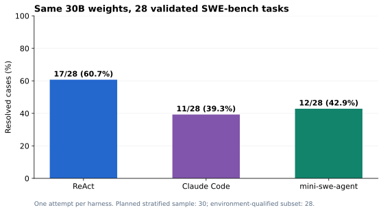

# 汇报摘要：现有 AMD 机器上完成了什么

## 核心结论

已经在现有 **8×AMD Instinct MI350X** 节点的 Docker 环境中，把公开 **Qwen3-Coder-30B-A3B-Instruct** 与 Uni-Agent 接起来，实际运行三种代码 agent，完成 sandbox 内代码修改和新容器中的独立测试。与此同时，验证了本地 Docker 与远端 E2B 兼容 sandbox 两条路线，并测出了可复现的 ROCm 推理加速效果。

这为后续 agentic RL 提供了交互、任务评分和轨迹基础设施。**本次没有更新模型参数，没有训练前后对照，因此不报告后训练收益。**

## 任务效果

预先分层选择 30 道 SWE-bench Verified 历史真实缺陷题，覆盖 12 个项目。先验证原始代码不能通过、官方修复可以通过；28 道题满足环境要求，另 2 道保留为环境未就绪，没有补选。三个 agent 在相同的 28 题上各运行一次。

| Agent | 独立测试通过 | 正常结束 | 修改既有测试的题数 | Agent 耗时中位数 |
|---|---:|---:|---:|---:|
| ReAct | **17/28，60.7%** | 27/28 | 0 | 6.6 分钟 |
| Claude Code | **11/28，39.3%** | 28/28 | 2 | 3.9 分钟 |
| mini-swe-agent | **12/28，42.9%** | 25/28 | 1 | 5.4 分钟 |

剥离按路径识别的测试文件改动后，通过数仍为 17、11、12。正常退出、修复成功与遵守修改约束是不同维度；上表分别保留。ReAct 在这个样本通过更多题，同时消耗更多生成 token 和时间，不能只按通过率选型。

## Sandbox 与基础设施

- **本地方案**：Uni-Agent 脚本通过专用 Docker daemon 创建每题 sandbox；Claude/Mini 在 sandbox 里运行，ReAct 的循环留在 CPU 编排容器。模型推理由另外的 GPU 容器提供。
- **远端方案**：通过 E2B SDK 接入用户提供的服务。ReAct + 本地 Qwen 在远端修复区间合并函数，通过全部 10 项独立测试；同任务在本地 Docker 也通过 10 项测试。远端实验未跑 SWE-bench、Claude 或 Mini。
- **生命周期**：验证了状态保持、文件隔离、禁网、资源限制、销毁；另有独立 TTL 回收，过期实例删除、未过期及其他 owner 实例保留。
- **可复现性**：固定源码、镜像 digest、模型 revision、依赖锁、数据清单、补丁和逐题结果均有保存；CPU 环境做过全新容器重建。原复现包约 25MB，3,137 个成员解包校验通过。

## 性能结果与资源建议

| 对照 | 条件 | 平均输出吞吐 |
|---|---|---:|
| 单卡 eager / 四卡 TP eager | 并发 8，2K 输入、256 输出 | 232 / 211 token/s |
| 单卡 eager / 单卡 AITER + 图执行 | 另一组配对实验，并发 8 | 235 / 1,036 token/s，约 **4.41×** |
| 单个优化副本 / 两个优化副本 | 并发 32 | 1,948 / 3,513 token/s，约 **1.80×** |

这些是固定条件下三次重复的 HTTP 推理微基准，不包含 agent 执行工具的时间。正式 SWE 对照始终使用冻结的 eager 服务。性能结果支持：**先优化单卡，再根据并发量增加副本**；尚未验证八副本线性扩展。

## 对项目的意义

当前可以汇报：本机具备运行和评测真实代码 agent 的基础，Uni-Agent 接入、sandbox 与评分链路可工作，并有明确的推理优化空间。

下一阶段若目标是后训练，需要用独立训练数据，验证一次真实的参数更新、模型同步、完整断点恢复，然后进行固定协议的 base/final 对照。现有 28 题的结果用于说明这次集成与比较，不替代完整 500 题评测或业务生产验收。

阅读下一步：[部署图](architecture/01-deployment.md) · [正式实验](experiments/03-swe-agent-comparison.md) · [案例](results/01-case-studies.md) · [后续路线](results/02-conclusions-and-next-steps.md)。
