# Deployment and request flow

## Where each part runs

| Location | Processes / responsibility |
|---|---|
| Host | Docker Engine and the lab launcher |
| `ua-lab-cpu` | Uni-Agent, task driver, ReAct loop, per-job Gateway, Docker CLI; no GPU access |
| GPU model container | vLLM serving fixed Qwen30B weights |
| `ua-lab-sandbox-daemon` | Dedicated Docker daemon, reached through `/lab/run/docker.sock` from the CPU container |
| Per-task sandbox | Repository and commands; real Claude Code or Mini CLI when selected |
| Fresh verifier sandbox | Apply the saved candidate and run tests independently |

Uni-Agent is installed from the pinned checkout in the CPU environment, using a vLLM ROCm base image. We did not use an image named `verl-project/uni-agent`.

The driver starts the agent. Task/driver code creates and cleans up the sandbox through its provider. The agent uses that live environment. Gateway records model interaction; it does not own Docker's container API.

## Model services used by different experiments

| Launcher selection | GPU | CPU-container endpoint | Host endpoint |
|---|---|---|---|
| `tp1` | 0 | `172.30.90.3:8000` | `127.0.0.1:18082` |
| `128k` | 1 | `172.30.90.5:8000` | `127.0.0.1:18083` |
| `tp4` | 4–7 | `172.30.90.6:8000` | `127.0.0.1:18084` |
| `aiter` | 2 | `172.30.90.7:8000` | `127.0.0.1:18085` |
| `aiter-replica` | 3 | `172.30.90.8:8000` | `127.0.0.1:18086` |

These are recorded configurations, not live status. Services were started as needed.

**Request paths:** official examples → vLLM directly; formal SWE runs → Uni-Agent Gateway → vLLM; E2B toy-task ReAct → local vLLM directly, with tools sent to remote E2B.

[Editable diagram](figures/deployment.mmd) · [Uni-Agent API](API.md) · [Docker lifecycle](../03_docker_sandbox/README.md) · [E2B flow](../04_e2b_sandbox/README.md)

