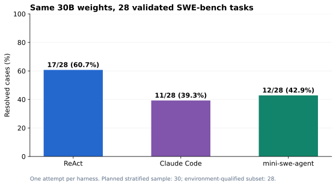

# 2. SWE-bench: three agents on the same model

**Result:** on the same 28 environment-qualified tasks, ReAct resolved **17**, Claude Code **11**, and mini-swe-agent **12**. Each received one attempt with fixed Qwen30B weights.

## Protocol and results

We selected 30 tasks across 12 repositories from SWE-bench Verified (500-task source), using seed `20260912`. The original code had to fail and the official patch had to pass. Twenty-eight tasks qualified; two were excluded without replacement. All 84 final candidate evaluations completed.

| Agent | Resolved | Finished normally | Tasks modifying existing tests | Median agent time |
|---|---:|---:|---:|---:|
| ReAct | 17/28 (60.7%) | 27/28 | 0 | 6.6 min |
| Claude Code | 11/28 (39.3%) | 28/28 | 2 | 3.9 min |
| mini-swe-agent | 12/28 (42.9%) | 25/28 | 1 | 5.4 min |

The driver used Uni-Agent task/agent/Gateway components and the 128K eager model service. ReAct ran in the CPU coordinator; Claude/Mini ran inside local Docker task sandboxes.

Candidates were replayed in fresh containers. A deterministic transformation removed pre-existing image changes. Removing modifications to recognized test paths left the resolved counts unchanged. No extra model samples were generated during regrading.

## What this shows

ReAct solved more tasks in this sample, with higher token use and longer runtime. These results compare the configured harnesses; they do not isolate an algorithm alone or establish a full SWE-bench leaderboard score. CLI success, normal completion, and verifier success are different measurements.

## Contents

- [STEPS.md](STEPS.md): controls, generation, independent regrading.
- [RESULTS.md](RESULTS.md): every task and concrete examples.
- [COMMUNITY.md](COMMUNITY.md): brief historical source review, not a competitor benchmark.
- [code/](code/): data preparation, runner, Docker adapter, regrader; `code/executed/` preserves original main-run versions.
- [configs/](configs/): three 128K agent configurations.
- Evidence: [final summary](results/final-summary.json), [CSV](results/per-case-results.csv), [qualified tasks](results/validated-manifest.json), [baseline](results/thirty-baseline-dns.json), [official-patch control](results/thirty-oracle-dns.json), [cost chart](figures/agent-cost.svg).

[Back to overview](../README.md)

