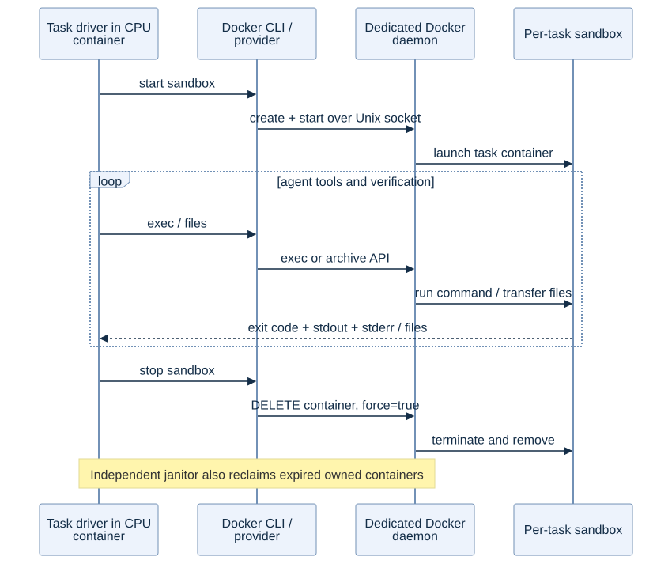

# 3. Local Docker sandbox

**Result:** task-local execution, persistent files, isolation controls, resource limits, and cleanup worked. ReAct repaired `merge_intervals` from **1/10** to **10/10** passing tests.

## What ran

| Experiment | Outcome |
|---|---|
| Official sandbox demo | Shell/editor shared files; a script changed from sum=7 to product=8; directory state and file transfer worked. |
| Isolation and resource checks | Separate filesystems, hidden host/GPU/socket paths, blocked networking when configured, CPU/memory/PID limits, timeouts, and deletion verified. |
| Binary/file transfer | Approximately 1.3 MB including NUL and Unicode round-tripped correctly. |
| ReAct repair task | 8 steps; 48.38 s recorded wall time; 10/10 held-out tests passed. |
| TTL janitor | Expired owned container deleted; unexpired and other-owner containers retained. |

The repair covered overlapping/touching/nested intervals, empty/unsorted inputs, duplicates, negatives, input preservation, and invalid ranges. Tests were removed before agent execution and restored for verification.

The isolation check used 1 CPU/256 MiB/no network. The repair used 1 CPU/1 GiB/no network. Formal SWE tasks used 2 CPUs/8 GiB and allowed network access. These configurations serve different tests.

## Contents

- [STEPS.md](STEPS.md): demo, checks, paired repair workflow.
- [API.md](API.md): Uni-Agent sandbox methods and Docker calls.
- [code/](code/): isolation checks, janitor, paired Docker/E2B repair runner.
- [configs/Dockerfile.demo](configs/Dockerfile.demo): demo environment.
- Evidence: [demo](results/docker-official-demo.txt), [isolation](results/docker-isolation.json), [repair](results/task/result.json), [repaired function](results/task/interval_utils.py), [verifier](results/task/verifier.json), [TTL controls](results/janitor-validation.json).

The dedicated daemon is a trusted privileged control plane; task containers do not receive its socket. A command timeout differs from deleting the sandbox. These checks do not certify production multi-tenant isolation.

[Back to overview](../README.md)

