# 4. Remote E2B sandbox

**Result:** the supplied E2B-compatible service supported lifecycle operations, the official Uni-Agent sandbox demo, and a real ReAct repair. The small task improved from **1/10** to **10/10** passing tests.

Verdan refers to this E2B experiment.

## What ran

| Experiment | Outcome |
|---|---|
| SDK smoke test | Create, execute commands, write/read files including Unicode, destroy instance. |
| Official sandbox demo | Shell/editor state and upload/download passed through the custom provider. |
| ReAct repair | Same merge_intervals task as Docker; 13 steps, 107.95 s recorded wall time, 10/10 final tests. |

ReAct and model requests stayed local. Tools ran remotely through E2B SDK 2.49.1 and the experiment's `e2b_compat` provider. This path called local vLLM directly, without Uni-Agent Gateway.

Remote SWE-bench, Claude Code, Mini, arbitrary SWE-image template builds, and full E2B API compatibility were not tested. Toy-task timings include different model trajectories and preparation; they are not a service latency benchmark.

## Contents

- [STEPS.md](STEPS.md): setup, official demo, paired repair.
- [API.md](API.md): six operations used here.
- [code/e2b_provider.py](code/e2b_provider.py): adapter; [run_e2b_demo.py](code/run_e2b_demo.py): demo entry.
- [configs/e2b.env.example](configs/e2b.env.example): variable names only.
- Evidence: [SDK smoke](results/e2b-sdk-smoke.json), [demo](results/e2b-official-demo.txt), [repair](results/task/result.json), [repaired function](results/task/interval_utils.py), [verifier](results/task/verifier.json).

[Back to overview](../README.md)

