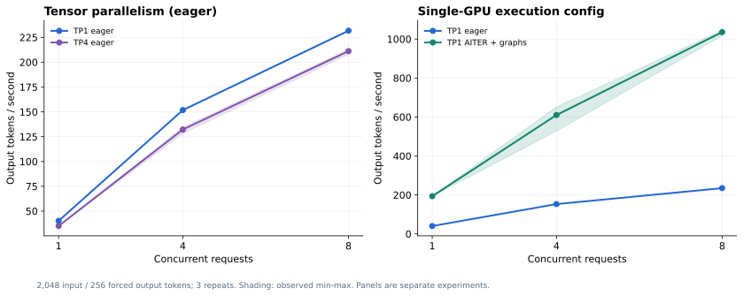
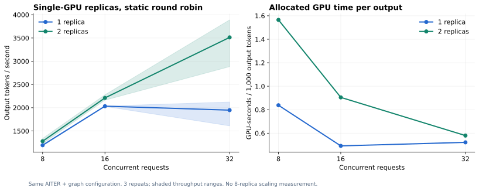

# 5. ROCm inference performance

**Result:** tested eager TP4 did not outperform one GPU. AITER plus graph execution substantially improved single-GPU throughput, and a second replica helped at high concurrency.

## Three measured comparisons

| Comparison | Concurrency | Mean output throughput | Finding |
|---|---:|---:|---|
| TP1 eager → TP4 eager | 8 | 231.72 → 211.17 tokens/s | More TP GPUs did not help this configuration. |
| TP1 eager → TP1 AITER + graphs | 8 | 234.96 → 1,035.76 tokens/s | **4.41×** within this paired experiment. |
| One → two optimized replicas | 32 | 1,948.07 → 3,512.83 tokens/s | **1.80×** within this paired experiment. |

## Method and interpretation

- Fixed BF16 weights; 2,048 input and 256 forced output tokens, temperature 0, `ignore_eos=true`.
- TP/AITER tests: concurrency 1/4/8. Replica tests: 8/16/32. Three repeats per setting: **54 batches** total.
- Throughput = actual output tokens / batch wall time. Shading shows observed min–max across repeats.
- AITER and compilation/graph execution changed together; gains cannot be assigned to AITER alone.
- Replicas used static round robin, not Uni-Agent's agent-aware router. No eight-replica test was run.
- Compare within an experiment; measurement periods and request details differed across experiments.

These are short-context HTTP serving measurements, not full agent runtimes. Another GPU was doing agent work, so this was not a whole-machine exclusive peak test. The formal 28-task comparison retained its eager service.

## Contents

[STEPS.md](STEPS.md) · [code/](code/) · [TP raw/summary](results/tp/) · [AITER raw/summary](results/aiter/) · [Replica raw/summary](results/replicas/)

[Back to overview](../README.md)

