# 6. Trajectories and reproduction

**Result:** all 84 main sessions had valid token/mask structure. Separate runs verified logprob capture for all three harnesses, and the CPU environment was rebuilt from pinned dependencies. No model update was performed.

## What ran

| Verification | Outcome |
|---|---|
| Main SWE sessions | ReAct 28/28, Claude 28/28, Mini 28/28 passed token/mask checks. Main-run logprobs were not saved. |
| Separate logprob checks | One session per harness had aligned, finite logprobs. ReAct/Claude repairs passed; Mini's repair did not. |
| Optimized-service trace | An additional ReAct task had valid logprobs and passed verification. |
| Clean CPU rebuild | 58 overlay dependencies installed in a fresh no-GPU container; agent/Gateway/verifier/E2B imports passed. |
| Logging patch | Deterministic fork check and eight logging tests passed; patch retained here. |
| Reproduction archive | 3,137 members checked, including 2,735 regular files and five symlinks; hashes and commits matched. |

Valid trajectories and successful repairs are separate outcomes. Historical main-run logprobs were not filled in later.

## What remains for training

A training experiment still needs reward attachment, loss/mask validation, an optimizer update, policy synchronization, checkpoint recovery, and base/final evaluation on held-out tasks. Current evidence establishes no post-training gain.

## Contents

- [STEPS.md](STEPS.md): trace replay, code export, environment reconstruction.
- [code/](code/): trajectory audit, logging check, exporter, offline report tools.
- [code/patches/](code/patches/): local upstream logging patch.
- Evidence: [trajectory audit](results/trajectories/audit.json), [ReAct logprob](results/trajectory-logprobs-react.json), [Claude logprob](results/trajectory-logprobs-claude.json), [Mini logprob](results/trajectory-logprobs-mini.json), [clean rebuild](results/environment/reproduction-cold-check.log.json), [archive verification](results/environment/reproduction-kit-verification.json).
- Provenance: [pinned manifest](results/provenance/source-manifest.json), [layout map](results/provenance/layout-map.json), [bundle validation](results/provenance/bundle-validation.json).

[Back to overview](../README.md)

