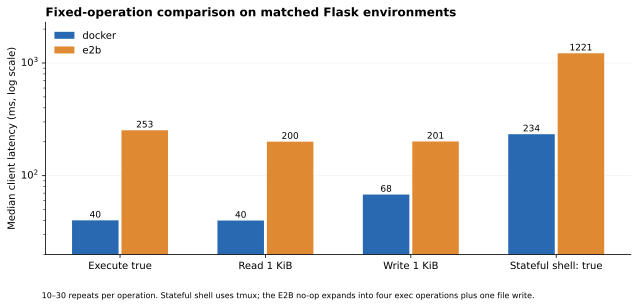
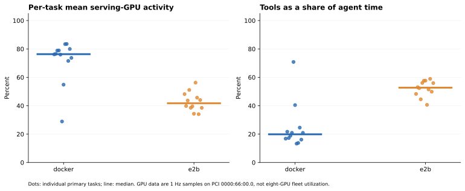
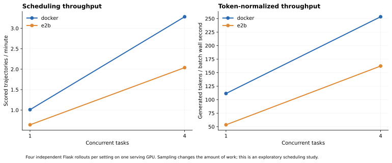
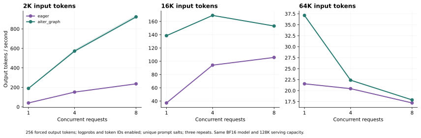
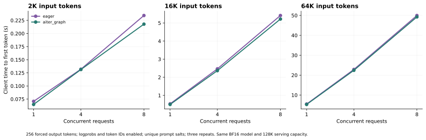
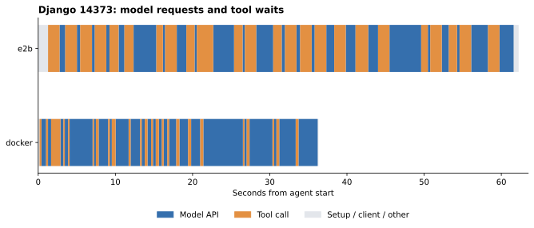

# Measured rollout bottlenecks

A serial rollout consists of environment preparation, repeated model and tool calls, verification, trajectory export, and cleanup. In agentic RL, the training batch also waits for enough scored trajectories; slow tools and long agent tails therefore affect learner supply. The measurements below cover that rollout path. They do not establish the bottleneck of a complete training job.

## 1. Tool transport and call granularity

The fixed-operation study removes model sampling from the comparison. All values below are client-observed medians on matched Flask images; they include the current adapters and transport.

| Operation | Docker | E2B | E2B / Docker |
|---|---:|---:|---:|
| Execute true | 40.1 ms | 253.1 ms | 6.31× |
| Read 1 KiB | 40.0 ms | 200.5 ms | 5.01× |
| Write 1 KiB | 68.0 ms | 201.2 ms | 2.96× |
| Read 1 MiB | 47.7 ms | 231.2 ms | 4.85× |
| Write 1 MiB | 68.7 ms | 406.0 ms | 5.91× |
| Stateful shell: true | 233.6 ms | 1220.7 ms | 5.23× |

A stateful-shell no-op generated one E2B file write and four Process/Start operations: send tmux keys, read exit status, read stdout, and read stderr. Local Docker used six CLI invocations because its upload path also creates the parent directory. The trace counts SDK/provider operations; HTTPX instrumentation alone does not capture Connect RPC sends.

**Action:** batch independent operations, reduce metadata round trips, use persistent channels where supported, and place the coordinator nearer the execution service. This result does not establish that colocated E2B has the same overhead.

**Targeted prototype:** a persistent E2B stdin channel preserved cwd/environment and completed 30 no-op commands at median **210.5 ms**, versus 1220.7 ms for tmux-over-exec (5.80× lower median latency). This is a transport prototype, not a full SWE-bench run with a replacement shell adapter. [Raw result](results/native-shell-probe.json)

## 2. Concurrency and idle gaps

| Provider | In-flight tasks | Scored trajectories | Batch seconds | Mean task seconds | Scored trajectories/min | GPU busy |
|---|---:|---:|---:|---:|---:|---:|
| docker | 1 | 4/4 | 237.7 | 59.4 | 1.01 | 65.9% |
| docker | 4 | 4/4 | 73.1 | 62.0 | 3.28 | 86.3% |
| e2b | 1 | 4/4 | 375.5 | 93.9 | 0.64 | 33.9% |
| e2b | 4 | 4/4 | 117.7 | 105.3 | 2.04 | 70.7% |

Four in-flight tasks improved scored-trajectory throughput by about 3.2 times on both providers. Docker generated about 30% fewer tokens in its concurrent batch, so its token-normalized gain was 2.27 times; E2B gained 3.03 times by that measure. Mean individual task latency increased slightly. Concurrency improved batch throughput by hiding waits; it did not make each issue finish faster.

Each setting contains four independently sampled copies of the Flask task, not additional primary benchmark cases. A scored trajectory requires valid token records and completed evaluation. Token-normalized throughput is shown because sampled output lengths vary. The finite batch includes preparation, verification, and drain time.

**Action:** maintain enough independent in-flight rollouts to cover tool waits; use separate verification capacity when it delays new generation. For real RL, asynchronous work also needs policy-version and reward bookkeeping. These tests did not update the policy.

## 3. Gateway and model execution

| Mean agent component | Docker | E2B |
|---|---:|---:|
| Model API wait | 92.11 s | 73.18 s |
| Gateway + local-client overhead | 1.01 s | 0.99 s |
| Codec subset (overlaps overhead) | 0.69 s | 0.59 s |
| Tool calls | 28.69 s | 75.09 s |
| Tool setup/close | 0.27 s | 1.83 s |

Server request-counter boundaries matched captured model calls for **24/24** primary runs. Across those boundaries, prefix-cache hits were **98.0%** of queried tokens.
Prefix caching reduces repeated prefill, but does not eliminate decoding work over a long context. API wait includes queueing, inference, transport, and response handling; it is not GPU kernel time.

Gateway plus local-client overhead averaged about 1 second per primary task; trajectory export averaged under 0.04 seconds. Neither was a leading cost at the measured concurrency. Server prefill/decode counters averaged 8.44/80.91 seconds per Docker task and 6.67/63.46 seconds per E2B task, with about 1 ms total queue time per task in the serial runs. Thus decoding dominated serving time in these rollouts, even with high prefix reuse.

The serving study uses 2K/16K/64K input lengths, concurrency 1/4/8, 256 forced output tokens, and three repeats. Inputs come from a real trajectory with a unique first-block salt; corresponding paired batches use identical IDs on both backends. Logprobs and token IDs are enabled. AITER and graph execution change together, so their effects are not isolated.

| Input tokens | Concurrency | Eager output tok/s | AITER + graphs output tok/s | Ratio | Eager TTFT | AITER TTFT |
|---:|---:|---:|---:|---:|---:|---:|
| 2048 | 1 | 40.0 | 189.2 | 4.73x | 0.07 s | 0.06 s |
| 2048 | 4 | 151.6 | 572.3 | 3.78x | 0.13 s | 0.13 s |
| 2048 | 8 | 236.2 | 923.6 | 3.91x | 0.23 s | 0.22 s |
| 16384 | 1 | 37.1 | 138.5 | 3.73x | 0.53 s | 0.50 s |
| 16384 | 4 | 94.1 | 169.1 | 1.80x | 2.47 s | 2.37 s |
| 16384 | 8 | 105.7 | 153.1 | 1.45x | 5.41 s | 5.22 s |
| 65536 | 1 | 21.5 | 37.1 | 1.72x | 5.50 s | 5.30 s |
| 65536 | 4 | 20.4 | 22.4 | 1.09x | 22.87 s | 22.43 s |
| 65536 | 8 | 17.2 | 17.9 | 1.04x | 49.96 s | 49.24 s |

The short-context serving gain does not carry over unchanged to long contexts. At 64K inputs and concurrency 8, both backends spend about 49–50 seconds before the first output token, and their aggregate output rates are close. This deliberately prevents prefix reuse; actual multi-turn rollouts above achieved high cache hits. Concurrency should be tuned with context length and KV capacity, not increased without a workload sweep.

**Action:** keep prefix reuse, constrain unhelpful context growth, and optimize model serving before adding tensor-parallel GPUs. Backend logs confirm AITER MoE and graph execution; some dynamic GEMM shapes use fallback configurations. A dedicated kernel trace would be needed to attribute individual kernel costs.

### Logprob overhead

A separate non-streaming study uses a warmed 16K prefix and token IDs in both modes, toggling logprobs only. This measures capture/response cost, not correctness of a training objective.

| Backend | Concurrency | No logprobs token/s | With logprobs token/s | With / without | Mean response KiB: off / on |
|---|---:|---:|---:|---:|---:|
| eager | 1 | 39.7 | 39.3 | 0.99× | 73.9 / 89.1 |
| eager | 4 | 149.7 | 148.8 | 0.99× | 73.9 / 89.1 |
| aiter_graph | 1 | 182.7 | 175.1 | 0.96× | 73.8 / 89.1 |
| aiter_graph | 4 | 530.8 | 514.3 | 0.97× | 73.8 / 88.8 |

## 4. Verification, startup, and tails

Warm create/prepare time, verification, cleanup, and trajectory export are recorded separately. E2B templates were built before primary runs; local images were already cached. Eleven newly prepared templates took 29–77 seconds each to become ready; Flask reused the preflight template. These observed readiness times are not a cold-registry build benchmark. Per-template records are in [templates.json](results/templates.json).

The targeted verifier study repeats official-gold evaluation twice on Django, Pylint, and Requests. Bash reports command wall time plus user/system CPU time; average cores is (user + system CPU seconds) / wall seconds.

| Task | Provider | Mean verifier command wall | Mean CPU seconds | Mean active cores | Gold passes |
|---|---|---:|---:|---:|---:|
| django__django-14373 | docker | 3.0 s | 3.0 s | 0.99 | 2/2 |
| django__django-14373 | e2b | 5.2 s | 4.6 s | 0.88 | 2/2 |
| psf__requests-1921 | docker | 59.0 s | 1.6 s | 0.03 | 2/2 |
| psf__requests-1921 | e2b | 28.3 s | 1.2 s | 0.04 | 2/2 |
| pylint-dev__pylint-7080 | docker | 13.0 s | 13.0 s | 1.00 | 2/2 |
| pylint-dev__pylint-7080 | e2b | 15.3 s | 14.9 s | 0.97 | 2/2 |

CPU time close to command wall time suggests a busy core; low CPU time with a long wall time calls for storage, network, subprocess, or scheduling investigation. It does not identify a unique root cause. This runtime includes package installation and tests, not just test assertions.

In the first Requests repeat, Docker spent 59.36 seconds in the verifier body with only 1.58 CPU seconds; E2B spent 27.51 seconds with 1.28 CPU seconds. Pytest itself reported 58.32 and 26.34 seconds, so most of this delay was inside the test suite rather than package installation. The suite exercises HTTP requests; per-test and network timings would be needed to attribute the wait further. Adding CPU cores alone is not supported as a remedy by these measurements.

**Action:** prebuild deterministic environments, keep runtime dependencies ready, and size verifier workers independently of model workers. Keep official tests intact. Investigate slow commands rather than treating every delay as model inference.

Pylint reached 100 actions on both providers. Under synchronous RL collection, such trajectories can hold up the batch after short tasks finish. Use step/token budgets and inspect failed trajectories; evaluate any early-stopping rule against reward quality rather than optimizing latency alone.

## Priorities for an agentic RL integration

| Priority | Change to evaluate | Evidence from this study | Remaining check |
|---|---|---|---|
| 1 | Keep several independent rollouts in flight | Four-task batches raised throughput and GPU activity | Sweep concurrency on diverse tasks; measure memory and tail latency |
| 2 | Reduce remote shell round trips | E2B tool share and fixed-operation timings | Integrate persistent shell with cancellation, timeout, output limits, and full task checks |
| 3 | Control growing contexts and tune serving | Paired 2K/16K/64K measurements | Preserve rewards when trimming observations; inspect kernels if needed |
| 4 | Separate verifier workers and prebuild dependencies | Guest wall/CPU measurements; distinct verification phase | Profile I/O and dependency setup under concurrency |
| 5 | Add learner instrumentation when training is connected | Valid scored trajectories exist | Measure backward, optimizer, weight synchronization, policy staleness, and checkpoint I/O |

## Measurement boundaries

- Python spans are buffered in memory and exported after each case. High-level model/tool phases are used for totals; nested codec and HTTP spans are not added again. Instrumentation overhead was not separately calibrated with an uninstrumented run.
- GPU/cgroup/vLLM sampling runs at 1 Hz. GPU values refer to the active serving device (PCI 0000:66:00.0), not the mean across eight installed GPUs. These are sampled activity counters, not a GPU kernel profile.
- E2B and Docker have matching configured CPU/RAM and repository trees, but different kernel, CPU visibility, storage, and network placement. The remote service implementation was not independently identified.
- The primary score uses one attempt per provider and filters recognized test-path changes before fresh verification. Repeated Flask scheduling trials are not included in its 12-task denominator.
- Trajectory checks cover structure and finite logprobs. Backpropagation, optimizer memory, weight synchronization, checkpoint I/O, and algorithm-specific logprob/mask semantics remain unmeasured.

## Evidence

[Case table](results/cases.csv) · [Tool calls](results/tool-calls.csv) · [Serving raw batches](results/inference/raw.json) · [Logprob study](results/inference/logprob-overhead.json) · [Resource probe](results/verifier-cpu-probe.json)

Open [timeline.json](results/timeline.json) in a Chrome-trace-compatible viewer such as Perfetto to inspect model/tool intervals. Full spans and 1 Hz telemetry remain in the original run directory.
