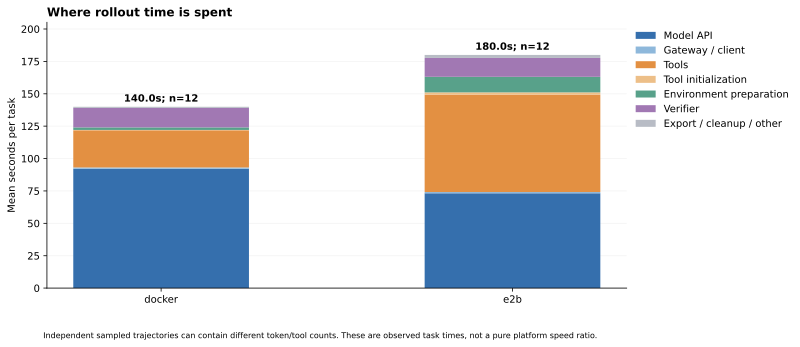

# 7. ReAct SWE-bench: Docker vs E2B and rollout bottlenecks

**Study started 2026-09-14 UTC and completed 2026-09-14 UTC. Fixed Qwen3-Coder-30B-A3B-Instruct weights; rollout and evaluation profiling, with no RL/SFT update.**

We ran the same 12 SWE-bench tasks on local Docker and the supplied E2B-compatible service, through Uni-Agent Task, ReAct, Gateway, and the official SWE verifier. Each rollout used a fresh execution sandbox and a separate fresh verifier sandbox.

## Main result

| Metric | Docker | E2B |
|---|---:|---:|
| Resolved tasks | **9/12** | **9/12** |
| Valid token/mask/logprob trajectories | 12/12 | 12/12 |
| Normal agent completion | 11/12 | 11/12 |
| Mean complete rollout time | 140.0 s | 180.0 s |
| Median tool share of agent time | 19.9% | 52.7% |
| Mean of per-task serving-GPU activity | 71.9% | 42.8% |

The providers agreed on task success for 12/12 tasks. Their sampled trajectories still differed in token count and tool use, so the end-to-end time ratio is not a pure platform-speed measurement.

## What the profile shows

1. **Small tool operations have a substantial remote cost.** A stateful-shell no-op took a median 234 ms on Docker and 1221 ms on E2B. The tmux implementation expands one command into four exec operations and one file write on E2B.
2. **Concurrency raised rollout throughput.** Four in-flight Flask tasks gave about 3.2 times the scored trajectories per minute of serial execution on each provider. Token-normalized gains were 2.27 times for Docker and 3.03 times for E2B; individual task latency did not improve.
3. **Serving gains depend on context length.** AITER + graphs gave 4.73 times eager throughput for one 2K-input request, but only 1.04 times at 64K input and eight concurrent requests. Both tests included token IDs/logprobs. The separate warmed-prefix logprob check reduced throughput by roughly 1–4%.
4. **Verification has its own cost.** Guest-side wall/user/system timings separate verifier execution from client transport and show where more CPU or faster I/O should be investigated.

## What was measured

48 accepted baseline/gold controls; 24 primary rollouts; 200 fixed-operation samples; 16 scheduling attempts; 54 serving batches; 24 logprob batches; and 12 targeted verifier runs. The persistent-shell prototype is separate from primary task scores.

All task environments were based on the same pinned image digests, configured for 4 CPUs and 8 GiB. Repository initial Git trees matched, baseline code failed, and official patches passed on both providers. Primary pairs ran serially, with alternating provider order, against one AITER + graph 128K service.

## Execution path

`run.py` starts the Uni-Agent Gateway and calls upstream `framework.task_runner.run_task`. Our `ProfileSWETask` extends the upstream SWE task to add timing and a fresh verifier; upstream ReAct and its tools run inside `ua-lab-cpu`. The Gateway and ReAct are in that coordinator process. The vLLM GPU service is a separate container.

The task creates and destroys sandbox instances through the selected provider. Local Docker commands go through the dedicated daemon socket; E2B commands use the remote SDK API. ReAct selects actions, while the tool adapter executes them. After grading, the driver calls `finalize_session`, attaches the reward, exports trajectories, and shuts down the Gateway. Sandbox cleanup and Gateway-session finalization are separate lifecycle operations.

**Fixed settings:** Qwen3-Coder-30B-A3B-Instruct BF16 (30B total / about 3B active parameters), TP1, 131072-token serving limit, 100 ReAct steps, 4096 new tokens per model call, temperature 0.2, top-p 0.9, 1800 s agent deadline, and 600 s evaluation timeout. No per-request random seed was fixed. All benchmark execution ran in containers; the host monitor only read telemetry.

The base [ReAct YAML](configs/swe-react-128k.yaml) supplies the agent and prompt settings. `run.py` replaces its original sandbox block; [providers.py](code/providers.py) sets the local resource limits, while [prepare_templates.py](code/prepare_templates.py) configures E2B templates. Each case includes its effective `input-config.json`. The old sandbox mounts and 2-CPU setting in the base YAML were not used for this study.

Runtime: Uni-Agent commit `10743439dd0a19da44a94cccad069b135d957bf1`, E2B SDK 2.49.1, and swebench 4.1.0. [Runtime details](results/runtime-details.json) and the captured [logging patch](configs/uni-agent-runtime.patch) record the existing lab checkout; model image identities are in [service provenance](results/final-service-provenance.json).

## Per-task outcomes

| SWE-bench instance | Docker resolved | E2B resolved | Docker seconds | E2B seconds |
|---|---|---|---:|---:|
| astropy__astropy-13033 | No | No | 169.4 | 314.8 |
| django__django-14373 | Yes | Yes | 42.7 | 79.5 |
| matplotlib__matplotlib-20488 | Yes | Yes | 232.5 | 214.1 |
| mwaskom__seaborn-3187 | No | No | 239.2 | 240.9 |
| pallets__flask-5014 | Yes | Yes | 48.5 | 102.8 |
| psf__requests-1921 | Yes | Yes | 207.5 | 199.6 |
| pydata__xarray-4075 | Yes | Yes | 74.7 | 102.8 |
| pylint-dev__pylint-7080 | No | No | 270.8 | 414.6 |
| pytest-dev__pytest-7521 | Yes | Yes | 185.1 | 155.8 |
| scikit-learn__scikit-learn-11310 | Yes | Yes | 85.6 | 103.5 |
| sphinx-doc__sphinx-9367 | Yes | Yes | 45.6 | 81.2 |
| sympy__sympy-24213 | Yes | Yes | 77.9 | 150.2 |

Astropy and Seaborn produced final answers but failed official verification. Pylint reached the 100-step limit on both providers and its final candidate failed verification. Every primary evaluation completed; an unresolved task is retained in the denominator. The sample takes the first qualified issue per repository in the existing 28-task dataset order.

`Resolved` follows SWE-bench's declared FAIL_TO_PASS and PASS_TO_PASS sets. It does not mean every test printed by pytest passed. For Requests 1921, both official-gold and candidate runs contain the same unrelated `test_conflicting_post_params` failure caused by a legacy pytest API; that test is outside both declared sets. The full [Docker verifier log](results/cases/docker/psf__requests-1921/verifier-raw.log) is retained alongside the scored test report.

## Read next

- [PROFILE.md](PROFILE.md): measurements, interpretation, and ranked actions.
- [STEPS.md](STEPS.md): replay procedure and resource cleanup.
- [Per-case CSV](results/cases.csv), [raw tool samples](results/tool-calls.csv), [timing trace](results/timeline.json), and [artifact hashes](results/source-manifest.json).
- [code/](code/): replay and analysis tools; `code/executed/` preserves the primary-run snapshot.

This is a small, previously observed development subset, not a full 500-task leaderboard or a held-out model evaluation. Configured CPU/RAM were matched; physical CPU, storage, kernel, and network placement were not. Results describe this deployment. Optimizer, backward pass, weight synchronization, and checkpoint costs were not measured.

After measurement, the [sandbox audit](results/service-audit.json) found no running instances owned by this study. The [two study model services and monitors were stopped](results/resource-release.json) to release GPU resources. E2B templates, images, weights, and the CPU coordinator remain available for replay.

Complete logs, trajectories, and telemetry: `/home/yuhanya/uni-agent-lab/results/swe-sandbox-profile-20260914T144308Z`.

[Back to overview](../README.md)
