# 实际部署：容器、程序和模型分别在哪里

## 先看四个执行位置

A负责启动和组织任务；B管理临时sandbox；C只负责模型推理。ReAct循环在A，Claude/Mini循环在任务sandbox。图中没有训练器或参数更新。

[简图Mermaid源文件](../assets/diagrams/00-overview.mmd)

## 本地正式评测的整体架构

下图对应28题正式SWE评测的运行时结构。**A和C使用同一种vLLM ROCm基础镜像，但它们是两个独立容器。** B使用Docker DinD镜像，里面的任务sandbox使用各题的SWE-bench镜像。

[Mermaid源文件](../assets/diagrams/01-local-deployment.mmd) · [PNG](../assets/diagrams/01-local-deployment.png)

## 外层容器和内层任务容器

| 对象 | 本次名称/实现 | 装了什么、运行什么 | 生命周期 |
|---|---|---|---|
| CPU编排容器A | `ua-lab-cpu` | Uni-Agent源码、Python环境、Docker客户端；评测作业与Gateway运行在这里 | 容器可长期保留，具体评测脚本会退出 |
| 模型服务容器C | 主实验为`ua-lab-model-128k` | vLLM加载本地Qwen30B，在GPU上推理 | 实验期间常驻 |
| sandbox daemon容器B | `ua-lab-sandbox-daemon` | 独立dockerd、独立镜像/容器存储 | 实验期间常驻 |
| 任务sandbox | `uni-agent-<随机ID>` | 当前题目仓库、依赖、命令进程；选Claude/Mini时还运行该CLI | 每题动态创建，完成后销毁 |
| 判题sandbox | 另一份新建的任务镜像实例 | 应用保存的候选改动，运行官方测试 | 每次判题独立创建/销毁 |
| 租约回收容器 | `ua-lab-janitor` | 定期按owner和TTL检查专用daemon中的容器 | 独立于评测worker常驻 |

外层Docker负责启动A、B、C；B里面的dockerd创建和管理任务sandbox。因此，宿主机普通 `docker ps`主要看到外层服务容器；看内层任务，应连接专用socket。

## “看不到Uni-Agent镜像”的原因

本次没有拉取一个叫 `verl-project/uni-agent` 的镜像。这个名称是源码仓库地址。

CPU容器从vLLM ROCm镜像启动后，把宿主实验目录挂为`/lab`，再将 `/lab/src/uni-agent` 以editable Python包安装到 `/lab/envs/cpu`。镜像名仍显示 `vllm/vllm-openai-rocm:nightly`，容器里执行的程序可以是Uni-Agent。

| 概念 | 具体位置 |
|---|---|
| 宿主实验根目录 | `/home/yuhanya/uni-agent-lab` |
| CPU容器内挂载点 | `/lab` |
| Uni-Agent源代码 | `/lab/src/uni-agent/uni_agent` |
| CPU Python解释器 | `/lab/envs/cpu/bin/python` |
| 正式实验入口 | `/lab/scripts/run_swe.py --gateway ...` |
| 官方小样本入口 | `/lab/src/uni-agent/examples/inference/parallel_infer_api.py` |

## Agent具体在哪里

- **ReAct**：主循环在A中。Uni-Agent用模型回复生成工具调用，把shell/编辑操作送到当前题目的sandbox。
- **Claude Code**：A中的Uni-Agent适配器通过Docker exec，在当前sandbox内启动真实Claude CLI。Claude自己的循环和本地工具都在那里运行。
- **Mini**：同样由A中的适配器启动，主循环位于sandbox内。

Claude二进制、Mini的portable Python和依赖提前准备到宿主实验缓存中，创建sandbox时只读挂载。没有每题重新下载或安装完整harness，也没有再额外创建一层“agent专用容器”。

## 远端E2B补充实验

这条实验与本地正式评测分开。模型仍在本地GPU上；远端仅承担工具执行与文件状态。

[Mermaid源文件](../assets/diagrams/04-e2b-route.mmd)

**这里的ReAct直接调用vLLM `/v1/chat/completions`，没有经过Uni-Agent Gateway。** E2B适配器将工具操作转换为SDK请求。该实验完成区间合并函数修复及10项测试，不包含远端SWE-bench、Claude Code或Mini。

## 哪些东西不在图中

训练器、梯度、优化器、训练权重同步没有运行，因此不画成已部署的数据流。性能实验使用的TP1/TP4/AITER/双副本，是模型服务C的不同配置与实例，见[性能实验](../experiments/06-serving-tp-and-aiter.md)，没有中途替换正式28题使用的模型服务。
