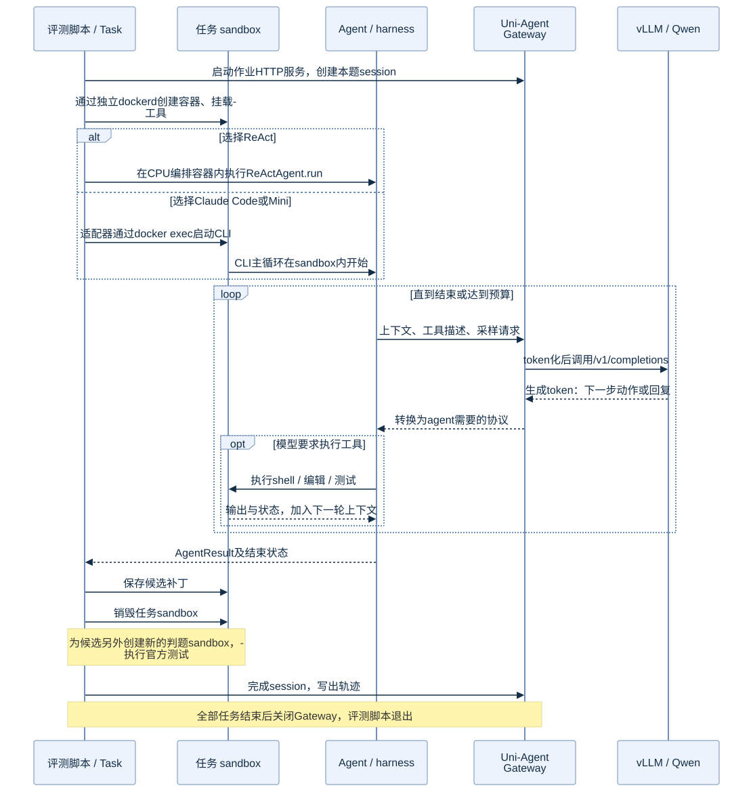

# 一道任务的执行流程：谁启动谁，何时调用模型

## 先说明入口

是我从宿主启动评测作业，形式如下（仅展示入口结构）：

```text
docker exec ua-lab-cpu /lab/envs/cpu/bin/python /lab/scripts/run_swe.py ... --gateway
```

脚本在CPU编排容器内运行，加载Uni-Agent。`agent.name`由配置预先选择为`react`、`claude_code`或`mini_swe_agent`。一次正式作业使用一种配置，三个作业分别覆盖同样的28题。

正式driver先启动Gateway，再为每题建立session、创建sandbox、构建并调用agent。外部CLI的启动也是由Uni-Agent适配器发起。Agent接到的是一个已经启动的sandbox。

## 交互时序



[Mermaid源文件](../assets/diagrams/02-task-sequence.mmd)

## 按阶段展开

| 阶段 | 谁执行 | 输入与动作 | 留下什么 |
|---|---|---|---|
| 读取任务 | driver + Uni-Agent Task配置 | 读取固定数据、问题描述、agent配置和模型地址 | 作业配置、渲染后的prompt |
| 建立session | Uni-Agent Gateway | 绑定instance ID与采样设置 | 本题模型请求通道 |
| 创建sandbox | driver → DockerSandbox → 专用dockerd | 启动该题SWE镜像，挂载只读工具运行时 | 初始仓库、资源与隔离配置 |
| 启动agent | `task.build_agent().run(...)` | ReAct直接进入循环；Claude/Mini由适配器通过docker exec启动CLI | Agent开始读取仓库 |
| 模型决策 | agent → Gateway → vLLM | 发送上下文、工具描述；模型生成动作或回复 | 模型token、工具调用 |
| 执行工具 | agent/工具层 → sandbox | 读文件、编辑、命令、复现与测试 | stdout/stderr、退出码、文件变化 |
| 继续或结束 | harness | 把工具结果加入上下文，再调用模型；检查结束和预算 | 完整/部分轨迹、finished状态 |
| 保存候选 | driver | 在测试评分前保存git差异和AgentResult | candidate patch、交互记录 |
| 独立判题 | driver + 上游SWE verifier | 新容器应用候选，执行标准测试 | resolved、eval_completed、测试报告 |
| 收尾 | driver/Gateway | finalize session、写文件、清理sandbox；作业结束关闭Gateway | 可关联的逐题结果与轨迹 |

## Plan并不是一个先于所有模型请求的独立步骤

本次没有一个单独的“规划服务”。harness先构造上下文；模型通常通过回复给出下一步动作。工具执行后，结果成为下一轮模型输入。具体行为可以是先搜索、先复现、先检查测试，也可能需要多轮修订。

这个循环既可能生成有效补丁，也可能提前结束、达到步数上限或没修对。因此“CLI退出0”“说已经完成”“最后有补丁”都不能替代独立测试。

## ReAct与黑盒CLI的控制边界

ReAct的循环与工具调用在Uni-Agent代码中可直接观察；Claude/Mini拥有自己的循环与上下文策略，Uni-Agent通过适配器运行它们，通过Gateway观察其模型交互。

例如，正式driver调用的是：

```python
from uni_agent.tasks import TaskConfigResolver, get_task

resolved = resolver.resolve(cfg, runtime_model=runtime)
task = get_task(resolved)
ar = await task.build_agent().run(
    sandbox=sandbox,
    messages=task.config.prompt,
    workdir="/testbed",
)
```

此处是说明性节选，完整已执行版本见[driver快照](../reproduce/scripts/executed/run_swe.py)。正式实验的外围并发、补丁保存和回放是自写逻辑；没有把它描述成完整官方RL训练runner。

## 每题独立，不共享被修改的仓库

同一种agent处理下一题会取得新的sandbox；不同agent处理同一题也从相同任务镜像出发。判题另外新建容器，避免直接依赖agent原容器中的临时安装、环境变量或测试状态。

所有候选还统一处理了镜像初始状态与数据base commit之间的差异，以确保回放的是agent自己的改动。这个确定性处理不增加模型采样次数，见[数据与判题](../experiments/02-data-and-controls.md)。
