# API与生命周期：常驻daemon、临时Gateway和任务sandbox

## Docker客户端可以在容器内运行

`docker`是客户端，`dockerd`才负责创建和管理容器。CPU容器中的Uni-Agent调用Docker客户端；客户端连接专用daemon，不需要在裸机上再执行一遍任务命令。



[Mermaid源文件](../assets/diagrams/03-docker-api.mmd)

本次socket映射：

| 视角 | 路径 |
|---|---|
| 宿主共享目录中的socket | `/home/yuhanya/uni-agent-lab/run/docker.sock` |
| CPU容器 | `/lab/run/docker.sock` |
| sandbox-daemon容器 | `/run/ua/docker.sock` |

CPU容器设置 `DOCKER_HOST=unix:///lab/run/docker.sock`。因此，在CPU容器执行 `docker run`实际请求的是专用DinD daemon，任务不是由宿主默认Docker daemon直接管理。

## 三类API不能混在一起

| 接口 | 调用方 → 接收方 | 本次作用 |
|---|---|---|
| Docker Engine API | CPU Docker客户端 → sandbox-daemon | 创建容器、执行进程、文件传输、删除容器 |
| Gateway模型API | agent → Uni-Agent Gateway | 接收OpenAI/Anthropic兼容模型请求、管理session并记录轨迹 |
| vLLM API | Gateway或直接API客户端 → GPU模型服务 | 执行Qwen推理 |
| E2B兼容API | CPU内E2B SDK → 远端服务 | 远端sandbox的生命周期与命令/文件操作；只用于补充实验 |

Docker Engine使用HTTP协议，但本地通过Unix socket传输，不需要开放一个TCP端口。

| Docker命令 | 主要API动作 |
|---|---|
| `docker run` | `POST /containers/create`，然后 `POST /containers/{id}/start` |
| `docker exec` | `POST /containers/{id}/exec`，然后 `POST /exec/{id}/start` |
| `docker cp` | 通过容器archive接口传输文件 |
| `docker rm` | `DELETE /containers/{id}` |

只读查看专用daemon的容器列表，可在CPU容器执行：

```bash
curl --unix-socket /lab/run/docker.sock http://localhost/containers/json
```

## 模型请求具体走哪条路

| 实验/agent | agent发出的请求 | 后续处理 |
|---|---|---|
| 正式ReAct | Gateway的 `/sessions/{id}/v1/chat/completions` | Gateway编码token，调用vLLM `/v1/completions` |
| 正式Claude Code | Gateway的 `/sessions/{id}/v1/messages` | Gateway适配Anthropic协议，调用同一vLLM后端 |
| 正式Mini | Gateway的OpenAI兼容chat接口 | 后端仍是固定Qwen30B |
| 官方直接API ReAct示例 | 直接vLLM `/v1/chat/completions` | 不经过Gateway |
| 官方直接API Claude示例 | 直接vLLM `/v1/messages` | 使用vLLM的Anthropic兼容接口 |
| 本地/远端区间合并ReAct实验 | 直接vLLM `/v1/chat/completions` | sandbox选Docker或E2B，模型请求始终来自本地CPU |

**Gateway后端是模型服务，不是Claude/ReAct/Mini。** Agent是Gateway的调用方。正式实验里agent选择和模型选择是分开的配置。

## 谁常驻，谁按任务退出

| 对象 | 本次生命周期 |
|---|---|
| 外层CPU容器 | 可一直保留，即使其中评测作业已结束 |
| 专用dockerd | 实验期间常驻，接收后续任务的Docker API |
| vLLM模型服务 | 作为模型API服务保留 |
| `run_swe.py`作业 | 一批评测完成后退出 |
| Gateway HTTP服务 | 随作业启动，随作业关闭；不是本次另部署的常驻Uni-Agent平台 |
| Agent实例/CLI | 每题运行，结束或达到预算后停止 |
| 任务/判题sandbox | 动态创建、清理；异常退出由独立租约回收补充 |

“常驻”描述本次实验中的服务生命周期，不代表已经配置开机自启或完整高可用策略。

## 任务资源与租约

正常路径中，context退出会清理容器。另有常驻janitor每30秒检查专用daemon，只对指定owner且TTL已到期的容器执行回收。最终脚本默认TTL3600秒。该机制在实验后段补充并独立验证，不追溯声称先前所有任务已受到TTL保护。

控制面可以管理sandbox，而任务sandbox没有Docker socket。这一区分对理解权限很重要；本次没有把共享内核Docker隔离描述为经过认证的强多租户隔离。
