# E02：数据选择、环境正负控制与独立判题

## 目的

让“模型没有修好”与“测试环境本身不可用”能够区分。评分前先确认每道题的原始仓库会失败、官方gold修复会通过，再固定正式比较的题集。

## 数据与选择规则

源数据为 `princeton-nlp/SWE-bench_Verified`，test split共500题，固定revision `c104f840cc67f8b6eec6f759ebc8b2693d585d4a`。预处理调用Uni-Agent上游函数，得到任务名称、镜像、问题描述与判题metadata。

先使用固定六题pilot打通链路，再按以下规则选择30题扩展集：

1. 按仓库分组，仓库名和题号先排序。
2. 使用Python `random.Random(20260912)`，按仓库顺序打乱各组题号。
3. 按排序后的仓库轮询，每次取一题，直到30题。
4. 在这些题的模型作答前冻结名单。按环境控制排除不合格题，**不补选替代题**。

这种分层策略强调跨项目覆盖，并不保持500题原始仓库占比。它适合工程探索，不提供全量榜单的代表性保证。

| 仓库 | 预选 | 环境合格 |
|---|---:|---:|
| astropy/astropy | 3 | 3 |
| django/django | 3 | 3 |
| matplotlib/matplotlib | 3 | 3 |
| mwaskom/seaborn | 2 | 2 |
| pallets/flask | 1 | 1 |
| psf/requests | 3 | 2 |
| pydata/xarray | 3 | 2 |
| pylint-dev/pylint | 3 | 3 |
| pytest-dev/pytest | 3 | 3 |
| scikit-learn/scikit-learn | 2 | 2 |
| sphinx-doc/sphinx | 2 | 2 |
| sympy/sympy | 2 | 2 |
| **合计** | **30** | **28** |

## 正负控制怎么做

每次使用新的任务容器。负控制不调用模型，也不改生产代码，直接执行verifier；正控制应用数据集的官方gold patch，再执行同一verifier。问题描述给agent，gold/test patch用于控制器与判题阶段，不作为agent输入。

| 控制集 | 原始代码通过数 | gold通过数 | 完成判题情况 |
|---|---:|---:|---|
| pilot六题 | 0/6 | 6/6 | 两组均6/6完成 |
| 预选30题 | 0/30 | 28/30 | 两组均29/30完成 |

两个环境未就绪样本：

- `psf__requests-2317`：原始和gold判题均达到600秒预算。测试源码使用HTTPBIN_URL，默认指向外网httpbin服务；本次未建立可靠完成的环境控制。
- `pydata__xarray-3993`：gold未通过。额外把内存预算提高到32GiB仍未通过，记录的OOM计数为0；保留为环境问题，不计成模型解题失败。

最终有效28题的规则是：`baseline.eval_completed && !baseline.resolved && gold.eval_completed && gold.resolved`。不能直接将程序exit0当成环境合格，必须看gold实际是否通过。

## 从候选补丁到最终分数

[Mermaid源文件](../assets/diagrams/05-evaluation-evidence.mmd)

每个agent的候选先保存，再送到新建容器评分。为消除公开SWE镜像自带的安装配置改动，所有正式候选使用统一的确定性归因规则：

1. 记录原始任务镜像相对数据base commit的预置差异和初始Git tree。
2. 在专用变换容器中，把保存的候选base diff还原成agent结束时的文件状态。
3. 相对初始镜像tree计算`candidate-delta.patch`，只保留agent引入的改动。
4. 在另一个新建镜像实例中应用delta，运行上游SWE verifier。
5. 按路径检查测试文件改动；有相应变化时，再剥离这些hunk做独立复验。

整个归因／回放过程没有再次调用模型，没有挑选最佳采样。最终指标来自 `regraded-main-*`；`main-*-128k`是原始生成与首次回放记录。每个正式原始作业有5题遇到镜像预置差异重复应用，统一回放后所有84题均完成判题。

“剥离测试路径”按明确的文件路径规则识别测试，仍可能保留新建的复现脚本；不能把它等同于人工整理后的最小生产补丁。

## 得到的结论与证据

本次建立了有效分母、跨项目小样本和可重放的候选评分。模型结果与环境可用性分别报告，三种agent使用同一个28题集合。

- [30题选择及原始数据manifest](../evidence/summary/manifest.json)
- [最终28题及排除项](../evidence/summary/validated-manifest.json)
- [原始代码控制](../evidence/summary/thirty-baseline-dns.json)、[gold控制](../evidence/summary/thirty-oracle-dns.json)
- [预处理脚本](../reproduce/scripts/prepare_data.py)、[候选回放脚本](../reproduce/scripts/regrade_swe.py)
- [全部题号与结果](../results/03-per-case-matrix.md)。
