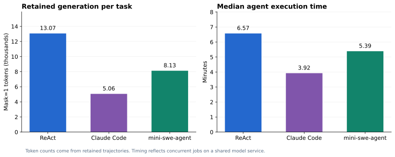

# E03：三种agent在同一30B模型上的SWE对照

## 目的

比较同一模型放进不同agent/harness后，修复真实仓库缺陷的效果、完成状态、修改约束和执行开销。被比较的是harness连同其prompt、工具和停止策略的整体行为。

## 第一阶段：六题pilot

六题固定为Flask5014、Requests6028、pytest5262/7432/7521/7982。环境控制为原始代码0/6通过、gold6/6通过。

配置为64K服务上下文，steps/turns上限60，每轮最多2048输出，temperature=0.2，top_p=0.9，各agent并发3。

| Agent | 判题通过 | 正常结束 | 完成判题 | 原始作业wall time |
|---|---:|---:|---:|---:|
| ReAct | 4/6 | 3/6 | 6/6 | 911.2秒 |
| Claude Code | 4/6 | 6/6 | 6/6 | 608.7秒 |
| Mini | 2/6 | 4/6 | 6/6 | 422.0秒 |

这一阶段证明三条harness链路都能执行任务，也帮助确定正式实验预算。pilot与后续28题不是独立随机样本、配置也不同，不把两者分数合并或解释成训练提升。

## 第二阶段：固定28题正式比较

| 项目 | 实际设置 |
|---|---|
| 模型 | 固定Qwen3-Coder-30B-A3B-Instruct，BF16；三组权重相同 |
| 服务 | GPU1、TP1、eager、131072上下文、prefix cache开启 |
| Agent | Uni-Agent ReAct；Claude Code 2.1.236；mini-swe-agent 2.2.8 |
| 采样 | temperature=0.2，top_p=0.9，Gateway固定配置 |
| 单次模型输出 | 最多4096 token |
| 步数预算 | 各配置的max_steps/max_turns/step_limit均为100；语义随harness而不同 |
| 总时间预算 | 每题agent1800秒；独立verifier600秒 |
| Sandbox | 2CPU、8GiB、pids512，三种agent使用同一题目的原始镜像 |
| 并发 | 每组3题，三个作业共用同一128K服务，最多9个任务并发 |
| 尝试次数 | 每种agent每题一次，不做多次采样挑最好结果 |
| Prompt | ReAct和Claude来自对应Uni-Agent示例；Mini使用自身benchmark默认prompt |
| 最终评分 | 统一归因候选后，在新建sandbox执行上游SWE verifier |

ReAct的 `max_total_tokens=120000` 在该版本源码中实际根据最近一次请求的prompt+completion判断预算，不能当作累计生成token配额。Claude/Mini还拥有各自的上下文和工具控制策略；ReAct shell配置为120秒，Mini入口的工具默认值为600秒，外围agent总超时仍一致。因此，这不是“所有内部条件完全相同、只替换agent名字”的消融实验。

## 最终任务结果

| Agent | resolved | 通过率 | 剥离测试路径后通过 | finished | eval_completed | 修改既有测试 |
|---|---:|---:|---:|---:|---:|---:|
| **ReAct** | **17/28** | **60.7%** | 17/28 | 27/28 | 28/28 | 0题 |
| Claude Code | 11/28 | 39.3% | 11/28 | 28/28 | 28/28 | 2题 |
| mini-swe-agent | 12/28 | 42.9% | 12/28 | 25/28 | 28/28 | 1题 |

这里的三个指标不能混用：

- `resolved`：SWE测试判定问题得到修复。
- `finished`：harness按自身规则报告结束。ReAct可能达到预算仍留下有效补丁；CLI成功退出也可能没修对。
- `eval_completed`：评分流程完成。还要结合测试报告和环境正负控制解释它。

进一步要求“判题通过、正常结束、未修改既有测试”，本次满足数为 **ReAct16/28、Claude10/28、Mini11/28**。这是额外的交付质量口径，不替代官方SWE的resolved指标。

## 配对比较

| 配对 | 两者均通过 | 仅前者通过 | 仅后者通过 | 两者均未通过 |
|---|---:|---:|---:|---:|
| ReAct / Claude | 11 | 6 | 0 | 11 |
| ReAct / Mini | 12 | 5 | 0 | 11 |
| Claude / Mini | 9 | 2 | 3 | 14 |

这个样本中，Claude和Mini通过的题都包含在ReAct通过集合内。ReAct相对Claude多通过6题，相对Mini多通过5题。样本规模、分层分布、prompt差异和单次采样限制了结论，不能据此宣布一个普遍成立的harness排名。

## 执行开销

| 指标 | ReAct | Claude Code | Mini |
|---|---:|---:|---:|
| Agent耗时中位数 | 394.3秒 | 235.5秒 | 323.2秒 |
| Agent耗时均值 | 496.8秒 | 256.2秒 | 334.0秒 |
| 原始作业wall time | 5220.5秒 | 2788.4秒 | 3358.4秒 |
| 保留轨迹中模型token，mask=1 | 365,885 | 141,690 | 227,529 |
| 保留轨迹中观察token，mask=0 | 737,366 | 643,786 | 351,614 |

token按最终保留轨迹计数，可能受上下文链处理影响，不能当作累计计费输入token。原始作业wall time不包含后续统一候选归因回放；各组共享服务、启动时间也不完全相同，这些耗时不是独占条件下的性能排行。

ReAct在本样本效果最好，也用了更多生成与执行开销。选型时应同时考虑修复率、合规修改、完成状态与资源预算。

## 证据与可复查入口

- [最终精确汇总](../evidence/summary/final-summary.json)
- [全部28题结果矩阵](../results/03-per-case-matrix.md)／[84行CSV](../results/per-case-results.csv)
- [原始ReAct pilot](../evidence/summary/pilot-react-gateway.json)、[Claude pilot](../evidence/summary/pilot-claude-gateway.json)、[Mini pilot](../evidence/summary/pilot-mini-gateway.json)
- [执行时driver](../reproduce/scripts/executed/run_swe.py)，[独立回放脚本](../reproduce/scripts/regrade_swe.py)
- [五个真实案例](../results/01-case-studies.md)。
