# E05：远端E2B兼容sandbox

## 目的与实际范围

验证能否保持模型在本机AMD GPU上推理，将agent工具执行放到远端sandbox。实际使用用户提供的E2B兼容端点与官方E2B SDK 2.49.1。

该Uni-Agent版本没有原生E2B provider。本次通过一个薄适配器实现其Sandbox接口：创建/销毁、命令执行、文件读写/上传下载。这里记录接口与行为，不推定用户端点的品牌、微VM实现或是否等同于官方E2B云。

## 调用链

ReAct循环和模型请求都在本地CPU侧；它直接调用本地vLLM `/v1/chat/completions`。E2B SDK负责远端工具调用。**这项实验没有经过Uni-Agent Gateway。**

## 实验一：SDK生命周期与文件操作

依次完成：创建`testlab-python-node`模板实例、运行系统与Python命令、写入marker并读取、中文文本写入/读取、主动销毁实例。

| 动作 | 结果 |
|---|---|
| 创建sandbox | 成功，记录约0.70秒；仅为本次单次观测 |
| 运行命令 | 正常返回exit_code/stdout/stderr |
| Python环境 | 观测为Python3.12.14 |
| marker与中文文件读写 | 内容一致 |
| 销毁 | SDK返回成功 |

[脱敏SDK记录](../evidence/sandbox/e2b-sdk-smoke.json)。创建时延不是统计性服务SLA，也没有验证大规模并发启动。

## 实验二：上游sandbox demo

导入E2B适配器后，执行同一个Uni-Agent官方sandbox demo。shell与文件编辑共享状态，脚本计算从7变为8，目录保持与文件上传下载均通过。

这一步说明provider接口足以承接上游工具工作流，而不只是服务端health返回成功。适配器见[e2b_provider.py](../reproduce/scripts/e2b_provider.py)，调用入口见[run_e2b_demo.py](../reproduce/scripts/run_e2b_demo.py)。

## 实验三：ReAct实际代码修复

使用和本地Docker实验相同的`merge_intervals`缺陷、要求与10项测试，模型固定为本地Qwen30B，ReAct最多30步、每轮2048输出，temperature=0.2、top_p=0.9。

| 指标 | 本地Docker | 远端E2B兼容服务 |
|---|---:|---:|
| 原始代码测试通过 | 1/10 | 1/10 |
| agent修复后 | **10/10** | **10/10** |
| finished | true | true |
| ReAct步数/工具调用 | 8 / 8 | 13 / 13 |
| 整体wall time | 48.38秒 | 107.95秒 |

测试脚本在agent执行前从任务目录移除，结束后才放回。本地和远端生成的轨迹不同，后者还涉及远端准备和网络操作，因此不能将两个wall time简单解释为sandbox服务速度差异。

[远端任务结果](../evidence/sandbox/e2b/result.json) · [实际修复文件](../evidence/sandbox/e2b/interval_utils.py) · [验证输出](../evidence/sandbox/e2b/verifier.json) · [完整任务定义](../reproduce/scripts/run_sandbox_agent.py)。

## 得到的结论

- 本地GPU推理与远端sandbox工具执行可以组合，Uni-Agent的Sandbox接口可扩展到该服务。
- ReAct不要求远端实例能访问本机模型端口，因为模型请求由本地编排侧发起。
- 生命周期、状态与真实工具闭环均已验证；实验结束时的服务审计没有本实验遗留实例。

## 没有覆盖的能力

没有跑远端SWE-bench，也没有把Claude/Mini放进该远端服务。任意SWE镜像的模板构建/映射尚未验证；黑盒CLI放到远端之后，需要解决它到本地Gateway的安全网络连接。这些是下一阶段集成项，不应从当前10测试案例推导为已完成。

密钥不保存到本目录，提供的服务地址在证据副本中做了脱敏；完整连接配置只在原实验受限配置文件中使用。
