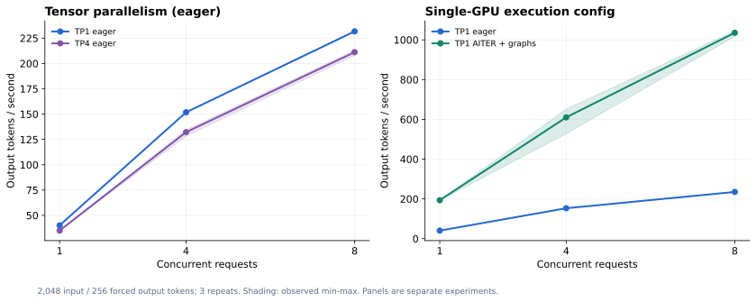

# E06：ROCm推理性能——TP1/TP4与AITER配置

## 目的

在agent任务效果之外，单独测量模型服务的输出吞吐和时延，回答两个资源问题：30B放得进单卡时是否要做多卡TP；ROCm推理配置是否有明显优化空间。

此处没有训练模型，所有配置使用相同BF16权重。图中的两个面板是两组独立实验，不混成一个受控多变量结论。

## 测量方法

- 请求：固定2048输入token、256输出token；设置`ignore_eos=true`以固定输出工作量，temperature=0。
- 并发：1、4、8；每种配置各重复3次，每组共18个batch。
- 输出统计：从流式接口记录首个文本chunk时间、完整请求耗时、模型usage与整个batch wall time。
- 聚合吞吐：batch内实际completion token数 / batch wall time。
- GPU时间指标：GPU数量 × batch wall time / output token数 × 1000；各batch计算后取三次均值，表示分配的GPU时间，不是GPU真实活跃kernel时长或账单。
- prefix cache开启，输入早期加入不同请求标识以减少整段复用；不声称完全不存在任何前缀命中。
- 同节点另一张GPU仍运行agent实验，未进行整机独占峰值测试。

## 实验A：单卡TP1与四卡TP4，均为eager

TP1使用GPU0；TP4使用GPU4–7。模型、BF16与基础镜像一致。服务配置保持相近，TP4按进程数分配更多CPU/RAM；这不是逐项隔离通信或kernel的性能分析。

| 并发 | TP1平均token/s | TP4平均token/s | TP1平均请求秒数 | TP4平均请求秒数 |
|---:|---:|---:|---:|---:|
| 1 | 40.19 | 35.06 | 6.36 | 7.29 |
| 4 | 151.80 | 132.22 | 6.72 | 7.69 |
| 8 | 231.72 | 211.17 | 8.78 | 9.61 |

在此保守eager配置和工作负载下，四卡TP没有获得吞吐收益。单卡能够容纳权重与KV cache，多卡带来的额外开销需要由更合适的工作负载/内核抵消；本次没有对具体瓶颈做kernel级归因。

不能由此推导“ROCm上的TP永远没用”或“大模型不需要TP”。它支持的是本机这个30B配置优先考虑单卡的决策。

## 实验B：单卡eager与AITER + 默认编译/图执行

对照组为GPU0上的eager，实验组为GPU2，设置 `VLLM_ROCM_USE_AITER=1` 并移除 `--enforce-eager`。两者64K服务上限、显存比例、OMP设置、并发上限、权重与镜像一致。

| 并发 | eager平均token/s | AITER+图平均token/s | 吞吐倍数 | 优化组三次范围 |
|---:|---:|---:|---:|---:|
| 1 | 40.44 | 193.32 | 4.78× | 192.90–194.16 |
| 4 | 153.01 | 610.13 | 3.99× | 527.53–651.81 |
| 8 | 234.96 | **1035.76** | **4.41×** | 1017.07–1045.17 |

该组合同时改变AITER相关kernel与编译/图执行，不能将全部收益归给其中一个开关。所有数据都是短上下文、固定输出长度的服务微基准，不等于真实SWE任务会快4.41倍。

## 功能验证与适用结论

优化服务完成四种API检查；另有官方ReAct单题和经Gateway的单题修复均通过。它没有替换正式28题使用的128K eager服务，也没有做完整28题的优化前后质量回归。

可以得到的结论是：这台AMD机器在模型执行配置上存在可观的实际优化空间，单纯增加TP卡数未必是优先选项。最终容量规划还需测量真实上下文长度、并发、工具等待和尾延迟。

## 原始统计和脚本

- [TP平均统计](../evidence/performance/serving-benchmark/summary.json)／[三次原始batch](../evidence/performance/serving-benchmark/raw.json)
- [AITER平均统计](../evidence/performance/serving-aiter-benchmark/summary.json)／[三次原始batch](../evidence/performance/serving-aiter-benchmark/raw.json)
- [TP测试脚本](../reproduce/scripts/benchmark_serving.py)、[AITER测试脚本](../reproduce/scripts/benchmark_aiter.py)
- [优化服务启动脚本](../reproduce/scripts/serve_model_aiter.sh)。
