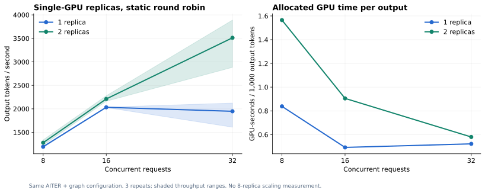

# E07：一个模型副本与两个模型副本

## 目的与配置

验证单卡优化完成后，把不同请求分配给两个独立模型副本，是否比将所有请求排队到一个副本更有效。

两副本分别位于GPU2、GPU3，都是相同AITER + 编译/图执行的TP1配置，权重、镜像、64K窗口和max_num_seqs=16一致。客户端按请求编号静态轮询两个端点。**没有使用Uni-Agent AgentAwareRouter，也没有在八张卡上部署八副本。**

沿用2048输入／256强制输出token，temperature=0，测试并发8、16、32，各3次；有效完整协议共18个batch。该组客户端关闭连接复用，以完整成功的v2记录统计，不拼接前一次未完整完成的测量。

## 结果

| 并发 | 单副本token/s | 双副本token/s | 双/单倍数 | 单副本GPU秒/千token | 双副本GPU秒/千token |
|---:|---:|---:|---:|---:|---:|
| 8 | 1193.60 | 1279.56 | 1.07× | 0.838 | 1.565 |
| 16 | 2033.20 | 2211.25 | 1.09× | 0.492 | 0.905 |
| 32 | **1948.07** | **3512.83** | **1.80×** | 0.522 | 0.580 |

并发32时，平均请求耗时从3.17秒降到2.23秒，平均首文本chunk时延从1.32秒降到0.32秒。三次吞吐范围分别为单副本1609.89–2122.81、双副本2883.54–3889.58 token/s，存在明显波动，因此同时提供范围与原始记录。

## 如何解读

低并发下，单副本已能承接工作，增加一个副本的吞吐收益很小，却增加了分配的GPU时间。并发达到32时，两个各允许16个active sequence的服务能分担排队，表现出更明显的吞吐与等待时延收益。

本实验说明“更多副本”应与负载需求匹配。双副本并未在所有并发下表现为两倍，也不能据此外推八副本线性扩展。静态轮询未考虑session亲和、prefix cache命中或负载差异；这些都属于后续路由策略研究。

这组单副本吞吐与前一组AITER实验不同，来自不同请求构造、连接策略与测量时段。每个倍数只在本组内部计算，不跨实验挑选最大数字作对照。

## 证据

- [完整平均统计](../evidence/performance/serving-replicas-benchmark-v2/summary.json)
- [18个原始batch与逐请求数据](../evidence/performance/serving-replicas-benchmark-v2/raw.json)
- [实际测量脚本](../reproduce/scripts/benchmark_replicas_v2.py)
- 服务实例与GPU映射见[环境版本](../reproduce/01-environment-and-versions.md)。
