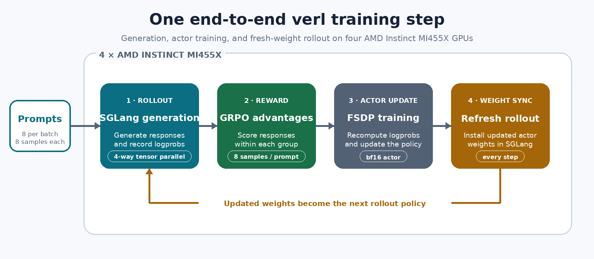
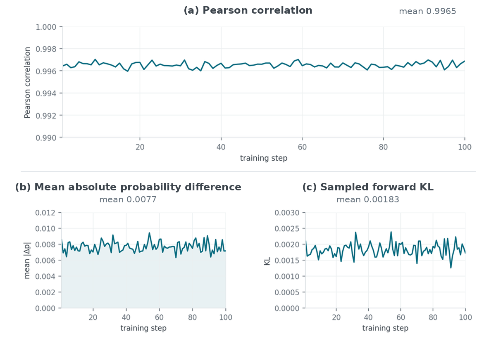
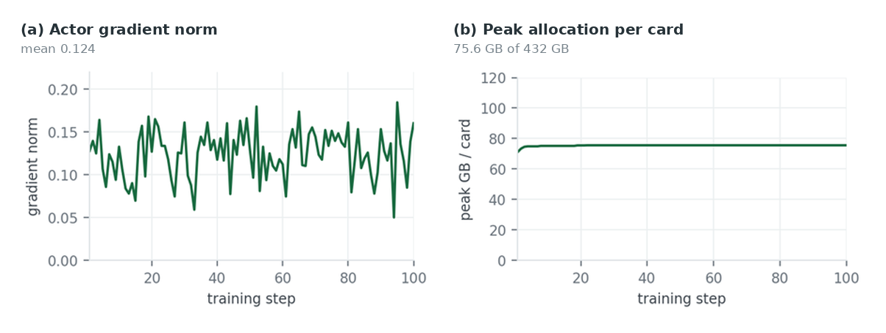

# Bringing End-to-End LLM Reinforcement Learning to AMD Instinct MI455X with verl

AMD Instinct™ MI455X is the first accelerator built on the fifth generation of AMD CDNA™ architecture. Hardware availability is only the first step for a new generation; adoption depends on frameworks, kernels, and communication libraries working together on a complete workload.

This post describes the work required to bring a full Group Relative Policy Optimization (GRPO) workflow — verl, Qwen3-30B-A3B, SGLang, and PyTorch FSDP — onto MI455X. The objective was to validate whether generation, training, and weight synchronization could operate as one stable loop on a new CDNA 5 platform.

## Result at a glance

- **End-to-end execution:** 100 consecutive GRPO steps completed in 8.0 hours on four MI455X GPUs.
- **Full workflow:** every step covered rollout generation, actor-side probability computation and optimization, weight synchronization, and transition into the next rollout.
- **Numerical consistency:** rollout-to-actor sampled-token probability correlation averaged `0.9965`, with no visible drift.
- **Runtime stability:** the final configuration had no out-of-memory error, kernel fault, or collective timeout, and peak allocated memory remained flat after warm-up.


## AMD Instinct MI455X: bringing RL to CDNA 5

AMD launched the Instinct MI400 Series at Advancing AI 2026. MI455X is the first Instinct accelerator based on AMD CDNA 5 and sits at the center of the 72-GPU AMD Helios™ rack-scale system [1, 2].


| Specification         | AMD Instinct MI355X | AMD Instinct MI455X |
| --------------------- | ------------------- | ------------------- |
| Architecture          | AMD CDNA 4          | AMD CDNA 5          |
| High-bandwidth memory | 288 GB HBM3E        | 432 GB HBM4         |
| Peak memory bandwidth | 8 TB/s              | Up to 23.3 TB/s     |


*Table 1. Public specifications for MI355X and MI455X. Sources: [2, 3].*

For end-to-end RL, memory capacity is only part of the story. Model state, training activations, rollout KV cache, and synchronized weights must move across different kernels, process groups, and framework boundaries. On a new `gfx1250` platform, all of these paths have to work together.

Against this backdrop, the complete RL loop provides a practical view of software readiness on MI455X, bringing together SGLang rollout generation, PyTorch FSDP actor training, and the synchronization of updated weights between them.

## What the end-to-end RL loop exercises



*Figure 1. The end-to-end RL loop exercised during each training step.*

Each phase of the loop uses different kernels, parallel layouts, process groups, and framework APIs, so one step touches far more of a new platform's stack than inference or supervised training alone. RL is also unforgiving in two ways that shaped this bring-up: several failures surface only after both halves of a step have already succeeded, and the generation and training engines must agree numerically or the policy gradient is silently wrong.

verl coordinates this dataflow behind a common control layer [4]. We used it to run GRPO [5] with SGLang serving rollouts and PyTorch Fully Sharded Data Parallel (FSDP) training the actor.

## What it took to run on MI455X

The failures fell across four layers: rollout kernel selection, actor kernel availability, checkpoint materialization, and actor-to-rollout weight synchronization.

### Rollout: route kernels per operation

No single backend covered every rollout operation, and the working configuration came from routing individual operations rather than turning AITER on or off wholesale:

- **Attention → Triton.** AITER's unified attention kernel reads out of bounds on `gfx1250`, not under load: it took down two SGLang schedulers at 6% KV-cache occupancy with 65 concurrent requests, faulting inside `kernel_unified_attention_3d_..._ALL_DECODE_1`.
- **MoE top-k routing → AITER.** Disabling AITER entirely, as the upstream ROCm image does for older parts, breaks generation elsewhere: SGLang's router reaches its Triton path only on a CUDA branch, so ROCm falls through to `sgl_kernel`'s `topk_softmax`, which fails to launch here. AITER's router is the only working path, so AITER stays enabled.
- **Expert GEMMs → Triton.** Both AITER's and Composable Kernel's fused MoE are built on XDLOPS, which `gfx1250` does not provide; the JIT build fails and a 128-expert model never loads. CK does not compile for this part at all, so `ENABLE_CK=0` is also required.

With this split, CUDA graphs captured and ran normally — the capture failures seen initially came from the routing kernel, not from graph capture.

### Actor: build missing components and select unfused paths

Transformer Engine and apex publish no `gfx1250` wheel, so both were built from source. Even then, TE's fused attention is unavailable on this part (as it is in AMD's own Primus image) and its grouped GEMM hits the same XDLOPS constraint as the MoE runner, so both run unfused. There is no FlashAttention build either, and that one is not silent: verl requests `flash_attention_2` by default and `transformers` raises instead of falling back, so SDPA has to be selected by hand.

### Checkpoint loading: avoid `fp32` host-memory pressure

verl materializes the checkpoint at `model_dtype`, which defaults to `fp32` — 122 GB per rank for a 30B model. Four ranks loading at once took a 251 GB host from 59 GB to 249 GB in about ten seconds, and Ray's OOM killer ended the run. Setting `model_dtype=bf16` brings peak host usage to 114 GB. It is a distinct setting from `param_dtype`, which was already `bf16`: one governs load width, the other sharded compute.

### Weight synchronization: repair the actor-to-rollout boundary

After each optimizer step, the actor has to push its updated weights into the rollout engine before the next rollout can start. That push is an RCCL broadcast from the training ranks to the SGLang schedulers, and it is the one part of the loop that neither standalone inference nor standalone training ever runs. It failed twice, for unrelated reasons.

**The broadcast hung.** With the ROCm defaults, the very first push never returned:

```
Watchdog caught collective operation timeout:
  WorkNCCL(SeqNum=37730, OpType=BROADCAST) ran for 1800028 milliseconds
```

The watchdog waited its full 1,800 seconds, both schedulers aborted, and the job died. Nothing in that message narrows down the cause — a hung collective looks the same whatever produced it, and it appears only after generation and training have both succeeded, so neither of those is implicated. The resolution was to adopt AMD Primus's `gfx1250` collective environment wholesale. Because those variables were applied together, we cannot attribute the fix to one of them, but the likely candidate is disabling MSCCL and MSCCL++, RCCL's alternative collective implementation, which Primus also disables on this part. With that environment in place the same broadcast completed in 4.3 seconds.

**The API had moved.** SGLang 0.5.19 changed `update_weights_from_tensor` from a single call into a three-part session — `begin_weight_update`, the tensor updates, `end_weight_update` — and its scheduler now asserts that a session is open. The verl revision we used still made the single call, so the first push was rejected. A small wrapper opens and closes the session around the updates. It has to go on verl's two HTTP adapters, because verl drives SGLang over HTTP; the direct engine call is the obvious place to patch and is not the path that runs.

## Reproducing the MI455X run

### Workload configuration

- **Hardware:** 4 × AMD Instinct MI455X (`gfx1250`), 432 GB HBM4 per GPU, single node, driver `7.1.1.31300009`
- **Model / data:** Qwen3-30B-A3B, a 128-expert MoE model [6], on DAPO-Math-17k [7]
- **Algorithm:** GRPO, learning rate `1e-6`, 8 prompts × 8 responses per step, 8,192-token maximum response
- **Engines:** SGLang 0.5.19 rollout at TP=4; PyTorch FSDP actor across the same four GPUs
- **Software:** ROCm 10.0.0, PyTorch 2.11.0+rocm10.0.0, Transformer Engine 2.17.0, Megatron-LM 0.19, verl 0.10.0.dev
- **Run:** 100 training steps, 8.0 hours wall clock

### Launch command

The image carries the `gfx1250` environment and both compatibility patches; the Dockerfile, launch script, and patches are published in full [8].

```bash
docker pull amdagi/verl-dev:verl-rocm10-mi45x

docker run --rm --device=/dev/kfd --device=/dev/dri --group-add video \
  --security-opt seccomp=unconfined --ipc=host --shm-size=64g \
  --ulimit memlock=-1 --ulimit stack=67108864 \
  -e NCCL_IB_DISABLE=1 \
  -v $MODELS:/root/models -v $DATA:/root/datasets \
  amdagi/verl-dev:verl-rocm10-mi45x \
  bash examples/grpo_trainer/run_qwen3_30b_a3b_mi45x.sh
```

### MI455X-specific image configuration

These are compatibility settings, not tuning:

- **Rollout:** `SGLANG_USE_AITER=1`, `SGLANG_ATTENTION_BACKEND=triton`, and `moe_runner_backend=triton`.
- **Training:** `NVTE_USE_GROUPED_GEMM_TRITON=1`, `model_dtype=bf16`, `attn_implementation=sdpa`, and `ENABLE_CK=0`.
- **Collectives and memory:** set `RCCL_MSCCL_ENABLE=0`, `RCCL_MSCCLPP_ENABLE=0`, `TORCH_NCCL_USE_TENSOR_REGISTER_ALLOCATOR_HOOK=0`, `GPU_MAX_HW_QUEUES=2`, and `PYTORCH_ALLOC_CONF=expandable_segments:True`; clear `NCCL_MIN_NCHANNELS`.

`NCCL_IB_DISABLE=1` is supplied only at run time for this single-node job.

## Validation results


### Rollout-to-actor probability consistency

Rollout generation and actor training evaluate the same sampled tokens through different execution paths. To verify that the two paths remained numerically aligned, we compared their sampled-token probabilities at every training step.



*Figure 2. Rollout-to-actor diagnostics over 100 steps: (a) Pearson correlation, mean* `0.9965` *(σ* `0.0003`*), (b) mean absolute sampled-token probability difference, mean* `0.0077` *over a* `0.0063`*–*`0.0094` *range, and (c) sampled forward KL, mean* `0.00183`*.*

Across 100 steps, all three metrics remained within a narrow range with no visible drift, indicating stable numerical agreement between the rollout and actor paths. These measurements provide a sampled-token consistency baseline for tracking future kernel and framework changes.

### Training stability



*Figure 3. (a) Actor gradient norm, mean* `0.124`*, and (b) peak allocated memory per card, flat at* `75.6 GB` *from step 11 onward.*

The gradient norm remained bounded throughout the run, while peak allocated memory stabilized at `75.6 GB` per GPU from step 11 onward.

### Where a step spends its time


| Phase                  | Share of step wall clock |
| ---------------------- | ------------------------ |
| Rollout generation     | 48.1%                    |
| Actor update           | 39.1%                    |
| Log-probability pass   | 10.9%                    |
| Weight synchronization | 1.8%                     |


*Table 2. Share of step wall clock by phase, averaged over 100 steps.*

## Conclusion

A 30B-class MoE model can generate rollouts through SGLang on CDNA 5, be trained through PyTorch FSDP, and have fresh weights installed into the rollout engine every step, with sampled-token diagnostics that stay stable across 100 updates. The MI455X-specific configuration stays localized in a Dockerfile, a launch script, and small compatibility patches [8], giving later software versions clear places to remove the temporary paths.

This is a software-readiness result, not a claim about peak throughput, training convergence, or multi-node scaling. It provides a working baseline for broader model coverage, longer runs, multi-node validation, and performance work.

## References

1. AMD Newsroom, “[AAI 2026: AMD Launches AMD Instinct MI400 Series GPUs for Frontier AI, HPC](https://newsroom.amd.com/news/aai-2026-mi400-instinct-update/),” 2026.
2. AMD, “[AMD CDNA™ Architecture](https://www.amd.com/en/technologies/cdna.html).”
3. AMD, “[AMD Instinct™ MI355X GPUs](https://www.amd.com/en/products/accelerators/instinct/mi350/mi355x.html).”
4. G. Sheng et al., “[HybridFlow: A Flexible and Efficient RLHF Framework](https://doi.org/10.1145/3689031.3696075),” *EuroSys ’25*, 2025.
5. Z. Shao et al., “[DeepSeekMath: Pushing the Limits of Mathematical Reasoning in Open Language Models](https://arxiv.org/abs/2402.03300),” arXiv:2402.03300, 2024.
6. A. Yang et al., “[Qwen3 Technical Report](https://arxiv.org/abs/2505.09388),” arXiv:2505.09388, 2025.
7. Q. Yu et al., “[DAPO: An Open-Source LLM Reinforcement Learning System at Scale](https://arxiv.org/abs/2503.14476),” arXiv:2503.14476, 2025.
8. “[MI455X verl bring-up source: Dockerfile, launch scripts, and compatibility patches](https://github.com/lizamd/verl/commit/d74323771ca870ade550df358aadac3a4d63ad01),” commit `d743237`.

