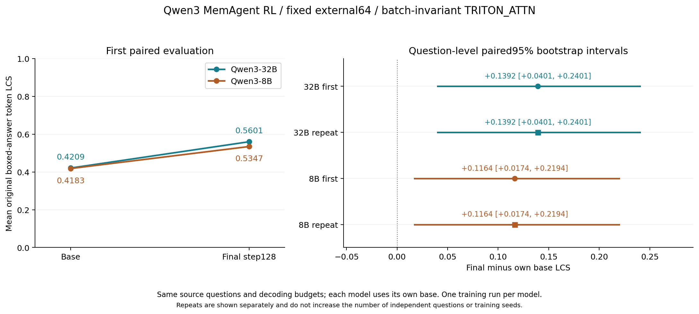
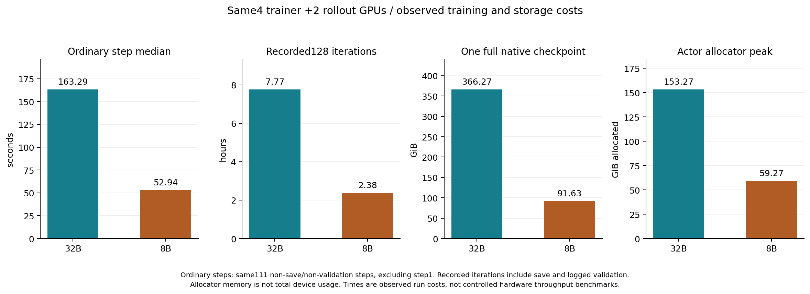
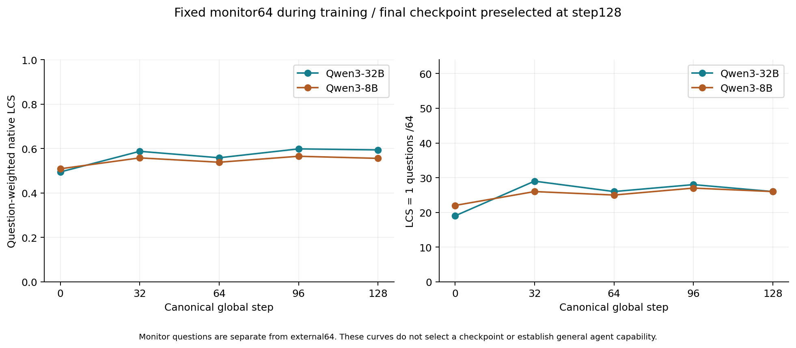
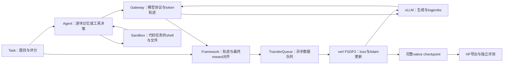

# Uni-Agent / Miles：ROCm节点32B与8B实验总结

> 仓库阅读版：保留方法、步骤、结果和图表。源码链接为固定上游版本参考；未收录的原始实验文件仅以路径引用。

**已完成：Qwen3-32B与Qwen3-8B各128步全参数RL、真实断点恢复、最终回载与重复评测。** 实验日期为2026-09-11至13日UTC；本文汇总结果、成本、案例与复现入口。

本次围绕一台8卡gfx950节点，把Uni-Agent从任务执行、轨迹采集、真实参数更新、完整断点恢复，一直运行到独立回载评测。主训练任务是官方MemAgent：模型逐块读取长文、更新短记忆，最后回答问题。32B与用户追加的8B均已采用相同数据和预算，独立从原始base完成128步全参数RL。

在同一稳定推理配方和固定external64题上，两个模型都观察到原生boxed-answer token-LCS提升：

| 模型 | Base LCS | Final128 LCS | 增量 | 95%问题级配对bootstrap | LCS=1 |
| --- | ---: | ---: | ---: | --- | --- |
| **Qwen3-32B** | 0.42091 | **0.56012** | **+0.13921** | [+0.04010,+0.24014] | 20/64 → **26/64** |
| **Qwen3-8B** | 0.41832 | **0.53467** | **+0.11635** | [+0.01737,+0.21943] | 19/64 → **28/64** |

每个模型的base和final均各运行两遍，全部64题完成、错误0；两遍base之间、两遍final之间的64条回答和reward分别完全一致。32B最终平均部分分更高，8B满分题更多；不能只挑其中一个指标排名。这些是每个规模一次训练的固定小集结果，各自提升的CI不等于规模间差异的显著性检验。

**8B适合作为这套配方后续调试的起点**：本次普通step中位耗时约为32B的1/3，完整断点约为1/4，并观察到独立集评分提升。32B提供了更高的最终平均LCS。通用工具能力、其他任务及跨seed稳定性仍需另外验证。

## 1. 两种模型的共同实验条件

| 项目 | 本次固定设置 |
| --- | --- |
| 数据 | 512训练题，各消费一次；64题monitor；另64题external |
| 执行预算 | 128个globalstep，每步4源题×每题4次完整采样 |
| 长文处理 | 每块约5000 token，记忆最多1024 token，最终回答最多1024 token；保留完整源材料 |
| 训练策略 | GRPO：组内优势中心化、不除标准差，token-mean loss，KL0.01 |
| 学习率 | 峰值1e-6，4个globalstep warmup；首个step实际LR0 |
| 参数/计算精度 | 全参数训练，FP32 master、BF16 compute、SDPA、gradient checkpointing |
| GPU布局 | 4卡FSDP2 trainer、2卡TP2 standalone rollout，separate_async |
| 断点 | 每8步保存model/Adam/extra(scheduler、RNG)/dataloader/TransferQueue；完整提交后才轮换旧断点 |
| 终点选择 | 固定step128；没有按中间monitor最高分挑选checkpoint |
| 规模对照的外部服务 | TP1/BF16/eager/16K、greedy、并发8、BI1/TRITON_ATTN，各模型均base/final和各自repeat |

这套GRPO配置只在“优势不除标准差”这一点上与部分DrGRPO配置相似；上游完整DrGRPO recipe还有损失归一化和KL设置差异。本次没有通过更改冻结协议来改写算法名称或结果。

两个模型使用相同的源问题和分块。完整640题的tokenizer与聊天模板跨训练/评测runtime检查一致。训练monitor和external是不同的64题；不能将它们连成同一条学习曲线。两次重复评测也不增加独立题目数或训练seed数。

模型固定revision：

- Qwen3-32B：`9216db5781bf21249d130ec9da846c4624c16137`，32,762,123,264参数。
- Qwen3-8B：`b968826d9c46dd6066d109eabc6255188de91218`，8,190,735,360参数，实际36层、399参数tensor。

## 2. 完整训练、效果与运行成本

两组训练、native/export证据和独立外部评测均已完成。实际成本对照如下：

| 项目 | Qwen3-32B | Qwen3-8B |
| --- | ---: | ---: |
| 完整globalstep | 128 | 128 |
| 不同源题/完整执行 | 512 / 2048 | 512 / 2048 |
| 真实context / padding | 13872 / 464 | 13872 / 464 |
| 每rank Adam状态数 / counter | 707 / 896 | 399 / 896 |
| Reward非均匀题组 | 179/512 | 180/512 |
| 有任务优势的globalstep | 108 | 107 |
| KL-only当前梯度的globalstep | 20 | 21 |
| Canonical记录迭代总耗时 | 27,959.4秒 / **7小时46分** | 8,576.2秒 / **2小时23分** |
| 普通step中位 / 平均 | **163.3 / 177.7秒** | **52.9 / 54.5秒** |
| Actor Torch allocator峰值allocated | 153.27GiB | 59.27GiB |
| 一份完整native128 | 366.27GiB | 91.63GiB |
| 最终BF16参数payload | 61.02GiB | 15.26GiB |
| fresh到native退出墙钟 | 11小时33分 | 2小时34分 |

在这次相同6卡布局下，8B正常步骤中位耗时约为32B的1/3.08，完整记录迭代耗时约为1/3.26。两个模型的生成长度、运行时行为和同时运行的其他作业会影响耗时，因此这是实际实验成本对照，不能当作受控kernel吞吐benchmark。

耗时比较使用同样111个普通step口径：排除step1及每个保存/验证step。完整墙钟单独列出，避免把32B外部中断的等待时间算成模型大小的开销。显存使用actor日志的Torch allocator峰值，不能当作整张卡全部进程的设备占用或最小硬件要求。

参数更新有独立证据：32B固定9个完整tensor、251,673,600个元素中29.31%的BF16值改变；8B固定9个完整tensor、100,675,584个元素中23.75%的BF16值改变，且与native FP32 cast BF16逐元素相同，均有限。这是抽样范围内的参数变化，不是全模型变化率，也不是能力评分。

Monitor的分数没有单调上升。32B最终为0.59384、26/64满分；8B最终为0.55568、26/64满分。8B monitor净增0.046875可被5个窄格式变化的正贡献完全覆盖，其余变化合计略降；这个比例不能套到下面的external结果。

来源：统一训练成本JSON（原始文件：`results/model-scale-final-training-costs.json`）、独立原生日志复核（原始文件：`results/model-scale-final-training-costs-independent.json`）、32B完整源覆盖（原始文件：`results/large-memagent/durable-train-source-coverage-final128.json`）、8B完整源覆盖（原始文件：`results/rl8-memagent/durable-train-source-coverage-final128.json`）。三张图均提供同目录的SVG与PDF，可直接用于汇报。

## 3. 哪些答案确实改善，哪些只是评分变化

32B的source核对支持以下目标答案改善：基地命名人物试飞的飞机改答B-17；电影题改答同时满足人物与共同演员约束的The Bye Bye Man；两部电影共同片源改答Nebo Zovyot；CEO作为嘉宾参加的播客改答Comedy Film Nerds。完整题目、原文编号和模型回答见[案例审阅](../03-memagent-32b-rl/details/32b-final-stable-case-review.md)。

也有真实回退：一题混淆主持人与另一名演员，选了错误节目；另一题正文保留正确的1943，却把1991放进最终框选答案。最终回答中出现某个事实，不保证模型选择了题目要求的目标答案。

两道仅TeX空格写法变化的题贡献了32B external净增分的约11.22%。其余变化也包含同一日期的词序、引号、城市扩写、组合名称与成员本名的区别，不能把剩余88.78%全称为新增知识。LCS=1是本次固定评分定义，不等于另行实现的标准HotpotQA EM。

正式external结果没有保存中间memory全文，因此这些具体例子能支持最终答案的变化，却不能定位某一块记忆更新如何导致改善。训练/monitor有更完整轨迹，但不能用别的题的轨迹补齐external自身缺失的机制证据。

8B external为15题升分、7题降分、42题同分；新增12个满分、丢失3个。两道窄格式题贡献净增的15.67%，其余20个变化题的净贡献约0.09812，仍不能全部称为新增知识。

| 8B案例 | Base → final128 | 核对结果 |
| --- | --- | --- |
| 原著作者出生日期 | 导演Clive Donner的日期 → **作者Hunter Davies的日期** | 从相关人物改为题目目标人物 |
| 漫画角色所属品牌 | Ghost Rider → **Marvel** | 从角色名改为要求的品牌 |
| 指定电影中的角色 | Fiona → **Princess Jessica** | 符合演员与作品约束 |
| 小说作者的父亲 | John Dickson Carr → **C. W. Grafton** | 原文支持正确父女关系 |
| Bubblegum Alley所在地 | San Luis Obispo → **Santa Cruz** | 真实回退，选到干扰机构地址 |
| Albertina约65,000项馆藏 | drawings → **people** | 真实回退，数量对应对象错误 |

完整原文、两遍回答、指标边界与机器证据：[8B案例复核](../04-memagent-8b-rl/details/8b-final-stable-case-review.md)、8B独立结果审计（原始文件：`results/memagent-8b/final128-stable-independent-audit-20260913.json`）。日期包装、姓名空格、同一机型省略后缀等仍会影响原生评分，报告同时保留这些限制。

## 4. Uni-Agent的架构与本次实际路径

MemAgent的原文块顺序由程序控制，模型学习生成记忆与最终答案。Gateway记录token、logprob和mask；Framework将一次执行的最终reward对齐到该次执行的context，verl对有效模型输出计算策略损失。工具观察可以出现在后续输入中，但不作为模型输出直接计算policy loss。

异步生成会提前生产轨迹，因此“日志里出现过”与“训练器真正消费过”不同。最终源覆盖审计从canonical rollout逐题重建原始chunk，排除预取、padding和被回滚的工作。数据、session、context、globalstep和Adam counter分别记录。

保存与验证顺序是actor更新→native保存→同步当前权重→切换验证用hybrid rollout并同步→验证→metrics/rollout dump。4张trainer卡在验证期间会临时承担两组TP2 hybrid replicas；独立TP2 rollout仍是训练时的生成通路。看到多组vLLM进程不代表额外增加了训练GPU。

完整讲解：[架构与源码指南](details/architecture-internals.md)、[离线交互探索页](training-explorer.html)、[一批真实32B数据的计数](../03-memagent-32b-rl/details/32b-training-walkthrough.md)。

## 5. 代码Agent与长文案例

这些使用原始模型，属于工具链与行为诊断，不并入MemAgent RL收益。

| 固定子集 | 模型与harness | resolved | finished | 两者交集 |
| --- | --- | ---: | ---: | ---: |
| SWE原六题 | Coder30B / ReAct | 4/6 | 5/6 | 4/6 |
| SWE原六题 | Coder30B / Claude Code | 3/6 | 5/6 | 3/6 |
| SWE原六题 | Coder30B / Mini-SWE | 2/6 | 1/6 | 1/6 |
| 扩展29题 | Coder30B / ReAct | 8/29 | 28/29 | 8/29 |
| Terminal-Bench三题 | Coder30B / ReAct | 1/3 | 2/3 | 1/3 |

六题有baseline0/6、gold6/6控制；扩展集先完成32题环境控制，按环境规则排除3题。预算与题集不同，不能拼成统一排行榜，也不是官方完整benchmark分数。Flask案例里ReAct与Claude修改了现有测试，违反提示约束，标记保留；仅取其源码补丁时，各自仍通过1个修复测试和59个回归测试。

Claude路径使用真正的Claude Code 2.1.236 CLI，经Anthropic Messages兼容Gateway连接本地Qwen。CLI自身的内部循环保留，Uni-Agent采集模型轨迹。此次跑通了推理与轨迹采集，没有完成Claude harness下的策略参数更新；被训练的policy可以是本地Qwen，CLI程序本身不被反向传播训练。

原始32B还完成23个“问题×长度”分块记忆case，只有8个底层问题，最长材料约90.7万source token。该过程通过逐块压缩记忆完成，模型实际窗口仍远小于整篇材料。完成处理不等于稳定答对；最远长度档只有1题且得分为0。

## 6. Miles补充实验

Miles拥有训练/rollout调度及自己的agentic接入层，本次走HF模型+FSDP2与SGLang。Uni-Agent这边侧重Task/Agent/Sandbox/Gateway交互抽象，训练交给verl。两者都要解决token、logprob、mask和reward对齐，以及更新后的权重回传。

| Miles case | 实际结果 | 解释 |
| --- | --- | --- |
| 0.6B GSM8K | 4个Adam steps，后三轮有参数变化；真实model/optimizer/scheduler恢复并继续 | 训练底座与权重回传闭环通过 |
| 0.6B Python工具RL | 32 samples，29条使用工具，50次执行，7个正确答案；2次非零更新 | 多轮工具轨迹可进入真实RL |
| 4B原始工具流程 | 所有任务失败、grad0、参数不变 | 仅step或checkpoint增长不足以证明学习 |
| 4B工具输入适配 | 独立rollout16/16工具执行与答案成功 | 输入契约修复；未做RL更新，不能叫训练收益 |

另在固定SGLang ROCm image上完成37项overlay的隔离冷重建与所选core/FSDP/patched模块导入，Torch/HIP保持原版。`pip check`仍包含基础镜像及完整项目extras的声明冲突，记录保留；该冷检查没有重新执行GPU训练。历史GPU结果与后续CPU复现验证分别记录在[Miles实验](../07-miles/REPORT.md)和[冷重建记录](../07-miles/details/miles-cold-rebuild-v3-20260912.md)。

## 7. 故障与恢复记录

| 事件 | 处理与保留的事实 |
| --- | --- |
| 早期32B run宿主中断 | 保留46个日志step与step32 HF；未将它们拼入新128，也未当作有Adam的恢复起点 |
| 正式32B在step34日志后收到SIGTERM | 回到完整commit32；旧33/34带SHA归档，四rank实际恢复及下一批UID验证通过 |
| 32B默认GPU0 final初始化超时 | 600秒期限失败、零题执行；GPU有其他用户长时测试占用，模型后来才加载完成；没有杀其他作业或重置GPU |
| GPU1默认对照切模型时端口探针失败 | 两base已完整完成；原controller failed保留，新操作记录只接final和分析；未重跑基线 |
| 8B预定step8暂停 | 完整commit后退出75，再重启自有容器恢复；是真实恢复验收，不是训练错误 |
| 8B最终导出验收缺少index | 官方merger默认50GB分片，约16GB的8B合法地保存为单文件；派生标准索引，完整SHA证明权重payload不变。原export/controller failed保留，后续CPU收尾单独登记 |

默认ROCM_ATTN和BI1/TRITON_ATTN是不同推理协议，分数单独配对。原GPU0的base不能与GPU1的final混成同环境对照；GPU1重跑匹配baseline由资源可用性触发，不由得分触发。默认恢复最终数据另列，不能替换稳定协议中较低的分数或隐藏重复波动。

默认GPU1恢复已完成：第一对LCS **0.43968→0.59487**，差值+0.15519、95%配对CI[+0.05180,+0.26092]；重复对为 **0.39018→0.56930**，差值+0.17913、CI[+0.05900,+0.29747]。LCS=1分别20→28与20→27。默认后端同模型两遍的response逐字一致数仅base23/64、final15/64；稳定协议分别64/64。完整结果、格式拆分和重复性见[32B报告](../03-memagent-32b-rl/REPORT.md)及默认恢复独立审计（原始文件：`results/large-memagent/primary-gpu1-recovery-independent-results.json`）。

## 8. 在另一台机器复现

环境准备见 [SETUP.md](SETUP.md)，各实验步骤见 [实验导航](../README.md)；[离线 HTML](reproduction.html) 保留完整连续阅读顺序，包括固定镜像digest、源码commit与补丁、CPU/RL/Miles依赖锁、HF revision、数据、容器、后台运行、断点保存/恢复、HF导出、base/final与repeat、统计和排障。

本机硬件按实际记录为8×gfx950、每卡约252GiB可见显存；用户称MI355，早期runtime名称为MI350X。最终训练使用amdgpu module7.1.0.31500000；推理镜像内Torch2.12.0+git6bbd260、HIP7.2.53211、vLLM0.28.1rc1.dev516+g9ea8f3ffc.rocm723。训练Transformers5.9.0与推理5.16.1分别锁定，没有让普通pip解析替换ROCm Torch。

v1复现包已交付并保持原字节。v2新增8B数据/脚本/协议、图表及收尾记录，不携带模型权重、venv、认证或native断点；历史结果放在`reproduction/reference-results`中，避免占用新实验输出目录。已从v2预检包在独立目录冷安装CPU81与RL118项依赖、核验609项8B源/模型/数据hash、模型结构和配置，均通过；原模型仅只读挂载。它是同一物理机的隔离重建，不是另一台GPU节点的完整128步复跑。

**新机器同一lab要跑两种规模时，必须在任何训练前完成8B模型/CPU准备及新节点评测登记。** 登记器要求整个`runs/rl`无历史，详见手册开头和8B章节的顺序。模型训练、全部最终评测均已结束，本次使用的GPU服务已停止，权重和证据保留。

完整native32B约366.3GiB、8B约91.6GiB；轮换时需要新旧两份同时存在。仅转移BF16 HF适合推理或重新开始训练，要保留Adam和数据游标继续则必须带上完整native状态、attempt记录和相同绝对挂载/有效symlink。

## 9. 下一轮实验应回答的问题

本轮先建立可信的工程闭环和小规模效果证据。进一步研究应扩大独立题集并运行多个训练seed，分别报告原生奖励、标准任务指标和语义等价诊断；还应在正式external流程中预先登记并保存完整memory轨迹，以分析证据保留与遗忘。代码Agent和Claude harness若进入RL，需要另做真实更新与外部任务对照，不能由当前推理成功率外推。
