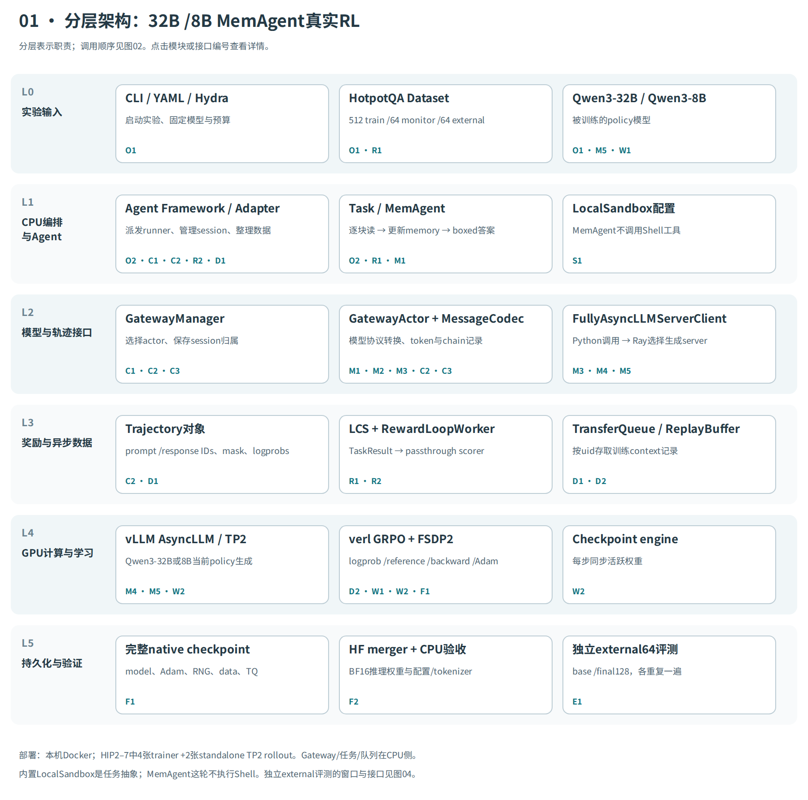
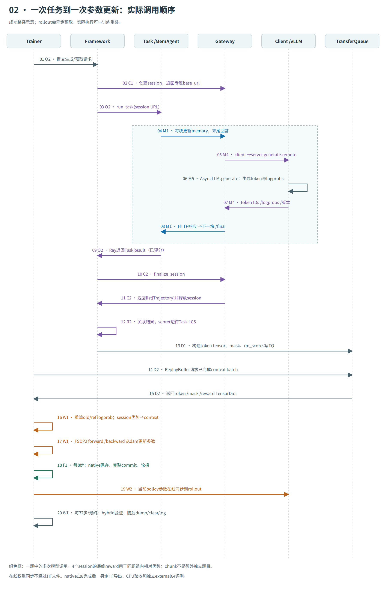
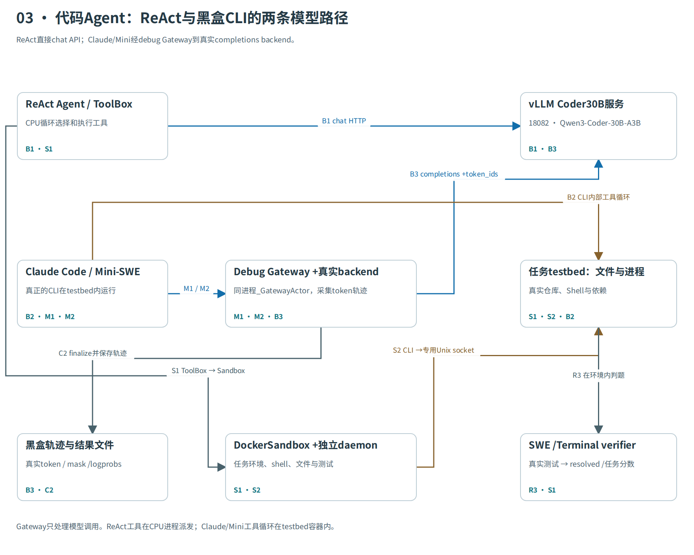
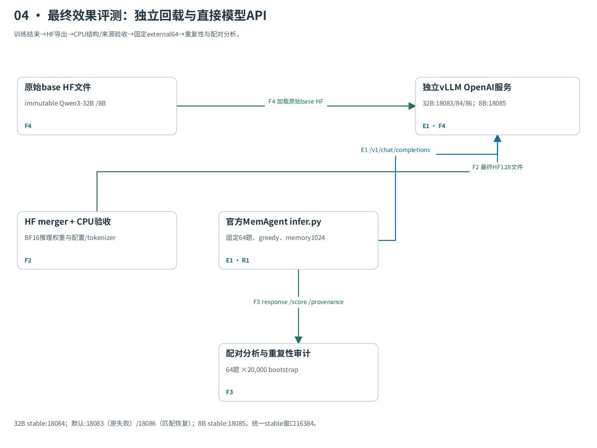
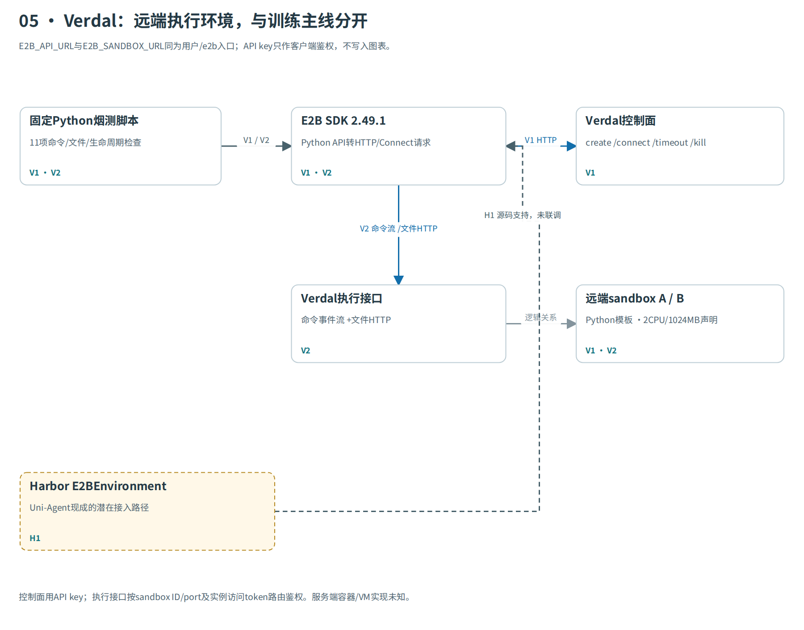
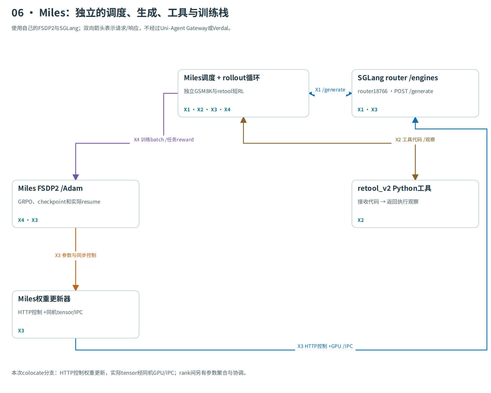

# 本次实验的分层架构、流程与接口

> 仓库阅读版：保留方法、步骤、结果和图表。源码链接为固定上游版本参考；未收录的原始实验文件仅以路径引用。

主入口：[离线交互图](diagrams/index.html)。点击模块或接口编号，可查看职责、输入输出、调用方式和源码。

**范围：32B/8B MemAgent训练、Coder30B推理与黑盒轨迹、独立external评测、Verdal SDK烟测、Miles短RL。它们是不同实验路径。**

HTTP用蓝色、Ray用紫色、Python用灰色、Tensor/RCCL用橙色、文件用绿色；虚线只用于源码支持但未联调的路径。

## 01 分层架构

实跑：Qwen3-32B与Qwen3-8B，各128步完整RL。

[SVG](diagrams/training.svg) · [PDF](diagrams/training.pdf)

## 02 训练流程

沿编号读：模型HTTP、Ray控制、token数据与权重同步是不同通路。

[SVG](diagrams/flow.svg) · [PDF](diagrams/flow.pdf)

## 03 代码Agent

实跑推理与真实token轨迹；这些Coder30B case没有optimizer更新。

[SVG](diagrams/code.svg) · [PDF](diagrams/code.pdf)

## 04 独立评测

实跑：base与预定final128各两遍；不使用训练Gateway/TQ。

[SVG](diagrams/evaluation.svg) · [PDF](diagrams/evaluation.pdf)

## 05 Verdal

实跑SDK：11项功能通过、4个测试实例均删除。虚线是尚未联调的Harbor接入。

[SVG](diagrams/verdal.svg) · [PDF](diagrams/verdal.pdf)

## 06 Miles独立栈

实跑：0.6B GSM8K与Python工具RL；4B adapter是单独rollout-only。

[SVG](diagrams/miles.svg) · [PDF](diagrams/miles.pdf)

## 接口目录

|编号|调用方 → 被调方|调用方式|实际方法 / 路由|范围|
|---|---|---|---|---|
|O1|实验controller → durable launcher → verl trainer|CLI / YAML / Python|rl_durable_reproduce.sh fresh/resume；rl8_controller.py|32B/8B各自独立启动；fresh在step8暂停后真实恢复，禁止覆盖旧run。|
|O2|AgentFrameworkRolloutAdapter / Framework → FrameworkWorker → run_task → HotpotQA Task|Ray RPC + Python|generate_sequences.remote(prompts)；_run_agent_runner_ray_task.remote(...)|本次dispatch_mode=ray_task；异步提交不等于立即训练同一批。|
|C1|Framework / 黑盒runner → GatewayManager → GatewayActor|Python → Ray RPC；黑盒诊断为进程内Python|create_session(session_id, metadata=None, sampling_params=None)|这是Python/Ray生命周期方法，不是REST创建接口；会话状态在actor内存中。|
|C2|Framework / 黑盒runner → GatewayManager → GatewaySession|Python → Ray RPC；黑盒诊断为进程内Python|finalize_session(session_id) → list[Trajectory]|finalize后移除actor会话；reward由Framework后加。黑盒导出轨迹本身不代表训练。|
|C3|持有manager或actor句柄的控制代码 → GatewayActor / GatewaySession|Python / Ray RPC|abort_session(session_id)；get_session_state.remote(session_id)|get_session_state仅在actor层，没有Manager代理，也不是HTTP历史轨迹或reward查询；此处按代码接口标记。|
|M1|MemAgent / Mini模型客户端 → Gateway OpenAI adapter|HTTP JSON / aiohttp|POST /sessions/{session_id}/v1/chat/completions|训练MemAgent和黑盒Mini实际使用；这是Agent到Gateway的一段HTTP。|
|M2|真实Claude Code CLI → Gateway Anthropic adapter|HTTP JSON / 流式响应适配|POST /sessions/{session_id}/v1/messages|本次用于Coder30B黑盒推理；CLI模型名是协议别名，不代表使用Anthropic权重。|
|M3|GatewaySession → verl FullyAsyncLLMServerClient|进程内异步Python|await backend.generate(request_id=session_id, prompt_ids=..., sampling_params=...)|本次实际注入FullyAsyncLLMServerClient；此边界不是公共OpenAI HTTP请求。|
|M4|verl LLM client → Load balancer → vLLMHttpServer actor|Ray RPC|acquire_server.remote(...) → server.generate.remote(...) → release_server.remote(...)|server类名带HTTP，但本次训练通过Ray调用generate；与HTTP推理服务分开。|
|M5|vLLMHttpServer.generate → vLLM AsyncLLM engine|Python AsyncLLM / GPU tensor计算|engine.generate(TokensPrompt(...), SamplingParams(...))；async for output|训练window为8192；不是external稳定服务的16384。|
|R1|HotpotQA Task → 原生boxed-answer LCS → TaskResult|Python函数返回|compute_score(response, ground_truths)；TaskResult(reward, accuracy, extra_info)|reward由Task计算；没有向Gateway提交reward的REST调用。LCS满分不等于语义判定。|
|R2|Framework → RewardLoopWorker → score_from_runner_result|Ray RPC + Python callback|worker.compute_score.remote(data)；score_from_runner_result(...)|本次为Task奖励透传，不是另训reward model；每步过程奖励需要另立token/step合同。|
|D1|Framework → TransferQueue|TransferQueue Python接口 / TensorDict|tq.async_kv_batch_put(keys, fields, tags, partition_id)|session可产生多个context；不是把一份JSON transcript直接传给Adam。|
|D2|PPOTrainerSeparateAsync → ReplayBufferAsync → TransferQueue|ReplayBuffer / TQ元数据与tensor接口|sample(global_steps, partition_id="train", batch_size=4)；tq.kv_batch_get(...)|batch4按源题组计数；不会把各context误当4次采样中的独立session。|
|W1|verl PPOTrainer → FSDP2 actor与Adam|Python / Ray worker dispatch / 分布式tensor collective|compute_advantage_for_multi_trajectories(...)；actor_rollout_wg.update_actor(batch)|组内优势不除std，token-mean，KL0.01；32B/8B各128 globalstep，每rank最终Adam counter896。|
|W2|standalone_checkpoint_manager → actor checkpoint engine → rollout worker → vLLM|Ray RPC + 分布式tensor传输 + 本地bucket/IPC接口|update_weights(global_steps)；send_weights/receive_weights；collective_rpc("update_weights_from_ipc")|每globalstep同步；不经过HF文件。nccl为配置后端名，运行在ROCm；IPC接口可能有共享内存fallback，不据源码断言实际fallback。|
|F1|PPOTrainer / DurableCheckpointCallback → native checkpoint卷|磁盘I/O + fsync + 原子commit指针|_save_checkpoint/_load_checkpoint；tq.save_checkpoint/load_checkpoint|每8步保存，完整新commit后才轮换；native使用长度与固定位置probe，不冒充整文件全SHA。|
|F2|独立导出与恢复脚本 → verl.model_merger → HF目录|CPU合并 / 本地文件|python -m verl.model_merger merge --backend fsdp|不是每步实时同步。8B合法单文件导出后补标准index，原failed记录保留；权重payload不变。|
|E1|官方MemAgent infer → HotpotQA/MemAgent → 独立base或HF128 vLLM服务|HTTP JSON，绕过Gateway|POST /v1/chat/completions；身份预检GET /v1/models|32B端口18083/18084/18086，8B18085；LocalSandbox不是shell工具使用；此链无TQ或更新。|
|S1|Task / ReAct工具 / CLI包装器 → DockerSandbox或LocalSandbox|Python async接口 → provider操作|start/stop；exec/exec_shell；read_file/write_file；upload/download|代码case实际使用；Gateway不执行shell。Docker持久shell由tmux工具层实现，非每次exec自动保持。|
|S2|CPU容器里的DockerSandbox → ua-lab-sandbox-daemon与每题testbed容器|Docker CLI → Unix socket → Docker Engine|DOCKER_HOST=unix:///lab/run/docker.sock；docker run/exec/cp/rm|CPU:/lab/run/docker.sock=daemon:/ua-run/docker.sock=host:$LAB_ROOT/run/docker.sock；区别外层宿主daemon。|
|B1|ReActAgent模型客户端 → 本地Coder30B vLLM|HTTP JSON / aiohttp|POST http://127.0.0.1:18082/v1/chat/completions|六题40步、expanded29为100步；没有Gateway token训练轨迹，没有optimizer更新。|
|B2|Uni-Agent Agent包装器 → 题目容器内Claude Code或Mini-SWE runtime|Docker exec / stdin-stdout；模型经HTTP|ClaudeCodeAgent.run；MiniSweAgentAgent.run|Claude Bash/Read/Edit/Write及Mini LocalEnvironment在题目容器内；CLI协议模型名不代表实际权重。|
|B3|同进程_GatewayActor / OpenAICompletionsBackend → 18082 vLLM OpenAI completions|Python backend接口 → HTTP JSON|POST /v1/completions；prompt=token IDs；return_token_ids=true；logprobs=1|helper来自debug_launcher，但选用真实AutoTokenizer/backend；不是训练的verl RPC链，也没有更新。|
|V1|独立CPU smoke脚本 → Verdal控制面 E2B_API_URL|E2B SDK 2.49.1 → HTTP REST JSON|POST /sandboxes；POST /sandboxes/{id}/connect；POST /sandboxes/{id}/timeout；DELETE /sandboxes/{id}|真实创建/重连/改TTL/删除通过；TTL更新通过不等于已测试自然到期；无模型或RL。|
|V2|E2B commands/files SDK → Verdal sandbox网关 → envd兼容接口|Connect JSON server-stream + HTTP文件传输|POST /process.Process/Start；GET/POST /files?path=...|11项smoke通过，含后台wait、重连文件、两实例文件隔离；不能据此推断VM/容器底层或完整安全隔离。命令timeout约束流连接，不保证kill。|
|H1|HarborTask → Harbor E2BEnvironment / 远端sandbox|Uni-Agent subprocess CLI → Harbor → E2B SDK|harbor trial start --agent oracle --env e2b|仅源码审阅；本次未完成Harbor+Verdal端到端。provider会查询/构建template并请求86400秒lifetime，SDK基础smoke不证明这些能力。|
|X1|Miles single/multi-turn generator → SGLang router18766 → engines|HTTP JSON，经SGLang router|POST /generate|真实token直接进入Sample，不以输出文本重新tokenize代替；不经过Uni-Agent Gateway。|
|X2|Miles multi_turn工具分派 → retool_v2 PythonSandbox|Python函数 → 本地子进程|execute_tool(name, params) → subprocess.Popen(["python3", script_path])|运行在Miles容器内临时目录，不是每次创建Docker/Verdal。4B adapter只修工具输入，独立rollout-only。|
|X3|FSDPTrainRayActor / UpdateWeightFromTensor → 独立SGLang engines|HTTP控制 + GPU tensor/IPC + Gloo元数据协调|pause_generation → flush_cache → begin_weight_update → update_weights_from_tensor → end_weight_update → continue_generation|本次--colocate选Tensor/IPC分支；不是HTTP上传整套参数JSON，也不是non-colocate distributed广播分支。|
|X4|Miles train.py / actor group → FSDPTrainRayActor optimizer|独立Ray训练控制 + PyTorch FSDP2|actor_model.train(rollout_id, rollout_data_pack)；loss.backward()；optimizer.step()|0.6B GSM8K四Adam步含真实恢复；工具RL两次非零更新。4B原case虽走训练但grad0；adapter无更新。|
|F3|外部评测与独立分析脚本 → 本地results.jsonl / provenance / paired.csv|CLI / Python / Files|analyze_stable_memagent.py；analyze_memagent8b_stable.py；audit_8b_final_results.py|只读CPU分析，不是模型API或Gateway管理接口；重复不扩大独立题目数。|
|R3|SWE或Terminal Task与实验评测脚本 → 任务环境中的官方测试/verifier|Python / Sandbox进程|swe_bench.compute_reward(...)；terminal_bench.compute_reward(...)|代码测试评分，不是HotpotQA LCS；本次Coder30B推理结果没有反向传播。|
|F4|专用模型启动脚本 → 独立vLLM服务与本地HF目录|CLI / Files|vllm serve <MODEL_PATH> --served-model-name ...；/v1/models核对真实root|原始base不经过checkpoint merger；评测服务不执行参数更新。|

## 每条接口的输入与输出

### O1 · 配置与持久启动

- 调用：实验controller → durable launcher → verl trainer；CLI / YAML / Python。
- 输入：固定模型、数据、128步配置、checkpoint卷、GPU分配
- 输出：独立attempt、解析配置、训练进程与运行状态
- 范围：32B/8B各自独立启动；fresh在step8暂停后真实恢复，禁止覆盖旧run。
- 来源：32B fresh/resume入口:8（原始文件：`scripts/rl_durable_reproduce.sh`）；8B自动controller:20（原始文件：`scripts/rl8_controller.py`）；实际32B配置:2（原始文件：`configs/rl_memagent_32b_128_durable.yaml`）

### O2 · Framework分发Agent任务

- 调用：AgentFrameworkRolloutAdapter / Framework → FrameworkWorker → run_task → HotpotQA Task；Ray RPC + Python。
- 输入：prompt TensorDict、uid、SessionHandle、tools_kwargs、runner配置
- 输出：TaskResult；生成轨迹由Framework另行finalize
- 范围：本次dispatch_mode=ray_task；异步提交不等于立即训练同一批。
- 来源：[训练adapter提交:150](https://github.com/verl-project/uni-agent/blob/472c875a97f9a2764c81a6ec7581167632bd8bcc/uni_agent/framework/entry.py)；[Ray runner分发:789](https://github.com/verl-project/uni-agent/blob/472c875a97f9a2764c81a6ec7581167632bd8bcc/uni_agent/framework/framework.py)；[run_task解析Task:101](https://github.com/verl-project/uni-agent/blob/472c875a97f9a2764c81a6ec7581167632bd8bcc/uni_agent/framework/task_runner.py)

### C1 · 创建模型会话

- 调用：Framework / 黑盒runner → GatewayManager → GatewayActor；Python → Ray RPC；黑盒诊断为进程内Python。
- 输入：唯一session_id、metadata、可信采样默认值
- 输出：SessionHandle(session_id, base_url=/sessions/{id}/v1)
- 范围：这是Python/Ray生命周期方法，不是REST创建接口；会话状态在actor内存中。
- 来源：[Manager create_session:75](https://github.com/verl-project/uni-agent/blob/472c875a97f9a2764c81a6ec7581167632bd8bcc/uni_agent/gateway/manager.py)；[Actor创建与URL:228](https://github.com/verl-project/uni-agent/blob/472c875a97f9a2764c81a6ec7581167632bd8bcc/uni_agent/gateway/gateway.py)；黑盒直接创建session:181（原始文件：`scripts/blackbox-swe-cases.py`）

### C2 · 结束会话并取回轨迹

- 调用：Framework / 黑盒runner → GatewayManager → GatewaySession；Python → Ray RPC；黑盒诊断为进程内Python。
- 输入：已完成模型调用的session_id
- 输出：prompt_ids、response_ids、mask、logprobs、chain与版本字段
- 范围：finalize后移除actor会话；reward由Framework后加。黑盒导出轨迹本身不代表训练。
- 来源：[Manager finalize:94](https://github.com/verl-project/uni-agent/blob/472c875a97f9a2764c81a6ec7581167632bd8bcc/uni_agent/gateway/manager.py)；[移除session并返回轨迹:254](https://github.com/verl-project/uni-agent/blob/472c875a97f9a2764c81a6ec7581167632bd8bcc/uni_agent/gateway/gateway.py)；[Trajectory字段合同:41](https://github.com/verl-project/uni-agent/blob/472c875a97f9a2764c81a6ec7581167632bd8bcc/uni_agent/gateway/session/types.py)

### C3 · 中止与活跃状态检查

- 调用：持有manager或actor句柄的控制代码 → GatewayActor / GatewaySession；Python / Ray RPC。
- 输入：活跃session_id
- 输出：中止清理；phase、时间、chain数、rollback统计
- 范围：get_session_state仅在actor层，没有Manager代理，也不是HTTP历史轨迹或reward查询；此处按代码接口标记。
- 来源：[abort_session与状态方法:261](https://github.com/verl-project/uni-agent/blob/472c875a97f9a2764c81a6ec7581167632bd8bcc/uni_agent/gateway/gateway.py)；[状态快照字段:396](https://github.com/verl-project/uni-agent/blob/472c875a97f9a2764c81a6ec7581167632bd8bcc/uni_agent/gateway/session/session.py)

### M1 · Session Chat Completions

- 调用：MemAgent / Mini模型客户端 → Gateway OpenAI adapter；HTTP JSON / aiohttp。
- 输入：model、messages、可选tools与采样参数
- 输出：OpenAI风格choices、assistant消息、usage
- 范围：训练MemAgent和黑盒Mini实际使用；这是Agent到Gateway的一段HTTP。
- 来源：[实际Chat路由:127](https://github.com/verl-project/uni-agent/blob/472c875a97f9a2764c81a6ec7581167632bd8bcc/uni_agent/gateway/gateway.py)；[HTTP客户端请求:147](https://github.com/verl-project/uni-agent/blob/472c875a97f9a2764c81a6ec7581167632bd8bcc/uni_agent/agents/react/model.py)；[OpenAI协议转换:155](https://github.com/verl-project/uni-agent/blob/472c875a97f9a2764c81a6ec7581167632bd8bcc/uni_agent/gateway/gateway.py)

### M2 · Session Anthropic Messages

- 调用：真实Claude Code CLI → Gateway Anthropic adapter；HTTP JSON / 流式响应适配。
- 输入：Anthropic messages、system、tools等请求字段
- 输出：Anthropic风格消息与stream事件
- 范围：本次用于Coder30B黑盒推理；CLI模型名是协议别名，不代表使用Anthropic权重。
- 来源：[Messages适配handler:181](https://github.com/verl-project/uni-agent/blob/472c875a97f9a2764c81a6ec7581167632bd8bcc/uni_agent/gateway/gateway.py)；[去除base_url末尾v1:50](https://github.com/verl-project/uni-agent/blob/472c875a97f9a2764c81a6ec7581167632bd8bcc/uni_agent/agents/claude_code/agent.py)；真实CLI任务调用:192（原始文件：`scripts/blackbox-swe-cases.py`）

### M3 · Gateway调用训练后端

- 调用：GatewaySession → verl FullyAsyncLLMServerClient；进程内异步Python。
- 输入：实际context token IDs、采样参数、可选多模态数据
- 输出：TokenOutput：生成token、logprob、结束原因、权重版本
- 范围：本次实际注入FullyAsyncLLMServerClient；此边界不是公共OpenAI HTTP请求。
- 来源：[backend.generate调用:269](https://github.com/verl-project/uni-agent/blob/472c875a97f9a2764c81a6ec7581167632bd8bcc/uni_agent/gateway/session/session.py)；[实际client类型:180](https://github.com/verl-project/verl/blob/a9f2985159536a607211dcac730d3f5d55028950/verl/trainer/ppo/v1/trainer_separate_async.py)；[partial rollout合并:217](https://github.com/verl-project/verl/blob/a9f2985159536a607211dcac730d3f5d55028950/verl/workers/rollout/llm_server.py)

### M4 · 分配生成server并发起RPC

- 调用：verl LLM client → Load balancer → vLLMHttpServer actor；Ray RPC。
- 输入：request_id、prompt_ids、sampling_params及路由字段
- 输出：选定server的TokenOutput；释放路由占用
- 范围：server类名带HTTP，但本次训练通过Ray调用generate；与HTTP推理服务分开。
- 来源：[路由acquire/release:70](https://github.com/verl-project/verl/blob/a9f2985159536a607211dcac730d3f5d55028950/verl/workers/rollout/llm_server.py)；[server.generate.remote:142](https://github.com/verl-project/verl/blob/a9f2985159536a607211dcac730d3f5d55028950/verl/workers/rollout/llm_server.py)

### M5 · vLLM实际生成token

- 调用：vLLMHttpServer.generate → vLLM AsyncLLM engine；Python AsyncLLM / GPU tensor计算。
- 输入：prompt_token_ids、sampling参数与request ID
- 输出：token_ids、log_probs、stop_reason、global_steps
- 范围：训练window为8192；不是external稳定服务的16384。
- 来源：[server generate实现:560](https://github.com/verl-project/verl/blob/a9f2985159536a607211dcac730d3f5d55028950/verl/workers/rollout/vllm_rollout/vllm_async_server.py)；[AsyncLLM调用:672](https://github.com/verl-project/verl/blob/a9f2985159536a607211dcac730d3f5d55028950/verl/workers/rollout/vllm_rollout/vllm_async_server.py)；[TokenOutput与版本:756](https://github.com/verl-project/verl/blob/a9f2985159536a607211dcac730d3f5d55028950/verl/workers/rollout/vllm_rollout/vllm_async_server.py)

### R1 · Task计算最终LCS奖励

- 调用：HotpotQA Task → 原生boxed-answer LCS → TaskResult；Python函数返回。
- 输入：模型最终回答及固定参考答案
- 输出：标量LCS、accuracy、response和context计数
- 范围：reward由Task计算；没有向Gateway提交reward的REST调用。LCS满分不等于语义判定。
- 来源：[LCS与TaskResult:53](https://github.com/verl-project/uni-agent/blob/472c875a97f9a2764c81a6ec7581167632bd8bcc/uni_agent/tasks/hotpotqa/task.py)；[原生评分实现:1](https://github.com/verl-project/uni-agent/blob/472c875a97f9a2764c81a6ec7581167632bd8bcc/uni_agent/tasks/hotpotqa/reward.py)

### R2 · Reward Worker适配任务结果

- 调用：Framework → RewardLoopWorker → score_from_runner_result；Ray RPC + Python callback。
- 输入：session最后一条trajectory及runner_reward_info
- 输出：reward_score与reward_extra_info，广播至该session各context
- 范围：本次为Task奖励透传，不是另训reward model；每步过程奖励需要另立token/step合同。
- 来源：[Worker评分并广播:1040](https://github.com/verl-project/uni-agent/blob/472c875a97f9a2764c81a6ec7581167632bd8bcc/uni_agent/framework/framework.py)；[Runner reward透传:78](https://github.com/verl-project/uni-agent/blob/472c875a97f9a2764c81a6ec7581167632bd8bcc/uni_agent/framework/task_runner.py)；[本次自定义scorer分支:883](https://github.com/verl-project/uni-agent/blob/472c875a97f9a2764c81a6ec7581167632bd8bcc/uni_agent/framework/framework.py)

### D1 · 写入训练轨迹队列

- 调用：Framework → TransferQueue；TransferQueue Python接口 / TensorDict。
- 输入：token tensor、mask、logprob、rm_scores、uid/session/context信息
- 输出：{uid}_{session_index}_{trajectory_index}记录；prompt标记finished/failure
- 范围：session可产生多个context；不是把一份JSON transcript直接传给Adam。
- 来源：[轨迹批量写TQ:1096](https://github.com/verl-project/uni-agent/blob/472c875a97f9a2764c81a6ec7581167632bd8bcc/uni_agent/framework/framework.py)；[末token稀疏rm_scores:1183](https://github.com/verl-project/uni-agent/blob/472c875a97f9a2764c81a6ec7581167632bd8bcc/uni_agent/framework/framework.py)；[prompt完成标记:662](https://github.com/verl-project/uni-agent/blob/472c875a97f9a2764c81a6ec7581167632bd8bcc/uni_agent/framework/framework.py)

### D2 · 按题组读取训练数据

- 调用：PPOTrainerSeparateAsync → ReplayBufferAsync → TransferQueue；ReplayBuffer / TQ元数据与tensor接口。
- 输入：已完成prompt groups与对应session/context keys
- 输出：KVBatchMeta及训练字段；计算后回写advantages/returns
- 范围：batch4按源题组计数；不会把各context误当4次采样中的独立session。
- 来源：[异步ReplayBuffer采样:582](https://github.com/verl-project/verl/blob/a9f2985159536a607211dcac730d3f5d55028950/verl/trainer/ppo/v1/replay_buffer.py)；[物化key集合:383](https://github.com/verl-project/verl/blob/a9f2985159536a607211dcac730d3f5d55028950/verl/trainer/ppo/v1/replay_buffer.py)；[TQ读写优势字段:1685](https://github.com/verl-project/verl/blob/a9f2985159536a607211dcac730d3f5d55028950/verl/trainer/ppo/v1/trainer_base.py)

### W1 · GRPO与FSDP2参数更新

- 调用：verl PPOTrainer → FSDP2 actor与Adam；Python / Ray worker dispatch / 分布式tensor collective。
- 输入：重算old/ref logprob、session reward、有效输出mask
- 输出：advantages/returns、loss/grad指标与更新后参数
- 范围：组内优势不除std，token-mean，KL0.01；32B/8B各128 globalstep，每rank最终Adam counter896。
- 来源：[session优势广播context:148](https://github.com/verl-project/verl/blob/a9f2985159536a607211dcac730d3f5d55028950/verl/trainer/ppo/v1/utils.py)；[actor update入口:1769](https://github.com/verl-project/verl/blob/a9f2985159536a607211dcac730d3f5d55028950/verl/trainer/ppo/v1/trainer_base.py)；[train_mini_batch:712](https://github.com/verl-project/verl/blob/a9f2985159536a607211dcac730d3f5d55028950/verl/workers/engine_workers.py)；固定GRPO配置:52（原始文件：`configs/rl_memagent_32b_128_durable.yaml`）

### W2 · 活跃actor权重同步到rollout

- 调用：standalone_checkpoint_manager → actor checkpoint engine → rollout worker → vLLM；Ray RPC + 分布式tensor传输 + 本地bucket/IPC接口。
- 输入：当前actor参数与global_steps版本
- 输出：rollout新权重、KV cache处理、生成恢复及版本标记
- 范围：每globalstep同步；不经过HF文件。nccl为配置后端名，运行在ROCm；IPC接口可能有共享内存fallback，不据源码断言实际fallback。
- 来源：[每步实时同步:348](https://github.com/verl-project/verl/blob/a9f2985159536a607211dcac730d3f5d55028950/verl/trainer/ppo/v1/trainer_separate_async.py)；[传输编排:505](https://github.com/verl-project/verl/blob/a9f2985159536a607211dcac730d3f5d55028950/verl/checkpoint_engine/base.py)；[vLLM bucket与IPC接口:210](https://github.com/verl-project/verl/blob/a9f2985159536a607211dcac730d3f5d55028950/verl/workers/rollout/vllm_rollout/vllm_rollout.py)

### F1 · 完整native保存与恢复

- 调用：PPOTrainer / DurableCheckpointCallback → native checkpoint卷；磁盘I/O + fsync + 原子commit指针。
- 输入：四rank模型、Adam、scheduler/RNG、dataloader和TQ状态
- 输出：完整checkpoint-commit.json与committed_checkpoint.json；恢复后继续真实训练
- 范围：每8步保存，完整新commit后才轮换；native使用长度与固定位置probe，不冒充整文件全SHA。
- 来源：[保存native/data/TQ:920](https://github.com/verl-project/verl/blob/a9f2985159536a607211dcac730d3f5d55028950/verl/trainer/ppo/v1/trainer_base.py)；[完整恢复:822](https://github.com/verl-project/verl/blob/a9f2985159536a607211dcac730d3f5d55028950/verl/trainer/ppo/v1/trainer_base.py)；持久提交callback:85（原始文件：`scripts/rl_durable_checkpoint.py`）

### F2 · 最终HF模型导出

- 调用：独立导出与恢复脚本 → verl.model_merger → HF目录；CPU合并 / 本地文件。
- 输入：已提交的native actor shards与base模型配置/tokenizer
- 输出：独立可载入的BF16 HF weights、配置与验收记录
- 范围：不是每步实时同步。8B合法单文件导出后补标准index，原failed记录保留；权重payload不变。
- 来源：32B官方merger调用:52（原始文件：`scripts/rl_export_committed.py`）；8B导出器:1（原始文件：`scripts/rl8_export_committed.py`）；8B singleton布局恢复:1（原始文件：`scripts/recover_rl8_single_file_export.py`）

### E1 · 外部MemAgent直接推理

- 调用：官方MemAgent infer → HotpotQA/MemAgent → 独立base或HF128 vLLM服务；HTTP JSON，绕过Gateway。
- 输入：固定external64、chunk5000、memory/final1024、greedy
- 输出：最终response、LCS、调用计数及配对/重复性分析
- 范围：32B端口18083/18084/18086，8B18085；LocalSandbox不是shell工具使用；此链无TQ或更新。
- 来源：[逐题直接Task推理:93](https://github.com/verl-project/uni-agent/blob/472c875a97f9a2764c81a6ec7581167632bd8bcc/examples/mem_agent/infer.py)；[直接chat client:145](https://github.com/verl-project/uni-agent/blob/472c875a97f9a2764c81a6ec7581167632bd8bcc/uni_agent/agents/mem_agent/agent.py)；8B外部runner:1（原始文件：`scripts/run_memagent8b_stable.py`）；32B stable端点:16（原始文件：`scripts/stable_memagent_profile.py`）

### S1 · Sandbox程序接口

- 调用：Task / ReAct工具 / CLI包装器 → DockerSandbox或LocalSandbox；Python async接口 → provider操作。
- 输入：命令argv、cwd/env、文件bytes与目标路径
- 输出：ExecResult(stdout, stderr, exit_code)与文件数据
- 范围：代码case实际使用；Gateway不执行shell。Docker持久shell由tmux工具层实现，非每次exec自动保持。
- 来源：[通用exec与错误语义:346](https://github.com/verl-project/uni-agent/blob/472c875a97f9a2764c81a6ec7581167632bd8bcc/uni_agent/sandbox/base.py)；[Docker exec映射:167](https://github.com/verl-project/uni-agent/blob/472c875a97f9a2764c81a6ec7581167632bd8bcc/uni_agent/sandbox/docker.py)；[native shell或tmux选择:110](https://github.com/verl-project/uni-agent/blob/472c875a97f9a2764c81a6ec7581167632bd8bcc/uni_agent/tools/shell.py)；[编辑工具读取sandbox文件:122](https://github.com/verl-project/uni-agent/blob/472c875a97f9a2764c81a6ec7581167632bd8bcc/uni_agent/tools/edit_file.py)

### S2 · 独立任务Docker daemon

- 调用：CPU容器里的DockerSandbox → ua-lab-sandbox-daemon与每题testbed容器；Docker CLI → Unix socket → Docker Engine。
- 输入：镜像、容器配置、命令、stdin和文件
- 输出：独立任务容器与命令/文件结果
- 范围：CPU:/lab/run/docker.sock=daemon:/ua-run/docker.sock=host:$LAB_ROOT/run/docker.sock；区别外层宿主daemon。
- 来源：独立dind daemon与socket:7（原始文件：`scripts/start_sandbox_daemon.sh`）；CPU侧DOCKER_HOST:49（原始文件：`scripts/run_large_swe.py`）；[stdin文件写入:182](https://github.com/verl-project/uni-agent/blob/472c875a97f9a2764c81a6ec7581167632bd8bcc/uni_agent/sandbox/docker.py)

### B1 · Coder30B ReAct直接chat

- 调用：ReActAgent模型客户端 → 本地Coder30B vLLM；HTTP JSON / aiohttp。
- 输入：messages、tool schemas、temperature0.2/top_p0.9
- 输出：assistant text、structured tool_calls和usage
- 范围：六题40步、expanded29为100步；没有Gateway token训练轨迹，没有optimizer更新。
- 来源：固定Coder30B端点:36（原始文件：`scripts/run_large_swe.py`）；[chat HTTP调用:147](https://github.com/verl-project/uni-agent/blob/472c875a97f9a2764c81a6ec7581167632bd8bcc/uni_agent/agents/react/model.py)；扩展题预算:21（原始文件：`configs/swe-react-coder30b-expanded.yaml`）

### B2 · Claude与Mini黑盒CLI

- 调用：Uni-Agent Agent包装器 → 题目容器内Claude Code或Mini-SWE runtime；Docker exec / stdin-stdout；模型经HTTP。
- 输入：任务说明、session gateway URL、CLI/工具配置
- 输出：agent结果、候选patch、finished状态；Task另做verifier
- 范围：Claude Bash/Read/Edit/Write及Mini LocalEnvironment在题目容器内；CLI协议模型名不代表实际权重。
- 来源：黑盒任务与二进制挂载:83（原始文件：`scripts/blackbox-swe-cases.py`）；[CLI endpoint与exec:119](https://github.com/verl-project/uni-agent/blob/472c875a97f9a2764c81a6ec7581167632bd8bcc/uni_agent/agents/claude_code/agent.py)；[Mini容器内环境与模型:37](https://github.com/verl-project/uni-agent/blob/472c875a97f9a2764c81a6ec7581167632bd8bcc/examples/mini_swe_agent/run_agent.py)

### B3 · 黑盒Gateway转token completions

- 调用：同进程_GatewayActor / OpenAICompletionsBackend → 18082 vLLM OpenAI completions；Python backend接口 → HTTP JSON。
- 输入：Gateway真实tokenized prompt及可信采样参数
- 输出：真实token IDs/logprobs → Gateway trajectories.jsonl
- 范围：helper来自debug_launcher，但选用真实AutoTokenizer/backend；不是训练的verl RPC链，也没有更新。
- 来源：实际Gateway与backend构造:160（原始文件：`scripts/blackbox-swe-cases.py`）；[token completions适配:140](https://github.com/verl-project/uni-agent/blob/472c875a97f9a2764c81a6ec7581167632bd8bcc/examples/gateway/debug_launcher.py)；finalize并写非训练轨迹:206（原始文件：`scripts/blackbox-swe-cases.py`）

### V1 · Verdal sandbox生命周期

- 调用：独立CPU smoke脚本 → Verdal控制面 E2B_API_URL；E2B SDK 2.49.1 → HTTP REST JSON。
- 输入：已有template ID、lifetime、metadata；控制面X-API-KEY
- 输出：sandbox ID、envd连接信息；状态与删除结果
- 范围：真实创建/重连/改TTL/删除通过；TTL更新通过不等于已测试自然到期；无模型或RL。
- 来源：创建sandbox:50（原始文件：`scripts/verdal_sandbox_smoke.py`）；重连与TTL测试:120（原始文件：`scripts/verdal_sandbox_smoke.py`）；真实create REST路由:21（原始文件：`envs/verdal-current/lib/python3.12/site-packages/e2b/api/client/api/sandboxes/post_sandboxes.py`）；控制面API key header:281（原始文件：`envs/verdal-current/lib/python3.12/site-packages/e2b/api/__init__.py`）

### V2 · Verdal命令与文件数据面

- 调用：E2B commands/files SDK → Verdal sandbox网关 → envd兼容接口；Connect JSON server-stream + HTTP文件传输。
- 输入：命令/cwd/env或文件bytes；sandbox ID/port及envd X-Access-Token
- 输出：start(pid)/stdout/stderr/end；文件回读；非零退出异常
- 范围：11项smoke通过，含后台wait、重连文件、两实例文件隔离；不能据此推断VM/容器底层或完整安全隔离。命令timeout约束流连接，不保证kill。
- 来源：实际命令和文件检查:70（原始文件：`scripts/verdal_sandbox_smoke.py`）；Connect Start与bash进程:293（原始文件：`envs/verdal-current/lib/python3.12/site-packages/e2b/sandbox_sync/commands/command.py`）；文件GET/POST通路:202（原始文件：`envs/verdal-current/lib/python3.12/site-packages/e2b/sandbox_sync/filesystem/filesystem.py`）；数据面路由与envd token:1071（原始文件：`envs/verdal-current/lib/python3.12/site-packages/e2b/sandbox_sync/main.py`）

### H1 · Harbor接入E2B provider

- 调用：HarborTask → Harbor E2BEnvironment / 远端sandbox；Uni-Agent subprocess CLI → Harbor → E2B SDK。
- 输入：Harbor task目录、环境定义、进程中的E2B URL与认证
- 输出：task result、verifier reward、agent/verifier日志
- 范围：仅源码审阅；本次未完成Harbor+Verdal端到端。provider会查询/构建template并请求86400秒lifetime，SDK基础smoke不证明这些能力。
- 来源：[构造Harbor CLI命令:99](https://github.com/verl-project/uni-agent/blob/472c875a97f9a2764c81a6ec7581167632bd8bcc/uni_agent/tasks/harbor/task.py)；[harbor_env配置:126](https://github.com/verl-project/uni-agent/blob/472c875a97f9a2764c81a6ec7581167632bd8bcc/docs/source/quickstart/harbor-integration.md)；模板构建与86400秒create:180（原始文件：`envs/tbench/lib/python3.12/site-packages/harbor/environments/e2b.py`）

### X1 · Miles原生生成接口

- 调用：Miles single/multi-turn generator → SGLang router18766 → engines；HTTP JSON，经SGLang router。
- 输入：input_ids、sampling_params、return_logprob=true
- 输出：text、meta_info.output_token_logprobs与采样版本
- 范围：真实token直接进入Sample，不以输出文本重新tokenize代替；不经过Uni-Agent Gateway。
- 来源：[多轮生成循环:26](https://github.com/radixark/miles/blob/50ad28b47c8b7cd1f6bfed7767bb505a9fc8d9a9/miles/rollout/generate_hub/multi_turn.py)；[原生generate payload:68](https://github.com/radixark/miles/blob/50ad28b47c8b7cd1f6bfed7767bb505a9fc8d9a9/miles/rollout/generate_utils/generate_endpoint_utils.py)；真实generate HTTP200:328（原始文件：`logs/miles/run-05.log`）

### X2 · Miles Python工具执行

- 调用：Miles multi_turn工具分派 → retool_v2 PythonSandbox；Python函数 → 本地子进程。
- 输入：模型tool-call里的Python代码
- 输出：真实stdout/stderr或错误 → tool message，观察token被mask
- 范围：运行在Miles容器内临时目录，不是每次创建Docker/Verdal。4B adapter只修工具输入，独立rollout-only。
- 来源：[执行tool calls:77](https://github.com/radixark/miles/blob/50ad28b47c8b7cd1f6bfed7767bb505a9fc8d9a9/miles/rollout/generate_hub/multi_turn.py)；[Python子进程:259](https://github.com/radixark/miles/blob/50ad28b47c8b7cd1f6bfed7767bb505a9fc8d9a9/examples/retool_v2/tool_sandbox.py)；4B输入适配:1（原始文件：`scripts/miles_retool_adapter.py`）

### X3 · Miles实时权重回传

- 调用：FSDPTrainRayActor / UpdateWeightFromTensor → 独立SGLang engines；HTTP控制 + GPU tensor/IPC + Gloo元数据协调。
- 输入：按dtype组织的flattened tensor buckets、序列化IPC元数据、weight_version
- 输出：rollout引擎更新权重并恢复生成
- 范围：本次--colocate选Tensor/IPC分支；不是HTTP上传整套参数JSON，也不是non-colocate distributed广播分支。
- 来源：[实际updater选择:201](https://github.com/radixark/miles/blob/50ad28b47c8b7cd1f6bfed7767bb505a9fc8d9a9/miles/backends/fsdp_utils/actor.py)；[pause/bucket/end顺序:78](https://github.com/radixark/miles/blob/50ad28b47c8b7cd1f6bfed7767bb505a9fc8d9a9/miles/backends/fsdp_utils/update_weight_utils.py)；[tensor HTTP合同:101](https://github.com/radixark/miles/blob/50ad28b47c8b7cd1f6bfed7767bb505a9fc8d9a9/miles/backends/sglang_utils/sglang_api_client.py)；真实同步接口日志:274（原始文件：`logs/miles/run-05.log`）

### X4 · Miles FSDP2与Adam更新

- 调用：Miles train.py / actor group → FSDPTrainRayActor optimizer；独立Ray训练控制 + PyTorch FSDP2。
- 输入：Sample转训练数据、logprob、mask、reward及GRPO优势
- 输出：更新后的模型/Adam状态与DCP checkpoint
- 范围：0.6B GSM8K四Adam步含真实恢复；工具RL两次非零更新。4B原case虽走训练但grad0；adapter无更新。
- 来源：[训练与同步循环:129](https://github.com/radixark/miles/blob/50ad28b47c8b7cd1f6bfed7767bb505a9fc8d9a9/train.py)；[FSDP train:439](https://github.com/radixark/miles/blob/50ad28b47c8b7cd1f6bfed7767bb505a9fc8d9a9/miles/backends/fsdp_utils/actor.py)；[Adam step:542](https://github.com/radixark/miles/blob/50ad28b47c8b7cd1f6bfed7767bb505a9fc8d9a9/miles/backends/fsdp_utils/actor.py)；[rollout-only边界:163](../07-miles/REPORT.md)

### F3 · 独立结果文件与配对分析

- 调用：外部评测与独立分析脚本 → 本地results.jsonl / provenance / paired.csv；CLI / Python / Files。
- 输入：完整base/final各64题结果、相同协议与运行时证据
- 输出：原生LCS、满分转移、逐题差异、20,000次问题级配对bootstrap、重复性与图表
- 范围：只读CPU分析，不是模型API或Gateway管理接口；重复不扩大独立题目数。
- 来源：32B stable分析:1（原始文件：`scripts/analyze_stable_memagent.py`）；8B stable分析:1（原始文件：`scripts/analyze_memagent8b_stable.py`）；8B独立审计:1（原始文件：`scripts/audit_8b_final_results.py`）

### R3 · 代码任务独立verifier

- 调用：SWE或Terminal Task与实验评测脚本 → 任务环境中的官方测试/verifier；Python / Sandbox进程。
- 输入：真实testbed代码、任务metadata、Agent修改及测试环境
- 输出：resolved或任务reward、判题日志；Agent finished由其自身终止事实另行记录
- 范围：代码测试评分，不是HotpotQA LCS；本次Coder30B推理结果没有反向传播。
- 来源：[SWE reward与verifier:1](https://github.com/verl-project/uni-agent/blob/472c875a97f9a2764c81a6ec7581167632bd8bcc/uni_agent/tasks/swe_bench/reward.py)；[Terminal verifier:1](https://github.com/verl-project/uni-agent/blob/472c875a97f9a2764c81a6ec7581167632bd8bcc/uni_agent/tasks/terminal_bench/reward.py)；黑盒结果写入:206（原始文件：`scripts/blackbox-swe-cases.py`）

### F4 · 独立推理服务加载HF模型

- 调用：专用模型启动脚本 → 独立vLLM服务与本地HF目录；CLI / Files。
- 输入：固定原始base目录，或通过CPU验收的预定HF128目录
- 输出：加载指定权重的独立模型HTTP服务
- 范围：原始base不经过checkpoint merger；评测服务不执行参数更新。
- 来源：32B独立模型服务:1（原始文件：`scripts/serve_qwen3_32b.sh`）；8B独立加载检查:1（原始文件：`scripts/start_memagent8b_stable.py`）；8B final恢复加载:1（原始文件：`scripts/finalize_memagent8b_layout_recovery.py`）

## 关键阅读边界

- Gateway仅有两个模型HTTP业务路由；create/finalize/abort/state走Python或Ray，没有reward POST或HTTP轨迹下载管理端点。
- Task/Runner计算任务结果，Framework关联reward，当前RewardLoopWorker透传LCS；Gateway只记录模型token轨迹。
- MemAgent按块生成记忆；离散memory字符串没有跨调用的可微连接。GRPO按同题session最终reward中心化，再广播到各context。
- 在线权重同步与磁盘checkpoint/HF导出分开；每8步native保存先于该步同步，验证后才记录最终metrics。
- Coder30B ReAct直连chat API；Claude/Mini经debug Gateway到/v1/completions，采集真实token但本轮未更新参数。
- Verdal仅SDK功能实测；Harbor到Verdal及完整模型/RL链尚未联调。远端底层虚拟化实现未核实。
- Miles是独立栈，不串入Uni-Agent Gateway/TQ；4B工具adapter的16/16结果不是RL提升。

## 来源与详细复核

- [训练接口源码核对](details/layered-rl-interface-review.md)
- [代码、评测、Docker与Miles接口核对](details/layered-other-interface-review.md)
- [Gateway接口清单](../01-cpu-sandbox-gateway/details/gateway-api-map.md)
- [Verdal实现与链路](../08-verdal-sandbox/details/verdal-sandbox-architecture.md)
- [最终实验结果](RESULTS.md)
