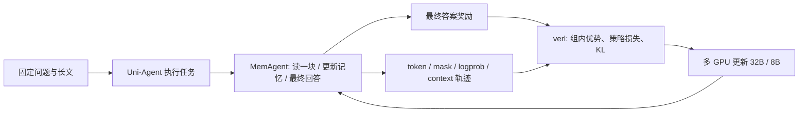

# 这次跑了什么：给第一次接触 Agentic RL 的读者

本次主实验用 **Uni-Agent + verl，在一台 8 卡 AMD ROCm 节点上分别训练 Qwen3-32B 与 Qwen3-8B dense**。任务是长文分块阅读：Agent 反复读取文档、更新有限长度的记忆，最后回答问题；强化学习根据最终答案的奖励更新模型全部参数。两种模型均已完成 128 个训练步、真实断点恢复与固定独立题集的训练前后比较。

## 一个问题怎样成为训练数据

例如，问题询问一位演员曾担任什么政府职务。文档里既有演员与电影的关系，也有多段生平资料和大量无关信息。Agent 每次接收约 5,000 token 的文档块，结合上一轮记忆，生成最多 1,024 token 的新记忆。下一块到来后重复这一过程；读完全部文档后，再用最终记忆生成最多 1,024 token 的答案。

训练有两个直接可观察的难点：关键事实可能在后续压缩中被丢掉；正确事实也可能因为最终答案表达、选择范围或格式而得不到高分。因此，本次既检查最终分数，也保留逐块输入、记忆和答案。相应案例见 [32B 长文失败轨迹](../02-memagent-long-context/details/32b-memory-case-study.md) 和 [成功轨迹](../02-memagent-long-context/details/32b-memory-success-case.md)。这些案例使用训练前模型，不能当作 RL 收益。

同一道训练题采样 4 次完整执行。如果 4 次的最终奖励不同，组内相对奖励可产生任务学习信号。当前使用 GRPO 类目标，优势不除以组内标准差；其直观形式是：

`某次执行的优势 = 该次奖励 − 同题组内平均奖励`

最终奖励会分配给该次执行产生的多个记忆/答案 context。训练器利用保存的 token、mask、采样 logprob 和新的模型 logprob 计算策略损失，再加上 KL 正则更新参数。这种奖励分配比较粗：一次答对，并不能自动定位到究竟是哪一轮记忆改写做对了。本次对上游多 context 加权语义也做了单独审计，见 [上游问题与本机对照](methods/memagent-upstream-alignment.md)。

如果 4 次奖励完全一样，组内任务优势为零；此时有参数变化也可能主要来自 KL 正则等因素。报告分别列出 global step、Adam 更新、非零任务优势和验证效果，避免混为一个“学到了”的指标。

## 两个框架各自做什么

**Uni-Agent** 组织 Agent 循环、任务、模型调用、奖励和轨迹采集。对于代码修复任务，它还连接 Docker sandbox；对于 Claude Code 等黑盒 CLI，它通过 Gateway 代理模型请求并采集轨迹。

**verl** 承担分布式训练、旧/参考策略 logprob、优势与损失计算、优化器更新、rollout 参数同步、检查点和恢复。本次采用 separate_async：4 卡负责 FSDP2 训练，另外 2 卡运行 TP2 rollout；余下 2 卡安排独立评测。可点击查看 [完整离线架构页](training-explorer.html)。

## “128 步”和“多轮 Agent”是两个计数

| 计数 | 本次含义 |
| --- | --- |
| 128 global steps | 训练器消费 128 个问题批次 |
| 每批 4 道题 | 完整训练覆盖固定的 512 道题一次 |
| 每题采样 4 次 | 每个模型实际共 2,048 次完整 Agent 执行 |
| 一次 Agent 执行 | 多次读文档/压缩记忆，最后回答；模型调用数取决于文档块数 |
| 一次 Adam 更新 | 训练器内部 optimizer step；其数量与 global step 不相同，按实际状态记录 |

长文通过分块记忆处理。即使源文档累计接近百万 token，也不表示模型在一次注意力计算里直接接收百万 token。

## 怎样判断有没有效果

训练题为 512 道；另外固定 64 道 monitor 题在 0/32/64/96/128 步观察过程，再留出 64 道 external 题用于预定的最终 step128 对照。不会根据 monitor 最好分数选择另一个 checkpoint。

主指标使用固定上游实现的最终 boxed 答案 token LCS，范围 0–1；LCS=1 也按这个实现定义。它对答案格式、标点、词形和答案覆盖范围敏感，所以平均分上涨不能全部解释为知识或推理能力上涨。每题前后答案、升降分、窄范围格式诊断和改进/回退案例均已保留。

在当前 ROCm/vLLM 环境中，默认 greedy 推理的重复运行也出现了差异。原定主评测协议保留，另行预注册 `VLLM_BATCH_INVARIANT=1` 的稳定辅助协议，分别做完整 base/final 和重复评测。两个协议的分数各自配对，详见 [重复性诊断](../03-memagent-32b-rl/details/32b-base-repeat-diagnostic.md) 和 [稳定协议最终结果](../03-memagent-32b-rl/REPORT.md)。

## 另外跑过的 30B 级案例

**Qwen3-Coder-30B-A3B-Instruct** 接 ReAct、真实 Claude Code CLI 和 Mini-SWE 做代码修复，并在 Docker 中运行 verifier。它是 MoE 模型，与完成 RL 训练的 dense Qwen3-32B 不同。这部分用于展示模型与 Agent 工具链的实际行为，这里记录的是原始模型的推理实验。

同一批六题中，ReAct / Claude Code / Mini-SWE 分别有 4 / 3 / 2 题通过修复判题；还单独统计是否正常结束。另一个预先固定、完成环境正负对照的扩展集有 29 题，ReAct 修复通过 8 题。它们是本机诊断子集，不代表官方完整 SWE-bench 分数。详见 [大模型案例审计](../05-swe-code-agents/details/coder30b-case-audit.md) 和 [扩展集案例](../05-swe-code-agents/details/swe-expanded-case-study.md)。

Miles 则作为第二条技术路线，补充验证了真实更新、断点恢复和 Python 工具执行；规模和协议不同，单独记录在 [Miles 实验](../07-miles/REPORT.md)。

本说明介绍已完成实验的任务与方法。最终效果和限制见 [整体结果](RESULTS.md)，各实验的运行步骤从 [根 README](../README.md) 进入。
