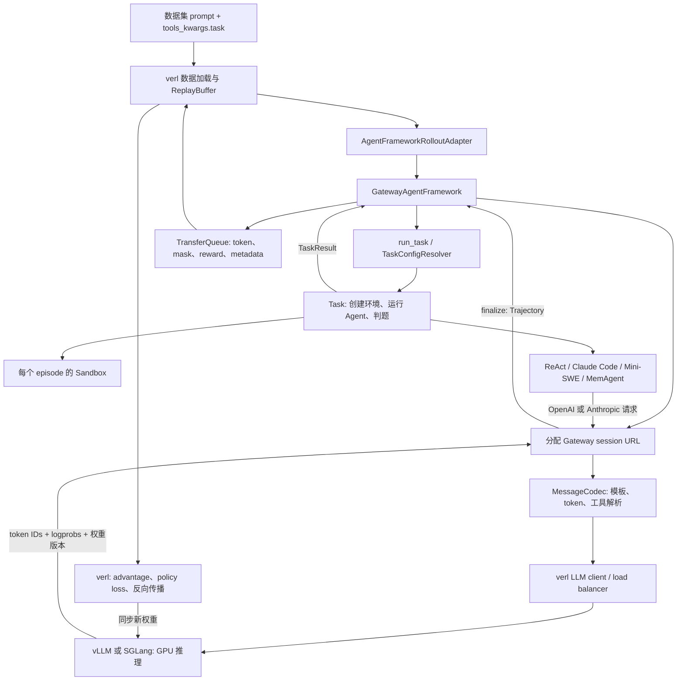

# Uni-Agent 架构与 agentic RL 入门

本文按本次实验固定的 **Uni-Agent `472c875a97f9a2764c81a6ec7581167632bd8bcc`** 解读源码；训练接口以它指定的 **verl `a9f2985159536a607211dcac730d3f5d55028950`** 为准。资料核对日期为 **2026-09-11 UTC**。这是源码与官方资料分析；本机是否运行成功、运行规模和耗时以实验汇总及日志为准，本文不预填实测结果。

## 1. 这里到底在训练什么

Uni-Agent 把“模型反复调用工具，操作环境，最后完成任务”产生的数据接到 verl 的强化学习训练器上。通常更新的是 **Qwen 等 policy 模型的权重**。ReAct 循环、Claude Code 程序、工具实现和判题脚本仍是运行环境的一部分。

例如修复一个 Python 项目：模型先读文件，再修改代码，执行测试，最后提交。Task 在独立环境中验证修改，得到 `reward=0` 或 `reward=1`。Gateway 保存模型真正生成的 token，以及生成时的 log probability；verl 利用 reward 计算 advantage，反向传播并更新 policy，再把新权重送给 rollout 引擎。

使用 Claude Code harness 时，这条链路训练的依然可以是本机 Qwen。Claude Code 负责对话和工具调度，模型服务由 Uni-Agent 注入。项目中的“黑盒”指框架不用接管 harness 的内部循环，**不表示可以训练闭源 Claude 模型，也不要求使用 Claude 模型**。

先区分六个常见名词：

| 名词 | 在本项目中的含义 | 容易误解的地方 |
| --- | --- | --- |
| Task / episode | 一份样本的一次完整求解与判题 | `finished=True` 仅表示 agent 正常结束，未必答对 |
| rollout | 用当前或近期 policy 采样一次求解过程 | 调用一次模型通常只是 rollout 的一轮 |
| session | Gateway 对一次 agent 运行分配的请求与轨迹容器 | 多个子请求、分支可能属于同一 session |
| trajectory | 可以提交给训练器的一条 token 序列 | 一个 session 可能最终产出多条 trajectory |
| reward | 环境判题产生的结果信号 | Agent 自己说“测试通过”不等于 verifier 通过 |
| GRPO group | 同一个 prompt 的多次采样结果，用于计算相对优势 | 至少要有多次采样；同组 reward 全相同往往缺少区分信号 |

对 GRPO 可先这样理解：同一道题采样若干解法，比较各自 reward，鼓励优于组内基线的模型输出。严格的 loss、归一化、importance sampling 和 KL 由 verl 配置决定。Uni-Agent 的主要价值是把复杂 agent 的交互、隔离环境和训练轨迹接好；它本身不重新实现整套优化器。

## 2. 从数据到参数更新



图中的推理引擎实际生成 token；Gateway 处理协议、session 状态和轨迹。Task/Sandbox 的 CPU 工作与 GPU 推理服务是不同部分。开 8 张卡不会自动让仓库测试、镜像拉取和容器启动也快 8 倍。

主要入口是 [framework/entry.py](https://github.com/verl-project/uni-agent/blob/472c875a97f9a2764c81a6ec7581167632bd8bcc/uni_agent/framework/entry.py#L108) 的 `AgentFrameworkRolloutAdapter`，通过 `actor_rollout_ref.rollout.agent.agent_loop_manager_class` 挂入 verl。它创建 Gateway actor 池和 Framework worker；Framework 的 `generate_sequences()` 将结果写进 TransferQueue。训练器异步消费结果，普通调用不返回传统的整批 rollout tensor。[官方固定版本源码](https://github.com/verl-project/uni-agent/blob/472c875a97f9a2764c81a6ec7581167632bd8bcc/uni_agent/framework/entry.py)

## 3. Agent、Tool、Task、Sandbox 的职责

| 层 | 负责什么 | 主要接口与源码 |
| --- | --- | --- |
| Agent | 如何解题：模型调用、工具循环，或启动外部 harness | `Agent.run(sandbox, messages, workdir)` → `AgentResult`；[agents/base.py](https://github.com/verl-project/uni-agent/blob/472c875a97f9a2764c81a6ec7581167632bd8bcc/uni_agent/agents/base.py#L91) |
| Tool | 一个模型可调用的动作与参数 schema | `Tool.run()` → `ToolResult`；[tools/base.py](https://github.com/verl-project/uni-agent/blob/472c875a97f9a2764c81a6ec7581167632bd8bcc/uni_agent/tools/base.py#L133) |
| Toolbox | 将一组工具绑定到同一个 sandbox，管理持久状态和生命周期 | `schemas()`、`call()`、`entered()`；[tools/base.py](https://github.com/verl-project/uni-agent/blob/472c875a97f9a2764c81a6ec7581167632bd8bcc/uni_agent/tools/base.py#L233) |
| Task | 一次 episode 的全生命周期、样本 metadata、最终判题 | `Task.run()` → `TaskResult`；[tasks/base.py](https://github.com/verl-project/uni-agent/blob/472c875a97f9a2764c81a6ec7581167632bd8bcc/uni_agent/tasks/base.py#L118) |
| Sandbox | 执行命令、读写文件、上传下载及环境启动/销毁 | `exec()`、`read_file()`、`write_file()`；[sandbox/base.py](https://github.com/verl-project/uni-agent/blob/472c875a97f9a2764c81a6ec7581167632bd8bcc/uni_agent/sandbox/base.py) |

Task 拥有 sandbox 生命周期：启动 → agent 操作 → verifier 判题 → 返回结果 → 清理。Agent 和 Tool 收到的 sandbox 已经启动，它们不应自行销毁环境。工具的 Python 代码运行在 agent worker 侧，shell 命令和被编辑文件位于 sandbox 内。

配置按 registry 分发，具体实现惰性导入，因此不用安装所有云供应商 SDK。固定版本已经注册：

| 类型 | 内置实现 |
| --- | --- |
| Agent | `react`、`claude_code`、`mini_swe_agent`、`mem_agent` |
| Task | `swe_bench`、`swe_bench_multilingual`、`swe_rebench`、`terminal_bench`、`hotpotqa`、`harbor` |
| Sandbox | `local`、`docker`、`modal`、`vefaas`、`openyuanrong` |

注册表分别在 [agents/registry.py](https://github.com/verl-project/uni-agent/blob/472c875a97f9a2764c81a6ec7581167632bd8bcc/uni_agent/agents/registry.py)、[tasks/registry.py](https://github.com/verl-project/uni-agent/blob/472c875a97f9a2764c81a6ec7581167632bd8bcc/uni_agent/tasks/registry.py)、[sandbox/registry.py](https://github.com/verl-project/uni-agent/blob/472c875a97f9a2764c81a6ec7581167632bd8bcc/uni_agent/sandbox/registry.py)。Harbor 是可接入的任务格式与运行体系，不是一个模型或 agent 名称。

### 数据与配置的合并顺序

每行训练数据的关键结构是：

```python
{
    "prompt": [{"role": "user", "content": "原始问题"}],
    "extra_info": {
        "tools_kwargs": {
            "task": {
                "name": "swe_bench",
                "sandbox": {"image": "该题的基础镜像"},
                "metadata": {"problem_statement": "原始问题", "...": "判题字段"},
            }
        }
    },
}
```

顺序为 **运行级 Task YAML → 数据行 task 覆盖 → 运行时模型端点注入**。字典深度合并，列表和标量整项覆盖；有两项重要例外：recipe 文件的 `prompt_template` 保持权威，数据行不能偷偷替换它；顶层 `prompt` 是来源消息，覆盖旧数据里可能残留的 `task.prompt`。最后注入的 `base_url`、API key 和 served model name 不允许样本覆盖。

Recipe 可以用 metadata 渲染 ReAct 或 Claude Code 的不同提示词，所以同一数据集可以比较多个 harness。当前模板只支持文本；源码中的多模态消息透传不等于模板支持多模态。verl 的初始长度过滤发生在模板展开前，应给最终 agent 请求预留系统提示词、工具 schema 和历史观察的空间。

实现见 [tasks/config.py](https://github.com/verl-project/uni-agent/blob/472c875a97f9a2764c81a6ec7581167632bd8bcc/uni_agent/tasks/config.py)、[framework/task_runner.py](https://github.com/verl-project/uni-agent/blob/472c875a97f9a2764c81a6ec7581167632bd8bcc/uni_agent/framework/task_runner.py#L101)；语义说明见 [Task 文档](https://github.com/verl-project/uni-agent/blob/472c875a97f9a2764c81a6ec7581167632bd8bcc/docs/source/concepts/task-and-reward.md)。

## 4. 白盒 ReAct：最适合先理解调用链

[ReActAgent](https://github.com/verl-project/uni-agent/blob/472c875a97f9a2764c81a6ec7581167632bd8bcc/uni_agent/agents/react/agent.py#L52) 每轮执行：

1. 把消息和工具 schema 发给 OpenAI-compatible `/chat/completions`。
2. 将 assistant 输出记入 transcript。
3. 按返回顺序执行多个 tool call，把 observations 追加到 transcript。
4. 再次调用模型，直到模型给出无工具的普通答案、调用 `submit` / `finish`，或耗尽轮数、token、超时预算。

默认工具是 `str_replace_editor`、`stateful_shell`、`submit`。`stateful_shell` 对模型的函数名为 `shell`，它用持久 tmux 会话保留 cwd、环境变量和后台进程；编辑器的编辑历史在工具对象中，实际文件仍位于 sandbox。换 Task 时可以复用工具；换工具时不用重写判题逻辑。

注意 `finished=True` 对 ReAct 只代表正常停止条件，不保证产生有效补丁。其 `run()` 当前会捕获循环异常、保存部分 transcript，并返回 `finished=False`；所以应同时查看 `task.log`、`info.error`、reward 和最终轨迹，不能只看外层进程是否退出成功。基础设施异常在其他层还有各自传播规则。

## 5. 黑盒 Claude Code 与 Mini-SWE

### Claude Code 到本机模型有两条路径

```text
仅推理：Claude Code → 本机支持 Anthropic Messages 的 vLLM
训练：  Claude Code → Gateway /sessions/<id>/v1/messages → verl rollout engine
```

[ClaudeCodeAgent](https://github.com/verl-project/uni-agent/blob/472c875a97f9a2764c81a6ec7581167632bd8bcc/uni_agent/agents/claude_code/agent.py#L91) 在 sandbox 内启动真正的 `claude` CLI，使用一个非空 user prompt。环境变量中设置 `ANTHROPIC_BASE_URL`、`ANTHROPIC_MODEL`、`ANTHROPIC_AUTH_TOKEN`，通过 `--model` 指定请求模型名称。`base_url` 尾部的 `/v1` 会被移除，因为 Claude Code 会自行追加 `/v1/messages`。若配置的 key 是空值或 `EMPTY`，实现会生成随机占位 token，适用于无真实鉴权的本地服务。

默认关闭 WebFetch/WebSearch、Agent/Task 子 agent、AskUserQuestion 及 slash commands，控制 `max_turns` 和进程 `run_timeout`。CLI 退出码为 0 时 `AgentResult.finished=True`。这些默认值是实验 harness 配置，不是底层模型能力的限制。启用子 agent 后，同一个 Gateway session 可以有并发请求和多条 trajectory，训练选样与权重语义需要重新检查。

`_ensure_claude()` 优先复用 sandbox 已有 CLI，缺失时走 npm 或官方 native installer。自动安装默认跟随最新包或 stable，复现实验应把实际 CLI 版本记录并固定到任务镜像。新加入的 [Claude sidecar Dockerfile](https://github.com/verl-project/uni-agent/blob/472c875a97f9a2764c81a6ec7581167632bd8bcc/examples/claude_code/Dockerfile.claude-code-tool) 提供可预构建工具包；如何挂载仍取决于 sandbox provider，并非所有 provider 自动支持同一种 sidecar 配置。

两个常见配置陷阱：

- 在 Docker sandbox 中，`127.0.0.1` 默认指向该容器自己。必须让它能访问宿主或推理容器的 Gateway 地址；代理 URL 正确不等于网络可达。`task_runner` 的 `proxy_port` 反向隧道当前只适用于 OpenYuanRong，不能直接套到 Docker。
- ClaudeCodeAgent 的启动代码没有逐项把 `ModelConfig.temperature/top_p/max_total_tokens` 映射成 CLI 环境变量。通过 Gateway 时应检查 rollout/session 的采样默认值和总容量；直连模式更应以实际请求及后端日志确认限制是否生效。

官方还有 [Gateway debug launcher](https://github.com/verl-project/uni-agent/blob/472c875a97f9a2764c81a6ec7581167632bd8bcc/examples/gateway/README.md)：可以接 fake backend 或本机 `/v1/completions` 后端，运行 Claude 单次 smoke，并在 finalize 后写 `trajectories.jsonl` 与 `debug_snapshot.json`。真实后端必须返回原始 `token_ids`，不能用生成文本重新分词冒充。该 launcher 不需要完整训练器，但也不会完成 policy update；仅回复 `OK` 只验证连接和轨迹输出，复杂工具流程要另外测。

### Mini-SWE 是另一种外部 harness

[MiniSweAgentAgent](https://github.com/verl-project/uni-agent/blob/472c875a97f9a2764c81a6ec7581167632bd8bcc/uni_agent/agents/mini_swe_agent/agent.py#L109) 将 task 与 Gateway URL 编码后通过 stdin 传进 sandbox 中的 `run_agent.py`；后者创建 Mini-SWE 的 `LocalEnvironment`、`LitellmModel` 与 `DefaultAgent`。这里的 `LocalEnvironment` 位于任务 sandbox 内，不代表它在物理宿主机直接运行。

返回 `exit_status="Submitted"` 才视为正常完成。工具镜像固定了 `mini-swe-agent==2.2.8` 和 `litellm==1.81.7`，参见 [Dockerfile](https://github.com/verl-project/uni-agent/blob/472c875a97f9a2764c81a6ec7581167632bd8bcc/examples/mini_swe_agent/Dockerfile.mini-swe-agent-tool)。当前 wrapper 使用 `model_name="openai/default"`，适合由 Gateway 决定实际 policy；若直连严格校验模型名的推理服务，需要匹配其 served alias 或调整 wrapper。Mini-SWE 已有实现，概念文档中仍出现“planned integration”是文档落后于源码。

## 6. 聊天记录为何还不是 RL trajectory

只有文字 transcript，不足以可靠计算 policy loss。训练必须知道哪些 token 真由模型生成、哪些是工具返回，生成时对应何种 policy，以及 log probability 是否与 token 对齐。

[Trajectory](https://github.com/verl-project/uni-agent/blob/472c875a97f9a2764c81a6ec7581167632bd8bcc/uni_agent/gateway/session/types.py#L40) 的关键字段是：

| 字段 | 含义 |
| --- | --- |
| `prompt_ids` | 首个模型请求的初始上下文 token |
| `response_ids` | 后续模型生成 token 与轮间新增上下文 token 的连续序列 |
| `response_mask` | 生成 token 为 1；工具结果和其他外部新增上下文为 0 |
| `response_logprobs` | 与 response IDs 对齐的 rollout log probability；不要求时可以缺省 |
| `finished`、`reward_score` | 由 Framework 在 runner 结束后附加的 episode 事实和 scalar reward |
| `extra_fields` | 物化原因、跨越的最早/最新权重版本等信息 |

例如 `assistant 调用 shell → tool 返回测试日志 → assistant 修改结论`，三个片段都进入下一轮上下文；只有两个 assistant 片段参与 policy token loss。mask 不是删掉工具日志：这些日志仍影响模型下一轮条件分布。

固定 commit 当天新增了 Continuous Token 编码。`MessageCodec` 调用 verl 的 `continuous_token_wiring` 保持跨轮 token stream，并对齐 mask / logprobs。源码要求初始 prompt 不被合并过程改写；当后端被要求返回 logprobs 却没返回，或长度不匹配时会报错。[codec.py](https://github.com/verl-project/uni-agent/blob/472c875a97f9a2764c81a6ec7581167632bd8bcc/uni_agent/gateway/session/codec.py#L200)、[session.py](https://github.com/verl-project/uni-agent/blob/472c875a97f9a2764c81a6ec7581167632bd8bcc/uni_agent/gateway/session/session.py#L224)

会话最终的处理顺序是：

```text
runner 完成 → Gateway finalize → trajectory_selection(all/longest)
→ 附加 runner 结果 → 可选 trajectory postprocessor
→ reward scoring → 轨迹落盘 → TransferQueue
```

`longest` 根据 **模型生成 token 数**选一条，既不是 reward 最大，也不是所有上下文 token 最多。Claude 官方 recipe 使用它减少多分支带来的训练复杂性。`all` 会保留多条；目前存在公开的 session loss 权重讨论，见 project-status.md。

Framework 写入 TQ 时构造 `input_ids`、attention / position IDs、loss mask，并把 scalar reward 放到 `rm_scores` 的最后一个 response 位置。训练器将 episode 信号传播到可训练输出。该机制不是 step-level process reward；当前 TaskResult/RewardLoop 集成没有通用的逐步骤 reward 输出契约。[framework.py](https://github.com/verl-project/uni-agent/blob/472c875a97f9a2764c81a6ec7581167632bd8bcc/uni_agent/framework/framework.py#L1129)

当 `mask_unfinished_episode=True` 且 `finished=False`，Framework 把 TQ 中该 trajectory 的训练 mask 清零，但保留 reward；GRPO 组内均值/方差仍可能受其 reward 影响。它也仍可能消耗模型前后向计算。`finished=None` 表示 agent 未报告结束状态，依旧可训练。这个配置与“删掉失败样本”不是一回事。

### Reward 的两层契约

SWE Task 执行独立 verifier，将 `resolved` 转成 scalar reward，`accuracy` 变成 validation `acc`，`extra_info` 保存判题细节。可选的 streaming RewardLoopWorker 还能读取 `runner_reward_info`，结合 trajectory 再计算最终分数。这里的 `TaskResult.extra_info` 是 scorer 输入，不能把它当作自动聚合的 validation metrics。

不使用 streaming handles 的 colocated TQ reward pass 有自己的后处理路径，会替换 `rm_scores`；它不能自动接收 runner 的完整判题上下文，某些 scorer metrics 也不会进入当前 validation 聚合。若要叠加模型分数和任务判题，要明确选择正确的 reward 拓扑，不能仅配置两个 reward 后假设它们会相加。[官方 Reward Flow](https://github.com/verl-project/uni-agent/blob/472c875a97f9a2764c81a6ec7581167632bd8bcc/docs/source/concepts/gateway-and-trajectories.md#reward-flow)

## 7. Colocate async、Separate async 与 partial rollout

固定版训练脚本使用 verl V1 入口 `python -m verl.trainer.main_ppo`。官方文章中的 “fully async” 是执行方式的总称；当下 V1 配置名应分清 `colocate_async` 和 `separate_async`，旧 experimental fully-async 脚本的参数不能逐项照搬。

| 模式 | GPU 如何分工 | 适合本机实验的理解 |
| --- | --- | --- |
| `sync` | rollout 与训练按整批同步推进 | 容易理解，但长短 episode 会造成等待 |
| `colocate_async` | 相同 GPU 池交替推理与训练，切换时 rollout sleep / resume | 单节点可把容量集中起来；推理和训练不是在相同卡上任意同时常驻 |
| `separate_async` | 独立 rollout 池持续生成，另一组 GPU 训练 | 单节点也可拆 4+4，获得并行；要处理权重同步与 policy lag |

两种 async 模式都使用 TransferQueue、ReplayBufferAsync 和支持 partial rollout 的 client。模型请求在切换时被中止后，已生成 token/logprobs 被保留，剩余生成可在新权重下继续。这能减少长 episode 被等待或丢弃，但同条 trajectory 可能跨多个权重版本，还要重建前缀 KV。监控 `trajectory_spans` 与 staleness 比只看平均 tokens/s 更能反映训练数据质量。

`separate_async` 有一个明确约束：

```text
data.train_batch_size
  = trainer.v1.separate_async.parameter_sync_step
  × actor_rollout_ref.actor.ppo_mini_batch_size
```

例如 prompt batch=64、mini batch=16，就应每 4 个 mini batch 同步一次。权重同步不能使用 `naive` backend；具体 ROCm 后端是否可用要由本机实验验证。可选的 hybrid GPU lending/switching 属于额外实验功能，先平衡独立资源池再考虑。

本仓库 [train_qwen3_moe.sh](https://github.com/verl-project/uni-agent/blob/472c875a97f9a2764c81a6ec7581167632bd8bcc/examples/quickstart/training/train_qwen3_moe.sh#L79) 和 dense 脚本目前默认 `colocate_async`；[MemAgent recipe](https://github.com/verl-project/uni-agent/blob/472c875a97f9a2764c81a6ec7581167632bd8bcc/examples/mem_agent/README.md) 已提供单节点 4 train + 4 rollout 的 FSDP2 路径。以上运行语义依据 [verl 固定版 V1 文档](https://github.com/verl-project/verl/blob/a9f2985159536a607211dcac730d3f5d55028950/docs/advance/v1_async_trainer.md)，不是本机性能结果。

## 8. Docker 在这套系统里的两种角色

第一种是学习环境容器：包含 ROCm PyTorch、vLLM、verl、Uni-Agent、Ray 和训练依赖，需要访问 GPU。第二种是每道题的 sandbox 容器：包含待修项目、测试依赖及 agent 工具，通常主要消耗 CPU、内存和磁盘，**不需要把 GPU 设备传进去**。

DockerSandbox 使用 `docker run --rm -d` 创建每个 episode 的容器，`docker exec` 执行命令，`docker cp` 传文件。调用哪个 daemon 由执行环境决定；在学习容器里使用 Docker CLI 管理宿主或独立 daemon 的任务容器，并不要求再启动一整套 Docker-in-Docker。数据卷路径应按 daemon 所在侧解释。

固定版已经有 `pull_timeout`、`start_timeout`、`pull_policy`、`run_args` 配置。它的 `from_config()` 只把 `image` 与 `sandbox_kwargs` 传给实现，因此不能想当然认为通用 `runtime_timeout` 会变成 Docker daemon 的自动 TTL；正常清理依赖 Task 的 context manager，具体命令还有自己的 timeout。[DockerSandbox](https://github.com/verl-project/uni-agent/blob/472c875a97f9a2764c81a6ec7581167632bd8bcc/uni_agent/sandbox/docker.py#L24)

在 8 卡单节点上，优先从少量并发、少量真实题、短 context 开始。SWE 镜像体积、CPU verifier 和 task 并发往往比权重更早形成限制。扩容时先分开观察 GPU 生成时间、sandbox 启动时间、工具调用时间和判题时间。

## 9. 性能与调试入口

`agent_aware_router` 在固定版本当天并入。它位于 verl LLM server manager 的负载均衡层，优先把同一 session 后续请求留在原 replica 以复用 KV cache；只有过载时才重新选副本。slow path 同时考虑剩余 KV 容量和前缀命中带来的重计算量。它读取 vLLM metrics / KV events，因此是有后端依赖的可选优化，不是跑通 Agent/Task 的前置条件。[官方设计](https://github.com/verl-project/uni-agent/blob/472c875a97f9a2764c81a6ec7581167632bd8bcc/docs/source/concepts/agent-aware-router.md)

每个真实运行至少保留：

- 模型及 tokenizer revision、Uni-Agent/verl commit、CLI/镜像版本、完整启动配置。
- 数据样本 ID、Task YAML、sandbox 镜像 digest、oracle / verifier 结果。
- `framework.log`、`task.log`、`trajectory.json` 和 `trajectory.npz`；debug launcher 另有 JSONL/snapshot 格式。
- reward、finished、轮数、模型 token 数、训练 mask 非零数、logprobs 对齐情况。
- 若进行 RL：global step、policy loss、grad norm、优化器/权重更新证据与 checkpoint；若评估收益，还需独立验证集和 base 对照。

排错可沿边界逐级定位：sandbox 能执行命令 → oracle 能正确判题 → 模型协议和 tool parser 正确 → agent 有实际工具动作 → Gateway 有完整 token 轨迹 → reward/mask 进入 TQ → trainer 真正更新参数。每通过一级，只证明该级对应的能力；两步训练成功仍不证明 SWE 能力已经提升。

推荐的源码阅读顺序是：`tasks/swe_bench/task.py` → `agents/react/agent.py` → `framework/task_runner.py` → `framework/entry.py` → `gateway/session/types.py` → `gateway/session/session.py` → `framework/framework.py`。先看一条 episode，再看并发和优化，更容易把每个日志对应回实际组件。

本机实跑的逐步讲解见 [rl-training-walkthrough.md](rl-training-walkthrough.md)：其中解释了 `num_turns` 是 Gateway chat 角色计数、并非模型调用次数；MemAgent 每个 chunk 使用独立 context trajectory，训练应保留 `trajectory_selection=all`。
