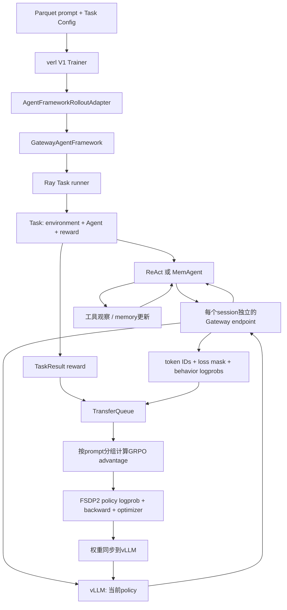

# 从这台机器上的实跑理解 agentic RL

这份文件按本机真实代码路径解释训练，具体结果见 `rl-engineering-log.md` 与各run的 `analysis.json`。

## 先把三个“成功”分开

1. **运行成功**：Agent没有让框架抛异常，完成了一个session。日志里的 `num_success_sessions=32` 只表示流水线完成，不等于答对32题。
2. **发生学习**：loss/gradient真正参与优化，checkpoint里的参数数值改变。只看“step=2”或checkpoint文件存在不够；本次第一个pilot跑完2步但梯度和参数变化全0。
3. **能力提高**：固定heldout集、相同推理参数的前后比较提高。本次更大的学习率确实更新了参数，却导致工具调用能力退化。因此要分别检查运行、更新、评估。

## 一次训练batch怎么走

`scripts/rl_record_task.py`只扩展任务和工具；训练仍使用上游框架。MemAgent路线则直接使用官方 `examples.mem_agent.dataset.HotpotQAMemAgentDataset`、`HotpotQATask` 和 `MemAgent`。

## 模型究竟在学哪些token

Agent产生工具调用是模型动作，参与policy loss。工具返回的真实记录是环境观察，进入下一次模型上下文，但其 `response_mask=0`，不要求模型通过语言建模去生成环境内容。

Gateway是token轨迹的真值来源：保留实际generation token ID和rollout logprob，避免先读API文本、再重新tokenize猜测原序列。原生 `trajectory.npz` 保存这些数组，`rl_decode_trajectories.py`可以将少量轨迹解码成可读文件。

`num_turns`是Gateway自身的chat-turn计数，不能直接当成Agent模型调用次数。本实验分析额外从任务日志统计实际ReAct STEP / MemAgent context prompt数量。

## 为什么reward都一样时GRPO没有梯度

每个问题采样4个独立session。假设reward是 `[1, 1, 0.2, 0.2]`，组内均值为0.6；正确轨迹得到正advantage，错误轨迹得到负advantage。GRPO用这些advantage调整对应生成token的概率。

如果reward是 `[0.15, 0.15, 0.15, 0.15]`，所有轨迹相对组均值都是0。即使GPU执行了forward/backward并保存checkpoint，policy梯度也可能严格为0。这正是本次finish-only pilot发生的情况：模型会读取工具并直接回答，但验奖协议只允许finish调用，所有样本落到相同过程分。

因此新任务开始时，先抽样查看reward分布、组内reward差异、正确/错误轨迹，再开长训练。不要通过与正确性无关的随机奖励人为制造方差。

## 三种训练布局

| 布局 | 本机配置 | 行为 |
|---|---|---|
| `sync` | 4张卡上FSDP2 + 4个TP1 vLLM replica | 一批Agent结束、计算reward、更新policy、同步权重，再开始下一批 |
| `colocate_async` | 同样4张卡，Agent流水线可预取 | 同一批GPU在训练/rollout阶段切换；需要观察轨迹跨policy版本和staleness |
| `separate_async` | MemAgent为2 trainer +2 standalone rollout | 推理池与训练池分开，通过NCCL/RCCL同步；官方实现仍初始化trainer侧hybrid replica以支持切换 |

colocate的“4训练卡+4推理replica”是共用4张物理卡，不能加成8卡。MI355仍通过PyTorch `torch.cuda` API运行，通信API名称 `nccl` 在这里对应AMD RCCL。

## MemAgent与ReAct的区别

ReAct保留对话历史，模型决定调用哪个工具，观察结果后继续。MemAgent先把长文切成token chunks，每个chunk开启新的模型上下文，输入“问题+上次memory+本chunk”，输出新的短memory，最后只用memory回答问题。

这意味着一个MemAgent session会产生多个独立context trajectory。官方训练配置必须 `trajectory_selection=all`，最终问题reward广播到所有memory segment；只保留`longest`会丢掉其余memory更新的训练样本。

固定的verl代码还有一层关键处理：`verl/trainer/ppo/v1/utils.py::compute_advantage_for_multi_trajectories` 先按 `{uid}_{session_id}` 只取最后context来计算GRPO，再将结果广播回该session各context。因此4个rollout各有7段memory时，组内advantage仍基于4个session的最终答案，不会把28段memory当成28个独立试验。验证指标也按每个session最后context聚合；直接平均全部context行可能改变各问题的权重。

Trainer的global step也不等于Adam更新次数。它将 `ppo_mini_batch_size * rollout.n` 作为context mini-batch大小，长文episode展开后通常需要多个mini-batch。4步MemAgent smoke的checkpoint optimizer state中，398个参数状态的 `step` 都为28。异步 `agent_logs/step_N` 是生成时标签，还可能含未消费的预取；真正消费数量以 `rollout/N.jsonl` 为准。

学习率scheduler的计数又不同：V1 engine worker只在一次`train_mini_batch`的最后一个iteration调用scheduler，因此本路线warmup按global step计，而Adam可能在这一步内更新约7次。32步MemAgent实测Adam step224。若训练在验证阶段失败，注意上游先保存checkpoint、再验证、最后写metrics/rollout；此时checkpoint可能比日志多完成一步，不能仅按最大日志step判断是否发生优化。

官方HotpotQA奖励是最后 `\\boxed{...}` 答案的token-level LCS ratio，可能是0.5等分数。尽管日志字段叫`acc`，这里也不能直接解释成二元exact match准确率。

## 本机复现时最有用的检查顺序

1. 确认镜像内 `torch.version.hip`、逐张GPU实际tensor运算；不能只信device_count。
2. 固定Uni-Agent与其verl子模块commit，再记录镜像digest/额外venv包。
3. 用小batch跑整个Agent闭环，打开一个task.log和trajectory.npz确认工具观察真的影响后续回答。
4. 检查reward oracle、组内方差、非零gradient和base/checkpoint参数差异。
5. 固定heldout与greedy参数，保存step0基线，随后再延长训练。
6. 看到能力下降时保留失败曲线。降低学习率/加KL是可以测试的假设，不能在结果前宣称解决了问题。

本次具体依赖兼容点（ROCm可见卡变量、vLLM tied embedding与分桶）和完整命令见工程记录。
