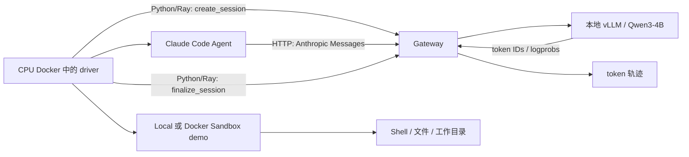

# 01 · CPU、Sandbox 与 Gateway 接通实验

本实验验证 Uni-Agent 的基础组件能否工作：先跑 CPU 测试和命令/文件沙箱，再让真实 Claude Code 通过 Gateway 调用本地 Qwen。
实际结果是 **685 个 CPU 测试通过，Local/Docker Sandbox demo 通过，Claude Code → Gateway → Qwen3-4B 的最小请求通过**。
这里的 Claude Code 是 Agent 客户端；生成回复的是本地 Qwen，不是 Anthropic 托管模型。

## 实验要回答什么

1. Task、Agent、Gateway 与 Sandbox 的依赖能否在隔离 Docker 环境中导入和运行？
2. Agent 能否执行命令、修改文件，并在多次调用之间保留需要的状态？
3. 黑盒 Agent 的模型请求能否被 Gateway 接收，并转成可取回的 token 轨迹？

这些检查是后续任务评测和 RL 的基础，还没有执行策略参数更新。

## 实验链路

CPU driver 和执行任务的 Docker Sandbox 是不同角色。真实 Qwen 请求另需 GPU 推理服务；CPU 单测和 fake backend 验证不依赖模型 GPU。
Gateway 的 HTTP 业务路由只有 `/sessions/{id}/v1/chat/completions` 和 `/sessions/{id}/v1/messages`。
创建、结束和中止 session 使用 Python/Ray 方法，具体接口见 [Gateway 清单](details/gateway-api-map.md)。

## 已得到的结果

| 检查 | 真实结果 | 如何理解 |
| --- | --- | --- |
| 官方 CPU level0 | 685 passed，12 deselected | 显式排除了一个引用旧目录的 deployment 测试 |
| Local Sandbox demo | sum=7、编辑后 product=8；文件与工作目录检查通过 | 在 CPU 容器内验证基础执行语义 |
| Docker Sandbox demo | 同样通过 | driver 与任务执行环境分为不同容器 |
| Claude Code → fake backend | 输出 OK，exit=0，1 条轨迹 | 验证 CLI 与 Gateway 协议接通 |
| Claude Code → Qwen，仅设 response_length | 失败，HTTP 400，0 条轨迹 | 客户端请求 32000 tokens，超过 16K 服务预算 |
| 同时设置 prompt_length 与 response_length | 输出 OK，exit=0，1 条轨迹 | 真实模型调用，prompt=1102、response=2 tokens |

测试数对应原实验；后来空目录重建验证了核心导入和依赖，没有把这 685 个测试重新跑一遍。

## 怎样复现

1. 先读 [公共准备](../00-overview/SETUP.md)，准备 Docker 与固定源码版本；CPU 容器不映射 GPU。
2. 按 [REPORT.md](REPORT.md) 中的环境说明准备依赖，再运行 `cpu and level0` 测试；保留过期测试的排除说明。
3. 先验证 Local Sandbox，再验证独立 Docker Sandbox；检查命令退出码、文件内容及跨调用工作目录。
4. 运行 Gateway 的 fake backend case，确认真实 CLI 退出成功且 finalize 返回轨迹。
5. 启动与 tokenizer 匹配的 Qwen/vLLM 服务，确认 `/health`、`/v1/models` 与上下文长度。
6. 运行真实 Claude Code 请求，同时设置 `prompt_length=12000`、`response_length=64`；两者合计应适配该服务预算。
7. 使用新的 session ID 和结果目录，记录回复、退出码、轨迹数与 token 长度，不覆盖历史结果。

具体原始命令在 [REPORT.md](REPORT.md)，依赖与启动顺序在 [复现审计](details/reproduction-audit.md)。
本目录保留说明、补丁与一个 Gateway helper，没有附带完整 driver、模型、依赖锁或镜像；报告中的历史 `scripts/...` 命令需要完整实验工程支持。
跨机器准备细节还可查 [完整离线手册](../00-overview/reproduction.html)。

## 代码与补丁

- [code/gateway_session.py](code/gateway_session.py)：在已有 `GatewayManager` 中执行 create → Task/Agent → finalize，异常时 abort。
- [code/README.md](code/README.md)：helper 的调用方式、返回值和依赖边界。
- [Docker stdin 补丁](patches/uni-agent-docker-stdin.patch)：通过 stdin 写入文件，避免把文件内容放进命令行参数而受长度限制。

helper 不会创建推理服务，也不写 TransferQueue 或更新参数；它用于理解完整工程中的 session 生命周期。
补丁应对照本实验固定 Uni-Agent commit 检查后应用，不应直接假定适用于最新上游。

## 建议阅读顺序

1. 本页：了解这组检查的目的和真实结果。
2. [REPORT.md](REPORT.md)：查看环境、失败原因和执行命令。
3. [Gateway 接口清单](details/gateway-api-map.md)：区分 HTTP 模型接口与 Python/Ray 管理接口。
4. [复现审计](details/reproduction-audit.md) 与 [公共架构](../00-overview/architecture.md)：了解依赖和后续任务怎样接入。
5. 最后阅读 `code/` 和补丁，结合真实接口追踪实现。

## 结论边界

最小 OK 回复证明协议和轨迹接通，没有证明模型能完成真实代码修复任务。
Sandbox demo 证明所测命令与文件行为，没有覆盖所有部署后端。
CPU 冷重建和 GPU 推理验收分别记录；固定源码、服务上下文预算与 Agent 请求参数需要一起核对。
