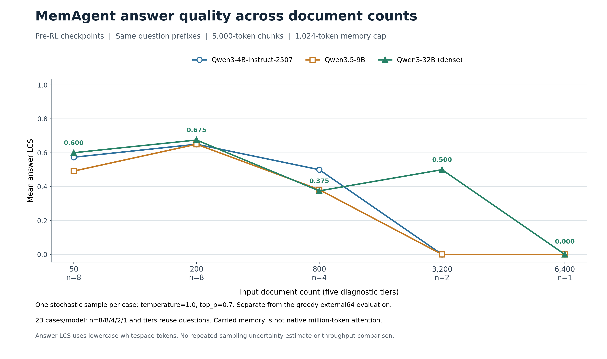
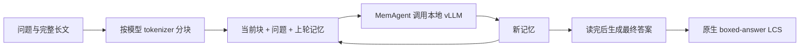

# 实验 02：MemAgent 长文推理与早期训练诊断

任务是让模型逐块阅读长文、更新记忆，最后回答 HotpotQA 问题。4B、9B、32B 原始模型分别完成了 23 个问题×长度组合；32B 在 3200 文档档位答对 1/2，6400 文档档位为 0/1。这个目录保存长文推理、记忆案例与早期 pilot，128 步最终 RL 结果见实验 03、04。

## 已经完成什么

| 文档数 | 每模型样本数 | 4B 平均 LCS | 9B 平均 LCS | 32B 平均 LCS |
| --- | ---: | ---: | ---: | ---: |
| 50 | 8 | 0.5734375 | 0.4916667 | 0.6000 |
| 200 | 8 | 0.6500 | 0.6500 | 0.6750 |
| 800 | 4 | 0.5000 | 0.3821429 | 0.3750 |
| 3200 | 2 | 0 | 0 | 0.5000 |
| 6400 | 1 | 0 | 0 | 0 |

上表使用 Qwen3-4B-Instruct-2507、Qwen3.5-9B 与 Qwen3-32B 的原始下载权重。每个模型的 23 个组合复用了同一组 8 个底层问题的前缀，各长度的分母不同。

还保留了用于理解实现的证据：

- 32B 的 Animorphs 成功案例另跑一条完整轨迹：91 个原文块、92 次模型调用，最终 LCS=1。
- 32B 的 Shirley Temple 失败案例另跑 90 个原文块、91 次模型调用，最终 LCS=0；可观察答案证据如何被忽略或丢失。
- 早期独立 32B pilot 完成真实优化；抽样 9 个张量中，2.25087% 的元素变化在转换为 BF16 后仍可表示。这是更新证据，不是能力分数。

## 调用链是什么

每块最多约 5000 token，记忆与最终回答各最多 1024 token。读取下一块的顺序由代码控制，模型决定保留什么信息。memory 是上一轮完整响应字符串。

这组独立推理使用官方 MemAgent 推理入口与模型 API；它没有经过训练 Gateway 收集供 RL 使用的原始 token logprobs。早期 pilot 的训练路径需结合[共享架构](../00-overview/architecture.md)理解。

最长有效样本在 4B tokenizer 下为 907,670 个 source token，分为 182 块。这个长度是累计读取的原文长度，不是一次请求的注意力窗口。

## 如何复现

1. 先读[共享环境准备](../00-overview/SETUP.md)，准备 ROCm Docker、固定版本源码、本地推理服务与相应模型。
2. 按[本实验复现步骤](REPRODUCE.md)准备固定版本 HotpotQA 数据，确认 context 是真实文本；文件名中的 50/200/800/3200/6400 表示文档数。
3. 按上表固定样本数，核对模型名、tokenizer、服务窗口、5000-token 分块与 1024-token 输出预算。
4. 保持这组长文协议的 temperature=1、top_p=0.7，每个组合一次采样，输出到新的运行目录。
5. 保存最终回答、原生 reward、分块数、调用次数与耗时，逐档汇总；额外轨迹诊断另存，不替换原始评测结果。
6. 如要复核早期 pilot，先准备对应训练源码与保留的 checkpoint，再按数值审计说明比较 FP32/BF16；不要仅凭文件存在判断发生学习。

本目录提供步骤和阅读材料，完整实验脚本、模型与数据需另行准备；没有一个可从当前目录直接启动全部历史实验的脚本。

## 建议阅读顺序

| 入口 | 解决的问题 |
| --- | --- |
| [REPORT.md](REPORT.md) | 4B/9B 数据格式、运行设置和五档结果 |
| [REPRODUCE.md](REPRODUCE.md) | 长文推理的准备与执行步骤 |
| [4B 记忆案例](details/memagent-case-study.md) | 为什么材料读完了仍然答错 |
| [32B 失败案例](details/32b-memory-case-study.md) / [成功案例](details/32b-memory-success-case.md) | 信息保留与跨文档关联的具体过程 |
| [32B pilot 数值检查](details/large-memagent-effective-weight-deltas.md) / [早期小模型检查](details/effective-weight-deltas.md) | 保存值改变与 BF16 可见变化的区别 |
| [外部配对分析方法](details/large-memagent-analysis.md) | 如何检查完整题集、协议和逐题差异；其中也引用后续 128 步实验 |
| [figures/](figures) | 长文曲线、记忆示意和早期训练图 |

## 汇报时的边界

- `eval_12800.json` 的整数 context 不构成有效原文，早期误跑结果已经排除。
- 长文协议为单次随机采样，小样本且跨长度复用问题；不能当作模型排行榜或长度影响的严格因果实验。
- 两条额外 32B 轨迹用于解释案例，未替换原 23 个组合，也没有增加独立评测题数。
- 参数变化、Agent 成功结束、最终答对是三件事；早期零梯度或失败记录仍需分别解释。
- 本目录的 pilot、旧中断 run 和长文推理分数不能并入新主线的 128 步训练曲线。

需要看最终训练效果，转到[32B RL](../03-memagent-32b-rl/README.md)、[8B RL](../04-memagent-8b-rl/README.md)与[整体结果](../00-overview/RESULTS.md)。
