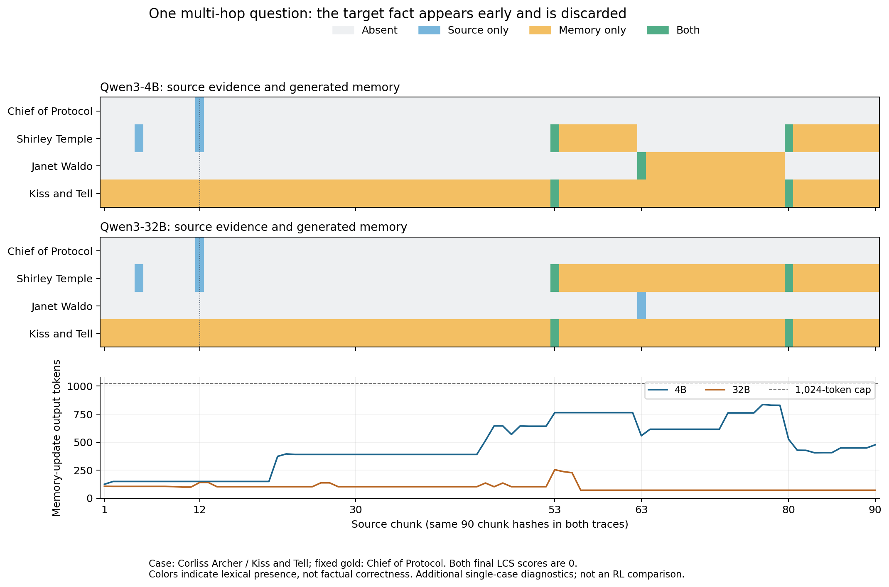

# 32B 逐块记忆案例：问题关联出现得比目标事实晚

32B的额外观察性轨迹完整运行了90个原文块和最终回答，共91次模型调用。题目询问电影《Kiss and Tell》中扮演Corliss Archer的女演员曾担任什么政府职务，固定数据答案是`Chief of Protocol`。这次额外轨迹最终LCS=0；原23条评测轨迹中、相同3200-docs输入的LCS也为0。两次单独执行分别保存，额外轨迹没有替换原评测分数。不同document长度下同题的分数不能混写：例如50-docs版本原始LCS为0.2。

同一道题此前的4B轨迹也保留着。重新分块并核验SHA256，确认两条轨迹的 **90份原文块完全相同**，可以逐块观察记忆选择。输入约45万token；它被分块处理，并未一次送入模型的attention。

五档长文及这些额外轨迹沿用 `temperature=1.0、top_p=0.7`。每条是单次随机采样；即使原文块完全相同，两条输出差异也不是重复试验后的稳定差异估计。这里与 external64 的 `temperature=0、top_p=1` greedy 协议分开，不用于替换训练前后对照结果。

| 位置 | 当前原文内容 | 32B 的记忆行为 |
| --- | --- | --- |
| 第 12 块 / Document 426 | Shirley Temple 词条列出驻 Ghana、Czechoslovakia 大使及 `Chief of Protocol` | 认为没有与题目关联的信息；没有保留 Shirley Temple 或 Chief of Protocol |
| 第 53 块 / Document 1845 | 《A Kiss for Corliss》由 Shirley Temple 主演，是《Kiss and Tell》的续集；此处未直接写原电影的角色演员 | 据续集线索认定 Shirley Temple；明确写“Based on general knowledge”补入两个大使职务 |
| 第 63 块 | Janet Waldo 的相关词条 | 没有像旧 4B 轨迹那样把 Janet Waldo 写入 memory |
| 第 80 块 / Document 2840 | 《Kiss and Tell》词条直接写 Shirley Temple 饰演 Corliss Archer | 已有演员关联被确认，但第 12 块的 Chief of Protocol 已不在 memory 中 |
| 最终回答 | 问题、最后的memory和答题指令，不含原文块 | 回答两个大使职务，并带入第54块memory扩写的年份；未输出固定gold |

第 12 块的原文确实包含：

> As an adult, she was named United States ambassador to Ghana and to Czechoslovakia and also served as Chief of Protocol of the United States.

当时模型的记忆写道，没有与问题相连的女演员及政府职务信息。第53块先给出续集主演线索，第80块才直接写明Shirley Temple在《Kiss and Tell》中饰演Corliss Archer；早期已丢弃的信息不会自动回来。这个例子揭示了顺序压缩对多跳检索的要求：尚未建立关联的事实可能在稍后才变得关键。

32B在这个案例中比4B更少混淆演员身份，但仍丢失了gold所需事实。这里也有标签覆盖边界：Document426本身同时列出两个大使职务和Chief of Protocol，固定答案却只有后者。LCS=0是这套任务的答案匹配结果，不能推导成其他职务不存在；也不能反过来把整段回答都认证为事实正确。第54块首次补入的任期年份`1966–1969`、`1974–1976`并不在这份职务原文证据中，之后被memory反复沿用。岗位名称的支持与附加年份的正确性需要分开看。本审计关注目标事实如何未被保留，不用一个案例裁定模型总体事实能力。

记忆长度也提供了线索。两者上限均为 1024 token，4B 的 memory 输出中位数为 405.5、最大 836，32B 为 **102、最大 254**。这两条轨迹都没有用满上限。第 12 块的丢失发生在信息选择阶段，不能仅用“memory 达到长度上限”解释；增加上限也不保证模型会保留尚未关联的事实。

图中的颜色是关键词存在性检查，不能自动验证句子事实正确。观察词是在每次生成之后匹配，不会注入 prompt。原始轨迹、源码片段重建及哈希核验分别见：

- 32B memory-updates.jsonl（原始文件：`results/memagent-trace/qwen32b-docs3200-sample0/memory-updates.jsonl`）
- 32B 结果与指标（原始文件：`results/memagent-trace/qwen32b-docs3200-sample0/summary.json`）
- 与原文逐块核验的摘录（原始文件：`results/memagent-trace/qwen32b-docs3200-sample0/evidence-excerpts.json`）
- 额外诊断的运行时来源（原始文件：`results/memagent-trace/qwen32b-runtime.json`）
- [旧 4B 案例](memagent-case-study.md)

这是模型规模变化下的单题行为诊断。正式 RL 效果仍以独立的 base / 128-step external64 配对评测为准。
