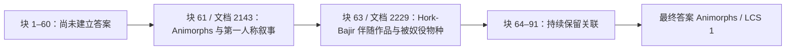

# 32B 成功长文案例：保留 Animorphs 与伴随作品的关联

固定长文评测的 3200 文档档位里，Qwen3-32B 在两题中答对一题；这题询问“一部以第一人称叙述、另有伴随作品讲述被奴役世界与外星物种的青少年科学奇幻系列”。固定答案是 **Animorphs**。

为了获得可讲解的内部过程，另外运行了一条观察性轨迹。它完整处理 91 个原文块、进行 92 次模型调用，最终再次输出 `\boxed{\text{Animorphs}}`，官方 LCS=1。这是已知成功案例的额外讲解材料，不替换原 23 个问题×长度 case 的结果。两次都使用原始下载模型，尚无本机 RL 更新；memory 生成为 temperature=1、top_p=0.7 的随机采样，不能从单题两次成功推出稳定成功率。

第 61 块的原文说明 Animorphs 是 young adult science fantasy series，六个主角轮流以第一人称叙述。模型从这一块起把 `Animorphs` 写入 memory，并在剩余所有更新和最终回答中保留。

第 63 块的原文介绍 **The Hork-Bajir Chronicles**：它是 Animorphs 的第二部伴随作品，叙述 Yeerks 如何奴役 Hork-Bajir，以及不同物种角色抵抗入侵的故事。模型将它与前面确定的系列合并，到第 91 块后仍保留系列名、伴随作品名与物种/叙事关系，最后答对。

这条成功轨迹也显示 memory 并非纯原文摘录。第 62 块没有本次标注的关键词，模型已自行补入 **The Andalite Chronicles**；相关名称到第 63 块才出现在原文中。模型的先验知识可以参与推理，最终正确并不意味着每一条中间记忆都能由当时已经读取的原文直接支持。

全部 91 个 source chunk 的 SHA256 已与保存轨迹逐项对上。检查词只在生成后用于标注，没有传入 prompt。可引用的材料是：

- 原始评测的 3200 文档结果（原始文件：`results/memagent/qwen32b-large-20260912/docs-3200.jsonl`）
- 额外轨迹的结果与完整计数（原始文件：`results/memagent-trace/qwen32b-docs3200-sample1/summary.json`）
- 逐块 memory 记录（原始文件：`results/memagent-trace/qwen32b-docs3200-sample1/memory-updates.jsonl`）
- 原文摘录、哈希及采样/来源说明（原始文件：`results/memagent-trace/qwen32b-docs3200-sample1/evidence-excerpts.json`）

与[Shirley Temple 的失败案例](32b-memory-case-study.md)并列展示时，可以说明同一系统如何保留或丢失跨文档关系。两题的证据顺序不同；这种并列是行为解释，不能当作严格的单变量实验或本机 RL 收益。
