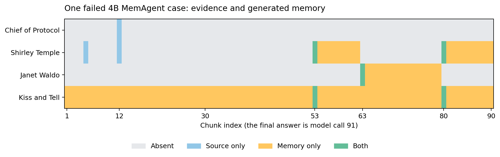

# 一条长文问答为什么读完了却答错

本例是额外的诊断复跑，没有覆盖原先的评估结果。使用官方 MemAgent / HotpotQATask、Qwen3-4B-Instruct-2507、原始 `eval_3200.json` 第 0 行，完整 90 个 5000-token chunks，最后再调用一次模型回答。采样、memory 上限和模板均沿用官方 task config。

该轨迹使用 `temperature=1.0、top_p=0.7`，是一条随机采样结果，没有重复采样稳定性估计；它不属于 external64 的 greedy（temperature=0、top_p=1）训练前后对照。

问题是：在电影 *Kiss and Tell* 中扮演 Corliss Archer 的女演员，曾担任什么政府职务？数据集答案是 `Chief of Protocol`。需要把电影条目中的演员 **Shirley Temple** 与人物条目中的官职联系起来。

最终结果：91 次调用全部完成、41,381 个输出 token、没有 API error，回答 `\boxed{\text{none}}`，官方 reward=0。模型服务和分块循环正常完成，但结果错误。

## 证据在什么时候出现

| chunk / 调用 | 原文与记忆中的实际内容 | 影响 |
| --- | --- | --- |
| 12 | 原文同时包含 `Shirley Temple` 和 `Chief of Protocol`；输出 memory 却说没有相关信息 | 早期人物官职没有进入后续 memory |
| 53 | 原文出现电影关联；模型 memory 引入 Jennifer Garner、2005 版电影和参议员等错误说法 | 这些是模型错误输出，不是原文事实 |
| 63 | 原文提到广播剧演员 Janet Waldo；模型将广播剧角色与电影角色混用 | 后续 memory 主要围绕错误人物展开 |
| 80 | 原文明确电影演员是 Shirley Temple；模型纠正了演员身份 | 此时它的 memory 中没有第 12 块的官职信息 |
| 91（最终回答） | 只接收最后的 memory，给出 `none` | 原始文档中的答案无法自动重新访问 |

第 12 块的模型输出开头是：

> No relevant information about a woman who portrayed Corliss Archer in the film *Kiss and Tell* or her government position is present in the provided section.

第 80 块则写：

> The woman who portrayed Corliss Archer in the film *Kiss and Tell* (1945) is **Shirley Temple**. ... However, the provided section contains **no information about any government position held by Shirley Temple**.

后一句只考虑当前 section 与已经压缩的 memory；相关官职本来在早期输入里。`Chief of Protocol` 在原文第 12 块出现，但从未出现在这次生成的任何 memory 中。



图中只做大小写不敏感的字面匹配，用于定位原始轨迹，不把“包含名称”当成模型理解或正确答案评分。完整语义仍应读对应 response。

## 这个案例能说明什么

MemAgent 每一块只接收“问题 + 上一份 memory + 当前文本”。先前原文不再自动保留；1024 token 是 memory 输出上限，也不保证模型能正确筛选、组合或忠实保留信息。这个例子既有早期证据筛选失败，也有同名角色的实体混淆和无依据内容进入 memory。

训练阶段把最终 reward 广播给各个 context 的生成。因此前面的筛选、后面的更新和最终回答都能收到学习信号，但终局 reward 不会自动指出具体哪一块犯了什么错误。这也解释了为什么要审计 context/session 的采样和 loss 权重，不能只看最终平均分。

它是一个固定题目的观察性案例，不能据此认定所有长文失败都源于同一机制。下一轮如果研究改善效果，可以独立比较可回访原文的检索工具、更明确的实体与证据存储、多轮读取策略，或者 memory policy 的训练；需要重新固定数据、预算和评估口径。本次没有把这些建议冒充已完成的实验。

## 复现与产物

`scripts/audit_memagent.py` 只在原版 `MemAgent.step` 返回后记录输入 memory、输出、token 用量和证据词位置；证据词只用于事后标注，没有注入给模型或改变 reward。

```bash
docker exec -e PYTHONPATH=/lab/src/uni-agent:/lab/src/verl ua-lab-cpu \
  /lab/envs/cpu/bin/python /lab/scripts/audit_memagent.py \
  --documents 3200 --sample-index 0 \
  --output /lab/results/memagent-trace/replay-qwen4b-docs3200-sample0 \
  --evidence-term 'Chief of Protocol' --evidence-term 'Shirley Temple' \
  --evidence-term 'Janet Waldo' --evidence-term 'Kiss and Tell'
```

该入口拒绝已存在的输出目录。模型推理带采样，重跑结果可能不同；原始证据已经固定保存。

- run-config.json（原始文件：`results/memagent-trace/qwen4b-docs3200-sample0/run-config.json`）：原文 hash 与运行设置。
- memory-updates.jsonl（原始文件：`results/memagent-trace/qwen4b-docs3200-sample0/memory-updates.jsonl`）：全部 91 次调用的 response / memory / token 用量。
- task.log（原始文件：`results/memagent-trace/qwen4b-docs3200-sample0/task.log`）：原版 agent 记录的逐块 prompt，含真实 section。
- summary.json（原始文件：`results/memagent-trace/qwen4b-docs3200-sample0/summary.json`）：证据位置和最终结果。
