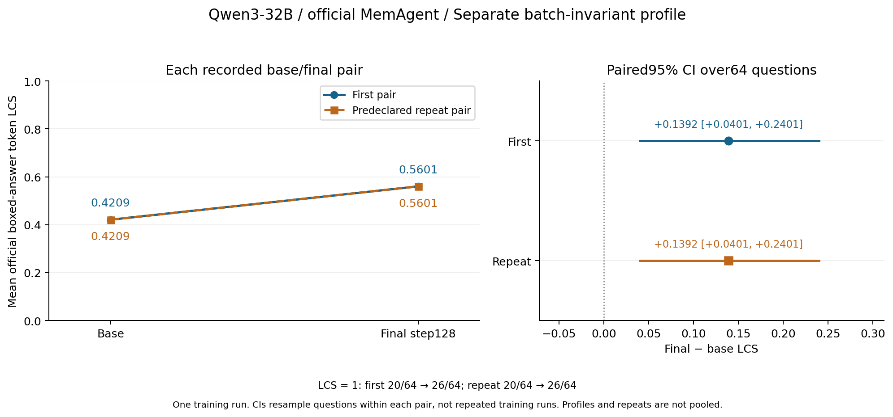
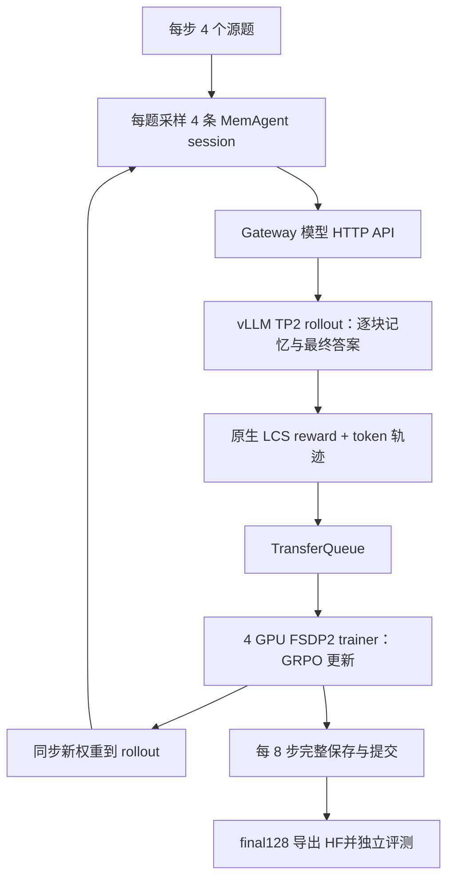
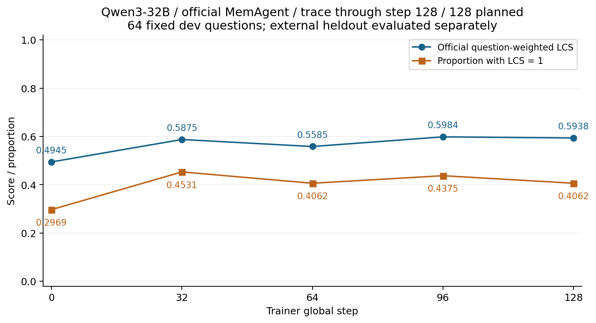

# 实验 03：Qwen3-32B 的 128 步 MemAgent RL

任务是训练 Qwen3-32B 逐块阅读长文、生成记忆和最终答案。本次完成了 128 个 global step 的全参数 RL、完整 checkpoint 保存与实际恢复；固定 stable external64 上，平均原生 LCS 从 **0.4209077381 提升到 0.5601190476**，LCS=1 从 **20/64 增至 26/64**。

## 最终结果与运行规模

| 项目 | 实际结果 |
| --- | --- |
| Stable external64 平均 LCS | 0.4209077381 → 0.5601190476，差值 +0.1392113095 |
| 95% 题目级配对 bootstrap 区间 | [+0.0401023065, +0.2401441592] |
| 逐题变化 | 19 题提高、7 题降低、38 题不变 |
| 重复评测 | base 两遍、final 两遍各 64/64 完成；同模型的回答和 reward 各 64/64 一致 |
| 训练消费 | 512 个源题各一次、2048 个 session、13872 个真实 context、464 条 padding |
| 优化进度 | 128 global step；四个 rank 的 Adam counter 均为 896 |
| 记录迭代时间 | 约 7 小时 46 分钟；111 个普通步骤的中位耗时 163.29 秒 |
| 最终完整 native checkpoint | 约 366.3 GiB；推理用 BF16 HF 另占约 61 GiB |

Stable 协议固定为 BI=1 / TRITON_ATTN、BF16、TP1、eager、16K 窗口、greedy、并发 8。两次重复验证当前记录环境的重复性，没有增加独立训练次数。

默认 ROCM_ATTN 的另组匹配恢复评测也已完成，first 为 0.4396777701→0.5948660714，repeat 为 0.3901785714→0.5693046537；这两组与 stable 分开报告，详见[完整报告](REPORT.md)。

## 训练架构与流程

训练使用 4 个 FSDP2 trainer GPU 与独立 2 GPU TP2 rollout；CPU 上的任务编排管理 session。Gateway 的会话创建、finalize、abort 是 Python/Ray 调用，模型采样走 HTTP，具体接口见[共享架构](../00-overview/architecture.md)。

同一题四条完整执行的最终 reward 用于组内均值中心化，并关联各个 context 的 token 轨迹；训练配置使用 token-mean loss、KL 0.01、LR 峰值 1e-6 和 4 步 warmup。它去掉了优势标准差归一化，不等同于完整 DrGRPO 配方。

每块 source 约 5000 token，memory/final 各最多 1024 token。128 个 global step、896 次 Adam 更新与每个 Agent 的多轮调用是不同计数。

## 如何复现

1. 读[共享 SETUP](../00-overview/SETUP.md)，准备固定 ROCm Docker、源码/兼容补丁、模型与数据；先核对 GPU 映射和 checkpoint 卷空间。
2. 按[本实验手册](REPRODUCE.md)固定 512 train / 64 monitor / 64 external，检查完整 source context 与问题分区，完成独立 pilot。
3. 使用手册内的完整 32B YAML 配方，在新 run 目录从原始 base 启动 128 步；不要续用早期 HF-only 中断实验的名称与统计。
4. 执行 step8 受控暂停，核对完整 model/Adam/scheduler/RNG/data/TQ，真正恢复并完成 step9。
5. 持续训练，按预定 0/32/64/96/128 做 monitor；每 8 步完整保存，提交完成后再轮换旧 checkpoint。
6. 到达真实 native128 后导出 BF16 HF，核对 tensor、tokenizer 和配置，再用同一评测协议分别运行 base/final 与 repeat。
7. 按 64 道题重算 reward、配对差值和 bootstrap，保留失败与回退案例，最后整理自己的报告。

完整 YAML 已收在本实验 `REPRODUCE.md` 内，没有本机配置文件。脚本、依赖、数据、模型和原始结果需按手册另行准备；[离线总手册](../00-overview/reproduction.html)保留跨实验上下文。

## 从哪里读

| 入口 | 内容 |
| --- | --- |
| [REPORT.md](REPORT.md) | 最终收益、成本、训练曲线、恢复和默认后端补充对照 |
| [REPRODUCE.md](REPRODUCE.md) | 32B 环境衔接、训练、恢复、导出、final/stable 评测和完整 YAML |
| [最终答案案例](details/32b-final-stable-case-review.md) | 原文支持的改善、真实回退及指标影响 |
| [真实一批数据讲解](details/32b-training-walkthrough.md) | 独立 pilot 的 session、context、padding 与 Adam 更新 |
| [恢复设计](details/rl-32b-durable-recovery-plan.md) | 原子提交、保留策略和真实恢复的验收方法 |
| [默认后端结果](details/32b-primary-gpu1-recovery-results.md) | 独立匹配恢复评测及重复波动 |
| [figures/](figures) / [details/](details) | 最终图与各阶段方法、案例、诊断说明 |

## 失败、指标与结论边界

- 旧 run 在 46 步中断，只有 step32 HF，不能恢复原 Adam 历史；它没有并入这次从 base 开始的 128 步。
- 新主线实际验证 step8→9 与 step32→33 恢复；回滚日志独立保留，重做的步数不重复计入 128。
- 原 GPU0 final 服务超过 600 秒 readiness 期限，未执行 final 题；后续 matched recovery 重新配齐自己的 base/final，未拼接旧 baseline。
- External 净增中，窄 TeX 空格变化贡献 +0.015625，约 11.22%；剩余项也不能全部解释为新增知识。
- 原生 LCS=1 不是另行实施的标准 HotpotQA EM；正式 external 未保存完整中间 memory，不能定位每次得分变化发生在哪个记忆块。
- 一次训练与 64 道题支持本实验范围内的结果，不支持通用 Agent 能力、跨训练 seed 稳定性或与 8B 的显著规模结论。

两规模使用相同口径的结果与成本见[整体结果](../00-overview/RESULTS.md)，8B 的独立实验见[实验 04](../04-memagent-8b-rl/README.md)。
