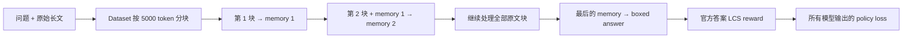
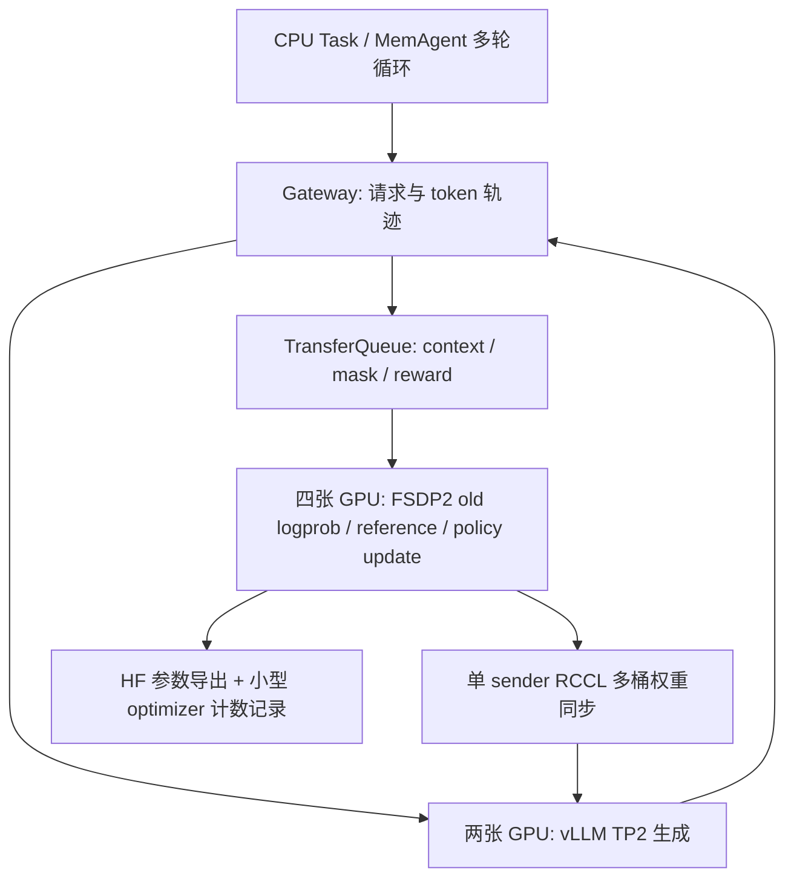

# 用本机一批真实 32B 数据理解 agentic RL

这里用已完整通过的 `memagent_32b_pilot_restart` 解释训练过程。正式长跑是独立的 `memagent_32b_128`，其结果需要等全部训练和外部评测结束后判断；pilot 不是长训练成绩。

## 一次任务到底在做什么

每个输入是一道 HotpotQA 问题和完整的长文。MemAgent 每次读约 5000-token 原文，生成最多 1024-token 的新记忆；下一次调用带新原文块、问题、上一份记忆和固定指令。这里的memory就是上一次完整响应字符串，代码没有另行抽取`updated_memory`标签中的内容。读完所有块，再带问题、最后的memory和答题指令生成答案。

模型在这个过程中做了多次会影响后续状态的决策：保留哪个人名、哪个年份、两段事实如何关联。读取下一块的顺序由固定代码控制；模型学习的动作是如何生成记忆和最终答案。最终答案的session级reward用于训练这条链上的各次模型输出，这是本实验的agentic RL内容。它不是把最后一次调用的梯度穿过离散文本、自动反传到早先API调用的可微计算图。代码任务则会生成shell、编辑和提交等工具动作。

长文可能有近百万 token，但一次模型请求仍只有一块原文、记忆和指令。本实验没有把这些案例称为原生百万 token attention。

## 从 4 道题到 7 次 Adam 更新

pilot 的实际记录是：

| 单位 | 数量 | 含义 |
| --- | ---: | --- |
| 输入 question / prompt | 4 | 一次 global step 取 4 道题 |
| 每题 rollout | 4 | 同一问题采样 4 条完整记忆/回答轨迹 |
| 消耗的真实 session | 16 | 4 × 4，每个 session 最终只得到一个任务 reward |
| 真实 context trajectory | 104 | 每次更新记忆、最后回答各形成一个 context |
| 合成 padding rows | 8 | 为满足训练 batch 整除而填充，不是模型实际完成的额外任务 |
| 送入 context minibatch 的 rows | 112 | 104 + 8 |
| 每个训练 rank 的 Adam step | 7 | 在这个配置下，112 rows 分成 7 个 context minibatch |

上述行数来自实际消费batch（原始文件：`runs/rl/memagent_32b_pilot_restart/rollout/1.jsonl`）。本pin将`ppo_mini_batch_size=4`再乘`rollout.n=4`，得到每个全局context minibatch的16行。`ppo_epochs=1`，所以112/16=7。四个rank各分到28行，每次更新各处理4行，再以每GPU microbatch=1累积梯度；这是一次共同的全局更新。

这里 **1 global step ≠ 1 次 Adam 更新 ≠ 104 道题**。四个 FSDP ranks 协作完成相同的 7 次更新，也不能再乘 4 报成 28 次独立优化。

pilot 的四个 rank 均留下 707 个 optimizer state entries，计数都是 7。正式长跑每次保存时还会把各 rank 的计数分布写到 `runs/rl/memagent_32b_128/optimizer_step_audits/`，即使旧的大模型 checkpoint 被轮换，计数记录也保留。正式运行有 4 步学习率 warmup，首个 global step 的 LR=0；计数增加不能代替参数变化证据。

## Reward 为什么还需要组内差异

当前固定协议关闭组内标准差归一化，使用GRPO的组内均值中心化。本次实际loss为token-mean且保留KL0.01，不能仅凭“去std”就称为完整DrGRPO配方。对于同一prompt uid为 \(u\) 的、实际进入batch的session集合 \(G_u\)，当至少有两个session且最终context含有效输出mask时：

\[
a_{u,s} = r_{u,s} - \frac{1}{|G_u|}\sum_{j\in G_u}r_{u,j}
\]

本pilot每组四个session都完整进入batch，所以分母确实是4。若同一道题四条rollout都拿0，或都拿1，任务reward不产生相互区分的优势；有梯度也可能只是KL正则贡献。4个prompt groups中只有 **1个具有非均匀reward**：其四个分数约为`[0.55555558, 0.875, 0.875, 0.55555558]`，均值约0.71527779，中心化后为`[-0.15972221, +0.15972221, +0.15972221, -0.15972221]`。同时观察到非零policy-gradient loss、非零梯度与实际权重改变。原始值与配置在冻结协议（原始文件：`notes/rl-memagent-32b-128-protocol.json`）中。

最后一个答案的reward会附到同一session的各份context。计算优势时，[multi-trajectory helper](https://github.com/verl-project/verl/blob/a9f2985159536a607211dcac730d3f5d55028950/verl/trainer/ppo/v1/utils.py#L148)先按`{uid}_{session_id}`取最大context index的一行，再按原prompt uid计算组均值；104条context不会作为104个独立样本进入这个均值。得到的优势再广播到该session的各context，并乘各自的response mask。

这里有两个实现边界：失败或返回None的session可能不在batch中，组大小不保证永远为4；若只剩一个session，当前源码把均值基线设为0，不能继续套用“单样本减自身均值”的公式。若最终context的response mask全零，helper取到并广播的policy优势也是0。8条synthetic padding使用独立的新uid，reward和response/loss mask均为0，不改变真实prompt组的均值，也不贡献PG、entropy或KL loss。

因此要按session解释“做对了几题”。训练loss在每个context minibatch内按有效输出token聚合，生成更长的记忆可能占更高权重；关闭组内标准差归一化并没有自动变成“每道题同权”的完整算法改造。上游相关讨论和本机全量只读审计见[MemAgent 上游对齐](../../00-overview/methods/memagent-upstream-alignment.md)。

## 哪些 token 参与 loss

原文、问题、此前记忆都成为当前调用的输入；新生成的memory或最终答案是policy的输出。Gateway/Framework保存token IDs、对应logprob与mask，训练只在有效policy输出位置计算相应的token loss。以前生成的memory在后一次调用里作为输入出现时，不会因此再次成为这次调用的输出监督。prompt仍参与attention、前向计算和参数梯度，mask=0不表示模型不处理这些输入；离散memory字符串也没有跨请求的可微连接。本次`mask_unfinished_episode=false`，不能把其他case中未完成episode整条清零的可选行为当成本配置默认。

代码任务走相同的训练接口，但中间的工具执行、文件修改和测试在 Docker sandbox 内。Claude Code 的黑盒路径保留它自己的循环，由 Gateway 代理其模型请求；本次 Claude/Mini 推理产物中的原始 Gateway trajectory 的 reward/finished 可以为空，TaskResult 再提供判题结果，进入训练前由 Framework 对齐。不能把只采集轨迹的黑盒推理说成已经用该 harness 更新了参数。

## 为什么用 6 张卡训练，另两张做评测

pilot中，下一批rollout约72秒完成，比当前训练结束早约96秒；old logprob、reference、actor update加同步约172秒。这是一次pilot预取的观测，支持先将HIP 2–7配置为4 trainer + 2 standalone rollout，保留HIP 0/1做独立案例；它不能保证整个长跑一直没有生成等待。初始/周期验证时，trainer上的hybrid rollout也可临时唤醒参与生成，图中两张卡指持续工作的standalone TP2服务。

预取也可能带来版本滞后。此pin的staleness按非padding的context trajectory统计，主值为`(当前global_step - 1) - max_global_steps`，worst值使用`min_global_steps`；`max-min+1`是生成所跨权重版本区间的宽度。它们不是秒数，也不是把整个MemAgent session合为一个样本的延迟。版本标记来自Gateway，缺失时Framework会使用调度标签兜底，所以仅看到staleness=0还不能单独证明完整session始终使用最新参数。长跑继续记录等待时间与这些指标，检查实际资源分配。

FP32 master parameters、FP32 梯度和 Adam 两份 moments 分到 4 个 trainer ranks，数值状态预算约 122 GiB/rank，另需激活和通信临时空间。MoE 的 active 参数少，并不意味着只存 active 专家的 optimizer 状态。因此本轮用 dense 32B 做训练，Coder30B-A3B 先用于代码案例，两条结果各自归档。

## 保存成功后，还验证了什么

pilot HF 导出包含 707 个 F32 tensors、32,762,123,264 个元素，实际 payload 为 122.048 GiB。固定抽样的 9 个张量中，FP32 值几乎都有变化；转成 BF16 后仍有 **2.25087%** 的抽样元素改变。这个比例只说明变化在推理精度下仍可表示，不是模型能力分数。

导出的 HF 又通过专用入口（原始文件：`scripts/start_32b_checkpoint.py`）重新加载到独立 vLLM 服务，核对了服务返回的真实权重路径，并完成短生成和空参数 submit 检查。见[精度记录](../../02-memagent-long-context/details/large-memagent-effective-weight-deltas.md)和回载验收（原始文件：`results/large-memagent/pilot-checkpoint-service-probe.json`）。这补齐了“确有更新 → 能导出 → 能重新推理”的工程证据。

最终能力评估使用正式 128-step checkpoint，与原始 base 在同一 64 道 external 问题上比较，沿用相同 tokenizer、非 thinking、temperature=0、1024-token memory/答案预算及官方 LCS。监控集每 32 步评估，external 不用于选 checkpoint。只有完整、配对、同运行时的结果才会进入[最终分析](../../02-memagent-long-context/details/large-memagent-analysis.md)；训练 loss 下降、计数增加或单个成功案例都不能替代它。
