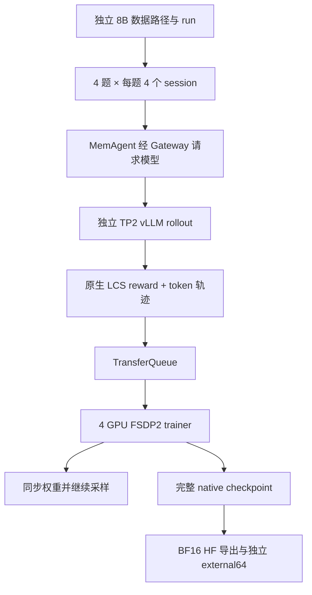

# 实验 04：Qwen3-8B 的独立 128 步 MemAgent RL

任务与 32B 相同：让模型逐块生成记忆，并用最终答案奖励训练整条执行链。Qwen3-8B 已完成独立 128 步全参数 RL；固定 stable external64 上，平均原生 LCS 从 **0.4183199179 提升到 0.5346726190**，LCS=1 从 **19/64 增至 28/64**。

## 最终结果与成本

| 项目 | 实际结果 |
| --- | --- |
| Stable external64 平均 LCS | 0.4183199179 → 0.5346726190，差值 +0.1163527011 |
| 95% 题目级配对 bootstrap 区间 | [+0.0173656205, +0.2194321282] |
| 逐题变化 | 15 题提高、7 题降低、42 题 reward 不变 |
| 重复评测 | base 两遍、final 两遍各 64/64 完成；同模型的回答和 reward 各 64/64 一致 |
| 训练消费 | 512 个源题各一次、2048 个 session、13872 个真实 context、464 条 padding |
| 优化进度 | 128 global step；四个 rank 的 Adam counter 均为 896 |
| 记录迭代时间 | 约 2 小时 23 分钟；111 个普通步骤的中位耗时 52.94 秒 |
| 最终完整 native checkpoint | 98,382,004,717 字节，约 91.63 GiB |

对比图只保存在共享 overview 中。两模型使用相同题集和固定 stable 配方，但各自只有一次训练；此图不构成两种模型规模差异的显著性检验。

## 训练链路与独立性

8B 使用自己的环境、run、checkpoint 和评测路径，复用相同原始 512/64/64 分区，独立验证 tokenizer、模型结构与 source coverage。它没有从 32B checkpoint 继续训练。

实际配方为 separate_async、4 个 FSDP2 trainer GPU + 2 GPU TP2 rollout、FP32 master/BF16 compute、GRPO 去组内标准差归一化、token-mean loss、KL 0.01、LR 峰值 1e-6、4 步 warmup。

训练 source 按约 5000 token 分块，memory/final 各最多 1024 token；训练采样 temperature=1、top_p=0.7。最终外部评测固定 BI=1/TRITON_ATTN、BF16、TP1、eager、16K 窗口、greedy、并发 8。

## 如何复现

1. 从[共享 SETUP](../00-overview/SETUP.md)准备 Docker、固定源码与模型；核对 8B 的独立路径、GPU 布局及保存新旧两份 checkpoint 所需空间。
2. 阅读[本实验手册](REPRODUCE.md)，准备独立 8B overlay 和固定数据，完成模型 name/shape、tokenizer 与源输入检查。
3. 按手册登记新节点的评测环境，再用内嵌完整 YAML 从原始 Qwen3-8B 启动新 128 步 run；路径登记前置条件需按原步骤执行。
4. 在 step8 保存后受控暂停，检查完整 model/Adam/scheduler/RNG/data/TQ，再真正恢复并完成 step9。
5. 继续到 128 步，保存预定 monitor、实际训练消费和完整 native 状态；不依据中间得分挑选 final checkpoint。
6. 导出 final128 BF16 HF。若固定版本导出合法单文件却无 index，按手册验证并补标准 index，保留原失败记录与权重文件哈希。
7. 在固定 stable 协议下完成 base 两遍、final 两遍，分别验收完整 64 题、原生 reward、配对统计及重复一致性。

完整 8B YAML 已收在本实验 `REPRODUCE.md` 内，没有本机配置文件；完整实验脚本、锁定依赖、模型、数据与原始证据需另行准备。[离线总手册](../00-overview/reproduction.html)可用于查看跨实验准备顺序。

## 建议阅读顺序

| 入口 | 内容 |
| --- | --- |
| [最终 external 案例与统计](details/8b-final-stable-case-review.md) | 最终效果、原文案例、回退、重复性与证据边界 |
| [REPORT.md](REPORT.md) | 独立 8B 训练约定、阶段记录、128 步完成及导出恢复 |
| [REPRODUCE.md](REPRODUCE.md) | 8B 训练、节点登记、外部评测、单文件恢复与完整 YAML |
| [独立审计说明](details/8b-independent-audits.md) | 模型/source 检查与实际 step8→9 恢复证据 |
| [固定六个案例到 128 步](details/rl-8b-final-casebook.md) | monitor 案例如何改善、回退或受格式影响 |
| [step32 案例](details/rl-8b-step32-casebook.md) | 同一组早期案例及部分记忆观察 |
| [共享架构](../00-overview/architecture.md) / [整体结果](../00-overview/RESULTS.md) | 所用接口、两规模结果与成本口径 |

## 需要保留的失败与边界

- 训练 native128 已正常完成；后续失败发生在 HF 导出验收器假定必须存在 index。合法的单个 safetensors 已写出，恢复补 index 后权重文件 SHA 未改变。
- 原 exporter/controller 的失败没有被改写成成功；后续恢复与 final 评测有独立记录，不能把等待时间算作训练迭代性能。
- Monitor LCS 为 0.5088068182→0.5556818182；其净增可由窄格式贡献解释。Monitor 与 external 是两组问题，不能互换结论。
- External 窄格式贡献约占净增 15.67%，其他变化也不全是新增知识；正式 external 没有保存完整中间 memory。
- 原生 LCS=1 不等同于标准 HotpotQA EM。重复执行没有把 64 道题变成 128 道独立题目，也没有增加独立训练 seed。
- 8B 与 32B 的平均 LCS 和 LCS=1 数量排序不同；记录成本约为 32B 的三分之一，受生成长度和并行负载影响，不能当作隔离硬件速度测试。

对应的大模型实验见[实验 03](../03-memagent-32b-rl/README.md)；原始模型的长文推理与早期 pilot 见[实验 02](../02-memagent-long-context/README.md)。
