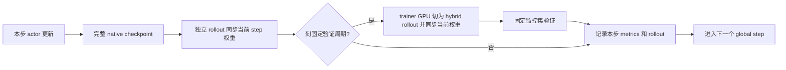

# Qwen3-8B：独立 128 步 MemAgent 对照实验

[本实验总览](README.md) · [全部实验](../README.md)

**最终状态：128 步训练、完整状态恢复、HF 导出恢复与独立评测均已完成。** Stable external64 的平均 LCS 为 0.4183199179 → 0.5346726190，LCS=1 为 19/64 → 28/64；base 与 final 各自两遍回答均 64/64 一致。

最终案例和指标边界见 [8B 最终评测](details/8b-final-stable-case-review.md)，成本对比见 [整体结果](../00-overview/RESULTS.md)。下面保留当时按时间追加的执行记录；其中“正在进行”“将验证”描述对应历史时点，不能作为当前运行状态。

2026-09-12 16:39:59 UTC 启动。当前状态以 `results/rl8-controller-status.json` 和 `results/rl8-durable-live-status.json` 为准；本文是实验约定和实际执行记录。

32B durable 实验已完成 128 次全局迭代、native128 检查点、HF 导出、完整训练统计和 source/monitor CPU 审计。root 在 `results/rl8-resource-release-20260912.json` 明确释放 GPU 2–7 后才启动本实验。GPU 0/1 继续用于 32B 独立最终评测。

## 与 32B 保持一致的部分

- 同一固定镜像 `vllm/vllm-openai-rocm@sha256:67d4317ba8aa9e60171c4eaa74eda3d1e877011c809aa186687b524ab4472aaa`，同一 ROCm PyTorch 和 118 项依赖锁；训练 overlay 独立为 `/lab/envs/rl8`。
- 同一原始 512 题训练集、64 题监控集和独立 64 题外部测试集。3 个 parquet 和 external JSON 均按字节复制至 `data/rl_memagent_8b_512_64_64`，未修改原有 32B split。
- 官方 MemAgent、HotpotQA 分块和最终 boxed-answer LCS reward，4 个 FSDP2 trainer、独立 TP2 rollout，`separate_async`，4 题 × 每题 4 次采样。
- 128 global steps；GRPO（组内中心化、不除标准差，token-mean loss）；LR 1e-6、4 global-step warmup、KL 0.01；FP32 master、BF16 compute、SDPA、gradient checkpointing。
- 5000-token chunk、1024 memory tokens、1024 final tokens；训练 temperature 1 / top_p .7，监控 greedy；全部保留原始上下文。
- 每 8 步保存 model、optimizer、scheduler/RNG、dataloader、TransferQueue 的原生完整状态。全部 fsync 后才原子发布独立 commit pointer，读租约保护正在导出的旧检查点。

## 8B 的实际模型和隔离

模型为 `Qwen/Qwen3-8B@b968826d9c46dd6066d109eabc6255188de91218`，36 层、399 个张量、8,190,735,360 个参数。原始 BF16 权重 16,381,470,720 字节，全部 HF LFS SHA256 已核验。9 个完整张量/状态探针取第 0、18、35 层，未沿用 32B 的层号和参数总数。

独立训练容器：`ua-lab-rl8-durable`。run：`runs/rl/memagent_8b_128_durable`。检查点卷：`/path/to/uni-agent-checkpoints/memagent_8b_128_durable`。环境、脚本、缓存、临时目录、状态和评测记录均使用单独命名。共享 Uni-Agent/verl 源码和依赖锁按只读约定复用，并进入内容 hash guard。

原生 model + 两份 Adam moments 估计 91.54 GiB，检查点预算 96 GiB，保留 128 GiB 文件系统余量，fresh 要求至少 320 GiB 可用。实际保存字节数将以 commit manifest 为准。

## 冻结与验证

最终训练协议：`notes/rl-memagent-8b-128-protocol.json`，SHA256 `695de77dd1d5e6be0efda3b23612e5308adaec47bda7a5c95c795d5bd5799f62`，609 项源代码、模型和数据 hash。首次 launch 前补入 step8 async-boundary 证据保存调用，旧的 prelaunch 协议已单独归档；当时尚未启动训练。

外部评测语义：`notes/rl-memagent-8b-stable-protocol.json`，SHA256 `31d8c36081f37fa3f750d368c8392a31db8c815d480fd7daaa62817aa52347b5`。最终模型固定选择 step128，预先约定 base/final 及各自 repeat，不使用监控分数选择最好检查点。

启动前已完成：原生配置校验、6 项检查点事务故障测试、12 项独立环境/模型 metadata/原始数据校验、8 项 CPU 张量重组与 FP32/BF16 数值对照、8 项 live parser/rollback 测试、10 项 source/monitor parser 控制检查。训练 TF 5.9/tokenizers .22 和推理 TF 5.16.1/tokenizers .23 对完整 640 题原始 IDs、分块和 8,742 个模板 prompt/model/runtime 的审计一致。上述 CPU 检查不代表已完成 GPU 恢复证明；真实恢复需要首次 step8→9 后检查。

## 后台执行和阶段证据

后台 controller PID 3590561；实际 `PPID=1`、`PGID=SID=3590561`，通过 `start_new_session=True` 脱离交互工具会话。启动记录：`results/rl8-detached-controller-20260912T163959Z.json`。日志：`logs/rl8-controller-20260912T163959Z.log`。独立 live writer PID 3590615，每分钟写状态和 CSV。

自动流程是 fresh→实际完整 step8 保存并暂停→校验原生状态、保存 dataloader/TQ 边界、生成 step8 snapshot 和完整 9 张量 FP32/BF16 delta→仅重启自己的 8B 容器→原生 resume→完成 128 步→HF BF16 导出→训练/监控统计→native 与导出权重一致性→独立 source 和 monitor 审计。冻结 helper 不在运行途中修改。

外部 stable 服务的 base/final/repeat 由环境任务负责人单独持有；其首次 baseline 前再冻结操作脚本锁，保持已冻结的模型选择、数据和采样语义。8B 与 32B 都以各自匹配的 base/final 为主要结果，跨模型比较另行标注运行时和容量差异。

最终报告会分开列 global iterations、真实 Adam counter、实际消耗的源题/会话/context 和预取数据；不会把 rank 数再乘到 Adam counter。参数变化、LCS 变化、回答格式变化和通用能力变化也分别解释。

## 实际 step8→9 恢复已进入训练 — 2026-09-12 17:03 UTC

Step0 监控为64题451contexts，LCS0.5088068181818182，满分22/64。Step8 whole commit于2026-09-12T16:55:32.846457+00:00完成，实际98359358326字节。四rank均399个完整Adam states，counter56、scheduler8。自动pause退出码75，CPU native/probe、dataloader/TQ边界和9个完整张量delta均通过，随后仅重启8B容器。

四rank原生load审计全部 matches_saved_state=true，包含完整RNG、FP32及有效BF16 model probes、Adam moments和计数。Attempt002于16:56:20UTC开始，17:03前已实际完成globalstep9和10；独立source UID/queue恢复审计正在进行。

Step8抽查100,675,584个元素：FP32有100,660,240个变化；统一BF16后有4,534,376个变化；均为有限值。此为参数更新证据，不是能力提升结论。

独立恢复审计随后PASS：`results/rl8-memagent/durable-resume-step9-independent-audit.json`（SHA256 74465847f61b3d1801ce146b1fae897f657d031cd9b09cd95b78fdf528c453f0）。第9步确实消费checkpoint保存的4个cached UID与对应source index，16sessions/112contexts；prefix1..9为36源题、144sessions、968真实contexts、40padding，源题不重复且没有错误。Step9 PG0.0148335262、gradient norm0.3826972454、KL0.0272130485、LR1e-6，优势范围[-.375,.125]，证明原生restore后继续了实际训练。

## Step32 阶段记录 — 2026-09-12 17:28 UTC

实际消费128道题、512sessions、3444真实contexts、140padding。45/128组reward不均一，29步有task-reward GRPO信号；第7、26、29步为零优势/KL-only当前梯度。四rank各399个Adam states，实际counter224，scheduler32。

监控LCS从0.5088068182到0.5578615196，满分22→26/64，12题改善、9题下降、43题不变；仍按协议继续到128，不按该分数选择终态。独立source/format audit在相应results目录另存。`analysis_snapshots/step_32.json`、`step_32_validation.json`和`results/rl8-memagent/durable-step32-training-stage-summary.json`保留原始阶段证据。

## Step64 阶段记录 — 2026-09-12 18:06 UTC

实际消费256源题、1024sessions、6932真实contexts、236padding；89/256组reward不均一，52步有task信号，12步为零优势/KL-only。四rank实际Adam448、scheduler64。LCS0.5383331079、满分25/64；相对initial为13升8降43平，相对step32的0.5578615196回落0.0195284。继续预定128，不按监控挑选最好检查点。

Step64另以CPU读取原生模型的9个完整张量：100,675,584元素中FP32变化100,671,697，统一BF16后变化17,914,547（step8为4,534,376），均finite。记录在`results/memagent-8b/native-step64-weight-deltas.json`，含原生commit hash和dtype/source信息。这说明有效BF16参数更新在积累，不代表任务能力必然单调上升。完整阶段汇总为`results/rl8-memagent/durable-step64-training-stage-summary.json`。

## 一次 global step 的真实顺序与 GPU 角色

固定原生源码为 verl commit `a9f2985159536a607211dcac730d3f5d55028950`。本节只读核对代码，没有新增运行时测试或修改训练路径。文件SHA256：`trainer_base.py`=e2ca9b9af567fbd0c99224475fafec7c881bc3e3ff730fdc6e8825c844b34e58；`trainer_separate_async.py`=b53e332a1664654441b046dd366679cc26a954671d15c89576572e684b6297f6。

上述 checkpoint 节点只在 save_freq 对应步骤执行，验证节点只在 test_freq 或最后一步执行。源码位置如下：

- [trainer_base.py:463](https://github.com/verl-project/verl/blob/a9f2985159536a607211dcac730d3f5d55028950/verl/trainer/ppo/v1/trainer_base.py#L463)：先执行本步采样与 actor/critic 训练；[保存调用:471](https://github.com/verl-project/verl/blob/a9f2985159536a607211dcac730d3f5d55028950/verl/trainer/ppo/v1/trainer_base.py#L471)在训练更新之后。
- [trainer_base.py:473](https://github.com/verl-project/verl/blob/a9f2985159536a607211dcac730d3f5d55028950/verl/trainer/ppo/v1/trainer_base.py#L473)：随后调用 on_step_end；[separate_async 同步:346](https://github.com/verl-project/verl/blob/a9f2985159536a607211dcac730d3f5d55028950/verl/trainer/ppo/v1/trainer_separate_async.py#L346)将当前 global_steps 的权重同步给独立 rollout。
- [trainer_base.py:481](https://github.com/verl-project/verl/blob/a9f2985159536a607211dcac730d3f5d55028950/verl/trainer/ppo/v1/trainer_base.py#L481)：之后才进入验证；[on_validate_begin:199](https://github.com/verl-project/verl/blob/a9f2985159536a607211dcac730d3f5d55028950/verl/trainer/ppo/v1/trainer_separate_async.py#L199)在当前为 trainer 模式时切换 hybrid。
- [switch_to_rollout:369](https://github.com/verl-project/verl/blob/a9f2985159536a607211dcac730d3f5d55028950/verl/trainer/ppo/v1/trainer_separate_async.py#L369)：hybrid 同步当前 global_steps 的权重、恢复生成并加入负载均衡器。
- [trainer_base.py:489](https://github.com/verl-project/verl/blob/a9f2985159536a607211dcac730d3f5d55028950/verl/trainer/ppo/v1/trainer_base.py#L489)：验证后计算指标、[写 rollout:494](https://github.com/verl-project/verl/blob/a9f2985159536a607211dcac730d3f5d55028950/verl/trainer/ppo/v1/trainer_base.py#L494)、[清理本批TQ:497](https://github.com/verl-project/verl/blob/a9f2985159536a607211dcac730d3f5d55028950/verl/trainer/ppo/v1/trainer_base.py#L497)、[记录logger:500](https://github.com/verl-project/verl/blob/a9f2985159536a607211dcac730d3f5d55028950/verl/trainer/ppo/v1/trainer_base.py#L500)，最后增加 global_steps。
- [switch_to_trainer:377](https://github.com/verl-project/verl/blob/a9f2985159536a607211dcac730d3f5d55028950/verl/trainer/ppo/v1/trainer_separate_async.py#L377)：返回训练时从路由移除 hybrid、停止其请求并让其 inference replicas 休眠，释放给 trainer 使用。

因此“完整commit64已出现、canonical metrics仍显示63”可以是正常的保存/验证窗口；不能简单判定训练卡住，也不能把它说成验证旧一步。所有rollout管理器在固定验证前都已有当前step权重。保存发生在本批TQ清理之前，恢复审计要区分已消费残留和真正下一批prefetch。

本实验关闭训练间隙的自适应hybrid切换；4个trainer GPU仍会在固定验证期临时组成两组TP2 hybrid replicas，另有独立的两GPU TP2 rollout。启动和验证时看到多组vLLM server符合这套资源复用设计。约57GiB/153GiB的8B/32B显存数字是训练actor的Torch allocator峰值，整张设备还可能包含其它inference进程及缓存，应另行测量设备总量。

Step64独立监控分解已完成：相对initial净增+0.0295262897，其中4个窄格式case净贡献+0.0442708333，其余17个变化题净贡献-0.0147445437。格式正贡献大于总净增，是因为其他差异发生抵消；这不是“149.94%的能力增益”。32→64净变化-0.0195284117，其中新的千位逗号case贡献+0.015625，其他变化净-0.0351534117。完整source/reward/format证据在`results/rl8-memagent/durable-step64-monitor-independent/`。

算法称谓澄清：本实验为GRPO去组内标准差归一化、token-mean聚合、KL0.01；历史“DR-GRPO”简称只覆盖优势估计的一项选择，不代表完整DrGRPO配方。见 `notes/rl-algorithm-label-clarification.md`。冻结配置、协议和当前训练均未改变。

## Step96 阶段记录 — 2026-09-12 18:42 UTC

实际消费384源题、1536sessions、10388真实contexts、364padding；133/384组reward不均一，80步有task-reward信号、16步为零优势/KL-only当前梯度。四rank实际Adam672、scheduler96。监控LCS0.5652157738、满分27/64，相对initial为16升8降40平，相对step64回升0.0268827。按照预定128继续。

原生96在18:36:17.712992UTC提交，98,388,473,331字节。额外CPU9张量观测仍覆盖100,675,584元素：FP32变化100,672,452，有效BF16变化21,899,548，allfinite；原生FP32最大绝对差0.0001651534。`results/memagent-8b/native-step96-weight-deltas.json`、`results/rl8-memagent/durable-step96-training-stage-summary.json`和两份step96 snapshot均已保存。

Step96 source/monitor独立审计PASS。相对initial净增+0.0564089556，4个窄格式case贡献+0.0338541667（60.02%），其它20个变化题净+0.0225547890；64→96回升+0.0268826659，其中格式变化净-0.0104166667、其它变化净+0.0372993326。固定64题的原始row、gold和全部451contexts均逐项匹配。训练prefix96为384源题各一次，源context和stage96统计一致。证据位于`results/rl8-memagent/durable-step96-monitor-independent/`和`durable-train-source-coverage-through96.{json,csv}`。

## 128步完成与导出布局恢复 — 2026-09-12 19:35 UTC

原生训练在19:14:12UTC正常完成，native128于19:12:31UTC完整提交，98,382,004,717字节。全程512源题各一次、2048sessions、13872真实contexts、464padding；180/512组reward不均一，107步有task信号，21步为零优势/KL-only当前梯度。四rank各399个Adam states，实际counter896、scheduler128。

最终monitor LCS0.5088068182→0.5556818182，满分22→26/64，17升10降37平。5个窄格式case净+0.0494791667，其余22变化题净-0.0026041667，总净增+0.046875；这次监控净增可以由格式贡献解释，不能报告成通用能力增益。

官方merger成功写出单个16,381,517,208字节safetensors。Transformers5.9默认max_shard_size50GB，只对多分片创建index；冻结export checker假定index存在而失败。原始`export-outcome.json`和`results/rl8-controller-status.json`保留failed原件。独立恢复脚本验证399个BF16张量及全部shape/offset/长度，按真实header生成标准index；只把生成shard的owner从root改为lab UID/GID15341，mode0600不变。完整payload/file SHA前后均为`a05dd67b60a4aadf3b613a616feed317e75cffe1008d204e446996fb38ae3382`，与独立pre-read一致。

恢复记录`run/exports/global_step_128/export-recovery-outcome.json`已completed；新CPU continuation `results/rl8-finalization-recovery/status.json`于19:35:19完成609项源复核和全部原冻结后处理。原始失败/原生完成记录hash均不变。最终9个完整张量共100,675,584元素：FP32变化100,672,781，有效BF16变化23,912,169，均finite且HF导出逐元素等于native FP32转BF16。最终source/monitor审计PASS；`analysis_snapshots/step_128.json`是final analysis逐字存档。

最终阶段汇总在`results/rl8-memagent/durable-step128-training-stage-summary.json`，固定六案例追踪在`notes/rl-8b-final-casebook.{md,json}`。训练和CPU工作结束后root在19:43释放训练GPU2–7；不再启动训练。外部stable base/final/repeats由env/root单独完成和解释。
