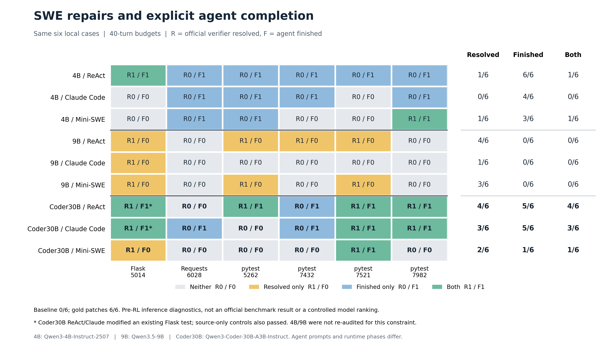
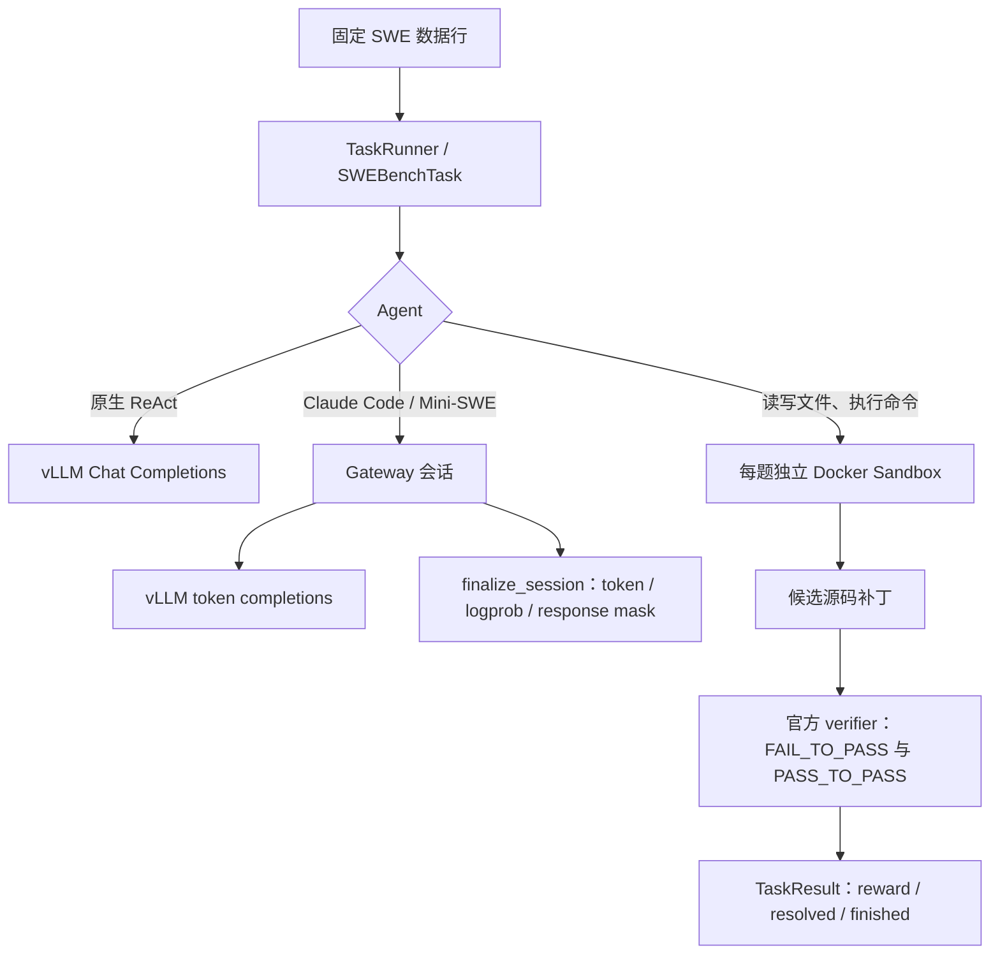

# 实验 05：用代码 Agent 修复真实 SWE 问题

任务是让 Agent 在 Docker 中阅读仓库、定位问题、修改源码，再由官方测试检查补丁。这里使用原始 Qwen 模型做推理和工具调用，**没有对 Coder30B 执行 RL 更新**。

主要模型是 `Qwen3-Coder-30B-A3B-Instruct`，总参数约 30.53B 的 MoE。相同六题上比较 ReAct、真实 Claude Code CLI 和 Mini-SWE；另外用 ReAct 完成独立的 29 题扩展诊断。

| 题集 / Agent | 官方 verifier resolved | Agent finished | 两者均满足 |
| --- | ---: | ---: | ---: |
| 原六题 / ReAct | 4/6 | 5/6 | 4/6 |
| 原六题 / Claude Code 2.1.236 | 3/6 | 5/6 | 3/6 |
| 原六题 / Mini-SWE 2.2.8 | 2/6 | 1/6 | 1/6 |
| 扩展 29 题 / ReAct | 8/29 | 28/29 | 8/29 |

`resolved` 表示官方目标测试和回归检查通过；`finished` 表示 Agent 提交或按自身协议正常结束。Mini 的 Flask case 已留下可通过测试的源码，但耗尽轮数、没有提交，因而两列不同。



这张图还包含早期 4B、9B 实验；图上的差异来自模型与 Agent 组合的实际记录，不能隔离解释成某一个组件的因果收益。

## 调用流程



原生 ReAct 直接调用模型服务；Claude/Mini 保留自己的内部循环，经 Gateway 转接模型协议并采集轨迹。Gateway 不替代工具环境，也不执行仓库测试。

Claude 使用 Messages 兼容接口，Mini 使用 OpenAI 兼容接口；工具在 Sandbox 中执行。手动调试路径保存的 Gateway 轨迹与 TaskResult 通过 session ID 关联，本实验没有继续执行训练器的奖励挂接或参数更新。

## 按这个顺序复现

1. 先读 [共享环境准备](../00-overview/SETUP.md)，准备固定版本源码、ROCm vLLM、CPU driver 与 Docker 任务环境；再完成 [Sandbox / Gateway 基础实验](../01-cpu-sandbox-gateway/README.md)。
2. 按 [本实验复现步骤](REPRODUCE.md) 固定模型 revision、SWE-bench Verified 数据 revision 和任务镜像，确认 context 上限与工具协议匹配。
3. 先在全新容器中跑原始仓库 baseline 和 dataset gold patch oracle，再运行模型。原六题必须得到 **baseline 0/6、gold 6/6**，并检查真实测试执行与解析结果。
4. 在同六题上运行目标 Agent。原协议最多 40 turns，Agent 600 秒、verifier 300 秒；保留逐题状态、候选补丁、verifier stdout 和真实模型轨迹。
5. 如果做扩展实验，先按冻结规则验证 32 个候选，再输出最终 29 题输入。32 题均 baseline=0、gold=1；其中 3 题因 baseline 已有回归失败被严格规则排除，未用模型结果选题。
6. 扩展 29 题采用独立的 100-turn ReAct 协议。必须等 29 个冻结 ID 都有最终结果，再汇总与绘图；不要与六题 40-turn 结果合并。
7. 最后审计 patch、测试修改和结束状态。比较 baseline 已有 diff、文件权限噪声与模型新增内容，分别报告 resolved、finished 和两者交集。

模型只收到任务所需的题面与仓库；gold solution 用于独立 oracle 控制，官方 tests 由 verifier 阶段使用。控制阶段不调用模型。各阶段使用新的任务容器，避免把答案或上一次修改带入模型环境。

## 先看两个能解释清楚的案例

[Django11119 与 SymPy21596](details/swe-expanded-case-study.md) 展示了一次成功修复和一次带回归的失败，均来自固定规则选出的已完成样本。

Django11119 中，模型让新建的 `Context` 继承 engine 的 `autoescape` 设置：

```diff
- return t.render(Context(context))
+ return t.render(Context(context, autoescape=self.autoescape))
```

这一行修复通过目标测试和另外 7 个回归测试。SymPy21596 则在修改集合求交语义后仍有 1 个目标测试失败、4 个回归，并改动了已有测试；`finished=true` 没有使它成为正确补丁。

原六题 Flask 中，ReAct 与 Claude 修改了已有测试，违反提示中的约束，主结果保留该标记。另做的 source-only 控制只应用源码补丁，两者各自通过 1 个目标测试和 59 个回归测试；这不抹去原运行的约束违反。

## 按问题找文件

| 想了解什么 | 文件 |
| --- | --- |
| 原六题如何选出，为什么先跑正负对照 | [REPORT.md](REPORT.md) |
| 环境、模型服务、Claude/Mini、六题与扩展任务的操作顺序 | [REPRODUCE.md](REPRODUCE.md) |
| Coder30B 三种 Agent 的逐题差异、真实轨迹和 Flask 控制 | [coder30b-case-audit.md](details/coder30b-case-audit.md) |
| 扩展集冻结与 32→29 的排除规则 | [swe-expanded.md](details/swe-expanded.md) |
| 扩展 29 题结果、成功与失败补丁 | [swe-expanded-case-study.md](details/swe-expanded-case-study.md) |
| 早期 4B/9B 黑盒 Agent 的结果与限制 | [blackbox-small-models.md](details/blackbox-small-models.md) |
| 图片含义、计数口径与展示范围 | [large-figures.md](details/large-figures.md) |

图片可直接用于阅读或汇报：[resolved/finished 对比](figures/swe-resolved-finished.png)、[同六题九组热图](figures/swe-six-nine-rows.png)、[扩展集按仓库结果](figures/swe-expanded29-by-repo.png)。同目录另有 SVG 矢量版本。

## 结论边界

这些是按镜像成本、环境可用性与正负对照筛选的诊断集，**不是完整 SWE-bench Verified 分数，也不是标准 benchmark 排名或 RL 收益**。

Agent 的提示、工具接口和终止策略不同；六题与扩展集的轮数预算也不同。共享服务时的墙钟耗时不用于推断独立吞吐。

`timeout_or_error=0`、`eval_completed=true` 或 shell 最终退出码均不能替代真实测试结果。核对 verifier 是否实际运行，再看目标测试、回归测试及任务约束。

本目录保留报告、复现步骤、图片和说明用代码；原始日志、运行环境与大体积实验输入不随文档收录。总体结果见 [实验总览](../00-overview/RESULTS.md)，完整链路见 [架构说明](../00-overview/architecture.md)，连续阅读可用 [离线复现手册](../00-overview/reproduction.html)。
