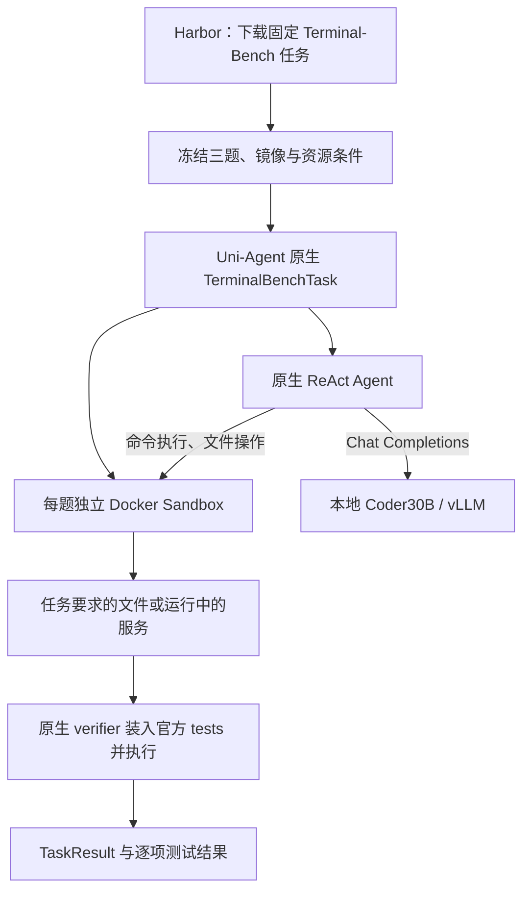

# 实验 06：用原生 Task 完成三项 Terminal-Bench 任务

任务是让本地 `Qwen3-Coder-30B-A3B-Instruct` 通过原生 ReAct 操作 Docker 环境，完成数据处理、语言迁移和虚拟机配置，再交由任务自己的 verifier 判分。

三题单次运行全部完成，结果是 **resolved 1/3、finished 2/3、两者交集 1/3**。这是原始模型的工具行为诊断，没有执行 RL 参数更新。

| 任务 | 需要完成什么 | resolved | finished |
| --- | --- | ---: | --- |
| `rstan-to-pystan` | 把 RStan 迁移为 PyStan 3.10.0，运行采样并输出参数均值 CSV | 0 | false |
| `multi-source-data-merger` | 合并 JSON/CSV/Parquet 用户数据，处理冲突并生成报告 | 1 | true |
| `qemu-alpine-ssh` | 启动 Alpine 虚拟机，配置可用的 SSH 服务 | 0 | true |

`finished` 只记录 Agent 是否提交或正常停止；`resolved` 取决于官方 verifier。QEMU 的 Agent 最终提交了说明文档，SSH 测试仍失败，因此“结束了”不等于“完成了任务”。

## 调用流程

Harbor 0.22.0 在这里负责获取任务；执行由 Uni-Agent 固定版本里的原生 `terminal_bench` Task 承担。模型使用本地推理服务，此分支没有经过训练 Gateway、TransferQueue 或 optimizer。

模型阶段只收到官方题面。官方 solution 仅用于独立 oracle 分支，tests 在 Agent 结束后由 verifier 装入；baseline、oracle 与模型使用全新任务容器，控制阶段不调用模型。

## 按这个顺序复现

1. 从 [共享环境准备](../00-overview/SETUP.md) 建好 CPU driver、ROCm 推理服务和任务 Docker 环境；不熟悉 Sandbox 的话先读 [基础实验](../01-cpu-sandbox-gateway/README.md)。
2. 按 [本实验复现步骤](REPRODUCE.md) 固定 Uni-Agent、Coder30B、Harbor 及 Terminal-Bench 2.1 的内容 digest；89 个任务全部下载后再选样。
3. 沿已记录的资源筛选与带固定 seed 的 SHA256 排序选择三题，固定镜像 manifest。原选择在任何 oracle 或模型执行前完成，没有按最终效果换题。
4. 先跑 baseline 和官方 oracle，逐题检查 pytest 确实启动、测试状态可解析，再核对同三题的有效控制均为 **baseline=0、oracle=1**。
5. QEMU 必须复用记录中的容器 APT snapshot 修复，并在同设置下重跑两种控制；只有 `reward=0` 而 pytest 未启动的旧记录不能作为有效负对照。
6. 按冻结的 ReAct 预算执行一次模型运行，不重试挑最好结果。各任务最长 100 steps，每次最多输出 2048 token，temperature=0.2、top_p=0.9；同时至多两项任务。
7. 保存工具观察、逐响应 usage、产物和 verifier stdout，分别汇总 resolved、finished、实际测试结果和模型响应数；不要仅看 Agent 最后一句话。

原执行预算为每任务 outer timeout 1200 秒、Agent 至多 900 秒、verifier 至多 240 秒。它缩短了原任务声明的部分时限，因此结果只适用于本次受限诊断协议。

复现命令和必要的环境处理集中在 [REPRODUCE.md](REPRODUCE.md)；README 用来解释实验顺序和判分，避免把某台机器上的部署配置当作前提。

## 成功和失败具体发生在哪里

**数据合并成功。** 模型生成 4 个唯一用户和 4 条冲突报告，`user_id` 为 int64，其余列为 string；官方 3 项 pytest 全部通过。一次把二进制 Parquet 当 UTF-8 文本读取出错后，它改用程序读取并完成输出。

**RStan 迁移未完成。** 模型在依赖安装和环境切换中积累了大量输出，第 50 次响应时当前请求达到 63,499 token。原生 55K 停止检查发生在该响应提出的工具命令执行前，最终缺少四份 CSV，官方测试 5 失败、1 通过。

**QEMU 服务未启动成功。** 模型先后使用废弃的 `-redir`、留下 Stopped 后台任务、尝试不兼容的串口与 daemonize 组合，并遇到端口转发错误。相同环境的 oracle 能通过真实 SSH 测试，因此不能照抄模型“环境不支持虚拟化”的解释。

完整证据与每题资源说明见 [REPORT.md](REPORT.md)。该报告同时保留最初无效的 QEMU 控制，以及修复后的有效正负对照，避免用环境错误解释模型能力。

## 报告这些计数时要分开

| 任务 | 成功模型响应数 | 实际工具调用数 | 最后一次请求 token 数 |
| --- | ---: | ---: | ---: |
| `rstan-to-pystan` | 50 | 49 | 63,499 |
| `multi-source-data-merger` | 25 | 25 | 11,832 |
| `qemu-alpine-ssh` | 29 | 29 | 6,117 |

三题共 104 次成功模型响应，API 报告累计 prompt tokens 为 1,195,910，累计 completion tokens 为 13,805。

55K 是原生 ReAct 记录的**当前请求上下文停止阈值**，不是累计 API 消费限额；服务另有 65,536 的硬 context 上限。新增工具输出可能使一次请求越过 55K，不能把最后一次请求 token 数误当整题累计用量。

## 从哪里继续读

| 阅读目的 | 文件 |
| --- | --- |
| 三题完整结果、有效控制、QEMU 修复与失败分析 | [REPORT.md](REPORT.md) |
| 获取任务、准备环境、运行控制与模型的步骤 | [REPRODUCE.md](REPRODUCE.md) |
| 任务、Agent、Sandbox、模型服务如何分工 | [共享架构说明](../00-overview/architecture.md) |
| 与其他实验一起汇报时的结果范围 | [实验总览](../00-overview/RESULTS.md) |
| 连续离线阅读全部复现内容 | [复现手册 HTML](../00-overview/reproduction.html) |

## 结论边界

三题来自资源条件筛选后的确定性小样本，并采用了受限执行时限，**不是官方 Terminal-Bench 排行榜分数，也不是训练前后效果比较**。

有效控制要求 tests 实际运行。原 QEMU 失败来自旧包索引 404、依赖缺失，虽然奖励文件写出 0、`eval_completed=true`，当时仍没有有效判题；修复只发生在任务容器内，未改变题面、solution 或 tests。

`errors=0` 不表示每条 shell 命令成功，`finished=true` 不表示满足任务目标。报告以官方测试、产物和真实命令观察共同解释结果，不由模型自述判断成功。

本目录保留任务介绍、结果分析与复现步骤；不收录任务镜像、虚拟磁盘、依赖包、原始运行日志或机器部署配置。
