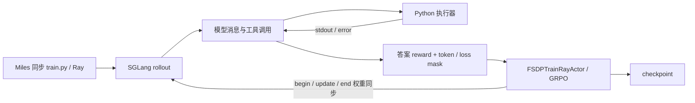

# 07 · Miles：数学 RL 与 Python 工具闭环

本实验在 ROCm 节点上用 Miles 验证另一套 rollout → reward → FSDP2 更新 → 权重回传链路。
**Qwen3-0.6B 完成真实 GSM8K 生成、checkpoint 恢复和 Python 工具 RL；4B 的工具失败最终定位到输入契约，适配后的独立 rollout 达到 16/16 正确。**
这里先用小模型检查底层接口和真实参数更新，结果不作为大模型能力提升报告。

## 做了哪些任务

| 阶段 | 任务 | 验收重点 |
| --- | --- | --- |
| 数学 RL | GSM8K train 数据中的固定小批次 | 真实生成、官方 math reward、非零梯度、参数变化 |
| 恢复训练 | 载入 model、optimizer、LR scheduler 后继续 | checkpoint 能恢复，训练与权重同步能继续 |
| Python 工具 RL | 8 个确定性整数表达式 | 模型实际调用 Python，观察返回，再生成答案并训练 |
| 4B 契约诊断 | 相同受控算术任务 | 区分工具格式失败与模型数学能力；适配实验只做 rollout |

## 实验链路

本次采用两卡 colocated FSDP2 短实验，训练器与推理引擎共享放置；没有开启 offload，也没有测试异步 `train_async.py`。
Python 工具使用上游子进程执行器，运行在专用 Docker 内；它不是每次调用都创建独立内核沙箱。

## 真实结果

| 实验 | 结果 | 能够证明什么 |
| --- | --- | --- |
| GSM8K + 恢复 | 4 × 16 = 64 条真实生成；4 个 Adam step | 3 次非零梯度与连续参数变化，恢复及权重回传通过 |
| 0.6B Python 工具 RL | 32 samples，50 次工具执行，7 个正确且有 Python stdout 的答案 | 两次实际参数更新，工具观察 token 被 mask |
| 4B 原工具 | 32 samples，125 次调用，全部 reward=-1 | 两步 grad=0、权重不变，不计作有效学习 |
| 4B 加强提示 | 16 samples，61 次调用，仍全部错误 | 仅增加文字约束未修好工具契约 |
| 4B 工具适配 | 16/16 正确，16 次真实 Python 执行 | 输入格式修正后的 rollout 对照；没有执行训练 |
| CPU 冷重建 | 37/37 overlay pins 一致，所选模块导入通过 | 环境重建证据，未重验 GPU 训练 |

首个 GSM8K batch 的组内 reward 全相同，GRPO advantage 为零，所以 checkpoint1 与 base 相同；后续三个 checkpoint 才发生参数变化。
各轮题目不同，不能把四轮 reward 均值当成学习曲线。4B 的 0/32 与适配后的 16/16 也不是训练前后提升。

## 怎样复现

1. 先读 [公共准备](../00-overview/SETUP.md)，为 Miles 单独建立 Docker/venv，不复用 Uni-Agent 的训练环境。
2. 依照 [REPRODUCE.md](REPRODUCE.md) 固定 Miles、SGLang-Miles、基础 ROCm 镜像及 Python overlay。
3. 对照本目录两份补丁，在固定源码副本中检查并应用；核对实际导入的 SGLang 源码路径。
4. 先做 CPU 导入检查；GPU 容器再验证两张可用卡、attention 前后向及 log-prob 路径。
5. 准备固定 GSM8K 小输入和 Qwen3-0.6B，跑两轮，再从 checkpoint2 恢复两轮。
6. 检查真实生成、reward、梯度、Adam step、参数差异及 SGLang 权重版本，而不仅检查 job 返回码。
7. 再运行 Python 工具任务，核对工具 stdout、最终答案、observation mask 和实际参数变化。
8. 若复现 4B 对照，把原工具、加强提示和 adapter rollout 分开保存；adapter 不加载标签、不执行参数更新。

| 原始短实验设置 | 值 |
| --- | --- |
| Miles commit | `50ad28b47c8b7cd1f6bfed7767bb505a9fc8d9a9` |
| SGLang-Miles commit | `32839114c4ada2ae237581405a8ff39dc0db9e25` |
| GSM8K rollout | 4 prompts × 4 samples，response 256，context 2048 |
| 优化方法 | GRPO，lr=1e-6，weight decay=0 |
| 工具任务 | 最多 4 个模型轮次，每轮 512 tokens，总 context 1800 |

本目录包含复现说明和兼容补丁，没有完整 launcher、固定数据、模型或依赖锁；历史 `scripts/...` 命令需从完整实验工程准备对应实现。
详细版本组合和分阶段验收见 [REPORT.md](REPORT.md)、[REPRODUCE.md](REPRODUCE.md) 与 [完整离线手册](../00-overview/reproduction.html)。

## 代码与材料

- [FSDP 交叉熵补丁](patches/miles-fsdp-no-megatron.patch)：为无 vocabulary 分片的 FSDP 路径提供 PyTorch 实现。
- [SGLang Triton 兼容补丁](patches/miles-sglang-triton-compat.patch)：对齐本次固定 SGLang kernel 路径与调用参数。
- [真实轨迹摘录](details/miles-trajectories.md)：看 Python 输出、代码围栏错误和 adapter 后的真实答案。
- [CPU 冷重建记录](details/miles-cold-rebuild-v3-20260912.md)：看安装顺序、37 个 pins 与尚存的依赖声明缺项。

## 建议阅读顺序

1. 先看本页的四种任务与结果边界。
2. 看 [真实轨迹摘录](details/miles-trajectories.md)，理解为什么 4B 会连续失败。
3. 看 [REPORT.md](REPORT.md)，理解梯度、checkpoint 与工具协议的证据。
4. 动手时再按 [REPRODUCE.md](REPRODUCE.md) 和补丁准备环境。
5. 若要比较 Uni-Agent，回到 [公共架构](../00-overview/architecture.md)。

## 结论边界

这组实验验证了 Miles 的训练闭环和一种受控工具任务，不是 SWE/Terminal-Bench 或泛化能力评测。
CPU 冷重建保留了 `pip check` 的缺项，不能把所选模块可导入写成整个 Miles 依赖完整。
4B 适配器改变了工具输入语义：剥掉外层 Python 围栏、为最后的裸表达式补 `print`；成功来自真实代码执行，不应记作 RL 收益。
