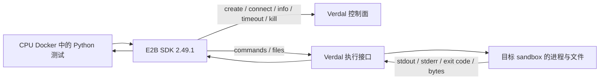

# 08 · Verdal：E2B 兼容 Sandbox 实验

本实验用 E2B Python SDK 调用真实 Verdal 服务，验证 Agent 所需的命令执行、文件读写、连接与实例生命周期。
**2026-09-13 的完整烟测使用 `e2b==2.49.1`，11 项检查全部通过；两轮测试创建的 4 个实例均已删除并确认返回 404。**
本次没有调用模型、运行 Agent benchmark 或更新策略参数。

## 要解决什么问题

Agent 产生代码或 shell 命令之后，需要一个地方执行，并把 stdout、stderr、退出码和文件内容返回。
Verdal 位于执行环境这一层。先验证 SDK 基础接口，才能继续判断 Harbor/Uni-Agent 是否可以接入完整任务。
完整烟测在本地 CPU Docker 内运行，不需要 GPU；远端模板需预装所用的语言运行时。

## 调用链路



图中控制面与执行接口按逻辑职责区分，不代表已经确认服务端部署了几个进程或使用何种虚拟化技术。
`E2B_API_URL` 决定生命周期 API 地址，`E2B_SANDBOX_URL` 决定命令/文件接口地址；两者可以指向同一个兼容网关。
SDK 使用实例 ID 与端口路由信息选择 sandbox，账户密钥与实例访问 token 用于各自的鉴权环节。

## 真实结果

| 能力 | 完整烟测中的结果 |
| --- | --- |
| 创建与 Shell | 创建成功，Linux/x86_64 命令输出与 exit=0 正确 |
| UTF-8 与二进制文件 | 中文文本 49 bytes、二进制 4096 bytes 完整回读 |
| 文件与进程共享状态 | files API 写入内容可由同实例的 `cat` 读取 |
| Python 执行 | 实际计算 1² + … + 10²，返回 385 |
| 错误反馈 | 故意 `exit 7`，准确得到退出码 7 与 stderr |
| 后台进程 | `background=True` 后 `wait()` 得到最终输出 |
| 重连 | 新客户端连接同一活跃实例后，原文件仍在 |
| 双实例区分 | 两个实例的测试文件双向不可见 |
| TTL 与清理 | 修改 TTL、查询状态成功；主动删除后返回 404 |

上表合并了部分项目，原始 11 项逐项记录在 [REPORT.md](REPORT.md)。
首次组合存在两个失败：模板没有 Python；旧版 `e2b==2.25.0` 重连后缺路由头，文件访问被拒绝。
更换预装 Python 的模板与 `e2b==2.49.1` 后完整检查通过；这不是严格的单变量性能对照。

## 怎样复现基础示例

1. 准备 Python 3.12 或 CPU Docker，安装 `e2b==2.49.1`，不需要下载模型。
2. 从自己的服务获取可用模板 ID、API 地址和 sandbox 网关地址；确认该模板有示例需要的软件。
3. 设置 `E2B_API_URL`、`E2B_SANDBOX_URL`、`E2B_TEMPLATE_ID`；脚本不提供默认服务或模板。
4. API key 由 `E2B_API_KEY` 注入，或在交互终端使用脚本的无回显输入。
5. 运行 [code/verdal_basic.py](code/verdal_basic.py)，检查 `passed`、命令输出、文件回读与 cleanup 结果。
6. 需要扩展时再按报告逐项加入后台进程、重连、二进制与双实例检查，最后删除本次创建的实例。

具体安装、环境变量占位值与 Docker 命令见 [REPRODUCE.md](REPRODUCE.md)。
保留的短脚本真实执行 create → command → files.write/read → finally kill，使用 60 秒 TTL。
它覆盖最小接口子集，没有重新实现原完整烟测的全部 11 项；运行短脚本成功不能直接声称 11 项全部复现。
命令等待超时也不等同于保证强制杀死远端进程；脚本始终尝试删除自己创建的实例，清理失败会非零退出并输出实例 ID。

## 如何放入 Uni-Agent

已核对的上游路径是：

```text
Uni-Agent HarborTask → Harbor E2BEnvironment → E2B SDK → Verdal
```

固定 Uni-Agent 版本没有原生 `e2b` sandbox provider，配置入口是 `name: harbor` 与 `harbor_env: e2b`。
Harbor 还涉及模板 alias 查询/构建、任务上传、verifier、日志回收和更长实例 TTL；这些能力没有包含在本次 SDK 验收内。
模型 Agent 接入时，远端 sandbox 还需能够访问模型服务/Gateway。SDK 可执行命令不代表 token 轨迹、reward 或 RL 已打通。
具体接口与待验收步骤见 [接入审阅](details/verdal-integration-review.md)。

## 建议阅读顺序

1. 本页：先区分执行环境烟测与完整 Agent/RL。
2. [REPORT.md](REPORT.md)：看 11 项结果与两次兼容问题。
3. [实现与调用链](details/verdal-sandbox-architecture.md)：看控制面、命令流和文件协议。
4. [REPRODUCE.md](REPRODUCE.md) 与 [参考代码](code/verdal_basic.py)：实际运行最小示例。
5. [接入审阅](details/verdal-integration-review.md) 与 [公共架构](../00-overview/architecture.md)：规划下一层验收。

## 结论边界

重连检查针对仍在运行的同一实例，没有验证关机恢复或快照迁移。
双实例文件不可见是功能检查，没有进行完整安全隔离审计；TTL 更新后也未等待自然到期。
SDK 接口已实测，Verdal 服务端实现未读源码；Harbor 完整任务、模型调用与 RL 属于后续独立实验。
