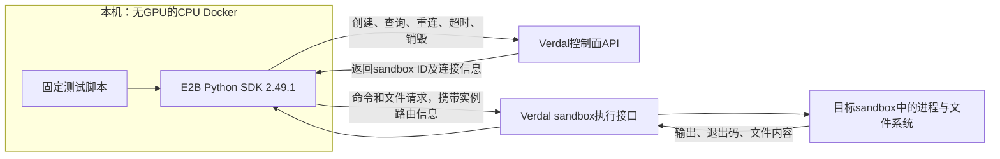

# Verdal烟测的实现、调用链与任务边界

依据：本机E2B2.49.1客户端源码、实际测试脚本和2026-09-13成功结果。本文没有新建远端资源，也没有读取或记录API key。可以确认客户端与兼容接口的行为；未读取Verdal服务端源码，不能据此断言其底层使用Docker、Kubernetes或某种microVM。

## 本次由谁负责什么

本机CPU Docker容器运行固定Python测试脚本。E2B SDK把Python方法转换为远端HTTP/RPC请求，Verdal端提供sandbox生命周期、进程执行和文件访问能力。脚本检查返回值、文件内容与退出码，最后删除自己创建的实例。

本轮任务由确定性脚本决定，没有LLM采样、Agent自主规划、业务benchmark verifier或RL参数更新。它证明的是后续Agent可依赖的一组执行环境功能。



图中远端模块按逻辑职责划分，不代表已确认Verdal部署了几个独立服务或执行daemon。E2B客户端调用envd兼容接口；服务端究竟直接运行envd还是由适配层实现相同协议，本次没有验证。

## 两个URL为什么相同仍能工作

`E2B_API_URL`与`E2B_SANDBOX_URL`这次都设置为`https://sandbox.example.com/e2b`。一个入口承载两类逻辑请求：

| 通路 | 主要作用 | SDK使用的路由（相对于对应base URL） |
| --- | --- | --- |
| 控制面 | 列出模板与实例 | `GET /templates`、`GET /sandboxes` |
| 控制面 | 创建实例 | `POST /sandboxes` |
| 控制面 | 连接已有实例 | `POST /sandboxes/{id}/connect` |
| 控制面 | 修改TTL、查询、销毁 | `POST /sandboxes/{id}/timeout`、`GET /sandboxes/{id}`、`DELETE /sandboxes/{id}` |
| 执行接口 | 启动命令 | `POST /process.Process/Start` |
| 执行接口 | 读取文件 | `GET /files?path=...` |
| 执行接口 | 写入文件 | `POST /files`；本次字符串/bytes采用multipart上传 |

控制面用账户API key（`X-API-KEY`）鉴权。执行接口的客户端路由信息包括`E2b-Sandbox-Id`与`E2b-Sandbox-Port: 49983`；create/connect若返回envd访问token，SDK再加`X-Access-Token`。路由头负责选择实例，token负责实例访问，两者职责不同。这里的49983是SDK约定的envd服务端口，客户端仍访问配置的网关URL。

API路径及header来自客户端实现核对，未进行包含凭据的抓包，也未保存token值。

## 一轮真实执行顺序

1. 查询服务已有模板。选用预装 Python / Node 的模板，模板声明2CPU、1024MB内存；本次没有构建新镜像或模板。
2. `Sandbox.create(template=<ID>, timeout=180)`创建主实例，传入测试标识metadata，获得sandbox ID及连接信息。
3. 对这个ID执行Shell/Python，并通过files API写读文本和二进制数据。
4. 验证后台进程、非零退出码，再通过`Sandbox.connect(id)`创建新的客户端连接，读取同一个仍在运行的实例中的文件。
5. 新建第二个实例，在两个ID之间交叉检查各自文件不可见。
6. 主实例`set_timeout(90)`，查询状态仍为running。
7. 在finally中分别kill两个测试ID，再查询对应ID得到404。第一轮失败对照的两个实例也经过同样清理，最终API列表为空。

成功这一轮从脚本记录的开始到清理完成约7.04秒，包含两个实例与11项检查；主实例创建约0.49秒。它们只是单轮观测，不是并发压测、稳定P99或冷启动性能结论。

## 命令是怎样执行并返回的

测试中的调用：

```python
sandbox.commands.run(
    "python3 -c 'print(sum(i*i for i in range(1,11)))'"
)
```

SDK将其组织成`ProcessConfig(cmd="/bin/bash", args=["-l", "-c", command])`，经Connect RPC的`process.Process/Start`提交。客户端消费服务端事件流：

```text
Start：取得PID
  → Data：收集stdout / stderr
  → End：取得exit_code
  → 返回CommandResult，或抛出携带输出的CommandExitException
```

本次Python命令实际返回385。故意执行`exit 7`时，SDK正确暴露退出码7与指定stderr，脚本将这项预期失败判为接口检查通过。

`background=True`会提前返回持有PID和事件流的handle；随后`handle.wait()`继续消费该流。本次后台命令是`sleep 1`后输出`background-ok`。它没有通过循环查询HTTP状态来等待。

一次`commands.run()`会启动新的Shell进程。同一sandbox的文件可以继续存在；前一次Shell里的临时变量或`cd`不应假定自动影响下一次调用，需要明确指定cwd或在同一个命令中执行相关步骤。

`commands.run(timeout=...)`在当前SDK中主要约束连接/事件流预算，不能直接解释为保证强制杀死远端进程。本次没有测试命令等待超时后的进程回收；正常退出与主动kill已验证。

## 实际完成了哪些任务

| 能力组 | 具体任务与结果 |
| --- | --- |
| 环境创建 | 创建主实例；命令返回Linux/x86_64、实例内UID0 |
| 文本与二进制 | 中文文本49bytes完整往返；4096bytes二进制逐字节及SHA一致 |
| 文件/命令共享状态 | files API写入的内容可被同实例Shell中的cat准确读出 |
| Python执行 | 计算1²+…+10²，结果385 |
| 异步与错误反馈 | 后台命令wait成功；故意exit7的退出码与stderr被准确传回 |
| 连接与状态 | 新客户端连接同一个活跃sandbox ID，先前文件仍在 |
| 实例区分 | 两个不同ID的测试文件双向互不可见 |
| 生命周期 | TTL更新接口接受；主动删除后GET返回404 |

对应原测试记录中的11项检查全部通过。重连结果仅证明仍在运行的同一个sandbox可再次连接，未验证关机恢复、快照迁移或节点故障恢复。TTL检查未等待90秒自然到期；双实例文件互不可见也不构成完整安全隔离审计。

## 两个兼容问题为何出现

第一轮选择`ubuntu`模板，里面没有python3，执行命令返回127。换用已有Python模板后，该任务成功；因此模板决定可用的软件环境，API连通本身不保证存在任意语言运行时。

第一轮E2B2.25.0在重连后文件访问报unauthorized。源码中该版本create添加了sandbox ID/port路由头，connect却缺失；2.49.1已在connect中补齐。新版配合Python模板的完整实测通过。本次没有改SDK源码，也没有绕过API鉴权。由于两轮同时换了SDK与模板，报告分别说明这两个问题，不将整轮差异当作严格单变量实验。

## 放回Uni-Agent / Agentic RL架构中

Verdal承担执行环境这一层。后续完整任务的角色分工可以是：模型产生动作；Uni-Agent/Harbor组织任务；Verdal执行命令和文件操作并返回观察；verifier判定任务结果；训练器再用reward及模型轨迹更新策略。

已核对的现成接入路径是`Uni-Agent HarborTask → Harbor E2BEnvironment → E2B SDK → Verdal`，使用`name: harbor`与`harbor_env: e2b`。当前Uni-Agent原生sandbox registry没有e2b provider。

这条完整链还未实测：Harbor0.22.0涉及template alias查询/必要时构建、86400秒lifetime、任务文件上传、agent与verifier及日志回收。正式接模型时还要确保远端sandbox能访问模型API/Gateway；远端的127.0.0.1指向远端实例自身。Gateway token轨迹与RL训练也需要另外验收。

## 证据入口

- 实际测试脚本（原始文件：`scripts/verdal_sandbox_smoke.py`）
- 复跑封装（原始文件：`scripts/run_verdal_smoke.py`）
- 成功原始结果（原始文件：`results/verdal-sandbox-20260913/uni-agent-verdal-57be2652bf9d/report.json`）
- 清理与凭据留存检查（原始文件：`results/verdal-sandbox-20260913/final-validation.json`）
- [配置与操作说明](../REPORT.md)
- [Uni-Agent/Harbor源码接入核对](verdal-integration-review.md)

SDK源码参考：`e2b/sandbox_sync/commands/command.py`的run/_start，`e2b/envd/process/process_connect.py`的Start路由，`e2b/sandbox_sync/filesystem/filesystem.py`的read/write，以及`e2b/sandbox_sync/main.py`的create/connect构造。它们位于本机`envs/verdal-current/lib/python3.12/site-packages/`，版本锁为E2B2.49.1。
