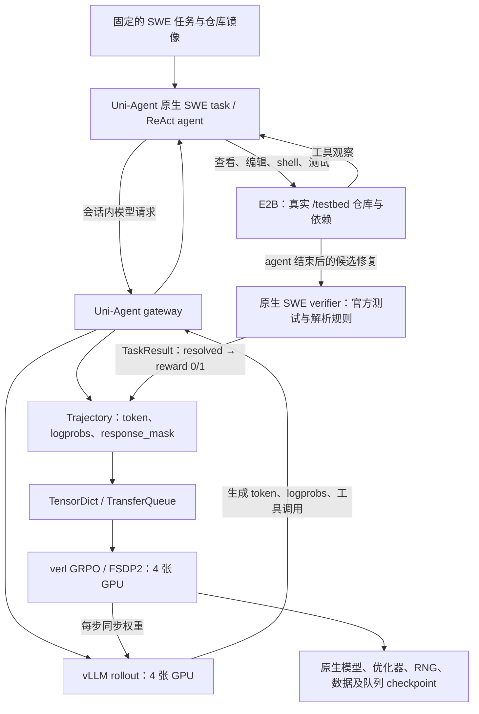

# SWE / E2B / Uni-Agent / verl：Qwen3-8B 强化学习阶段报告

> **临时状态报告，截点为 2026-09-15 00:41 UTC。训练当前已停止，没有自动续跑任务在运行。300 步目标尚未完成，也没有证据证明模型性能提升或训练收敛。** 目前保留 step 8 的完整原生 checkpoint，正在准备主机重启后的恢复方案。本次恢复所需的主机重启尚未执行、也未获得授权；该主机还有其他用户及 kubelet 服务，不能自动重启。

本实验已实际运行端到端多轮代码修复 RL，重点验证真实 E2B 执行、官方测试奖励、轨迹掩码、参数更新和中断恢复。运行标识为 `swe8b300_20260914_a`；[W&B 历史记录](https://wandb.ai/yuhanya-amd/uni-agent-swe-e2b/runs/swe8b300_20260914_a)与本地证据共同保留，图表中的历史步号不代表当前训练仍在运行。

## 执行方式

模型为官方 `Qwen/Qwen3-8B`，固定 revision `b968826d9c46dd6066d109eabc6255188de91218`，没有使用此前 MemAgent 的训练 checkpoint 初始化。选择 8B 是为了在现有八张 AMD ROCm GPU 上同时部署四张 FSDP2 trainer GPU 与四个 TP=1 vLLM rollout 副本，优先验证完整链路和迭代速度，并非声称它是 SWE 的最佳模型。

ReAct 在训练节点的 runner 中运行，通过 `SessionHandle.base_url` 调用 gateway；工具命令在远端 E2B 中执行。会话结束后产出 `Trajectory`，任务返回 `TaskResult`，framework 将奖励和完成状态附加到轨迹再交给 verl。奖励沿用官方 SWE 的 `FAIL_TO_PASS` / `PASS_TO_PASS` 判定，取 `float(resolved)`，没有模型裁判。基础设施错误或无有效 verifier 输出的 session 单独报错，不静默计为模型失败。

`response_mask=1` 只标记模型生成 token；工具观察及插入的对话边界为 0。观察仍占上下文、参与注意力，但没有直接策略损失。原生 ReAct 工具为 `str_replace_editor`、`stateful_shell`、`submit`，最多 32 步、16K 总上下文、单轮最多生成 2,048 token。

主要训练设置为全参数 GRPO、每批 2 个任务×每任务 4 条 rollout、token-mean 损失、KL 系数 0.01、LR `1e-6` 与 4 步 warmup、FP32 主状态 / BF16 计算、SDPA。原训练采样为 temperature 1、top_p 0.7；恢复配置在 checkpoint 8 边界明确改为 top_p 1.0，旨在增加探索。**该改动尚未产生新的有效训练步，不能作为已验证的改进。**

## 数据与无模型对照

本次使用 **26 个训练任务、8 个开发任务**，任务 ID 不重叠。数据是经过镜像及运行环境筛选的 SWE-bench Verified 子集，来源为其**官方 test split**，部分任务已有历史模型结果。因此这是诊断性实验，不是官方排行榜评测，也不支持无污染或泛化结论。重复采样同一任务不增加独立样本数。

这 34 个任务另做无模型的 verifier 对照：**baseline 0/34 resolved，gold 34/34 resolved**；50 个目标失败测试转为通过，1,971 个回归测试保持通过。“34 controls”指同一任务集的奖励链路检查，不是额外测试集，更不能计作模型成功率。

运行时数据删除了 gold `patch`。Gold 仅用于独立对照；官方 `test_patch` 留在私有任务 metadata 中，供 agent 结束后评测使用，不进入 prompt，也不提前安装。

## 已完成多少、学到了什么

| 指标 | 已有证据 |
|---|---|
| 完整本地训练指标 | 步 1–19；共 152 条训练 rollout |
| 短暂的额外更新 | 四个 rank 均有 step 20 optimizer 审计，但无完整指标、rollout dump 或已提交 checkpoint |
| 持久恢复边界 | **step 8**；32 个原生文件，约 91.56 GiB |
| 历史训练 resolved | **5/152（3.29%）** |
| 初始开发集 resolved | **0/8**；没有后续开发集结果 |
| 四条 rollout 的混合奖励组 | **1/38**；只有一个组同时有成功与失败 |
| 恢复尝试新增步数 | attempt-003、004 均为 **0** |

唯一非零 GRPO 奖励优势发生在 step 1，此时 warmup 的实际 LR 为 0。Step 2–19 的奖励优势和策略梯度损失均为 0。Adam 动量历史与 KL 正则仍可能改变参数，因此“optimizer 计数增加、参数改变”不能证明任务奖励带来了有效学习。当前没有成功率提升或收敛证据。

已审计的两个训练批次中，工具观察约占响应序列的 88% 和 91%，对应 mask 均为 0；按生成 token 重新计算的 PPL、优势与日志吻合。低指标并非由观察 token 稀释分母造成，但大量观察会挤占 16K 上下文；重复工具调用、错误文件上的循环和截断均需要后续处理。

有界 CPU 检查在原始模型的一段 28-token JSON 工具调用上复现了 top_p 0.7 的单候选输出及全部零 processed logprob。前缀对照未发现该位置的未来信息泄漏，源码审计未发现标签错位。这支持调整探索策略，但不能解释全程低熵，也没有建立精度 bug。

## 中断与恢复经过

1. 9 月 14 日，step 8 提交后通过原生恢复验收，继续运行至本地完整 step 19，并留下短暂 step 20 更新。随后运行环境发生外部中断、Docker exec 断开，之后主机重启。初始中断的触发原因尚未查明。Step 9–20 属于未提交的历史分支，不计为恢复后的持久进度。
2. 重启后发现两个旧 ROCm 诊断客户端仍持有 KFD/DRM 引用。八卡 BF16 检查、默认路径 128 MiB H2D/DtoH 及约 2.49 GB 独立 FP32 张量传输通过，但 attempt-003 仍在 FSDP 初始化时停顿，随后停止。
3. 默认八 rank RCCL 探针在 45 秒期限内未完成；关闭 SDMA 的探针通过。attempt-004 确认各 rank 的环境设置后仍在 FSDP 分片初始化停顿，随后停止。**关闭 SDMA 不是已验证的训练恢复方案。** 不使用分布式/FSDP 的实际完整模型参数复制也在首个 embedding 处达到 90 秒期限。
4. **9 月 15 日 00:33:28 UTC**，使用 release `/usr/bin/amd-smi` 发起一次覆盖全部八卡的 XGMI hive reset，没有抑制 ASan 检查。**00:33:54** 的内核日志逐卡报告 reset succeeded，CLI 也成功退出。
5. Reset 并未恢复完整模型复制。最终落盘日志显示：reset 后的原始 CPU tensor 路径完成前 8 个参数、累计约 2.86 GB，停在第 0 层 MLP `up_proj.weight` 复制前，随后达到 90 秒期限；另一个先 clone CPU 源 tensor 的对照停在首个 embedding，亦达到 90 秒期限。两次探针的子进程均已退出。旧 KFD 客户端仍残留，根因尚未完全定位；不能将“reset 成功”当作“训练已恢复”。

当前训练和自动续跑均已停止。本轮尚未再次执行主机重启；由于主机存在其他用户与 kubelet 服务，重启恢复需要明确协调和授权。恢复后仍须通过实际模型传输、原生 checkpoint 加载、新 optimizer 进度与持久 checkpoint 验收，才能继续报告训练进展。

开机恢复方案现已准备并通过 5 项 CPU 检查、源码/data hash 校验和 systemd 单元检查，尚未安装或启用服务。参见[恢复步骤与边界](/data2/yuhanya/swe-e2b-rl-20260914/code/REBOOT_RECOVERY.md)、[恢复脚本](/data2/yuhanya/swe-e2b-rl-20260914/code/resume_after_reboot.py)和[当前状态记录](/data2/yuhanya/swe-e2b-rl-20260914/run/current-status.json)。它会拒绝在已知异常的本次 boot 上运行，也会在发现其他 KFD 客户端或完整模型传输失败时停止。重启后的运行结果尚未验证。

原生 checkpoint 保存模型、optimizer、scheduler/RNG、dataloader 和 TransferQueue；step 8 已核验提交指针、文件尺寸、记录的首/中/尾探针和 ZIP 目录，此前的四 rank 恢复也匹配保存状态。这些检查不等于重新计算全部 checkpoint 字节哈希，异步在途任务也不保证逐 token 重放。

## 可追溯证据

以下链接指向本机保留的原实验工作区；本目录只新增说明，没有复制模型、checkpoint、环境、包或大日志。旧状态文件各有时间截点，当前停机状态以本报告开头为准。

- [完整工作记录](/data2/yuhanya/swe-e2b-rl-20260914/WORKLOG.md)、[历史训练与 checkpoint 审计](/data2/yuhanya/swe-e2b-rl-20260914/docs/STATUS-20260915.md)、[机器可读恢复证据](/data2/yuhanya/swe-e2b-rl-20260914/results/recovery-evidence-v3.json)。
- [任务划分及已知偏差](/data2/yuhanya/swe-e2b-rl-20260914/data/split-manifest.json)、[模型来源审计](/data2/yuhanya/swe-e2b-rl-20260914/results/precision-audit/model-provenance-metadata.json)、[采样与精度诊断](/data2/yuhanya/swe-e2b-rl-20260914/results/precision-audit/REPORT.md)。
- [E2B runner](/data2/yuhanya/swe-e2b-rl-20260914/code/swe_e2b_runner.py)、[sandbox 适配层](/data2/yuhanya/swe-e2b-rl-20260914/code/swe_e2b_sandbox.py)、[恢复时的采样策略](/data2/yuhanya/swe-e2b-rl-20260914/run/swe8b300_20260914_a/sampling_policies/attempt-003.json)。
- [Hive reset 结果](/data2/yuhanya/swe-e2b-rl-20260914/results/recovery-20260915/hive-reset-result.json)、[逐卡内核记录](/data2/yuhanya/swe-e2b-rl-20260914/results/recovery-20260915/hive-reset-kernel.log)。
- [Reset 后参数复制日志](/data2/yuhanya/swe-e2b-rl-20260914/results/recovery-20260915/model-transfer-after-reset/model-transfer-20260915T003515Z-5794.jsonl)、[超时结果](/data2/yuhanya/swe-e2b-rl-20260914/results/recovery-20260915/model-transfer-after-reset/model-transfer-20260915T003515Z-5794.result.json)、[clone 对照结果](/data2/yuhanya/swe-e2b-rl-20260914/results/recovery-20260915/model-transfer-clone/model-transfer-20260915T003656Z-5824.result.json)。
