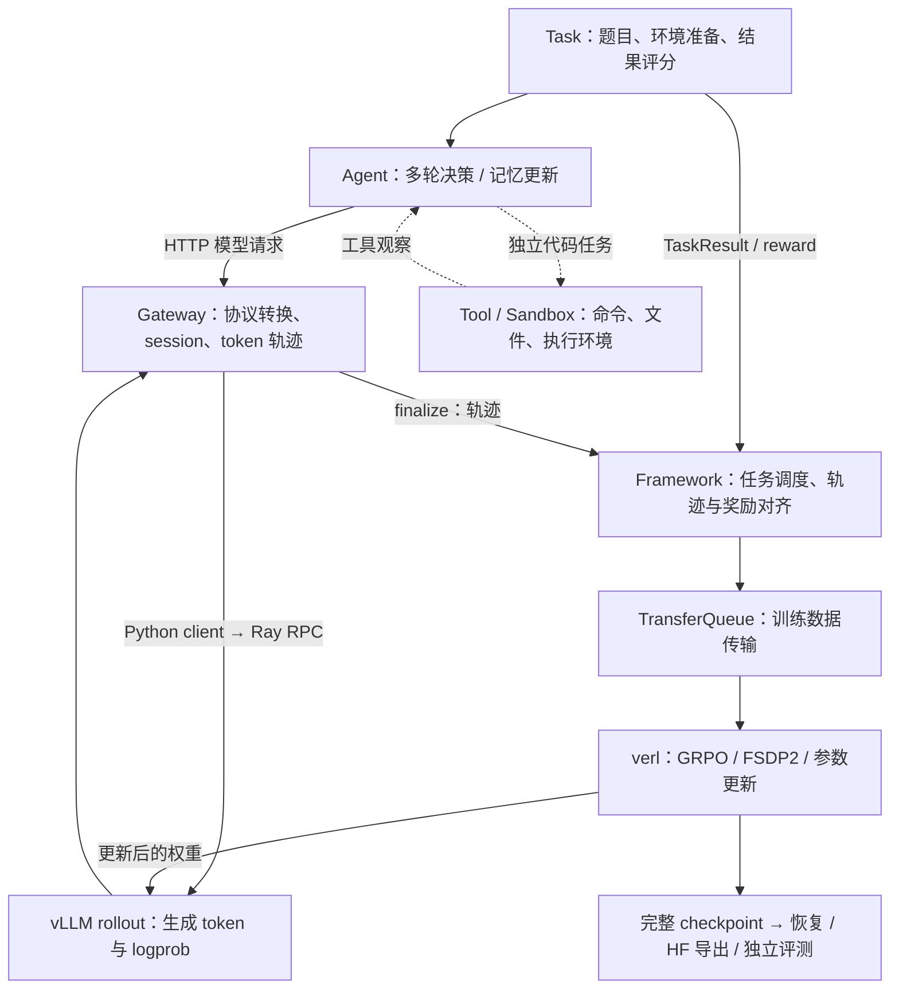
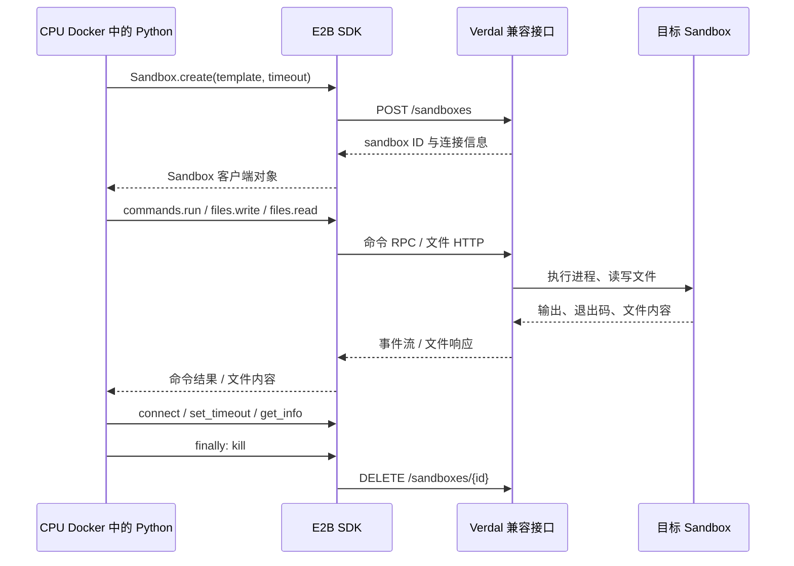
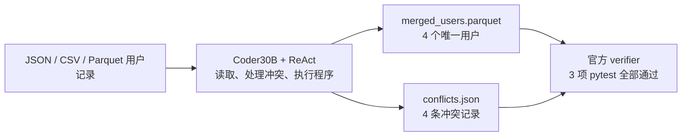

# Uni-Agent：架构、Agentic RL 链路与实测结果

**汇报主题：让 Agent 的任务执行过程成为可训练、可评估、可恢复的数据闭环。**  
实验依据：2026 年 9 月 11–13 日，ROCm / gfx950 八卡节点上的实际运行记录。建议按本文顺序讲解，约 10–15 分钟。

## 本次可以汇报的结论

Uni-Agent 将 Agent、任务、工具环境和模型调用统一到同一套运行框架中，并与 verl 配合完成强化学习。本次已经跑通 **32B 全参数训练 → 完整断点恢复 → 最终模型回载 → 独立评测**，也验证了 Verdal 的命令、文件与实例生命周期接口。

重点展示两个案例：**Verdal 执行环境**与 **Qwen3-32B 的 128 步 RL 长训练**。另用 Terminal-Bench 的数据合并任务展示 Agent 实际如何操作工具、交付文件并接受测试。

| 展示内容 | 实际模型 / 任务 | 本次完成的事 |
| --- | --- | --- |
| 案例一：Verdal Sandbox | 无模型；E2B SDK 功能测试 | 11 项检查通过，两轮共 4 个实例全部清理 |
| 案例二：32B 长训练 | Qwen3-32B；MemAgent / HotpotQA 长文问答 | 128 步全参数 RL；独立 64 题平均 LCS **0.4209 → 0.5601** |
| Terminal-Bench 任务展示 | 原始 Qwen3-Coder-30B-A3B-Instruct；ReAct | 数据合并任务通过官方 3 项测试；三题整体 resolved **1/3** |

**结果口径：本轮 32B RL 训练的是 MemAgent，并非 Terminal-Bench；Terminal-Bench 使用的是另一个原始 Coder30B 模型。本文分别展示“任务执行能力”和“长训练效果”，不把 Terminal-Bench 的成功归因于这次 32B RL。**

## 1. Uni-Agent 是什么

[Uni-Agent](https://github.com/verl-project/uni-agent) 是 verl 生态中面向长程 Agent 的推理、评估与强化学习运行框架。它提供 Python 抽象、分布式运行组件，以及供 Agent 调用的模型 Gateway；训练优化由 verl 等后端承担。

普通模型训练主要处理一段输入和一段输出。Agent 则会反复调用模型、执行工具、读取环境反馈，直到任务结束。Uni-Agent 要解决的是：**如何把这种多轮、带状态、会产生分支的执行过程，整理成正确的训练数据。**

它允许两类 Agent 接入：

- **可修改内部逻辑的 Agent**：例如原生 ReAct、MemAgent，可以分别扩展 Agent、Tool、Task 和 Sandbox。
- **已有的外部 Agent 程序**：例如真实 Claude Code CLI、Mini-SWE。通过 OpenAI / Anthropic 兼容模型接口接入 Gateway，保留各自的工具循环。

本次 Claude Code 案例中的 CLI 是真实程序，但其模型请求指向本地 Qwen。使用 Anthropic 协议不代表使用了 Anthropic 的模型权重。

## 2. 架构：任务执行、模型生成与训练更新如何衔接

下图以本次 MemAgent 训练为主线。虚线的 Tool/Sandbox 分支展示代码任务的接入位置，本轮在独立推理案例中验证，未用于 32B 训练。MemAgent 的文档分块由程序控制，不需要执行 Shell。



| 层次 | 组件 | 负责什么 |
| --- | --- | --- |
| 任务与决策 | Task、Agent | Task 定义目标和评分；Agent 决定下一步生成什么、调用什么工具 |
| 执行环境 | Tool、Sandbox | 执行命令、读写文件、返回 stdout / stderr / 退出码；本次代码任务使用 Docker |
| 模型接入 | Gateway、生成后端 | 给 Agent 提供兼容模型接口，保留采样时的 token、mask、logprob 与关联信息 |
| 数据组织 | Framework、TransferQueue | 并发运行任务，取得结果与轨迹，附加奖励和完成状态，组织为训练张量 |
| 学习与持久化 | verl、FSDP2、checkpoint | 计算优势和策略损失、更新参数、同步 rollout 权重、保存与恢复训练状态 |

这些组件不都等于独立 HTTP 服务。**Agent 到 Gateway 是模型 HTTP 请求；会话控制、任务分发和训练后端生成还使用 Python / Ray。** 本次训练中，Gateway 后面的生成调用通过 verl 的 Python client 和 Ray 到达 vLLM，不能把整条链都理解成 OpenAI API 转发。

Verdal 位于执行环境这一层。本轮单独验证了它的 SDK 接口，尚未把 Verdal 接进上图的完整 RL 训练链路。

## 3. API：哪些给 Agent 用，哪些给框架用

### 3.1 Gateway 的模型 HTTP API

本次固定版本注册了两个模型业务路由：

| 接口 | 使用方式 | 本次用途 |
| --- | --- | --- |
| `POST /sessions/{id}/v1/chat/completions` | OpenAI Chat Completions 兼容 | MemAgent 训练、Mini-SWE 等模型调用 |
| `POST /sessions/{id}/v1/messages` | Anthropic Messages 兼容 | 真实 Claude Code CLI 接本地模型 |

框架先创建 session，取得形如 `http://host:port/sessions/<id>/v1` 的专属 `base_url`，再交给 Agent。Agent 继续发送熟悉的模型请求；未知 session ID 返回 404。这里提供的是兼容所需的模型接口，并非完整实现两家的全部产品 API。

### 3.2 会话管理与扩展接口

| 接口 | 调用方式 | 实际职责 |
| --- | --- | --- |
| `create_session(...)` | GatewayManager 的 Python / Ray 调用 | 创建会话，返回 `SessionHandle` 和模型 `base_url` |
| `finalize_session(id)` | Python / Ray | 返回 `list[Trajectory]`，随后移除会话 |
| `abort_session(id)` | Python / Ray | 中止、丢弃会话状态；不等同于已验证的底层生成强制取消 |
| `get_session_state(id)` | GatewayActor 方法 | 查看活跃会话的 phase、chain、rollback 等状态；Manager 没有同名代理 |
| `Task.run()` / `run_task(...)` | Python；可由框架通过 Ray 分发 | 执行任务，返回含奖励和完成状态的 `TaskResult` |
| `Agent.run()` / `Tool.run(...)` | Python 扩展接口 | 实现多轮策略与工具动作 |
| `Sandbox.exec_shell/read_file/write_file` | Python 执行环境接口 | 把工具动作落实为命令与文件操作 |

**固定版本没有 Gateway 的“HTTP 创建任务、提交 reward、下载 trajectory、执行 Sandbox、启动训练”业务端点。** 这些能力分别属于框架控制接口、任务评分、执行环境和训练后端。

接口生命周期可以概括为：

```text
Framework 创建 session
  → 把 session.base_url 交给 Agent
  → Agent 多次请求模型，并按任务需要执行工具
  → Task 返回结果与 reward
  → Framework finalize 会话、取回 trajectories
  → 附加奖励与状态，写入 TransferQueue
  → verl 消费训练数据并更新模型
```

## 4. 针对 Agentic RL 的关键设计：trajectory

### 4.1 为什么聊天记录还不够

训练需要知道：模型实际采样了哪些 token、当时的概率是多少、哪些内容来自环境，以及最终任务得分属于哪次执行。只保存一份聊天文本再重新分词，可能无法还原采样时的 token 序列与概率。

Gateway 因此保留 **token 级 trajectory**。一个任务 session 可以包含多条轨迹；一个连续上下文片段也可能包含多轮生成与工具观察。题目数、session 数、context 数、API 调用数和训练步数需要分别计数。

| 主要字段 | 含义 | 对训练的作用 |
| --- | --- | --- |
| `prompt_ids` | 起始输入的 token IDs | 还原模型所见的初始上下文 |
| `response_ids` | 模型输出，加上续接时插入的工具观察 / 上下文 token | 保存连续执行所用的真实 token 序列 |
| `response_mask` | 与 response 对齐；模型输出为 1，插入上下文为 0 | 让策略损失区分模型动作与环境反馈 |
| `response_logprobs` | 可选的采样 logprob，逐 token 对齐；上下文位置为占位值 | 与训练时重算的 logprob 配合计算策略更新 |
| `reward_score`、`finished` | 结果奖励与执行完成状态 | 由 Framework 根据 Task/Runner 结果附加；`finished` 不代表答对 |
| `chain_id`、`extra_fields` | 上下文链标识，以及后端报告时的权重版本范围等 | 追踪多轮、并发和异步生成的数据来源 |

工具型轨迹的示意如下；这是一段结构说明，并非伪造的实验日志：

```text
初始输入：题目、系统提示、已有上下文

response：模型生成工具动作 | 环境返回工具观察 | 模型生成最终答案
mask：          1 ...     |      0 ...       |       1 ...
```

`response_ids` 中含有观察，并不表示观察也要作为模型动作学习。Gateway 返回的 `reward_score`、`finished` 默认尚未赋值；Framework 在拿到任务结果后补齐，并将数据转成训练张量。关联 session 的信息也会在框架的数据组织阶段附加，并非所有关联字段都在 Trajectory 顶层。

### 4.2 从轨迹到真正的 RL

| 能力 | 本次对应的机制与验证 |
| --- | --- |
| 复用多种 Agent | 同一个 Gateway 能接 OpenAI / Anthropic 协议；真实 Claude/Mini 接入已做推理与轨迹验证 |
| 保持多轮训练数据一致 | 保留 token、mask、logprob；按 chain 管理续接。源码还提供分支与 rollback 处理，不把所有会话强行拼为一条字符串 |
| 把任务结果变成学习信号 | 本次 MemAgent 使用最终答案的 LCS 奖励，同一 session 的结果奖励关联到其各条轨迹；没有采用逐工具动作的过程奖励 |
| 支持并发和异步运行 | Framework 调度任务，TransferQueue 传输训练数据，verl 使用 separate_async 组织采样和更新 |
| 跟踪策略版本 | 后端报告时以 `min_global_steps/max_global_steps` 记录轨迹跨越的权重版本范围；它不是逐 token 的完整版本标签，也不自动保证严格 on-policy |
| 持续训练与恢复 | 训练侧及本次 durable 提交机制保存模型、优化器、RNG、数据与队列状态；32B 已验证两次真实恢复 |

本次 32B 使用 GRPO：同一道题采样 4 次，奖励减去同组均值形成相对优势，使用 token-mean loss 和 KL 正则。优势不除以组内标准差，但这不等于完整复现了上游 DrGRPO 配方。

**训练完成的证据必须越过“有轨迹”这一层：还要看到有效奖励、优化器更新、参数变化、权重同步，以及最终模型的独立任务评测。** 上述可训练数据依赖能返回真实 token IDs / logprobs 的后端，不能假定任意第三方文本 API 都提供同等信息。

## 5. 案例一：Verdal Sandbox——验证 Agent 的执行环境

### 任务与调用链

目标是验证后续 Agent 能否可靠地执行命令、读写文件、重连实例并回收资源。测试脚本运行在 CPU Docker 内，通过 **E2B SDK 2.49.1** 调用 Verdal；远端使用预装 Python 的模板。



两类接口承担不同职责：生命周期包括 `POST /sandboxes`、`POST /sandboxes/{id}/connect`、查询、修改 TTL 和删除；执行包括 `POST /process.Process/Start` 与文件 GET/POST。它们是 **Verdal/E2B 的接口，不是 Uni-Agent Gateway 的额外路由**。

### 实际结果

| 检查 | 结果 |
| --- | --- |
| 创建与 Shell | 创建成功，stdout、退出码正确 |
| 文本与二进制 | 49-byte 中文文本、4096-byte 二进制完整回读 |
| 文件与进程共享状态 | files API 写入的文件可以被同实例 Shell 正确读取 |
| Python 执行 | 实际计算 `1² + … + 10²`，返回 **385** |
| 错误与后台任务 | 准确传回 `exit 7` / stderr；后台进程 wait 成功 |
| 重连与实例区分 | 重连活跃实例后文件仍在；两个实例的测试文件互不可见 |
| 生命周期 | TTL 修改和查询通过；两轮共 4 个实例删除后均确认 404 |

上表合并展示了完整报告中的 **11 项通过检查**。它证明执行接口与生命周期在本次条件下可用，为把模型动作变成可验证的环境操作提供了基础。

本轮没有调用 LLM 或运行 RL，也没有实测 `Uni-Agent HarborTask → Harbor E2BEnvironment → Verdal` 的完整任务链。该路径已做源码核对，仍需联调；本次也没有据客户端行为推断服务端采用哪种容器或虚拟机技术。

可演示代码：[verdal_basic.py](08-verdal-sandbox/code/verdal_basic.py)；运行步骤：[Verdal 复现说明](08-verdal-sandbox/REPRODUCE.md)。保留的短脚本覆盖创建、命令、文件与清理，不等于重新执行全部 11 项检查。

## 6. 案例二：Qwen3-32B——128 步 Agentic RL 长训练

### 6.1 训练的任务是什么

任务是 **MemAgent 长文问答**：每次读取约 5,000 token 的文档块，结合上一轮记忆，生成最多 1,024 token 的新记忆；读完后生成最终答案，以参考答案的原生 token-LCS 得分作为奖励。模型学习生成记忆与答案，文档块顺序由程序控制。

训练输入为 512 个源题，每题采样 4 次完整执行；每个 global step 处理 4 个源题，因此完成一轮需要 **128 个 global steps**。另设 64 题 monitor 和不重合的 64 题 external，最后固定使用 step128 做评测。

| 条件 | 本次设置 |
| --- | --- |
| 模型 | Qwen3-32B dense，全参数训练 |
| 设备与执行 | ROCm / gfx950；4 GPU FSDP2 trainer + 2 GPU TP2 rollout；Docker |
| 优化 | GRPO，组内均值中心化、不除标准差；token-mean loss，KL 0.01 |
| 精度与学习率 | FP32 master / BF16 compute；峰值 LR 1e-6，4 步 warmup |
| 保存 | 每 8 步保存完整状态；已验证 step8→9 与 step32→33 恢复 |

### 6.2 长训练得到了什么结果

主展示采用预先固定的稳定推理协议：`VLLM_BATCH_INVARIANT=1 / TRITON_ATTN`，同一组 external64、greedy、匹配的 base/final 环境。

| 指标 | Base | Final128 | 变化 |
| --- | ---: | ---: | ---: |
| 平均原生 LCS | 0.42091 | **0.56012** | **+0.13921** |
| LCS=1 题数 | 20/64 | **26/64** | **+6 题** |
| 有效评测完成数 | 64/64 | 64/64 | 两侧均无错误 |

按问题配对的 95% bootstrap 区间为 **[+0.04010, +0.24014]**。19 题升分、7 题降分、38 题同分。Base 与 final 分别重复一遍，各自的 64 条最终回答和奖励均完全一致；重复运行没有增加题目数或训练 seed 数。


默认 ROCm attention 后端也保留了独立配对结果，但重复波动明显。这里选择稳定协议作为主要展示口径，不把不同协议混配，也不改用其中最高的分数。

### 6.3 两个适合讲述的真实答案改善

| 问题 | 材料中的关键关系 | Base → Final128 |
| --- | --- | --- |
| 某飞行测试中队所在基地的命名对象，试飞了哪种飞机？ | 文档 10：中队在 Hill Air Force Base；文档 191：基地以 Ployer Peter Hill 命名，他死于 B-17 原型机试飞 | Verville-Sperry R-1 → **B-17 Flying Fortress**；LCS **0→1** |
| Nerdist Industries 的 CEO 曾作为嘉宾参加哪个播客？ | 文档 191 确认 CEO 为 Chris Hardwick；文档 154 的 Comedy Film Nerds 嘉宾名单包含他 | Maltin on Movies → **Comedy Film Nerds**；LCS **0→1** |

第一题需要关联分散在 200 份文档中的人物与飞机；第二题需要区分“平台上发布的节目”和“本人作为嘉宾出现的节目”。源文核对支持最终答案更符合目标关系。

这些是完整 64 题中的说明案例，不能替代总体统计。正式 external 没有保存完整中间 memory，因此不能据此描述“某一次记忆压缩如何被训练改善”；同时确实存在 7 道降分题。

### 6.4 工程规模、成本与可信度

| 项目 | 实际记录 |
| --- | --- |
| 训练消费 | 512 个不同源题各一次，**2,048 sessions、13,872 个真实 contexts**，另有 464 padding |
| 优化进度 | 128 global steps；四个 rank 的 Adam counter 各为 **896**，不将四 rank 相加 |
| 迭代耗时 | 记录迭代约 **7 小时 46 分**；普通 step 中位约 **163.3 秒** |
| 整体墙钟 | 约 **11 小时 33 分**，包含初始化、暂停、中断等待与恢复 |
| 持久化产物 | 完整 native checkpoint 约 **366.3 GiB**；最终 BF16 HF 约 **61 GiB** |
| 参数更新证据 | 抽检 9 个完整张量，约 2.52 亿个元素中 **29.31%** 的 BF16 值变化；仅代表抽检范围 |

训练覆盖已在恢复后逐题核对，旧中断实验的步骤没有混入这 128 步。完整状态恢复保留了优化器、RNG、数据和队列边界，验证后继续了实际训练。


Monitor 从 0.49446 到 0.59384，中间有波动；终点仍按预定 step128 选择。**Monitor 与 external 是两组题，图中的过程分数不能与上一张外部对照拼成一条曲线。**

这一结果支持“固定长文问答任务上的评分改善和完整训练闭环”。它来自一次训练、64 道外部题；两道窄格式变化约占净增的 11.22%，剩余变化也不能全部称为新增知识。LCS=1 是本次评分定义，不等于另行实现的标准 HotpotQA EM，更不能直接外推为 Terminal-Bench 的提升。

## 7. 补充任务展示：Terminal-Bench 的多源数据合并

**展示模型是原始 Qwen3-Coder-30B-A3B-Instruct，并非上述 RL 后的 Qwen3-32B。** 本任务用来展示 Agent 实际完成工具任务的过程。

选择 `multi-source-data-merger`：读取 JSON、CSV、Parquet 中的用户记录，按来源优先级处理冲突，生成统一数据表与冲突报告。



模型通过 **25 次模型响应、25 次工具调用**完成任务。过程中曾把二进制 Parquet 当成 UTF-8 文本读取而失败，随后改用程序读取并完成提交。输出中的 `user_id` 为 int64，其余列为 string；最后依据实际产物和官方测试判定成功。

这条推理路径是 `TerminalBenchTask → ReAct → vLLM Chat API + Docker Sandbox → verifier`。Harbor 只用于获取任务，执行由 Uni-Agent 原生 Task 完成；本次没有经过训练 Gateway、TransferQueue 或 optimizer。

### 成功案例之外，保留整个诊断集

| Terminal-Bench 任务 | resolved：官方测试通过 | finished：Agent 正常结束 | 主要观察 |
| --- | ---: | ---: | --- |
| 多源数据合并 | **1** | true | 正确产出合并表与冲突报告 |
| RStan → PyStan 迁移 | 0 | false | 上下文停止阈值触发，所需 CSV 未完整产出 |
| Alpine 虚拟机与 SSH | 0 | true | Agent 已提交说明，但 SSH 测试失败 |
| **合计** | **1/3** | **2/3** | 成功与正常结束分别统计 |

同三题均有有效的 **baseline=0、官方 oracle=1** 控制，并确认 pytest 实际执行。三题来自资源筛选后的固定诊断子集，执行预算也受限；它们不是官方完整排行榜成绩。

如果下一阶段要报告“32B 在 Terminal-Bench 上经过长训练得到提升”，需要另行建立该任务的训练/验证划分、接入对应奖励，实际训练后再做**同一模型 base 与 final 的匹配对照**。现有结果尚不包含这项结论。

## 8. 对后续工作的判断

本轮已经取得两类可复用资产：一套在 ROCm 上实际运行过的 32B Agentic RL 训练与恢复方法，以及经过命令、文件和生命周期验证的 Sandbox 接口。Terminal-Bench 的成功案例展示了把模型动作转化为真实文件产物、再由外部测试验收的过程。

下一步建议围绕同一类任务收敛：先扩大 Terminal-Bench 的固定评测集并保存完整工具轨迹，再验证该任务上的 RL 改善；Verdal 则先接通 Harbor 的任务、oracle 与 verifier，完成执行环境联调后再进入训练。这样才能把“执行环境可用”“任务能完成”和“训练确实提高任务表现”接成同一条证据链。

## 资料与版本

本文 API 按实验固定的 Uni-Agent `472c875a97f9a2764c81a6ec7581167632bd8bcc` 描述，训练配套 verl 为 `a9f2985159536a607211dcac730d3f5d55028950`；上游后续版本的接口可能变化。上述成绩均为本次实测，不引用官方其他模型的 benchmark 分数作为本机结果。

- [架构与全部接口](00-overview/architecture.md) · [交互架构图](00-overview/diagrams/index.html)
- [Gateway API 核对](01-cpu-sandbox-gateway/details/gateway-api-map.md) · [固定版 Trajectory 源码](https://github.com/verl-project/uni-agent/blob/472c875a97f9a2764c81a6ec7581167632bd8bcc/uni_agent/gateway/session/types.py)
- [Verdal 完整测试结果](08-verdal-sandbox/REPORT.md) · [客户端与接口链路](08-verdal-sandbox/details/verdal-sandbox-architecture.md)
- [32B 训练与评测报告](03-memagent-32b-rl/REPORT.md) · [答案与源文复核](03-memagent-32b-rl/details/32b-final-stable-case-review.md) · [复现步骤](03-memagent-32b-rl/REPRODUCE.md)
- [Terminal-Bench 三题完整记录](06-terminal-bench/REPORT.md)
